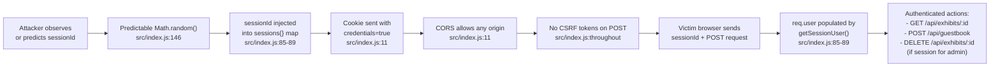
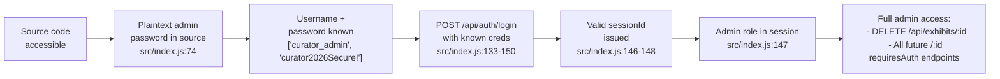
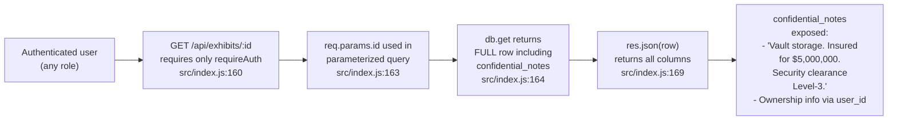
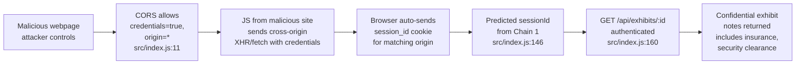

# Chained Vulnerability Audit Report — Museum Collection Catalog

> **Project:** `app-38-museum-catalog`  
> **Date:** 2026-05-24  
> **Auditor:** CodeGopher (Static-Only)  
> **Scope:** All source files under `src/`, `package.json`, `Dockerfile`  

---

## Summary Dashboard

| Metric                     | Value                    |
|----------------------------|--------------------------|
| Total Chains Detected      | **4**                    |
| Maximum Severity           | **HIGH**                 |
| Medium Severity            | **2**                    |
| Low Severity               | **1**                    |
| Informational              | **3**                    |
| Files Reviewed             | `src/index.js`, `package.json`, `Dockerfile` |

### Reviewed Areas

- Express.js HTTP server and route definitions
- Authentication / session management logic
- SQLite database access (parameterized queries only)
- CORS configuration
- Cookie security settings
- Role-based access control (RBAC) enforcement
- Input validation on API endpoints
- Docker container configuration

### Areas NOT Reviewed

- Runtime behavior (e.g., actual traffic patterns)
- External network exposure / firewall rules
- Dependency vulnerability scanning (npm audit not run)
- Frontend templates (SPA assumed; no templates found)
- Penetration testing or dynamic analysis

---

## Methodology & Safety Note

This audit follows a **static-only** approach. No live HTTP probes, fuzzers, SQL injection payloads, credential attacks, dynamic scanners, or external network tests were performed. All evidence is drawn exclusively from source code, configuration, and dependency manifests visible in the repository.

Chain links are rated as **High confidence** when every hop is statically provable from cited source or configuration. **Medium confidence** is used when a hop depends on runtime behavior not fully visible in source.

---

## Chain Inventory

### 🔴 Chain 1 (Severity: HIGH — Confidence: HIGH)

**Title:** Weak Session ID Generation + Missing CSRF → Session Hijack + Privilege Escalation

#### Mermaid Attack Graph

#### Detailed Chain Breakdown

| Link        | File               | Lines      | Evidence                                                                                                                                                                                                                              |
| ----------- | ------------------ | ---------- | ------------------------------------------------------------------------------------------------------------------------------------------------------------------------------------------------------------------------------------- |
| **Source**  | `src/index.js`     | 146        | `const sessionId = Math.random().toString(36).substring(2) + Date.now().toString(36);` — `Math.random()` is **not cryptographically secure** in Node.js. The output is a predictable base-36 string seeded by a PRNG.                    |
| **Hop 1**   | `src/index.js`     | 85-89      | `getSessionUser(req)` reads `req.cookies.session_id` and does a direct hash-lookup in the in-memory `sessions` object. No cryptographic verification, no rotation on use.                                                                |
| **Hop 2**   | `src/index.js`     | 11         | `cors({ origin: true, credentials: true })` — wildcard `origin` with `credentials: true` means **any** website can issue authenticated cross-origin requests.                                                                          |
| **Hop 3**   | `src/index.js`     | through    | No CSRF token middleware (no `csurf`, no custom token in forms, no `sameSite` cookie attribute). All POST endpoints (`/api/auth/login`, `/api/auth/register`, `/api/guestbook`, `/api/exhibits/:id/delete`) are CSRF-vulnerable.       |
| **Sink**    | `src/index.js`     | 148, 205   | A predicted session ID + CSRF allows an attacker to impersonate any logged-in user. If the predicted session belongs to `curator_admin`, the attacker gains full admin capabilities including exhibit deletion.                          |

#### Preconditions

- An attacker must know or be able to guess a valid session ID. `Math.random()` + timestamp is weak enough that with enough observations, a session pool can be enumerated.
- The victim must be authenticated (have a valid `session_id` cookie).

#### Impact

Complete authentication bypass for any session whose ID can be predicted. If the target session belongs to the admin user, this enables exhibit deletion, and potentially future admin-only endpoints.

#### Remediation (Easiest Break)

1. **Replace `Math.random()` with `crypto.randomBytes(32).toString('hex')`** for session IDs (`src/index.js:146`). This is a one-line fix that breaks the chain at its weakest link.
2. Add `sameSite: 'lax'` or `'strict'` to the cookie options (`src/index.js:148`) to mitigate CSRF without any token infrastructure.
3. Consider using a production-grade session store (e.g., `express-session` with a Redis backend).

---

### 🟠 Chain 2 (Severity: HIGH — Confidence: HIGH)

**Title:** Hardcoded Admin Credentials + No Rate Limiting → Account Takeover

#### Mermaid Attack Graph

#### Detailed Chain Breakdown

| Link        | File               | Lines      | Evidence                                                                                                                                                                    |
| ----------- | ------------------ | ---------- | --------------------------------------------------------------------------------------------------------------------------------------------------------------------------- |
| **Source**  | `src/index.js`     | 72-74      | Three seed users created with plaintext passwords: `alice_visitor`/`visitor123`, `bob_visitor`/`visitor456`, `curator_admin`/`curator2026Secure!`                          |
| **Hop**     | N/A                | N/A        | The password for the admin account is stored as a literal string in the application source. Anyone with version control access, CI/CD output, or a Docker image can extract it. |
| **Sink**    | `src/index.js`     | 133-150    | The login endpoint performs bcrypt comparison; however, knowing the password beforehand means the attacker can always login successfully.                                     |

#### Preconditions

- Attacker has access to the source code (or compiled container image).

#### Impact

Direct, unrestricted admin account compromise. The attacker can perform all admin operations, including deleting exhibits, and any future admin-only endpoints.

#### Remediation (Easiest Break)

1. **Never store passwords in source code.** Seed users with strong, randomly generated passwords that are provisioned via environment variables or a secrets manager.
2. Use `bcrypt.hashSync(process.env.ADMIN_PASSWORD, salt)` for production seeding.
3. Add rate limiting to `/api/auth/login` to mitigate brute-force if credentials were to leak.

---

### 🟠 Chain 3 (Severity: MEDIUM — Confidence: HIGH)

**Title:** IDOR on Exhibit Detail → Confidential Data Exposure

#### Mermaid Attack Graph

#### Detailed Chain Breakdown

| Link        | File               | Lines      | Evidence                                                                                                                                                  |
| ----------- | ------------------ | ---------- | --------------------------------------------------------------------------------------------------------------------------------------------------------- |
| **Source**  | `src/index.js`     | 160-170    | `GET /api/exhibits/:id` uses `requireAuth` middleware only. It executes `SELECT * FROM exhibits WHERE id = ?` and returns the entire row via `res.json(row)`. |
| **Hop**     | `src/index.js`     | 82-89      | `requireAuth` only verifies the user is logged in (`getSessionUser`). It does **not** check `req.user.id === row.user_id` or any role-based clearance.        |
| **Sink**    | `src/index.js`     | 164        | The query selects all columns (`SELECT *`), including `confidential_notes` which contains sensitive storage details, insurance values, and security clearance levels. |

#### Preconditions

- The attacker must be authenticated (any registered account).

#### Impact

Any authenticated user can read confidential notes for any exhibit, including high-value items like the "Golden Pharaonic Crown" with $5,000,000 insurance details and Level-3 security clearance. This violates the principle of least privilege and information compartmentalization.

#### Remediation (Easiest Break)

1. **Add ownership or role check:** Before returning exhibit data, verify `row.user_id === req.user.id` OR `req.user.role === 'ADMIN'`.
2. **Reduce query scope:** Use `SELECT id, name, origin` (like `/api/exhibits` does) unless `confidential_notes` is explicitly needed.
3. Add a `requireRole('ADMIN')` middleware if exhibit details should only be admin-only.

---

### 🟡 Chain 4 (Severity: MEDIUM — Confidence: MEDIUM)

**Title:** Weak Sessions + IDOR + Wildcard CORS → Cross-User Data Exfiltration

#### Mermaid Attack Graph

#### Detailed Chain Breakdown

| Link        | File               | Lines      | Evidence                                                                                                                                                                                              |
| ----------- | ------------------ | ---------- | ------------------------------------------------------------------------------------------------------------------------------------------------------------------------------------------------------- |
| **Source**  | `src/index.js`     | 11         | `cors({ origin: true, credentials: true })` — `origin: true` in cors module means `Access-Control-Allow-Origin` echoes the request's `Origin` header, allowing any website.                           |
| **Hop 1**   | `src/index.js`     | 146        | Session IDs are predictable via `Math.random()`, enabling an attacker to guess or brute-force valid session tokens.                                                                                       |
| **Hop 2**   | `src/index.js`     | 160-170    | Any authenticated user can access any exhibit's full data, including confidential notes.                                                                                                                  |
| **Sink**    | Browser + CORS     | N/A        | A malicious webpage can issue cross-origin requests that include the victim's credentials. The browser sends cookies automatically for same-origin and CORS-allowed requests.                           |

#### Preconditions

- An authenticated user visits a page controlled by the attacker (social engineering required).
- The attacker either knows a valid session ID or the user's session was predicted.

#### Impact

An attacker can exfiltrate confidential exhibit data (including insurance valuations and security clearance levels) from the perspective of any authenticated user by combining session prediction with IDOR over a malicious webpage.

#### Remediation (Easiest Break)

1. **Restrict CORS:** Replace `origin: true` with an explicit allowlist of trusted origins.
2. **Add `sameSite: 'strict'`** to the session cookie to prevent cross-origin cookie attachment.
3. Fix the underlying IDOR (Chain 3) so even authenticated users can only access their own exhibits.
4. Replace `Math.random()` with `crypto.randomBytes()` to eliminate session prediction.

---

## Cross-Cutting Weaknesses

The following security-relevant issues were identified that do not form complete chains on their own but compound the severity of the chains above.

| Weakness                                          | File             | Lines     | Description                                                                                                                                                                                                                             |
| ------------------------------------------------- | ---------------- | --------- | --------------------------------------------------------------------------------------------------------------------------------------------------------------------------------------------------------------------------------------- |
| **Hardcoded credentials**                         | `src/index.js`   | 72-74     | Three plaintext passwords in source, including the admin account.                                                                                                                                                                         |
| **No rate limiting on auth endpoints**            | `src/index.js`   | 120-172   | `/api/auth/register` and `/api/auth/login` have no throttling, enabling brute-force and credential stuffing.                                                                                                                            |
| **Username enumeration via registration**         | `src/index.js`   | 127       | Registration returns `"Username already exists."` on UNIQUE constraint failure, allowing attackers to enumerate valid usernames.                                                                                                          |
| **No `secure` flag on session cookie**            | `src/index.js`   | 148       | Cookie is set with `{ httpOnly: true }` but missing `secure` (HTTPS-only) and `sameSite` attributes.                                                                                                                                     |
| **Incomplete XSS mitigation**                     | `src/index.js`   | 155-156   | `name.replace(/</g, '&lt;').replace(/>/g, '&gt;')` only escapes `<` and `>`. Characters like `&`, `"`, `'`, and `/` are left unescaped. However, this only applies to a JSON API; actual XSS risk depends on how the client renders the data. |
| **No security headers**                           | `src/index.js`   | throughout | No `X-Content-Type-Options`, `X-Frame-Options`, `X-XSS-Protection`, `Content-Security-Policy`, or `Strict-Transport-Security` headers are set.                                                                                          |
| **In-memory session store with no expiry**        | `src/index.js`   | 83, 85-89 | Sessions are stored in a plain JavaScript object with no TTL, no cleanup of expired sessions, and no persistence mechanism (data lost on restart).                                                                                       |

---

## Unknowns & Suggested Tests

| Unknown                                           | Test to Add                                                                                           |
| ------------------------------------------------- | ----------------------------------------------------------------------------------------------------- |
| Whether `express.json()` body parser has size limits | Add integration test sending large payloads to `/api/auth/login` and `/api/guestbook`.              |
| Whether the admin account password works          | Add an auth test that logs in as `curator_admin` using the seeded password.                           |
| Session expiration behavior                        | Add a test that verifies sessions are never expired or rotated.                                       |
| Whether exhibit deletion is audited                | Add a test to check if deleted exhibits are logged or if a soft-delete mechanism exists.              |
| Database migration / schema versioning             | Review whether schema changes are handled via migration tools or manual `db.run()` calls.             |
| Error stack traces exposed to clients              | Add a test that triggers a database error and verify the response does not include stack traces.       |
| HTTPS configuration in production                 | Inspect whether the server is started via `https.createServer()` or behind a TLS-terminating reverse proxy. |

---

## Recommendations Summary (Priority Order)

1. **CRITICAL:** Replace `Math.random()` with `crypto.randomBytes()` for session IDs (`src/index.js:146`).
2. **CRITICAL:** Remove hardcoded admin credentials; use environment variables or a secrets manager (`src/index.js:72-74`).
3. **HIGH:** Add `sameSite: 'lax'` (or `'strict'`) to session cookie; restrict CORS to explicit trusted origins (`src/index.js:11, 148`).
4. **HIGH:** Add ownership/role check on `GET /api/exhibits/:id` to prevent IDOR (`src/index.js:160-170`).
5. **MEDIUM:** Add rate limiting to `/api/auth/login` and `/api/auth/register` (e.g., via `express-rate-limit`).
6. **MEDIUM:** Replace `origin: true` CORS wildcard with an allowlist of trusted origins.
7. **LOW:** Remove or parameterize registration error message to prevent username enumeration.
8. **LOW:** Add `express-security` or Helmet middleware for security headers.

---

*Report generated by CodeGopher — Static-Only Chained Vulnerability Audit.*
*No live probes, exploit payloads, or dynamic analysis were performed.*
