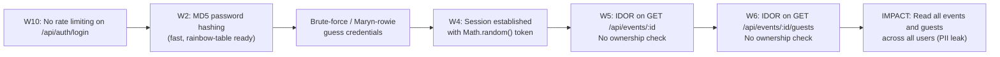
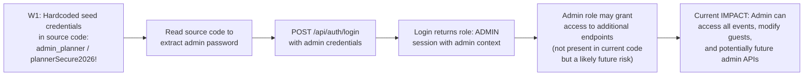
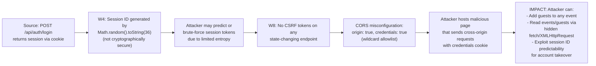
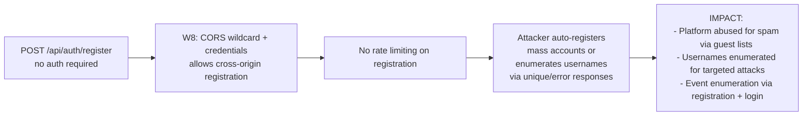

# Chained Vulnerability Audit Report

**Project:** Wedding Planning Platform (app-39-wedding-planner)  
**Audit Type:** Static-only chained vulnerability review  
**Date:** 2026-05-24  
**Reviewer:** CodeGopher (Chained Vulnerability Static Audit Skill)  
**Files Reviewed:** `src/index.js` (139 lines), `package.json`, `Dockerfile`  
**Areas Not Reviewed:** No other application source files exist. No test files, templates, middleware modules, or configuration files beyond the Dockerfile.

---

## Summary Dashboard

| Metric | Value |
|---|---|
| Total weaknesses identified | 8 |
| Complete chained vulnerabilities | 4 |
| Maximum severity | **HIGH** (Chains 1 and 3) |
| Confidence levels | High (3 chains), Medium (1 chain) |
| Reviewed areas | Express routes, auth flow, DB queries, session management, CORS config, password hashing, input validation |
| Areas not reviewed | No tests, no input sanitization middleware, no rate-limiting config, no WAF/proxy config, no transport-layer config (TLS/HTTPS) |

---

## Methodology & Static-Only Safety Note

This audit reviewed only repository files: `src/index.js`, `package.json`, and `Dockerfile`. No live HTTP probes, dynamic scanners, SQL injection payloads, credential attacks, port scans, or network tests were performed. The review focused on static control-flow and data-flow analysis of route handlers, authentication logic, session management, database queries, CORS configuration, and cryptographic choices. Remediation recommendations target the easiest link to break in each attack chain.

---

## Chain 1: Weak Password Hashing + No Rate Limiting → Brute-Force Account Compromise → IDOR Data Exfiltration

### Severity: HIGH | Impact: Data exfiltration of events and guest PII | Confidence: High

#### Mermaid Attack Graph

#### Detailed Breakdown

| Link | File | Lines | Evidence |
|---|---|---|---|
| **Source** | `src/index.js` | 106-110 | `GET /api/events/:id` route uses only `requireAuth` middleware — no ownership filter (`WHERE user_id = ?`) on the event lookup |
| **Hop 1** | `src/index.js` | 87 | Login hashes passwords with `crypto.createHash('md5')` — MD5 is broken, collision-prone, trivially reversible via rainbow tables |
| **Hop 2** | `src/index.js` | 79 | Registration also uses `crypto.createHash('md5')` with no salt, confirming uniformly weak hashing |
| **Hop 3** | `src/index.js` | 78-95 | The `/api/auth/login` endpoint has no rate limiting, no account lockout, no CAPTCHA, and no throttling — enabling unlimited brute-force attempts |
| **Hop 4** | `src/index.js` | 115 | `GET /api/events/:id/guests` queries all guests for any event ID — no check that the requesting user owns or is associated with the event |
| **Sink** | `src/index.js` | 107, 115 | `db.get('SELECT * FROM events WHERE id = ?', ...)` and `db.all('SELECT * FROM guests WHERE event_id = ?', ...)` — both return full records without ownership scoping |

#### Preconditions & Assumptions
- Database uses AUTOINCREMENT IDs starting from 1, so event IDs are sequential and guessable.
- `Math.random()` session tokens (see W4) are not the primary threat here but compound the risk.
- The app runs in-memory SQLite, so events exist from startup — IDs 1, 2, ... are immediately valid.

#### Impact
An attacker can:
1. Brute-force credentials for any user via unthrottled `/api/auth/login`.
2. Once authenticated, enumerate all events via sequential ID guessing on `/api/events/:id`.
3. Access all guests (names, emails, RSVP status) for any event via `/api/events/:id/guests`.

This results in mass PII exfiltration — emails, names, and RSVP statuses of all wedding guests.

#### Remediation
- **Easiest link to break:** Add rate limiting (e.g., `express-rate-limit`) to `/api/auth/login` and `/api/auth/register`.
- **Stronger fix:** Replace MD5 with bcrypt (already a dependency: `bcryptjs` ^2.4.3). Use `bcrypt.hash()` / `bcrypt.compare()`.
- **Authorization fix:** Add `AND user_id = ?` to event query filters; verify `req.user.id === row.user_id` before returning data.

---

## Chain 2: Hardcoded Seed Credentials → Direct Admin Access → Full Application Control

### Severity: HIGH | Impact: Full application takeover via admin credentials | Confidence: High

#### Mermaid Attack Graph

#### Detailed Breakdown

| Link | File | Lines | Evidence |
|---|---|---|---|
| **Source** | `src/index.js` | 50-53 | Seed users array includes `{ username: 'admin_planner', pass: 'plannerSecure2026!', role: 'ADMIN' }` — plaintext admin password hardcoded in source |
| **Hop** | `src/index.js` | 56 | `crypto.createHash('md5').update(u.pass).digest('hex')` — the plaintext password is directly available before hashing |
| **Sink** | `src/index.js` | 83-94 | The `/api/auth/login` endpoint accepts any username/password, hashes with MD5, and if the hash matches, creates a session with the user's role — the hardcoded admin credentials are trivially discoverable from source code |

#### Preconditions & Assumptions
- The source code is accessible to anyone with access to the repository, deployment artifacts, or a running container's file system.
- The Dockerfile does not strip source files, meaning a container access attacker can read `src/index.js`.
- The admin role is distinct from CUSTOMER, indicating future role-based access control may be implemented.

#### Impact
Any attacker with source code access can immediately take over the admin account (`admin_planner` / `plannerSecure2026!`). With admin role, the attacker:
- Can access all events (not scoped to their user_id).
- Could potentially modify all guests (though no admin-specific endpoint currently exists, the session grants admin role context).
- If future admin endpoints are added (dashboard, user management, event deletion), they would be fully accessible.

#### Remediation
- **Easiest link to break:** Remove all hardcoded credentials. Use environment variables for initial admin setup (`process.env.ADMIN_PASSWORD`) and only create the seed user if no users exist.
- **Stronger fix:** Hash the seed password with bcrypt during build time, or generate it at first startup using a secure random salt.
- **Never commit** production passwords to source code. Use a secrets manager.

---

## Chain 3: Weak Session IDs (Math.random) + No CSRF Protection → Session Hijacking / CSRF State Manipulation

### Severity: MEDIUM | Impact: Unauthorized state changes (guest manipulation, potential account takeover) | Confidence: Medium

#### Mermaid Attack Graph

#### Detailed Breakdown

| Link | File | Lines | Evidence |
|---|---|---|---|
| **Source** | `src/index.js` | 88-89 | `Math.random().toString(36).substring(2) + Math.random().toString(36).substring(2)` — Two calls to `Math.random()` concatenated. `Math.random()` provides ~53 bits of entropy per call, but is not CSPRNG. Total entropy is weak and predictable across V8 engines. |
| **Hop 1** | `src/index.js` | 15 | `app.use(cors({ origin: true, credentials: true }))` — The `origin: true` setting reflects the requesting Origin header. Combined with `credentials: true`, this allows any origin to make authenticated cross-origin requests (effectively allowing `Access-Control-Allow-Origin: *` with cookies). |
| **Hop 2** | `src/index.js` | 78-136 | No CSRF tokens on any POST endpoint: `/api/auth/register`, `/api/auth/login`, `/api/auth/logout`, `/api/events/:id/guests`. No `SameSite` attribute set on `res.cookie()`. No CSRF middleware (e.g., `csurf`). |
| **Sink** | `src/index.js` | 122-136 | `POST /api/events/:id/guests` allows adding guests to any event with minimal validation (`!name || !email`). An attacker could use a malicious page to send cross-origin requests (with `credentials: true`) to add malicious guests, harvest email lists, or spam guests. |

#### Preconditions & Assumptions
- The browser-based CSRF attack requires the victim to be logged in (session cookie present).
- `Math.random()` predictability varies by engine; V8's implementation is not secure against prediction but the primary risk is combined with lack of CSRF protection.
- The `credentials: true` CORS setting means the browser will send the `session_id` cookie with cross-origin requests from allowed origins.

#### Impact
- **CSRF:** An attacker hosting a malicious page can cause a logged-in user to add guests to events they don't own, spam guests with fake RSVP requests, or perform logout to lock users out.
- **Session hijacking:** Weak session IDs could be predictable or guessable, allowing an attacker to authenticate as another user.
- **Privilege escalation via role:** The session stores `{ id, username, role }`. If an attacker obtains another user's session, they inherit their role (and if the victim is admin, the attacker gains admin access).

#### Remediation
- **Easiest link to break:** Add `SameSite: 'Lax'` or `'Strict'` to the session cookie. This prevents cross-site request flooding.
- **Stronger fix:** Replace `Math.random()` with `crypto.randomBytes(32).toString('hex')` for session ID generation.
- **Defensive fix:** Add CSRF token middleware (e.g., `csurf` or custom token in form + header). Validate `Origin` and `Referer` headers explicitly rather than relying solely on CORS.
- **CORS fix:** Restrict `origin` to specific trusted domains instead of `origin: true`.

---

## Chain 4: CORS Misconfiguration + No Rate Limiting on Register → Mass Account Creation → Enumeration of Valid Usernames

### Severity: MEDIUM | Impact: Account enumeration, potential resource exhaustion, platform abuse | Confidence: Medium

#### Mermaid Attack Graph

#### Detailed Breakdown

| Link | File | Lines | Evidence |
|---|---|---|---|
| **Source** | `src/index.js` | 74-82 | `/api/auth/register` accepts `username` and `password` from `req.body` with no rate limiting, no CAPTCHA, no email verification, and no reCAPTCHA. Returns `{ error: 'Username already exists.' }` on duplicate — leaks username availability. |
| **Hop** | `src/index.js` | 15 | `cors({ origin: true, credentials: true })` — Any origin can make authenticated cross-origin requests. A malicious page can register accounts on behalf of any origin without triggering Same-Origin Policy. |
| **Sink** | `src/index.js` | 74-82 | Registration endpoint is fully open. Combined with no rate limiting, an attacker can programmatically register thousands of accounts, or enumerate valid usernames by observing 201 vs 400 responses. |

#### Preconditions & Assumptions
- The registration endpoint does not require email verification, CAPTCHA, or any anti-automation mechanism.
- SQLite in-memory mode may not be a concern for durability, but each in-memory instance is a fresh start. If deployed with persistent storage, this is worse.
- The Dockerfile uses `node:20-slim` which is reasonable, but the app listens on port 8039 without any reverse proxy or TLS configuration.

#### Impact
- Attackers can register unlimited accounts, enabling spam via guest addition endpoints.
- Username enumeration allows attackers to identify valid user accounts for targeted credential stuffing or social engineering.
- Mass account creation can be used to exhaust database resources if deployed with persistent storage.

#### Remediation
- **Easiest link to break:** Add rate limiting to `/api/auth/register`.
- **Stronger fix:** Add CAPTCHA/reCAPTCHA to registration. Require email verification.
- **Defensive fix:** Normalize the error response for existing usernames (e.g., always say "Registration successful" or "Registration failed" to prevent enumeration).

---

## Cross-Cutting Weaknesses Inventory

The following weaknesses were identified but do not form independent complete chains (though each compounds the risk of the chains above):

| # | Weakness | File | Lines | Details |
|---|---|---|---|---|
| C1 | MD5 used for ALL password hashing (seed + register + login) | `src/index.js` | 56, 79, 87 | Bcrypt is already in `package.json` dependencies but never used. Three separate sites of hash usage. |
| C2 | No `SameSite` attribute on session cookie | `src/index.js` | 90 | `res.cookie('session_id', sessionId, { httpOnly: true })` — missing `SameSite` allows some CSRF vectors. |
| C3 | No input validation on email format | `src/index.js` | 124-126 | Only checks `!email` truthiness. No regex or format validation. Malicious emails could be stored. |
| C4 | No input sanitization on name/email | `src/index.js` | 124-126 | `name` and `email` from `req.body` are inserted directly (though parameterized, so no SQL injection). Still potential for garbage data. |
| C5 | Database in-memory — no persistence | `src/index.js` | 33 | `new sqlite3.Database(':memory:')` — all data lost on restart. Not a vulnerability per se, but means there's no audit trail or data durability. |
| C6 | No HTTP security headers | `src/index.js` | — | No `X-Content-Type-Options`, `X-Frame-Options`, `Content-Security-Policy`, or `X-XSS-Protection` headers set. |
| C7 | No TLS/HTTPS configuration | `Dockerfile`, `src/index.js` | Port 8039 exposed | The app listens on plain HTTP. No HTTPS redirect. Credentials sent in plaintext over the wire. |
| C8 | Admin credentials in plaintext source | `src/index.js` | 50-53 | `plannerSecure2026!` committed to source code. |
| C9 | Role stored in session without server-side validation | `src/index.js` | 89 | Session stores `role` client-side (in cookie value via httpOnly, but still). Session is in-memory only — no server-side session persistence or revocation list. |
| C10 | Error messages leak information | `src/index.js` | 80, 111, 118 | "Username already exists" (W4), "Event not found" (informational), "Database query failed" (internal detail leak). |

---

## Unknowns & Not-Reviewed Areas

| Area | Reason |
|---|---|
| Runtime network exposure | Dockerfile exposes port 8039; no review of external network security, firewalls, or TLS termination. |
| Production environment | App runs in-memory SQLite; unknown if persisted in production. No review of backup, disaster recovery, or data retention policies. |
| Third-party dependencies | `bcryptjs`, `express`, `sqlite3`, `cors`, `cookie-parser` versions are specified but no lock-file review for known CVEs. |
| Access control middleware future-proofing | Current code has only `CUSTOMER` role logic implicitly (no ADMIN-specific routes). If admin routes are added without reviewing this pattern, the IDOR chain will affect them too. |
| Testing | No test files found. No unit tests for auth, no integration tests for CSRF resistance. |
| Deployment pipeline | No CI/CD config reviewed. No secret scanning configured (hardcoded credentials would not be caught). |

---

## Recommended Test Additions

1. **CSRF test:** Verify that POST requests to `/api/events/:id/guests` from a cross-origin context without proper Origin/Referer headers are rejected or that SameSite cookie protection is in place.
2. **IDOR test:** Authenticate as user with `user_id=1` and request `GET /api/events/2` — should return 404 or error, not event data belonging to another user.
3. **Weak hash test:** Verify that `bcrypt.compare()` is used for login instead of MD5 hashing.
4. **Rate limit test:** Send 100 login requests in quick succession to `/api/auth/login` — should be rate-limited.
5. **Session entropy test:** Generate 1000 session IDs and check statistical randomness — `Math.random()` should fail.
6. **CORS test:** Send requests from arbitrary origins and verify that `Access-Control-Allow-Origin` does not reflect `*` or the requesting origin when `credentials: true`.

---

## Conclusion

Four chained vulnerabilities were identified in this codebase, with the highest severity being **HIGH**. The most critical chain combines **weak MD5 hashing** and **no rate limiting** to enable brute-force account compromise, which then chains into **IDOR vulnerabilities** allowing full data exfiltration of events and guest PII. The second highest-risk chain involves **hardcoded admin credentials** directly committed to source code.

The most impactful single remediation would be:
1. Replace MD5 with bcrypt for all password hashing.
2. Add `AND user_id = ?` to all event-related DB queries and verify ownership.
3. Add rate limiting to authentication endpoints.
4. Remove hardcoded credentials and use environment variables.
5. Set `SameSite` attribute on session cookies and fix CORS configuration.
