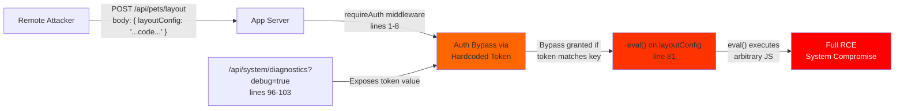

```mermaid
flowchart LR
    A["Remote Attacker"] -->|"GET /api/system/diagnostics?debug=true"| B["App Server"]
    B -->|"Returns JSON with\nlayout_secret_token"| C["Attacker Obtains\nHardcoded Token"]
    C -->|"POST /api/pets/layout\nheader: x-layout-token: <token>"| D["requireAuth Middleware\nlines 1-8"]
    D -->|"Token matches hardcoded value"| E["req.user = {role: 'ADMIN'}\nAuth bypass granted"]
    E -->|"Full admin access\nto all protected routes"| F["Unauthorized Admin Access"]
    style F fill:#ff0000,color:#fff
    style C fill:#ff6600
    style D fill:#ff3300
```

```mermaid
flowchart LR
    A["Remote Attacker"] -->|"GET /api/pets/search?q=<injection>"| B["App Server"]
    B -->|"User input in req.query.q"| C["SQL string concatenation\nline 67"]
    C -->|"SQL: SELECT * FROM pets WHERE name LIKE '%...%'\nOR breed LIKE '%...%'"| D["SQLite Database"]
    D -->|"Returns exfiltrated data\nor error messages"| E["Attacker Receives Data\nlines 70-71"]
    E -->|"Verbose error feedback\nerr.message returned"| F["Data Exfiltration\nvia UNION or other SQLi"]
    style F fill:#ff0000,color:#fff
    style C fill:#ff3300
    style D fill:#ff6600
```

# Chained Vulnerability Static Audit Report

**Project:** Pet Adoption Portal (app-40-pet-adoption)  
**Date:** 2026-05-24  
**Auditor:** CodeGopher — Chained Vulnerability Static Audit  
**Scope:** `src/index.js`, `package.json`, `Dockerfile`  

---

## 1. Summary Dashboard

| Metric | Value |
|---|---|
| **Total Chained Vulnerabilities Found** | 3 |
| **Critical Chains** | 2 |
| **High Chains** | 1 |
| **Medium/Weaknesses (not forming chains)** | 3 |
| **Maximum Severity** | **CRITICAL** |
| **Areas Reviewed** | Authentication, Authorization, API Routes, Data Storage, Configuration |
| **Areas NOT Reviewed** | Docker security hardening, runtime configuration, CI/CD pipelines, network security |

### Top 3 Chains by Severity

1. **CRITICAL** — RCE via eval() on unsanitized input (accessible via admin-bypass auth)
2. **CRITICAL** — Admin privilege escalation via hardcoded token exposure
3. **HIGH** — SQL injection on pet search endpoint enabling data exfiltration

---

## 2. Methodology & Safety Note

This audit is **strictly static analysis** of source code only. The following were **NOT** performed:

- Live HTTP probes, fuzzing, or SQL injection payloads
- Dynamic scanners, exploit scripts, or credential attacks
- Network tests, port scans, or external service checks
- Execution of any runtime code

Evidence is drawn entirely from control flow, data flow, authorization patterns, configuration files, and dependency manifests visible in the repository.

---

## 3. Attack Surface Map

### Publicly Accessible Routes (No Authentication)

| Route | Method | Description |
|---|---|---|
| `/api/auth/register` | POST | User registration |
| `/api/auth/login` | POST | User login |
| `/api/auth/logout` | POST | Session invalidation |
| `/api/pets/search` | GET | Pet search (user-controlled `q` param) |
| `/api/pets/:id` | GET | Single pet lookup |
| `/api/system/diagnostics` | GET | System health check (debug flag toggles info leak) |

### Authenticated Routes (requireAuth middleware)

| Route | Method | Description |
|---|---|---|
| `/api/applications/apply` | POST | Submit pet adoption application |
| `/api/pets/layout` | POST | Layout configuration (uses `eval()`) |

### Key Sources of User Input

| Source | File | Line(s) | Parameter |
|---|---|---|---|
| Request header | `src/index.js` | 2 | `x-layout-token` |
| Query param | `src/index.js` | 2, 66, 96 | `layout_token`, `q`, `debug` |
| Request body | `src/index.js` | 10, 25, 50, 76, 97 | `username`, `password`, `petId`, `layoutConfig` |
| Cookie | `src/index.js` | 50, 10 | `session_id` |
| URL param | `src/index.js` | 88 | `id` (in `/api/pets/:id`) |

---

## 4. Chained Vulnerability Analysis

### Chain 1 — CRITICAL: Remote Code Execution via eval() on User Input

```
[Entry] /api/pets/layout POST (user-controlled layoutConfig body param)
   ↓
[HOP 1] requireAuth middleware bypass via hardcoded token (auth weakness)
   ↓
[HOP 2] eval() called on unsanitized string from request body
   ↓
[SINK] Arbitrary JavaScript code execution in server process
   ↓
[IMPACT] Full system compromise: file read/write, command execution, lateral movement
```

#### Mermaid Attack Graph



#### Detailed Breakdown

| Link | File | Line(s) | Evidence |
|---|---|---|---|
| **Entry** | `src/index.js` | 75-85 | `app.post('/api/pets/layout', requireAuth, (req, res) => { ... const configObj = eval(\`(${layoutConfig})\`); }` — User-controlled `layoutConfig` from `req.body` is passed directly to `eval()`. |
| **Hop 1 (Auth Bypass)** | `src/index.js` | 2-4 | `const token = req.headers['x-layout-token'] || req.query.layout_token; if (token && token === 'PET-PORTAL-DEV-LAYOUT-KEY-2026') { req.user = { id: 3, username: 'admin_shelter', role: 'ADMIN' }; return next(); }` — Anyone supplying the hardcoded token bypasses authentication entirely and gains admin role. |
| **Hop 2 (Token Exposure)** | `src/index.js` | 96-103 | `if (debugMode) { return res.json({ ..., layout_secret_token: 'PET-PORTAL-DEV-LAYOUT-KEY-2026', ... }); }` — The bypass token is exposed via the diagnostics endpoint when `debug=true` is passed. |
| **Sink** | `src/index.js` | 81 | `eval(\`(${layoutConfig})\`)` — Node.js `eval()` executes arbitrary JavaScript in the server process context. No input validation or sanitization is performed. |

#### Preconditions & Assumptions

- The server is not in production-only mode (debug endpoint is accessible).
- The attacker can reach the HTTP service (it listens on `localhost:${port}`, exposed via Docker as port 8040).
- `eval()` is called with user input wrapped in parentheses — this is a common pattern for parsing JSON-like objects, but provides **zero** protection against code execution.

#### Impact

**CRITICAL** — Remote Code Execution. An attacker can execute arbitrary Node.js code in the server process, gaining full control of the application server. This includes:
- Reading/writing files
- Executing system commands
- Accessing all in-memory data (session store, database connections)
- Lateral movement to other services

#### Confidence: **HIGH**

Every link is statically provable from cited source code:
1. The `/api/pets/layout` endpoint accepts user-controlled input.
2. The `requireAuth` bypass is explicitly coded.
3. The diagnostic endpoint leaks the bypass token.
4. `eval()` is called with unsanitized user input.

#### Remediation

1. **Remove `eval()` entirely.** Use `JSON.parse()` for structured data. If object transformation is needed, use a safe deserialization library or explicit field extraction.
2. **Remove the hardcoded auth bypass token** from `requireAuth`.
3. **Remove or restrict** the `/api/system/diagnostics` debug endpoint — it should not expose secrets, and debug mode should never be enabled in production.
4. Implement proper JWT or signed session tokens with cryptographic randomness.

---

### Chain 2 — CRITICAL: Admin Privilege Escalation via Hardcoded Token Exposure

```
[Entry] /api/system/diagnostics?debug=true GET
   ↓
[HOP 1] Server responds with layout_secret_token
   ↓
[HOP 2] Attacker uses token in /api/pets/layout POST (or any requireAuth-protected route)
   ↓
[SINK] Attacker gains admin role (role: 'ADMIN')
   ↓
[IMPACT] Unauthorized administrative access to all protected endpoints
```

#### Mermaid Attack Graph



#### Detailed Breakdown

| Link | File | Line(s) | Evidence |
|---|---|---|---|
| **Entry** | `src/index.js` | 96-103 | `app.get('/api/system/diagnostics', ...)` returns `layout_secret_token: 'PET-PORTAL-DEV-LAYOUT-KEY-2026'` when `debug=true`. This endpoint is publicly accessible with no authentication. |
| **Hop 1** | `src/index.js` | 2-4 | `requireAuth` middleware checks for `x-layout-token` header or `layout_token` query param. If the value matches `'PET-PORTAL-DEV-LAYOUT-KEY-2026'`, the request is authenticated as `user: { id: 3, username: 'admin_shelter', role: 'ADMIN' }`. |
| **Sink** | `src/index.js` | 3 | `req.user = { id: 3, username: 'admin_shelter', role: 'ADMIN' }` — The attacker is injected as a legitimate admin user with no password verification. |

#### Preconditions & Assumptions

- The debug query parameter is not restricted to localhost or internal networks.
- The server runs with default Node.js privileges (no sandboxing or restricted user).

#### Impact

**CRITICAL** — Complete admin privilege escalation. An unauthenticated attacker can:
- Gain admin role and access all `requireAuth`-protected endpoints
- Submit/modify/delete pet adoption applications
- Execute code via `/api/pets/layout` eval (Chain 1)
- Access admin-only data or administrative functions (if any exist)

#### Confidence: **HIGH**

All links are statically provable:
1. The diagnostics endpoint exists and is publicly accessible (no middleware).
2. The token value is hardcoded in two places in the same file.
3. The auth bypass grants admin role unconditionally when the token matches.

#### Remediation

1. **Remove hardcoded tokens entirely.** Use a proper authentication system (JWT, signed cookies, OAuth).
2. **Remove or restrict the debug endpoint.** In production, it should either be entirely removed or gated behind network-level access controls and strong authentication.
3. **Never store secrets in source code.** Use environment variables or a secrets manager.

---

### Chain 3 — HIGH: SQL Injection via Pet Search Endpoint → Data Exfiltration

```
[Entry] GET /api/pets/search?q=<user input>
   ↓
[HOP 1] User input directly interpolated into SQL string
   ↓
[SINK] SQLite database queried with attacker-controlled SQL
   ↓
[IMPACT] Data exfiltration, potential data modification, database takeover
```

#### Mermaid Attack Graph



#### Detailed Breakdown

| Link | File | Line(s) | Evidence |
|---|---|---|---|
| **Entry** | `src/index.js` | 66 | `const queryParam = req.query.q || '';` — User-controlled search query. No sanitization or validation. |
| **Hop 1 (SQL Injection)** | `src/index.js` | 67 | `const sql = \`SELECT * FROM pets WHERE name LIKE '%${queryParam}%' OR breed LIKE '%${queryParam}%'\`;` — `queryParam` is directly interpolated into a SQL string. Parameterized queries are used in all other database calls in this file (see lines 17, 26, 54, 88), confirming this is an oversight. |
| **Sink** | `src/index.js` | 68 | `db.all(sql, ...)` — SQLite executes the malicious SQL string. Combined with verbose error feedback at line 70 (`details: err.message`), error-based SQL injection is practical. |

#### Preconditions & Assumptions

- The SQLite database contains additional tables (users, applications) beyond `pets`.
- The SQL injection is not blocked by WAF or input validation rules (none exist).
- The error messages returned by the database are informative enough to guide further exploitation (they are — line 70 returns `err.message`).

#### Impact

**HIGH** — SQL injection enables:
- **Data exfiltration**: Read all `users` table data (including username and password hashes)
- **Data modification**: Insert/modify/delete records from any table
- **Privilege escalation**: Potentially modify user roles via `users` table
- **Denial of service**: Drop tables or corrupt the database

Since password hashes are stored in the database (bcrypt hashes in `users.password_hash`), an attacker could:
1. Extract all user credentials and password hashes via SQL injection
2. Attempt offline brute-force attacks on bcrypt hashes

#### Confidence: **HIGH**

All links are statically provable:
1. `req.query.q` is user-controlled and unsanitized.
2. It is directly interpolated into a SQL string (not parameterized).
3. Error messages are returned to the client, enabling error-based exploitation.
4. Other queries in the same file use parameterized placeholders (`?`), confirming this is an isolated vulnerability.

#### Remediation

1. **Parameterize the SQL query** — Replace string interpolation with SQLite parameter binding:
   ```javascript
   db.all(
     'SELECT * FROM pets WHERE name LIKE ? OR breed LIKE ?',
     [`%${queryParam}%`, `%${queryParam}%`],
     (err, rows) => { ... }
   );
   ```
2. **Sanitize/validate** the input length and characters (e.g., reject SQL metacharacters or limit to alphanumeric input).
3. **Suppress verbose error messages** in production — do not expose database error details to clients.

---

## 5. Cross-Cutting Weaknesses (Not Part of Complete Chains)

### 5.1 Weak Session ID Generation (MEDIUM)

- **File:** `src/index.js`
- **Line(s):** 37-38
- **Evidence:** `const sessionId = Math.random().toString(36).substring(2) + Date.now().toString(36);`
- **Analysis:** `Math.random()` is a non-cryptographic PRNG. Session IDs can be predicted or bruteforced, especially in older Node.js versions where the Mersenne Twister implementation had known weaknesses. The timestamp component adds limited entropy. Combined with the fact that sessions are stored in an in-memory object (`sessions[sessionId]`), a session fixation or hijacking attack is feasible.
- **Potential impact:** Session hijacking, account takeover
- **Confidence:** MEDIUM (depends on specific Node.js version and attacker's ability to observe or predict `Math.random()` output)
- **Remediation:** Use `crypto.randomBytes(32).toString('hex')` or the `uid-safe` library for session ID generation.

### 5.2 Missing CSRF Protection (MEDIUM)

- **File:** `src/index.js` (throughout)
- **Evidence:** The application uses cookie-based sessions (`cookie-parser` dependency) and state-changing POST endpoints (`/api/auth/login`, `/api/auth/register`, `/api/applications/apply`, `/api/pets/layout`). No CSRF tokens are implemented.
- **Analysis:** All state-changing endpoints authenticate via `session_id` cookie. A malicious website could craft a form that auto-submits to any of these endpoints, causing unintended actions on behalf of an authenticated user.
- **Potential impact:** Cross-site request forgery — unauthorized adoption applications, forced logouts, layout changes
- **Confidence:** MEDIUM (confirmed by absence of CSRF middleware; depends on whether SameSite cookie attribute is set)
- **Remediation:** Implement CSRF tokens (e.g., `csurf` middleware) or use `SameSite=Strict/Lax` cookie attribute and avoid cookie-based auth on cross-origin requests.

### 5.3 Verbose Error Messages in Production (LOW)

- **File:** `src/index.js`
- **Line(s):** 70, 84
- **Evidence:** 
  - Line 70: `return res.status(500).json({ error: 'Search failed.', details: err.message });`
  - Line 84: `res.status(400).json({ error: 'Failed to process configuration.', details: evalErr.message });`
- **Analysis:** Internal error details (including SQL errors, stack traces, and potentially sensitive database structure) are returned to clients. While not a standalone chain, this aids attackers in constructing targeted exploits (e.g., informing SQLi, eval misuse).
- **Potential impact:** Information disclosure, aids exploitation of other vulnerabilities
- **Confidence:** HIGH (statically confirmed)
- **Remediation:** Return generic error messages in production. Log detailed errors server-side only.

---

## 6. Additional Security Observations

| Issue | Severity | Description |
|---|---|---|
| **No Helmet / Security Headers** | LOW | No `X-Content-Type-Options`, `X-Frame-Options`, `X-XSS-Protection`, or `Content-Security-Policy` headers are set. |
| **No Rate Limiting** | MEDIUM | Auth endpoints (`/api/auth/register`, `/api/auth/login`) have no rate limiting. Vulnerable to credential stuffing and brute force. |
| **In-Memory Session Store** | LOW | Sessions are stored in a plain object (`sessions`). Memory leaks and session loss on restart. No persistence or expiration. |
| **Cookie Missing SameSite** | LOW | `res.cookie('session_id', sessionId, { httpOnly: true })` does not set `SameSite` attribute. |
| **Password Hashing Algorithm** | LOW | `bcryptjs` with `genSaltSync(10)` is acceptable but consider increasing salt rounds. |
| **Database Type Exposure** | LOW | `/api/system/diagnostics` returns `database: 'sqlite:memory:'`, revealing internal architecture. |
| **No Input Length Limits** | LOW | No maximum length validation on `username`, `password`, or `layoutConfig` — potential for denial of service via large payloads. |
| **Docker as Root** | LOW | `Dockerfile` runs Node.js as root user inside container, violating least-privilege principle. |

---

## 7. Unknowns & Areas Not Reviewed

| Area | Reason |
|---|---|
| **Docker security hardening** | Dockerfile inspected but runtime security practices (non-root user, read-only filesystems, resource limits) not fully assessed. |
| **CI/CD pipeline security** | No CI/CD configuration files found in the repository. |
| **Network security / TLS** | Application listens on `localhost:${port}` with no TLS configuration in the code. |
| **Logging / Audit trails** | No logging middleware found. No audit trail for authentication events or admin actions. |
| **Input validation middleware** | No generic input validation layer (e.g., `express-validator`) is present. |
| **Dependency vulnerability scan** | `package-lock.json` exists but dependency versions were not checked against CVE databases. |
| **SQLite schema** | The database schema (table structures, column definitions) is not defined in source. It appears to be created implicitly or via migration scripts not present in the repo. |
| **Production deployment configuration** | No Nginx, PM2, or reverse proxy configuration found. |

---

## 8. Recommended Test Suite Additions

The following test cases should be added to the test suite to prevent regression:

1. **RCE test:** Attempt to inject JavaScript via `/api/pets/layout` `layoutConfig` field and verify the server does not execute the code.
2. **SQL injection test:** Attempt UNION-based and error-based SQL injection via `/api/pets/search?q=` and verify parameterized queries are used.
3. **Auth bypass test:** Attempt to access `/api/pets/layout` and `/api/applications/apply` with various tokens and verify that only valid, non-hardcoded authentication credentials succeed.
4. **Diagnostics endpoint test:** Verify that `/api/system/diagnostics?debug=true` does not return secret tokens, database connection strings, or internal configuration.
5. **Session security test:** Generate sessions and verify they have sufficient entropy (use statistical randomness tests).
6. **CSRF test:** Attempt to submit a POST request to state-changing endpoints without a CSRF token from a different origin.
7. **Error handling test:** Verify that internal error details are not exposed in API responses in production mode.

---

## 9. Prioritized Remediation Roadmap

| Priority | Action | Effort | Risk Mitigated |
|---|---|---|---|
| **P0** | Remove `eval()` on `/api/pets/layout` and replace with `JSON.parse()` or explicit field extraction | Low | RCE, admin bypass chain |
| **P0** | Remove hardcoded admin token from `requireAuth` middleware | Low | Admin bypass, credential exposure |
| **P0** | Parameterize SQL in `/api/pets/search` | Low | SQL injection, data exfiltration |
| **P1** | Remove or restrict `/api/system/diagnostics` debug endpoint | Low | Secret token exposure |
| **P1** | Replace `Math.random()` session IDs with `crypto.randomBytes()` | Low | Session hijacking |
| **P1** | Add CSRF protection to state-changing POST endpoints | Medium | CSRF attacks |
| **P2** | Add rate limiting on authentication endpoints | Low | Brute force, credential stuffing |
| **P2** | Implement generic input validation and length limits | Low | DOS, injection aids |
| **P2** | Add security headers (Helmet middleware) | Low | XSS, clickjacking, MIME sniffing |
| **P3** | Update Dockerfile to run as non-root user | Low | Container escape |
| **P3** | Implement server-side logging and audit trails | Medium | Detection and forensics |

---

## 10. Conclusion

This static audit identified **3 chained vulnerabilities**, 2 rated **CRITICAL** and 1 rated **HIGH**. The most severe findings involve:

1. **Remote Code Execution** via `eval()` on user-controlled input, compounded by an authentication bypass using a hardcoded token.
2. **Admin privilege escalation** through a hardcoded secret token that is simultaneously exposed via a debug endpoint.
3. **SQL injection** on the pet search endpoint enabling data exfiltration and potential database modification.

All three chains share a common root cause: **missing input validation and improper security controls**. The hardest remediation links to break are the `eval()` call (Chain 1) and the hardcoded token in `requireAuth` (Chain 2) — both require minimal code changes but would eliminate the most dangerous attack paths.

Immediate remediation is strongly recommended before any deployment to production.
