```mermaid
flowchart LR
    A[Attacker] -->|Triggers DB error| B[Verbose error: err.message leaked]
    B -->|Line 148| C[Weakness: Database schema info in response]
    C -->|Line 145| D[Weakness: SQL injection exposes password hashes via UNION]
    D -->|Lines 50,94,104| E[Weakness: MD5 password hashing - weak, rainbow-table-able]
    E -->|Lines 104, no throttle| F[Weakness: No rate limiting on login]
    F --> G[Impact: Credential recovery + account takeover]
```

# Chained Vulnerability Static Audit Report

**Project:** Library Book Reservation System (`app-41-library-reservation`)  
**Date:** 2026-05-24  
**Reviewer:** CodeGopher — Chained Vulnerability Static Audit  
**Audit Type:** Static-only source code review (no live probes, no dynamic scanners)

---

## 1. Summary Dashboard

| Metric | Value |
|---|---|
| Total chained vulnerabilities detected | 3 |
| Highest chain severity | **CRITICAL** |
| Medium severity chains | 1 |
| Low severity chains | 1 |
| Cross-cutting weaknesses (not forming complete chains) | 4 |
| Files reviewed | `src/index.js`, `package.json`, `Dockerfile` |
| Areas not reviewed | Test files (none present), configuration files beyond `package.json`, Docker configuration beyond base image |

### Maximum Severity: CRITICAL

Three chained vulnerability paths were identified, one of which grants full database exfiltration via SQL injection. The highest-impact chain combines an unparameterized user-controlled query parameter with SQLite query execution, enabling complete data theft from an unauthenticated endpoint.

---

## 2. Methodology and Safety Note

This audit follows a four-phase methodology:

1. **Attack surface mapping** — Identified all HTTP endpoints, request parameters, headers, and cookies accepted by the application.
2. **Weakness inventory** — Catalogued individually low/medium security weaknesses in the source.
3. **Attack graph synthesis** — Connected entry points to weaknesses to sinks using static evidence (source code, configuration, control flow, data flow).
4. **Impact assessment** — Rated each chain by impact, reachability, confidence, and the easiest remediation link.

**Static-only boundary:** No live HTTP probes, SQL injection payloads, fuzzers, credential attacks, dynamic scanners, or external network tests were performed. All evidence is drawn exclusively from the repository files.

---

## 3. Attack Surface Mapping

### HTTP Endpoints (from `src/index.js`)

| Method | Path | Auth Required | User Input | Description |
|---|---|---|---|---|
| POST | `/api/auth/register` | No | `body.username`, `body.password` | User registration |
| POST | `/api/auth/login` | No | `body.username`, `body.password` | User login |
| POST | `/api/auth/logout` | No | `cookies.session_id` | Session termination |
| GET | `/api/reservations` | Yes | None (uses `req.user.id`) | List authenticated user's reservations |
| GET | `/api/reservations/:id` | Yes | `params.id` | Get single reservation |
| GET | `/api/books/search` | No | `query.q` | Search books by title/author |
| GET | `/api/books/:id` | No | `params.id` | Get single book by ID |

### Other Inputs
- **Cookies:** `session_id` (used for session lookup)
- **Database:** In-memory SQLite (`:memory:`) seeded at startup

---

## 4. Chained Vulnerabilities

### Chain 1: SQL Injection → Full Database Exfiltration

**Severity:** CRITICAL  
**Confidence:** High  
**Impact:** Complete read of the SQLite database, including all user credentials, password hashes, reservation records, and book catalog data.

#### Mermaid Attack Graph

```mermaid
flowchart LR
    A[Unauthenticated Attacker] -->|GET /api/books/search?q=| B[Source: query param 'q']
    B -->|Line 144| C[Weakness: String interpolation into SQL]
    C -->|Line 145| D[Sink: db.all(sql) executes arbitrary SQL]
    D -->|Reads all tables| E[Impact: Full DB exfiltration]
    E -->|Includes password hashes| F[Secondary: Credential compromise]
```

#### Detailed Breakdown

| Phase | File | Lines | Reference | Evidence |
|---|---|---|---|---|
| **Entry Point** | `src/index.js` | 143–144 | `app.get('/api/books/search', ...)` | `queryParam = req.query.q || ''` captures unsanitized input |
| **Weakness (Hop 1)** | `src/index.js` | 144 | Template literal SQL | `` `SELECT * FROM books WHERE title LIKE '%${queryParam}%' OR author LIKE '%${queryParam}%'` `` — user input directly interpolated into SQL string |
| **Sink** | `src/index.js` | 145 | `db.all(sql, ...)` | Unparameterized SQL executed directly against SQLite without quoting or sanitization |
| **Impact** | — | — | — | Attacker can read any table, extract password hashes, perform UNION-based queries to read `users` table, or dump entire database |

**Preconditions:** The endpoint is unauthenticated and callable by any network-accessible client.

**Remediation (easiest break):** Parameterize the query — replace string interpolation with placeholder binding:

```js
const sql = `SELECT * FROM books WHERE title LIKE ? OR author LIKE ?`;
db.all(sql, [`%${queryParam}%`, `%${queryParam}%`], (err, rows) => { ... });
```

**Secondary mitigation:** Remove the `details: err.message` error response (line 148) to prevent schema leakage through error messages.

---

### Chain 2: Weak Session IDs + CORS Misconfiguration + No CSRF → Account Takeover

**Severity:** HIGH  
**Confidence:** Medium  
**Impact:** Attacker can hijack authenticated user sessions and gain unauthorized access to user accounts and their reservation data.

#### Mermaid Attack Graph

```mermaid
flowchart LR
    A[Attacker] -->|Any origin| B[CORS: origin: true, credentials: true]
    B -->|Line 10| C[Weakness: No origin restriction + credentialed requests allowed]
    C -->|Line 112| D[Weakness: Math.random() session IDs]
    D -->|Weak PRNG| E[Sink: Predictable session IDs]
    E -->|Line 113| F[Weakness: No CSRF tokens on endpoints]
    F --> G[Impact: Account takeover via session hijack]
```

#### Detailed Breakdown

| Phase | File | Lines | Reference | Evidence |
|---|---|---|---|---|
| **Entry Point** | `src/index.js` | 10 | `cors({ origin: true, credentials: true })` | `origin: true` causes the CORS middleware to echo the `Origin` header from the request, effectively allowing any origin. `credentials: true` allows sending cookies with cross-origin requests. |
| **Weakness (Hop 1)** | `src/index.js` | 112 | `Math.random()` session IDs | `const sessionId = Math.random().toString(36).substring(2) + Date.now().toString(36)` — `Math.random()` is a weak, non-cryptographic PRNG. Session IDs are predictable and susceptible to guessing or brute-force. |
| **Weakness (Hop 2)** | `src/index.js` | 113 | Session stored in plain object | `sessions[sessionId] = { id: user.id, username: user.username, role: user.role }` — Session object (including user ID, username, and role) stored in memory keyed by a predictable session ID. |
| **Weakness (Hop 3)** | `src/index.js` | 80–82, 89–97, 143–149 | No CSRF tokens | None of the state-changing or data-reading endpoints verify a CSRF token. Any cross-origin page can trigger requests with the victim's session cookie. |
| **Sink** | `src/index.js` | 80–82 | `getSessionUser(req)` | `return sessions[sessionId]` — A predictable session ID allows the attacker to craft valid session identifiers and access arbitrary user sessions. |
| **Impact** | — | — | — | Attacker gains unauthorized read access to `/api/reservations` for any victim, and can predict session IDs to target specific users. Combined with CORS misconfiguration, any third-party page can make credentialed requests to the API on behalf of a logged-in victim. |

**Preconditions:**
- The victim must be authenticated (has a valid session cookie).
- The attacker must be able to make the victim's browser issue a cross-origin request (social engineering, drive-by page, etc.).
- The attacker must be on a network that can reach the service (since the cookie is `httpOnly` but not `Secure`, and the app binds to `0.0.0.0` in Docker).

**Remediation (easiest break):** Replace `Math.random()` with a cryptographically secure session ID generator:

```js
const sessionId = crypto.randomBytes(32).toString('hex');
```

**Additional mitigations:**
- Restrict CORS to specific trusted origins: `cors({ origin: ['https://trusted-domain.com'], credentials: true })`
- Implement CSRF tokens on all state-changing and data-reading endpoints.
- Add `SameSite=Strict` or `SameSite=Lax` cookie attribute.

---

### Chain 3: Verbose Error Messages + Weak Password Hashing + No Rate Limiting → Credential Recovery and Account Takeover

**Severity:** MEDIUM  
**Confidence:** Medium  
**Impact:** Attacker can extract database schema details from error messages, then use known password hashes (or leaked data from other sources) to crack weak MD5 hashes and recover plaintext credentials, leading to account takeover.

#### Mermaid Attack Graph



#### Detailed Breakdown

| Phase | File | Lines | Reference | Evidence |
|---|---|---|---|---|
| **Entry Point** | `src/index.js` | 148 | `details: err.message` | When a SQL query fails, the `err.message` is returned in the HTTP 500 response, potentially exposing SQLite error details including table/column names. |
| **Weakness (Hop 1)** | `src/index.js` | 145 | SQL injection (see Chain 1) | An attacker can exploit the SQL injection in `/api/books/search` to UNION additional queries that extract `username` and `password_hash` columns from the `users` table. |
| **Weakness (Hop 2)** | `src/index.js` | 50, 94, 104 | `crypto.createHash('md5')` | MD5 is a broken cryptographic hash. Passwords are hashed with MD5 for both seeded users and user-registered accounts. Rainbow tables and brute-force are trivial for short/common passwords. |
| **Weakness (Hop 3)** | `src/index.js` | 104 | No rate limiting | The login endpoint (`/api/auth/login`) has no throttling, retry limits, or lockout mechanism, enabling unlimited offline/online brute-force attempts. |
| **Sink** | `src/index.js` | 113 | Session creation | Recovered passwords allow an attacker to login and obtain a valid session cookie. |
| **Impact** | — | — | — | Attacker can crack hashed passwords offline using rainbow tables, or brute-force via the login endpoint without rate limiting, then take over user accounts. |

**Preconditions:**
- The attacker can trigger SQL errors or exploit the SQL injection to extract password hashes.
- The passwords are short/common (the seeded passwords `"alicepass"`, `"bobpass"`, and `"librarianSecure2026!"` are easily crackable with MD5).

**Remediation (easiest break):** Replace MD5 with a proper password hashing function such as `bcrypt`, `scrypt`, or `Argon2`:

```js
const bcrypt = require('bcrypt');
const hash = await bcrypt.hash(password, 12);
// On login:
const match = await bcrypt.compare(password, user.password_hash);
```

**Additional mitigations:**
- Add rate limiting to the login endpoint.
- Never expose internal error details to API consumers.
- Sanitize SQL injection vulnerability (Chain 1) to prevent hash extraction.

---

## 5. Cross-Cutting Weaknesses (No Complete Chain)

These are security-relevant issues found in the codebase that do not, on their own or with the weaknesses above, form a confirmed attack chain. They may still warrant remediation.

| # | Weakness | File | Lines | Description |
|---|---|---|---|---|
| CW-1 | **Hardcoded plaintext passwords** | `src/index.js` | 44–47 | Three user credentials (including admin) are stored as plaintext in source code and then hashed with MD5 at startup. If source code is leaked, plaintext passwords are immediately exposed. |
| CW-2 | **No role-based access control** | `src/index.js` | 79–131 | The `requireAuth` middleware only checks for session existence — it does not enforce role-based authorization. The `/api/reservations` endpoint could be accessed by any authenticated user regardless of role. No admin-only endpoints are defined, but this is a latent risk if admin endpoints are added. |
| CW-3 | **Cookie without `Secure` flag** | `src/index.js` | 113 | `res.cookie('session_id', sessionId, { httpOnly: true })` — the `Secure` flag is not set, allowing session cookies to be transmitted over unencrypted HTTP. Combined with CORS misconfiguration, this increases exposure. |
| CW-4 | **Console.log with port number on startup** | `src/index.js` | 161 | `console.log(\`... listening at http://localhost:${port}\`)` — minor information disclosure; exposes port number on service start. |

---

## 6. Unknowns and Areas Not Reviewed

| Area | Reason |
|---|---|
| **Test coverage** | No test files exist in the repository. Tests should be added to verify authentication flows, SQL injection prevention, and CORS behavior. |
| **Runtime configuration** | The service binds to `0.0.0.0` implicitly (Express default). In production, binding to a specific interface should be enforced. |
| **Deployment security** | The Dockerfile (`Dockerfile`) runs `npm install` from `package-lock.json` but does not pin the Node.js base image to a specific digest. No non-root user is defined. |
| **Input validation** | Only the `/api/auth/register` endpoint validates the presence of `username` and `password`. Other endpoints lack input length or format validation. |
| **Session expiration** | No session TTL or expiration is implemented. Sessions persist indefinitely in the in-memory store until manual logout. |
| **HTTPS** | No TLS/HTTPS termination is configured. All traffic including session cookies and credentials is transmitted in cleartext. |
| **Dependabot / SCA** | No automated dependency vulnerability scanning is configured. `sqlite3` has known native-binding installation issues that could introduce supply-chain risk. |

---

## 7. Remediation Priority Summary

| Priority | Chain / Weakness | Effort | Impact of Fixing |
|---|---|---|---|
| **P0** | Chain 1: SQL injection — parameterize the `/api/books/search` query | Low | Eliminates full database exfiltration |
| **P0** | Chain 3: MD5 hashing — switch to bcrypt/scrypt/argon2 | Low | Eliminates offline password cracking |
| **P1** | Chain 2: Weak session IDs — use `crypto.randomBytes()` | Low | Eliminates session ID predictability |
| **P1** | CW-1: Remove hardcoded passwords — load from environment variables | Low | Prevents credential exposure on source leak |
| **P2** | Chain 2: Restrict CORS origins | Low | Reduces cross-origin attack surface |
| **P2** | Chain 2: Add CSRF protection | Medium | Prevents CSRF-based session abuse |
| **P2** | Chain 3: Add rate limiting to login | Low | Mitigates brute-force risk |
| **P3** | CW-2: Add role-based authorization checks | Medium | Prevents privilege escalation if admin endpoints exist |
| **P3** | CW-3: Add `Secure` flag to cookies | Low | Prevents cookie leakage over HTTP |
| **P3** | Remove verbose error messages (`details: err.message`) | Low | Prevents schema leakage |

---

## 8. Conclusions

This Library Book Reservation System contains **three chained vulnerability paths** and **four cross-cutting weaknesses**. The most critical finding is the **SQL injection in the unauthenticated `/api/books/search` endpoint** (Chain 1), which allows an unauthenticated attacker to read all data from the database. Combined with the **weak MD5 password hashing** (Chain 3), this creates a path from an unauthenticated web request to full credential recovery.

The **account takeover chain** (Chain 2) is the most complex, relying on the convergence of CORS misconfiguration, weak session IDs, and absent CSRF protection. While each weakness individually presents a medium-severity concern, their combination enables an attacker to hijack authenticated user sessions.

All chains can be broken by addressing their weakest remediation link, most of which are low-effort fixes (parameterized queries, `crypto.randomBytes()`, bcrypt hashing, environment-variable password loading).

---

*Report generated by CodeGopher — Chained Vulnerability Static Audit. All findings are based on static analysis of source code only. No live testing was performed.*
