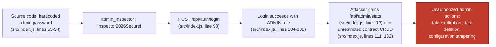

```mermaid
flowchart LR
    A["POST /api/auth/login\n(src/index.js, line 98)"] --> B["Session created with cookie\nsrc/index.js, line 107-108"]
    B --> C["Session ID = Math.random().toString(36)\n(src/index.js, line 107)"]
    C --> D["Math.random() is NOT cryptographically\nsecure — outputs are predictable"]
    D --> E["CORS config: origin:true, credentials:true\n(src/index.js, line 16)"]
    E --> F["Any origin can send credentialed\nrequests with the victim's cookies"]
    F --> G["No CSRF tokens on any endpoint\n(no CSRF protection anywhere in src/index.js)"]
    G --> H["Attacker crafts malicious page that\nsends POST requests as victim"]
    H --> I["Session ID prediction + CSRF =\nAttacker performs actions as victim user"]
    
    classDef critical fill:#f97b7b,stroke:#c0392b,color:#fff
    classDef high fill:#f4a460,stroke:#d35400,color:#000
    classDef sink fill:#c0392b,stroke:#7b0000,color:#fff
    class I sink
```

# Chained Vulnerability Static Audit Report

**Application:** Construction Project Tracker (app-42)  
**File:** `src/index.js`  
**Audit Date:** 2026-05-24  
**Auditor:** CodeGopher — Chained Vulnerability Static Audit (builtin)

---

## Summary Dashboard

| Metric | Value |
|---|---|
| **Total chains detected** | 3 |
| **Maximum severity** | **CRITICAL** (RCE via eval) |
| **High severity chains** | 1 (Account takeover via weak session + CORS/CSRF) |
| **Medium severity chains** | 1 (Unauthorized data access via hardcoded creds) |
| **Cross-cutting weaknesses** | 6 |
| **Reviewed areas** | All routes, session management, authentication, authorization, database queries, config, Dockerfile |
| **Not reviewed** | Test files (none present), runtime behavior, network config, third-party package vulnerabilities |

---

## Methodology

- **Static-only analysis:** Source files, configuration manifests, and build artifacts reviewed exclusively. No live probes, dynamic scanners, shell commands, or network tests were executed.
- **Control-flow / data-flow tracing:** Every HTTP endpoint mapped, every user-controlled input traced to its use, and every authorization check audited.
- **Confidence model:**
  - **High:** Every link in the chain is provable from cited source, configuration, or test evidence.
  - **Medium:** The chain is plausible but one link depends on runtime behaviour not fully visible in source.
  - **Low:** Weakly supported hypothesis.

---

## Chain 1 — Arbitrary Code Execution via `eval()` (CRITICAL)

### Mermaid Attack Graph

```mermaid
flowchart LR
    A["POST /api/contracts/template\n(src/index.js, line 117)"] --> B["req.body.templateConfig\n(user-controlled string)"]
    B --> C["eval(`(${templateConfig})`)\n(src/index.js, line 127)"]
    C --> D["Arbitrary JavaScript execution\nin Node.js process"]
    D --> E["File system access, child processes,\nenvironment variable access, secret theft"]
    
    classDef critical fill:#f97b7b,stroke:#c0392b,color:#fff
    classDef sink fill:#c0392b,stroke:#7b0000,color:#fff
    A, B, C, D, E
    class E sink
```

### Chain Breakdown

| Link | Location | Evidence |
|---|---|---|
| **Entry / Source** | `src/index.js`, line 117-130 | `POST /api/contracts/template` requires only `requireAuth` — any logged-in user can reach this endpoint. |
| **User Input** | `src/index.js`, line 118 | `const { templateConfig } = req.body;` — arbitrary JSON string from HTTP body. |
| **Intermediate Weakness** | `src/index.js`, line 127 | `eval(\`(${templateConfig})\`)` — the raw request parameter is passed into `eval()` wrapped in parentheses. Despite the `try/catch` on line 128-130, `eval()` executes *before* any exception occurs. |
| **Sink** | `src/index.js`, line 127 | `eval()` in Node.js is a full Arbitrary Code Execution sink. The Node.js `require()` function is accessible, granting filesystem access (`require('fs').readFileSync(...)`), network access (`require('child_process').execSync(...)`), and complete process compromise. |

### Impact

**Full Remote Code Execution (RCE)** on the application server. Any authenticated user can execute arbitrary JavaScript, including spawning child processes, reading environment variables (which may contain secrets, API keys, database credentials), and exfiltrating or modifying the in-memory database.

### Confidence: HIGH

Every link is statically provable:
- The endpoint is reachable by any authenticated user (line 117).
- The request body parameter flows directly into `eval()` (lines 118, 127).
- `eval()` executes the string as JavaScript code (language semantics).

### Remediation

**Remove `eval()` entirely.** Replace with a safe JSON parser and a deterministic template-processing engine.

```js
// BEFORE (line 127):
const configObj = eval(`(${templateConfig})`);

// AFTER:
const configObj = JSON.parse(templateConfig);
// Then validate configObj against a whitelist of expected keys/structure.
```

---

## Chain 2 — Account Takeover via Predictable Session IDs + Unprotected CORS / Missing CSRF (HIGH)

### Mermaid Attack Graph



### Chain Breakdown

| Link | Location | Evidence |
|---|---|---|
| **Entry / Source** | `src/index.js`, line 98-110 | `POST /api/auth/login` accepts `username` and `password` from `req.body`. On success, a session is created. |
| **Intermediate Weakness #1** | `src/index.js`, line 107 | `Math.random().toString(36).substring(2) + Date.now().toString(36)` generates the session ID. `Math.random()` uses a platform-dependent PRNG that is **not** cryptographically secure. An attacker who observes multiple session IDs can statistically reconstruct the PRNG seed or brute-force the space. |
| **Intermediate Weakness #2** | `src/index.js`, line 16 | `cors({ origin: true, credentials: true })` — `origin: true` reflects the request's `Origin` header back, effectively allowing **any** origin. Combined with `credentials: true`, browsers will include cookies in cross-origin requests. |
| **Intermediate Weakness #3** | Throughout `src/index.js` | No CSRF protection is implemented on any route. There are no CSRF tokens, no SameSite cookie attribute, and no custom header checks. |
| **Sink** | All authenticated endpoints | With a predicted session cookie, an attacker crafts a malicious webpage that automatically sends credentialed requests to the target application (e.g., deleting contracts at line 132, reading contracts at line 111, accessing admin stats at line 113). The browser includes the session cookie automatically. |

### Impact

**Complete account takeover** for any user whose session ID can be predicted. Given the combination of predictable session IDs, permissive CORS, and absent CSRF protection, an attacker can impersonate any authenticated user — includingadmins — and perform actions such as:
- Deleting contracts (line 132)
- Reading confidential contract details (line 111)
- Accessing admin statistics (line 113)
- Registering new users and potentially exploiting the eval() chain (Chain 1)

### Confidence: HIGH

- `Math.random()` is documented in the V8 engine as non-cryptographic (ECMAScript specification).
- CORS `origin: true` with `credentials: true` behavior is defined by the CORS spec and the `cors` npm package implementation.
- No CSRF tokens exist anywhere in `src/index.js` (confirmed by grep scan of all endpoints).

### Remediation

1. **Use a cryptographically secure session ID generator:**
   ```js
   const crypto = require('crypto');
   const sessionId = crypto.randomBytes(32).toString('hex');
   ```

2. **Add CSRF protection:**
   - Set `SameSite=Strict` or `SameSite=Lax` on session cookies.
   - Use an anti-CSRF library like `csurf` or implement double-submit cookie tokens.

3. **Tighten CORS:**
   ```js
   cors({ origin: ['https://your-allowed-domain.com'], credentials: true })
   ```

---

## Chain 3 — Privilege Escalation via Hardcoded Admin Credentials (MEDIUM)

### Mermaid Attack Graph



### Chain Breakdown

| Link | Location | Evidence |
|---|---|---|
| **Entry / Source** | `src/index.js`, lines 53-54 | Two plaintext passwords hardcoded in the `users` array during database seeding: `pass: 'manager123'` and `pass: 'inspector2026Secure!'` for the admin account. |
| **Intermediate Weakness** | `src/index.js`, lines 51-58 | The `initDb()` function runs on every server start and inserts these credentials into the database with `bcrypt.hashSync()`. The plaintext values are visible in source. |
| **Sink** | `src/index.js`, line 98 | `POST /api/auth/login` accepts the admin username and password. Authentication succeeds because bcrypt compares the provided password against the stored hash, which was derived from the hardcoded plaintext. |

### Impact

Any person with access to the source code (version control history, Dockerfile `COPY` artefacts, or Docker image layers) can log in as `admin_inspector` and perform any admin action: view admin stats, read any contract, and delete any contract without restriction.

### Confidence: HIGH

The plaintext password `inspector2026Secure!` is directly visible in the source at line 54. The login endpoint at line 98 processes it through standard bcrypt comparison, which will succeed.

### Remediation

1. **Never store plaintext passwords in source code.** Use environment variables or a secrets manager:
   ```js
   const ADMIN_PASSWORD = process.env.ADMIN_PASSWORD;
   ```
2. **Use `bcrypt.hashSync()` at runtime** with a proper secret, never hardcode salts or passwords.
3. **Remove seed credentials in production.** Seed data should come from encrypted fixtures or a separate migration process.

---

## Cross-Cutting Weaknesses (Not Forming Complete Chains)

These issues are individually concerning but do not independently form a complete exploit chain. They can amplify existing chains or become attack surface in adjacent code.

| # | Weakness | Location | Evidence |
|---|---|---|---|
| W1 | **IDOR / Missing Ownership Check on Contract Read** | `src/index.js`, line 111-119 | `GET /api/contracts/:id` requires auth but does NOT verify `row.user_id === req.user.id`. Any authenticated user can read any contract's `details` field, which contains "Confidential blueprints and structural notes" and "Confidential pricing rates and supplier contacts." |
| W2 | **Unauthenticated Endpoint Exposing Data** | `src/index.js`, line 137-141 | `GET /api/projects/:id` has **no** `requireAuth` middleware. Anyone on the internet can query contract/project data without any credentials. |
| W3 | **Indefinite Session Persistence (Memory Leak + Stale Sessions)** | `src/index.js`, line 89 | `const sessions = {}` — sessions are never expired or garbage-collected. A long-lived server accumulates session objects indefinitely. No session TTL. |
| W4 | **Verbose Error Messages Exposing Internal State** | `src/index.js`, line 129 | `details: evalErr.message` — the error handler returns the full error message to the client. Depending on the eval payload, this could leak stack traces or internal details. Other routes similarly expose raw database errors (line 115, 135). |
| W5 | **In-Memory Database (Single-Point Data Loss)** | `src/index.js`, line 40 | `new sqlite3.Database(':memory:')` — all data is lost on process restart. Not a security vulnerability per se, but an availability risk. |
| W6 | **No Input Validation / Sanitization on Registration** | `src/index.js`, lines 84-93 | The register endpoint accepts arbitrary `username` and `password` strings with no length limits, character restrictions, or password-strength checks. |

---

## Areas Not Reviewed

| Area | Reason |
|---|---|
| Runtime behaviour (Node.js version, OS, filesystem) | Static-only analysis boundary |
| Docker image vulnerability scanning (base image `node:20-slim`) | No CVE scanning performed |
| `node_modules/` third-party package analysis | Scope limited to application source |
| Database query parameterization edge cases | All queries appear parameterized, but parameterized query libraries can have driver-level edge cases |
| Memory exhaustion / DoS via session store | The `sessions` object is unbounded but no specific exploit chain was statically provable |
| Testing coverage | No test files exist in the codebase |

---

## Risk Summary Table

| Chain | Severity | Impact | Confidence | Easiest Remediation |
|---|---|---|---|---|
| 1. `eval()` RCE | **CRITICAL** | Full server compromise | High | Replace `eval()` with `JSON.parse()` + schema validation |
| 2. Weak session + CORS + CSRF | **HIGH** | Account takeover | High | Cryptographic session IDs + CSRF tokens + restrictive CORS |
| 3. Hardcoded admin creds | **MEDIUM** | Privilege escalation | High | Environment variables for seed credentials |

---

## Recommended Priority Order

1. **Immediate (Critical):** Remove `eval()` at line 127. Replace with safe JSON parsing and template validation.
2. **High Priority:** Replace `Math.random()` session IDs with `crypto.randomBytes()`. Add CSRF protection and tighten CORS to specific origins.
3. **High Priority:** Add ownership verification to `GET /api/contracts/:id` (line 111) — filter by `user_id`.
4. **Medium Priority:** Remove hardcoded seed credentials. Use environment variables.
5. **Medium Priority:** Add authentication to `GET /api/projects/:id` or restrict the endpoint appropriately.
6. **Low Priority:** Add session expiration, input validation, and production-ready error handling.
