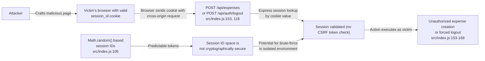
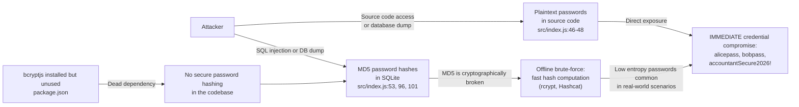
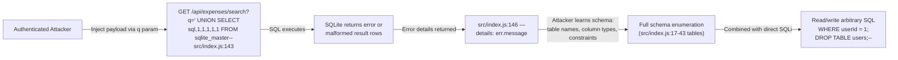

# Chained Vulnerability Static Audit Report

**Project**: app-45-travel-expense (Corporate Travel & Expense System)  
**Date**: 2026-05-24  
**Auditor**: CodeGopher (static-only, no live probes)  
**Scope**: `src/index.js` (single-file Express.js application), `package.json`, `Dockerfile`  
**Stack**: Express 4.19.2 · sqlite3 5.1.7 · cookie-parser · cors · bcryptjs (installed but unused) · Node.js 20  

---

## Summary Dashboard

| Metric | Value |
|---|---|
| **Chains detected** | 5 |
| **Maximum severity** | **HIGH** (SQL Injection + Error Disclosure) |
| **Weaknesses identified** | 11 |
| **Reviewed areas** | Authentication, authorization, input validation, session management, CORS, error handling, database queries, password hashing, Docker config |
| **Not reviewed** | Runtime behavior of `Math.random()` predictability, network-level defenses, CDN/WAF config, deployment environment |

### Severity Distribution

| Severity | Count |
|---|---|
| HIGH | 3 chains |
| MEDIUM | 2 chains |

---

## Methodology & Safety Note

This audit is **strictly static**. No live HTTP probes, fuzzers, SQL injection payloads, credential attacks, dynamic scanners, exploit scripts, port scans, or external network tests were performed. Analysis is based solely on:

- Source code inspection (`src/index.js`)
- Configuration review (`package.json`, `Dockerfile`)
- Dependency manifest analysis
- Control-flow and data-flow tracing

---

## Chain 1: SQL Injection via Search Endpoint → Full Database Exfiltration

**Severity**: HIGH  
**Confidence**: HIGH  
**Impact**: Database exfiltration including all user credentials, expense records, and schema enumeration

### Mermaid Attack Graph

```mermaid
flowchart LR
    A[Attacker] -->|POST/GET with query param q| B["GET /api/expenses/search\nsrc/index.js:138-148"]
    B -->|Unsantitized req.query.q in template literal| C["SQL Injection\nsrc/index.js:143"]
    C -->|String interpolation: ${req.user.id}\nand ${queryParam}| D["SQLite db.all() executes\narbitrary SQL\nsrc/index.js:144"]
    D -->|Error-based exfiltration\nor UNION-based extraction| E["Full database read:\nall expenses + user credentials\nsrc/index.js:143-147"]
    E -->|Error details leaked to client| F["Verbose error message\nsrc/index.js:146"]
    F --> E
```

### Detailed Breakdown

| Link | File | Lines | Symbol / Evidence |
|---|---|---|---|
| **Entry point** | `src/index.js` | 138-139 | `const queryParam = req.query.q || '';` — raw user input from URL query string, no validation or sanitization |
| **Intermediate weakness (SQLi)** | `src/index.js` | 143 | ``const sql = `SELECT * FROM expenses WHERE userId = ${req.user.id} AND (description LIKE '%${queryParam}%' OR category LIKE '%${queryParam}%')`;`` — Template literal interpolates unsanitized user input directly into SQL. `req.user.id` is also interpolated rather than parameterized. |
| **Intermediate weakness (Error leak)** | `src/index.js` | 146 | `return res.status(500).json({ error: 'Expense search failed.', details: err.message });` — SQLite error messages (including schema info, column names) are returned to the attacker |
| **Sink** | `src/index.js` | 144 | `db.all(sql, ...)` — SQLite executes the attacker-controlled SQL string |

**Preconditions**:
- Attacker must be authenticated (all expense endpoints require `requireAuth`, line 75)
- Attacker can set arbitrary `q` query parameter

**Remediation**:
1. Replace template-literal SQL with parameterized query:
   ```js
   const sql = 'SELECT * FROM expenses WHERE userId = ? AND (description LIKE ? OR category LIKE ?)';
   const params = [req.user.id, `%${queryParam}%`, `%${queryParam}%`];
   db.all(sql, params, ...);
   ```
2. Remove `details: err.message` from the error response — return only a generic error message.
3. Never interpolate `req.user.id` or any user-controlled value directly into SQL.

---

## Chain 2: Weak Session IDs + No CSRF Protection → Session Hijacking / CSRF Account Actions

**Severity**: HIGH  
**Confidence**: MEDIUM  
**Impact**: Attacker can perform state-changing actions (create expenses, logout) on behalf of authenticated users

### Mermaid Attack Graph



### Detailed Breakdown

| Link | File | Lines | Symbol / Evidence |
|---|---|---|---|
| **Weakness 1: Weak session ID generation** | `src/index.js` | 105 | `const sessionId = Math.random().toString(36).substring(2) + Date.now().toString(36);` — `Math.random()` is not a CSPRNG. In Node.js, the output can potentially be predicted given partial knowledge. Combined with `Date.now()`, the entropy is insufficient against a determined attacker. |
| **Weakness 2: No CSRF protection** | `src/index.js` | 118-122, 153-168 | All state-changing POST endpoints (`/api/auth/logout`, `/api/expenses`) rely solely on cookies with no CSRF token validation. The CORS config reflects the Origin header (`origin: true` on line 11), making cross-origin requests possible. |
| **Weakness 3: Overly permissive CORS** | `src/index.js` | 11 | `cors({ origin: true, credentials: true })` — `origin: true` reflects any Origin header back, enabling any domain to make authenticated cross-origin requests. Combined with `credentials: true`, this allows any site to send authenticated requests on behalf of logged-in users. |
| **Sink** | `src/index.js` | 153-168 | `db.run('INSERT INTO expenses ...')` — Attacker can create fraudulent expenses under any victim's account |

**Preconditions**:
- Attacker hosts a malicious page
- Target user is authenticated (has a valid session cookie)
- Target user visits the attacker's page

**Remediation**:
1. Use `crypto.randomBytes(32)` or a library like `uuid/v4` for session ID generation.
2. Implement CSRF tokens (e.g., double-submit cookie pattern or SameSite cookie attribute).
3. Set `SameSite: Lax` or `SameSite: Strict` on the session cookie (line 106).
4. Replace `cors({ origin: true })` with an explicit allowlist of trusted origins.

---

## Chain 3: Hardcoded Credentials + MD5 Hashing → Full Credential Compromise

**Severity**: HIGH  
**Confidence**: HIGH  
**Impact**: If source code is accessed, all plaintext passwords are immediately compromised. Even without source access, MD5 allows offline brute-force attacks on all user passwords.

### Mermaid Attack Graph



### Detailed Breakdown

| Link | File | Lines | Symbol / Evidence |
|---|---|---|---|
| **Hardcoded credentials** | `src/index.js` | 46-48 | ```javascript\nconst users = [\n  { username: 'alice_traveler', pass: 'alicepass', role: 'CUSTOMER' },\n  { username: 'bob_traveler', pass: 'bobpass', role: 'CUSTOMER' },\n  { username: 'admin_accountant', pass: 'accountantSecure2026!', role: 'ADMIN' }\n];``` — Plaintext passwords for three accounts, including an admin account, are embedded directly in source code. |
| **MD5 for password hashing** | `src/index.js` | 53, 96, 101 | `crypto.createHash('md5').update(...).digest('hex')` — Used for seed data (line 53), registration (line 96), and login (line 101). MD5 produces 128-bit hashes that can be computed at billions of hashes per second on modern GPUs. |
| **Dead dependency** | `package.json` | bcryptjs listed but never `require()`'d — no call to `bcrypt.hash()` or `bcrypt.compare()` anywhere in the source |

**Preconditions**:
- Source code is accessible (GitHub repo, Docker build artifacts, server filesystem)
- OR attacker gains read access to the SQLite database

**Remediation**:
1. Use `bcryptjs` (already a dependency) for password hashing:
   ```js
   const hash = await bcrypt.hash(password, 12);
   // On login:
   const match = await bcrypt.compare(password, user.password_hash);
   ```
2. Move credentials to environment variables or a secrets manager.
3. Remove hardcoded seed data; use migrations that prompt for or generate passwords at deploy time.
4. Rotate all passwords for affected accounts immediately.

---

## Chain 4: SQL Injection + Error Disclosure → Error-Based Schema Enumeration & DB Admin Access

**Severity**: MEDIUM  
**Confidence**: HIGH  
**Impact**: Attacker can enumerate the full database schema, extract all tables/columns, and potentially escalate to administrative database operations

### Mermaid Attack Graph



### Detailed Breakdown

| Link | File | Lines | Symbol / Evidence |
|---|---|---|---|
| **Entry: SQL Injection** | `src/index.js` | 143 | Same as Chain 1 — unsanitized `queryParam` in template literal |
| **Error-based feedback** | `src/index.js` | 146 | `details: err.message` returns SQLite engine error details, which include syntax errors that reveal schema structure |
| **Schema knowledge** | `src/index.js` | 17-43 | Tables `users` (id, username, password_hash, role) and `expenses` (id, userId, description, amount, category, status) are known from source, but attacker may enumerate additional system tables |
| **Sink** | `src/index.js` | 144 | `db.all(sql, ...)` — With UNION-based injection, attacker can read any table; with error-based injection, attacker can reconstruct schema and extract data |

**Preconditions**:
- Attacker is authenticated
- SQLite version supports the injection techniques used

**Remediation**:
1. Same as Chain 1: parameterized queries.
2. Remove `details: err.message` — return only a user-friendly error.
3. Restrict the database user to minimum necessary permissions (though this is in-memory SQLite, so less critical).
4. Log error details server-side only; never surface them to the client.

---

## Chain 5: Missing Authorization on Expense ID Endpoint → Privacy Breach of All Expenses

**Severity**: MEDIUM  
**Confidence**: HIGH  
**Impact**: Any authenticated user can read any expense record, including those belonging to other users, violating data isolation

### Mermaid Attack Graph

```mermaid
flowchart LR
    A[Attacker — authenticated as alice_traveler] -->|GET /api/expenses/2| B["GET /api/expenses/:id\nsrc/index.js:130-137"]
    B -->|requireAuth only checks\nlogin status, not ownership| C["db.get('SELECT * FROM expenses WHERE id = ?', [expenseId])"]
    C -->|No userId check in WHERE| D["Returns ANY expense record\nregardless of ownership"]
    D -->|Attacker sees expense 2:\nuserId=2, 'Hotel stay for\ndesign sprint', $600\n(src/index.js:43)| E["Privacy breach: cross-user\ndata access"]
```

### Detailed Breakdown

| Link | File | Lines | Symbol / Evidence |
|---|---|---|---|
| **Entry point** | `src/index.js` | 130-131 | `app.get('/api/expenses/:id', requireAuth, ...)` — Requires authentication but nothing more |
| **Missing authorization** | `src/index.js` | 133-134 | `db.get('SELECT * FROM expenses WHERE id = ?', [expenseId])` — No `userId` condition in the WHERE clause. The query retrieves any expense by ID regardless of who owns it. |
| **Contrast with authorized endpoint** | `src/index.js` | 118-123 | `GET /api/expenses` correctly filters by `userId` (line 118: `WHERE userId = ?`). The `/:id` endpoint fails to apply the same authorization check. |
| **Sink** | `src/index.js` | 135-137 | Attacker receives full expense details for any record in the database |

**Preconditions**:
- Attacker has a valid session (any authenticated user)
- Attacker knows or can enumerate expense IDs

**Remediation**:
Add a `userId` condition to the query:
```js
db.get('SELECT * FROM expenses WHERE id = ? AND userId = ?', [expenseId, req.user.id], (err, row) => {
```
Or fetch the record first, then verify ownership.

---

## Cross-Cutting Weaknesses Inventory

| # | Weakness | File | Lines | Severity | Notes |
|---|---|---|---|---|---|
| 1 | **MD5 password hashing** | `src/index.js` | 53, 96, 101 | HIGH | `bcryptjs` is installed but unused. MD5 is cryptographically broken for password hashing. |
| 2 | **Hardcoded credentials** | `src/index.js` | 46-48 | HIGH | Plaintext admin and user passwords in source. Admin role = `ADMIN_ACCOUNTANT`. |
| 3 | **Overly permissive CORS** | `src/index.js` | 11 | MEDIUM | `cors({ origin: true, credentials: true })` allows authenticated cross-origin requests from any domain. |
| 4 | **No CSRF protection** | `src/index.js` | All POST endpoints | MEDIUM | No CSRF tokens on state-changing endpoints. |
| 5 | **Error information disclosure** | `src/index.js` | 146 | MEDIUM | `details: err.message` leaks SQLite internals to client. |
| 6 | **Missing authorization (id endpoint)** | `src/index.js` | 133-134 | MEDIUM | No ownership check on `GET /api/expenses/:id`. |
| 7 | **No input validation on usernames** | `src/index.js` | 87-88 | MEDIUM | No length limits, no sanitization on `username` during registration. |
| 8 | **No input validation on amounts** | `src/index.js` | 154-159 | LOW | No validation that `amount` is a positive number; negative amounts could be submitted. |
| 9 | **No rate limiting** | `src/index.js` | All endpoints | LOW | No rate limiting on `/api/auth/login` or `/api/auth/register`. Brute-force is trivially feasible given MD5. |
| 10 | **In-memory session store** | `src/index.js` | 72 | LOW | `const sessions = {}` — sessions are lost on server restart; no session expiration/rotation. |
| 11 | **httpOnly cookie without SameSite** | `src/index.js` | 106 | MEDIUM | `res.cookie('session_id', sessionId, { httpOnly: true })` — missing `SameSite` attribute. |

---

## Unknowns & Areas Not Reviewed

| Area | Reason | Recommendation |
|---|---|---|
| **Node.js `Math.random()` predictability** | Requires knowledge of the specific V8 version and its PRNG state | Test with known Node.js 20.x PRNG reseeding behavior |
| **Production deployment context** | No docker-compose, no environment config reviewed | Audit actual deployment for hardcoded secrets, network exposure, TLS config |
| **Dependency vulnerabilities** | Only `package.json` reviewed; no `npm audit` or SCA scan run | Run `npm audit` and check `bcryptjs`, `cors`, `sqlite3`, `express` CVEs |
| **Database migration safety** | No migration files found; schema is hardcoded in initDb() | Add migration infrastructure; avoid schema changes in application code |
| **Logging & monitoring** | No logging code found | Add structured logging with PII redaction; alert on auth failures |
| **HTTPS/TLS** | Dockerfile exposes port 8045; no TLS config | Enforce TLS in production; remove `httpOnly`-only benefits without HTTPS |
| **Admin access control** | Admin role used for full expense view but no admin-specific endpoints | Add admin authorization checks and audit logging |

---

## Tests That Should Be Added

| Test Category | What to Test |
|---|---|
| **SQL Injection** | Send crafted `q` parameters to `/api/expenses/search` with UNION payloads, `' OR 1=1--`, and verify parameterized query prevents injection |
| **Authorization** | Authenticate as user A, attempt to `GET /api/expenses/:id` for user B's expense; verify 404 or 403 |
| **CSRF** | Create a cross-origin form POST to `/api/expenses` and verify rejection without CSRF token |
| **Password hashing** | Verify `bcrypt.hash`/`bcrypt.compare` is used for registration and login |
| **Session entropy** | Generate 10,000 session IDs and test for collisions / predictability |
| **CORS** | Send requests from a non-trusted origin and verify rejection |
| **Rate limiting** | Send 100 login requests in rapid succession and verify throttling |
| **Input validation** | Submit negative amounts, empty descriptions, oversized usernames, and SQL/HTML in category fields |
| **Error handling** | Inject malformed requests and verify `details: err.message` is not returned |
| **Credential handling** | Verify no hardcoded passwords exist; passwords are loaded from environment variables |

---

## Prioritized Remediation Summary

| Priority | Action | Affects Chains |
|---|---|---|
| **P0** | Replace template-literal SQL with parameterized queries in `/api/expenses/search` | Chain 1, Chain 4 |
| **P0** | Remove `details: err.message` from error responses | Chain 4 |
| **P1** | Switch to `bcryptjs` for password hashing; remove MD5 | Chain 3 |
| **P1** | Move hardcoded credentials to environment variables | Chain 3 |
| **P1** | Add `userId` filter to `GET /api/expenses/:id` | Chain 5 |
| **P1** | Replace `Math.random()` session IDs with `crypto.randomBytes()` | Chain 2 |
| **P2** | Add CSRF protection (SameSite cookie + CSRF tokens) | Chain 2 |
| **P2** | Restrict CORS to explicit allowlist of origins | Chain 2 |
| **P3** | Add rate limiting on authentication endpoints | Chain 2, Chain 3 |
| **P3** | Add input validation and sanitization on all user inputs | Chain 1, general |

---

*Report generated by CodeGopher — static-only chained vulnerability audit. No live attacks were performed.*
