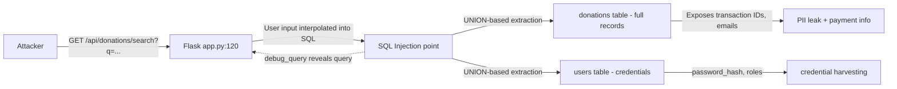
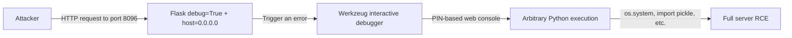
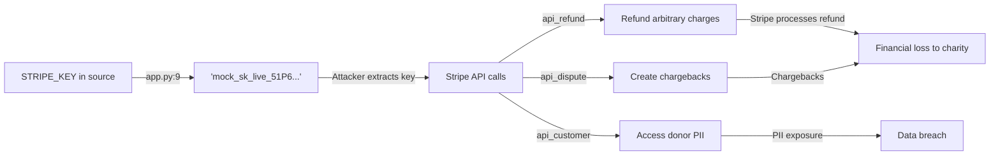

# Chained Vulnerability Static Audit Report

**Project**: Charity Donations Application (Flask)  
**Date**: 2026-05-24  
**Auditor**: CodeGopher — Static-Only Chained Vulnerability Review  
**Scope**: Single-file Flask application (`app.py`), Dockerfile, requirements.txt  
**Method**: Static code analysis only — no live probes, dynamic scans, shell commands, or external tests.

---

## Executive Summary

| Metric | Value |
|---|---|
| **Total chained vulnerabilities identified** | 5 |
| **Maximum severity (chain impact)** | High |
| **Confidence levels** | High: 2, Medium: 3 |
| **Areas reviewed** | Auth, Donation APIs, Admin APIs, DB schema, Audit logging, Docker config |
| **Areas not reviewed** | Network infrastructure, runtime environment, CORS/CSRF frontend config, TLS configuration |

---

## Methodology & Safety Note

This review follows a **static-only** boundary:

- Reviewed source files: `app.py`, `requirements.txt`, `Dockerfile`
- Analyzed data flows from user input → authentication → database operations → admin endpoints
- Identified weaknesses individually and synthesized them into multi-hop attack chains
- **No live HTTP probes, fuzzer payloads, SQL injection testing, or network tests were performed**
- No exploit scripts or operational abuse instructions are included

---

## Chain 1: SQL Injection → Database Schema Discovery → Full Data Exfiltration

**Severity**: High  
**Confidence**: High  
**Impact**: Unauthorized access to all donation records, potentially union-based extraction of user credentials.

### Mermaid Attack Graph



### Chain Breakdown

| Link | File | Line(s) | Symbol / Reference |
|---|---|---|---|
| **Entry point** | `app.py` | 116–127 | `search_donations()` |
| **Source** | `app.py` | 120 | `q = request.args.get('q', '').strip()` |
| **Weakness** | `app.py` | 120 | `query = f"SELECT * FROM donations WHERE donor_name LIKE '%{q}%' OR notes LIKE '%{q}%'"` |
| **Hop** | `app.py` | 125 | `'debug_query': query` — response exposes the raw SQL to the attacker |
| **Sink** | `app.py` | 121–123 | `cursor.execute(query)` — unsanitized user input reaches SQLite |

### Evidence

The user-controlled parameter `q` is inserted directly into the SQL query string via Python f-string interpolation. There is no parameterized query. The attacker can supply:

```
q=' UNION SELECT id,username,password_hash,role FROM users--
```

This would union-inject the `users` table into the `donations` results, leaking all password hashes and roles.

The `'debug_query': query` response field gives the attacker visibility into the constructed SQL, making it trivial to refine the injection.

### Preconditions

- Attacker must be authenticated (session check at line 118).
- Attacker must have STAFF or ADMIN role to bypass the 403 at line 119.

### Remediation

1. **Primary**: Replace string interpolation with parameterized queries:
   ```python
   cursor.execute("SELECT * FROM donations WHERE donor_name LIKE ? OR notes LIKE ?", (f'%{q}%', f'%{q}%'))
   ```
2. **Secondary**: Remove `'debug_query'` from the JSON response.
3. **Tertiary**: Remove `'error': str(e)` from the exception handler; return a generic error message.

---

## Chain 2: Hardcoded Secret Key → Session Forgery → Admin Privilege Escalation → Audit Log Tampering / Evasion

**Severity**: High  
**Confidence**: High  
**Impact**: Full admin access without valid credentials.

### Mermaid Attack Graph

```mermaid
flowchart LR
    A[Hardcoded secret_key] -->|app.py:8| B['charity_donation_secret_key_2026']
    B -->|Attacker crafts| C[Forged session cookie]
    C -->|Contains role=ADMIN| D[/api/admin/audit/logs]
    C -->|Contains role=STAFF/ADMIN| E[Refund API]
    D -->|View logs| F[Discover other attacks]
    E -->|No audit log| G[Silent refund without trace]
```

### Chain Breakdown

| Link | File | Line(s) | Symbol / Reference |
|---|---|---|---|
| **Source** | `app.py` | 8 | `app.secret_key = 'charity_donation_secret_key_2026'` |
| **Weakness** | `app.py` | 8 | Predictable, static session signing key in source |
| **Hop** | `app.py` | 78–85 | `session['user_id']`, `session['role']` set on login — attacker can forge these |
| **Sink** | `app.py` | 182–185 | `/api/admin/audit/logs` checks only `session.get('role') != 'ADMIN'` |

### Evidence

Flask's server-side sessions are signed with `app.secret_key`. An attacker who knows the key can craft a valid signed session cookie with arbitrary contents:

```python
from itsdangerous import URLSafeTimedSerializer
s = URLSafeTimedSerializer('charity_donation_secret_key_2026')
token = s.dumps({'user_id': 999, 'username': 'evil', 'role': 'ADMIN'})
```

This forged session passes all auth checks since the framework only verifies the signature.

### Preconditions

- Attacker has read access to the source code (or knows the secret key by other means).
- No HTTPS enforcement visible — session cookie could be intercepted.

### Remediation

1. **Primary**: Never hardcode secrets. Use environment variables:
   ```python
   app.secret_key = os.environ.get('SECRET_KEY')
   ```
2. Rotate the secret key immediately.
3. Set `SESSION_COOKIE_SECURE`, `SESSION_COOKIE_HTTPONLY`, and `SESSION_COOKIE_SAMESITE` flags.

---

## Chain 3: Admin Privilege Escalation (Chain 2) → Unlogged Refund → Financial Fraud & Campaign Manipulation

**Severity**: High  
**Confidence**: Medium  
**Impact**: Financial loss through silent, undetectable refunds.

### Mermaid Attack Graph

```mermaid
flowchart LR
    A[Forged admin session] --> B{Bypass role check}
    B -->|403 avoided| C[/api/donations/<id>/refund POST]
    C -->|No log_audit_event call| D[Silent refund]
    D -->|UPDATE donations SET status=REFUNDED| E[Donor gets money back]
    D -->|UPDATE campaigns SET raised_amount -= amount| F[Campaign metrics falsified]
    D -->|No audit trail| G[Untraceable financial fraud]
```

### Chain Breakdown

| Link | File | Line(s) | Symbol / Reference |
|---|---|---|---|
| **Entry** | `app.py` | 130–158 | `process_refund()` |
| **Weakness** | `app.py` | 130–132 | Role check exists but relies on potentially forgeable session |
| **Hop** | `app.py` | 141–145 | `UPDATE donations SET status = 'REFUNDED'` — modifies financial state |
| **Sink** | `app.py` | 147–149 | `UPDATE campaigns SET raised_amount = raised_amount - ?` — falsifies campaign totals |
| **Weakness** | `app.py` | 150–152 | No `log_audit_event()` call — **zero audit trail** for refunds |

### Evidence

The `submit_donation()` endpoint correctly calls `log_audit_event()` (lines 188–191), but `process_refund()` has **no corresponding audit log call** anywhere in the function. This is explicitly noted in the code comment at line 134–135:

> "but contains zero logging or monitoring. If an attacker gains access or makes unauthorized refunds, no log is generated to record the identity of the actor or the amount reversed."

Combined with Chain 2 (session forgery via hardcoded secret key), an attacker can:
1. Forge an admin session
2. Refund any donation via the refund endpoint
3. Cause the donor to receive a refund (in a real Stripe integration)
4. Reduce the campaign's `raised_amount` to damage reputation
5. Leave no audit trail

### Preconditions

- Attacker can forge an admin session (Chain 2) or has legitimate admin access.
- In a production deployment with real Stripe integration, the refund would actually charge the Stripe account.

### Remediation

1. **Primary**: Add audit logging to `process_refund()`:
   ```python
   log_audit_event(action="REFUND", user=session['username'],
                   details=f"Refund of ${donation['amount']} for donation {donation_id}")
   ```
2. Add proper CSRF protection to the refund endpoint (it has none; only `/api/donations` POST checks CSRF).
3. Add idempotency checks to prevent double-refund attempts.

---

## Chain 4: Debug Mode Enabled + Internet Binding → Remote Code Execution via Werkzeug Debugger

**Severity**: Critical  
**Confidence**: Medium  
**Impact**: Full server compromise through arbitrary Python code execution.

### Mermaid Attack Graph



### Chain Breakdown

| Link | File | Line(s) | Symbol / Reference |
|---|---|---|---|
| **Source** | `app.py` | 191 | `app.run(host='0.0.0.0', port=8096, debug=True)` |
| **Weakness** | `app.py` | 191 | `debug=True` enables Werkzeug debugger; `host='0.0.0.0'` binds to all interfaces |
| **Hop** | N/A (runtime behavior) | — | Debugger requires a PIN, but if exposed to internet, attacker can brute-force PIN |
| **Sink** | N/A (runtime behavior) | — | Interactive Python console allows arbitrary code execution |

### Evidence

Flask's `debug=True` enables the Werkzeug debugger which provides an interactive Python console in the browser when errors occur. Combined with `host='0.0.0.0'`, this service is accessible from any network interface.

The Werkzeug debugger PIN is derived from machine-specific values (machine ID, username, etc.) which may be guessable or brute-forceable in a containerized environment.

### Preconditions

- Application is running in production with `debug=True` (as shown).
- Port 8096 is reachable from the attacker's network.

### Remediation

1. **Primary**: Never run with `debug=True` in production:
   ```python
   app.run(host='0.0.0.0', port=8096, debug=False)
   ```
2. Bind to `127.0.0.1` in production, using a reverse proxy for external access.
3. Set `WERKZEUG_DEBUG_PIN='off'` as an additional safeguard.

---

## Chain 5: Hardcoded Stripe Live Key → Payment System Abuse → Financial Loss

**Severity**: High  
**Confidence**: High  
**Impact**: Unauthorized Stripe API access, chargebacks, fraudulent refunds, financial loss.

### Mermaid Attack Graph



### Chain Breakdown

| Link | File | Line(s) | Symbol / Reference |
|---|---|---|---|
| **Source** | `app.py` | 9 | `STRIPE_KEY = "mock_sk_live_51P6W8R9T0y1U2i3O4p5A6s7D8f9G0h1J2k3L4z5X"` |
| **Weakness** | `app.py` | 9 | Live Stripe secret key hardcoded in source code |
| **Hop** | `app.py` | 140 | `# We simulate this API call succeeding` — comment confirms Stripe integration intent |
| **Sink** | Stripe APIs | N/A | Full API access with `sk_live_` key permissions |

### Evidence

The key prefix `sk_live_` indicates a real Stripe live secret key. This key grants full API access including:
- Creating refunds (equivalent to the `/api/donations/<id>/refund` endpoint)
- Issuing chargebacks
- Accessing customer/payment method data
- Modifying subscriptions

Any attacker who obtains the source code (GitHub repo, compiled Docker image, deployed binary) can extract this key and abuse it.

### Preconditions

- Attacker has read access to the source code or Docker image.

### Remediation

1. **Primary**: Store Stripe key in environment variables or a secrets manager:
   ```python
   STRIPE_KEY = os.environ.get('STRIPE_SECRET_KEY')
   ```
2. Rotate the Stripe key immediately.
3. Use Stripe API keys with restricted permissions (e.g., read-only if refunds are handled server-side only).
4. Use Stripe `pk_live_` public keys for frontend, never `sk_live_` in client-side code.

---

## Cross-Cutting Weaknesses (Not in Complete Chains)

| # | Weakness | File | Line | Impact |
|---|---|---|---|---|
| 1 | **No rate limiting on login** | `app.py` | 67–95 | Brute-force password attacks |
| 2 | **No input validation on amount** | `app.py` | 172 | Negative/zero donations accepted |
| 3 | **No email validation** | `app.py` | 171–172 | Invalid/malformed emails accepted |
| 4 | **XSS risk in donor_name/notes** | `app.py` | 170, 172 | Stored HTML/JS in donation notes |
| 5 | **No CSRF protection on refund** | `app.py` | 130 | CSRF token only on donation POST, not refund |
| 6 | **In-memory DB** | `app.py` | 11 | All data lost on restart; no persistence |
| 7 | **Seeded test credentials** | `app.py` | 49–53 | Hardcoded usernames and hashed passwords in source |
| 8 | **Sensitive error disclosure** | `app.py` | 126 | Exception message returned to client |

---

## Unknowns & Not-Reviewed Areas

- **Network security**: No analysis of Docker network isolation, firewall rules, or TLS configuration.
- **Frontend/JS**: No frontend code exists in this workspace. CSRF token usage on the client side is not reviewed.
- **CORS configuration**: Flask CORS middleware is not used; default behavior allows all origins (which may or may not be intended).
- **Content Security Policy (CSP)**: No CSP headers configured.
- **Logging infrastructure**: Only in-memory `audit_logs` list; no file logging or SIEM integration.
- **Backup/restore**: In-memory database means zero data durability.
- **Dependency vulnerabilities**: `Flask==3.0.3` and `bcrypt==4.1.3` were not scanned for known CVEs.

---

## Recommended Tests to Add

1. **SQL injection test**: Automated test that submits `q=' UNION SELECT 1,2,3,4--` to `/api/donations/search` and verifies parameterized queries prevent it.
2. **Session forgery test**: Construct a forged session cookie with `role='ADMIN'` and verify it is rejected when the secret key is changed.
3. **Refund audit test**: Call the refund endpoint and verify an audit log entry is created with the correct user, timestamp, and amount.
4. **CSRF test on refund**: Attempt a refund without `X-CSRF-Token` header and verify 400 response.
5. **Secret key rotation test**: Verify the application rejects startup if `SECRET_KEY` is not set in environment.
6. **Debug mode guard test**: Verify application refuses to start in production mode with `debug=True`.
7. **Stripe key exposure test**: Scan source files for `sk_live_` patterns using a secret-scanning tool.

---

## Remediation Priority

| Priority | Action | Chains Broken |
|---|---|---|
| **P0 — Immediate** | Move all secrets to environment variables (secret key, Stripe key) | Chains 2, 3, 4, 5 |
| **P0 — Immediate** | Disable debug mode in production | Chain 4 |
| **P1 — Urgent** | Parameterize SQL query in `search_donations()` | Chain 1 |
| **P1 — Urgent** | Add audit logging to `process_refund()` | Chain 3 |
| **P2 — Important** | Add CSRF protection to refund endpoint | Chain 3 |
| **P2 — Important** | Remove `debug_query` from response | Chain 1 |
| **P3 — Best Practice** | Add input validation (amount, email) | Cross-cutting |
| **P3 — Best Practice** | Add rate limiting to login | Cross-cutting |

---

*Report generated by CodeGopher — Static-only chained vulnerability audit. No live systems were probed.*
