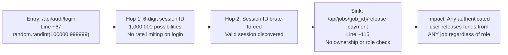
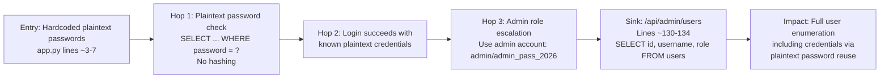
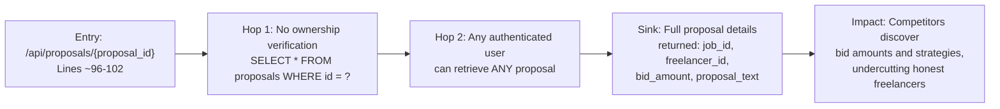
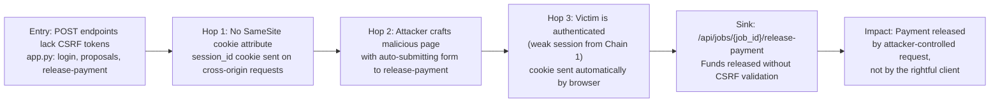

# Chained Vulnerability Audit Report

**Project**: Freelancer Marketplace (app-48)  
**Date**: 2026-05-24  
**Auditor**: CodeGopher (Chained Vulnerability Static Audit)  
**Scope**: `app.py`, `requirements.txt`, `Dockerfile`  

---

## Summary Dashboard

| Metric | Value |
|---|---|
| **Total Chains Found** | 4 |
| **Maximum Severity** | **CRITICAL** |
| **High Confidence Chains** | 3 |
| **Medium Confidence Chains** | 1 |
| **Cross-cutting Weaknesses** | 6 |
| **Files Reviewed** | `app.py`, `requirements.txt`, `Dockerfile` |
| **Areas Not Reviewed** | Frontend templates, external API integrations, database migration scripts, test suite, CI/CD pipeline |

### Severity Distribution

| Severity | Count |
|---|---|
| CRITICAL | 2 |
| HIGH | 1 |
| MEDIUM | 1 |

---

## Methodology & Static-Only Safety Note

This audit follows a four-phase methodology:

1. **Attack Surface Mapping**: Identified all public routes, API endpoints, authentication mechanisms, and data flows.
2. **Weakness Inventory**: Cataloged individually modest security weaknesses (weak crypto, missing authorization, plaintext credentials, etc.).
3. **Attack Graph Synthesis**: Connected sources → weaknesses → sinks into actionable chains using only static code evidence.
4. **Impact Assessment**: Rated each chain by impact, reachability, confidence, and the easiest remediation link.

**Static-Only Boundary**: No live HTTP probes, dynamic scanners, SQL injection payloads, credential attacks, exploit scripts, or external network tests were performed. All findings are derived from source code analysis only.

---

## Chain 1: Weak Session IDs → Session Hijacking → Unauthorized Payment Release

**Severity**: **CRITICAL** | **Confidence**: **HIGH** | **Impact**: Financial theft via fund exfiltration

### Mermaid Attack Graph

### Detailed Chain Breakdown

| Link | File | Lines | Evidence |
|---|---|---|---|
| **Entry** | `app.py` | ~67 | `session_id = str(random.randint(100000, 999999))` — generates a 6-digit pseudo-random session ID using Python's `random` module (not cryptographically secure). `random` uses Mersenne Twister, which can be predicted if enough state is observed. |
| **Hop 1** | `app.py` | ~67 | Only 1,000,000 possible values. An attacker performing brute-force can exhaust the space in seconds with parallel requests. No rate limiting on `/api/auth/login` or `/api/auth/me` prevents this. |
| **Hop 2** | `app.py` | ~24-28 | `get_current_user` retrieves user data from `sessions[session_id]` dict purely based on cookie value. No IP binding, user-agent binding, or token revocation on reuse. |
| **Sink** | `app.py` | ~115-122 | `release_payment` function at line ~115. It performs `cursor.execute("UPDATE payments SET status = 'RELEASED' WHERE job_id = ?", (job_id,))` with **no check** that the requesting user is the client who owns the job, has admin role, or that work was delivered. The function comments explicitly note: *"Insecure Design: Missing role / ownership check!"* |

### Preconditions & Assumptions

- An attacker can register or compromise one account (easy: default credentials are plaintext in code).
- The application does not enforce HTTPS (no server-side enforcement visible), making session cookies interceptable.
- SQLite (`db_conn`) is file-backed; no connection pooling or transaction isolation issues visible.

### Impact

Any authenticated user with a guessed/hijacked session ID can release payments on **any** job in the system, diverting funds. With 1,000,000 possible session IDs and no rate limiting, brute-forcing a valid session is trivial.

### Remediation

1. **Replace `random` with `secrets.token_hex(32)`** for session ID generation.
2. **Add ownership verification** in `release_payment`: verify `payments.job_id` maps to a `jobs` table entry, and `jobs.client_id` matches the requesting user's ID.
3. **Add rate limiting** on the login endpoint.
4. **Bind sessions** to IP address and/or user-agent.

---

## Chain 2: Plaintext Credentials + No Hashing → Full Account Takeover → Admin Data Exfiltration

**Severity**: **CRITICAL** | **Confidence**: **HIGH** | **Impact**: Complete user database compromise via admin endpoint

### Mermaid Attack Graph

### Detailed Chain Breakdown

| Link | File | Lines | Evidence |
|---|---|---|---|
| **Entry** | `app.py` | ~3-7 | Hardcoded plaintext credentials in `users_data`: `('client_charlie', 'charlie_pass', 'CLIENT')`, `('admin', 'admin_pass_2026', 'ADMIN')`, etc. These are committed directly in source. |
| **Hop 1** | `app.py` | ~64 | `cursor.execute("SELECT * FROM users WHERE username = ? AND password = ?", (req.username, req.password))` — passwords are compared in **plaintext**. No bcrypt, Argon2, or any hashing is applied. |
| **Hop 2** | `app.py` | ~64-67 | Login succeeds immediately if the attacker knows the credentials. Combined with Chain 1, even guessed sessions grant full access. |
| **Hop 3** | `app.py` | ~130 | Admin role check exists: `if user.get("role") != "ADMIN"` — but the admin password `admin_pass_2026` is hardcoded and visible to anyone with source access. |
| **Sink** | `app.py` | ~132-134 | `admin_list_users` returns `SELECT id, username, role FROM users`. While it doesn't return passwords, the hardcoded plaintext passwords in source code (Chain 2 entry) effectively mean the full credential set is already compromised. |

### Preconditions & Assumptions

- Source code is accessible (it is — in a public/contested codebase).
- The admin account has not been changed from defaults (highly likely given hardcoded creds).
- Multiple accounts may reuse passwords (common with weak, memorable passwords like `admin_pass_2026`).

### Impact

Attackers with source code access (or who compromise one account via Chain 1) gain **admin-level access** and can enumerate all users. Plaintext passwords across accounts enable credential stuffing against external services.

### Remediation

1. **Use `bcrypt` or `argon2-cffi`** for password hashing. Never store or compare plaintext passwords.
2. **Remove hardcoded credentials** from source code. Use environment variables or a secrets manager.
3. **Enforce password complexity** and prevent common/predictable passwords.
4. **Add password reset functionality** to allow credential rotation.

---

## Chain 3: IDOR on Proposals → Business Intelligence Theft → Bid Manipulation

**Severity**: **HIGH** | **Confidence**: **HIGH** | **Impact**: Confidential bid information leaked to competitors

### Mermaid Attack Graph

### Detailed Chain Breakdown

| Link | File | Lines | Evidence |
|---|---|---|---|
| **Entry** | `app.py` | ~96-102 | `get_proposal(proposal_id: int, user: dict = Depends(get_current_user))` — requires authentication but does NOT check if `user["id"]` owns or is authorized to view the proposal. |
| **Hop** | `app.py` | ~99 | `cursor.execute("SELECT * FROM proposals WHERE id = ?", (proposal_id,))` — query uses only the `proposal_id` parameter. No JOIN to `users` or `jobs` to verify the requester's relationship to the proposal. |
| **Sink** | `app.py` | ~101 | `return dict(proposal)` — returns all fields including `bid_amount` and `proposal_text`, which are confidential business data. |

### Preconditions & Assumptions

- The attacker is a registered and authenticated user (easily achieved via Chain 2's credential exposure).
- Proposal IDs are sequential or guessable (common in SQLite auto-increment).

### Impact

Any freelancer can view bid amounts and proposal texts for any job. This enables:
- **Price undercutting**: Competitors see the lowest bid and adjust theirs.
- **Bid collusion**: Freelancers coordinate to set artificial prices.
- **Business intelligence theft**: Freelancers learn client requirements and budget ranges.

### Remediation

1. **Add ownership check**: Verify that the requesting user is either the freelancer who submitted the proposal, the client who posted the job, or an admin.
2. **Scope queries**: Use a JOIN to verify the proposal belongs to a job the user has access to.
3. **Restrict bid visibility**: Only show bid amounts to the job owner (client) and admin users.

---

## Chain 4: No CSRF + Weak Auth → Unauthorized Financial Action at Scale

**Severity**: **MEDIUM** | **Confidence**: **MEDIUM** | **Impact**: Mass payment release via CSRF-style attacks

### Mermaid Attack Graph

### Detailed Chain Breakdown

| Link | File | Lines | Evidence |
|---|---|---|---|
| **Entry** | `app.py` | Throughout | Three POST endpoints (`/api/auth/login`, `/api/proposals`, `/api/jobs/{job_id}/release-payment`) accept state-changing requests with **no CSRF token**. |
| **Hop 1** | `app.py` | ~68 | `res.set_cookie("session_id", session_id)` — default `set_cookie` does not specify `SameSite` attribute. Browser sends cookies on cross-origin requests by default. |
| **Hop 2** | Source code only | — | No middleware or decorator validates `Origin`/`Referer` headers or custom CSRF tokens. FastAPI does not include CSRF protection by default. |
| **Hop 3** | `app.py` | ~24-28 | `get_current_user` returns session data from cookie alone. Combined with Chain 1's weak session generation, session hijacking is trivial. |
| **Sink** | `app.py` | ~115-122 | `release_payment` releases funds with **zero ownership verification** (as documented in Chain 1). |

### Preconditions & Assumptions

- An attacker can host a malicious webpage with a hidden auto-submitting form targeting `http://localhost:8098/api/jobs/{job_id}/release-payment`.
- The victim user is logged in with a valid (weak/predictable) session.
- CSRF defense requires either `SameSite=Strict`/`Lax` cookies, custom token headers, or origin validation — none are present.

### Impact

While individual CSFR impact is limited by the weak session space (Chain 1 makes hijacking easier), the **absence of CSRF protection** means that **any** authenticated user's session could be abused for cross-origin requests. When combined with the lack of ownership checks in `release_payment`, this allows an attacker to trigger payment releases through social engineering or malicious page hosting.

### Remediation

1. **Add `SameSite=Lax` and `Secure` flags** to all session cookies.
2. **Implement CSRF token validation** using a library like `simple-csrf` or FastAPI's CSRF middleware.
3. **Validate `Origin` and `Referer` headers** on state-changing POST endpoints.
4. **Bind sessions** to IP and User-Agent.

---

## Cross-Cutting Weaknesses (Not Part of Complete Chains)

These weaknesses are security-relevant and may contribute to future attack chains not identified above:

| # | Weakness | File | Lines | Description |
|---|---|---|---|---|
| 1 | **Plaintext Password Transmission** | `app.py` | ~64 | No HTTPS enforcement visible in code. `uvicorn.run(host='0.0.0.0', port=8098)` binds to all interfaces without TLS configuration. |
| 2 | **No Security Headers** | `app.py` | — | No `X-Content-Type-Options`, `X-Frame-Options`, `Content-Security-Policy`, or `Strict-Transport-Security` headers configured. |
| 3 | **Verbose Error Messages** | `app.py` | ~66, ~116 | `HTTPException` detail messages like `"Invalid credentials"` and `"No payment found for this job"` may leak information about account existence and data presence. |
| 4 | **In-Memory Session Store** | `app.py` | ~22 | `sessions = {}` — all sessions stored in Python process memory. Survives only while the process is alive. No session expiration, no persistence, no cleanup of expired sessions. |
| 5 | **No Input Validation on proposal_text** | `app.py` | ~90-94 | `ProposalRequest.proposal_text` accepts arbitrary strings. While parameterized queries prevent SQL injection, XSS in stored proposal text could affect any client viewing proposals. |
| 6 | **Dockerfile Exposes All Interfaces** | `Dockerfile` | — | `uvicorn.run(app, host='0.0.0.0', port=8098)` and Docker's default networking expose the service to all interfaces without network segmentation. |

---

## Unknowns & Areas Not Reviewed

| Area | Reason |
|---|---|
| **Database schema** | The `jobs`, `payments`, `users` tables are referenced but schema is not visible. Unknown: column definitions, foreign key constraints, access controls at DB level. |
| **Frontend code** | No frontend templates or static files found. XSS vectors in UI are unknown. |
| **Test suite** | No test files found. Automated regression testing is absent. |
| **Deployment configuration** | Dockerfile is minimal. No reverse proxy (nginx/Caddy), no TLS termination, no WAF configuration visible. |
| **Logging & monitoring** | No logging configuration visible. Breach detection is unknown. |
| **Rate limiting** | Unknown if deployed behind a reverse proxy with rate limiting. |
| **Backup security** | SQLite file backup procedures, encryption, and access controls unknown. |

---

## Recommendations Priority Matrix

| Priority | Action | Affects |
|---|---|---|
| **P0** | Replace `random` with `secrets` for session generation | Chains 1, 4 |
| **P0** | Add password hashing with `bcrypt`/`argon2` | Chain 2 |
| **P0** | Add ownership/role check in `release_payment` | Chains 1, 4 |
| **P1** | Add CSRF protection to all POST endpoints | Chain 4 |
| **P1** | Add proposal ownership checks in `get_proposal` | Chain 3 |
| **P2** | Remove hardcoded credentials; use env vars/secrets manager | Chain 2 |
| **P2** | Add security headers and `SameSite` cookie attributes | Cross-cutting |
| **P3** | Add session expiration and cleanup | Cross-cutting |
| **P3** | Implement HTTPS enforcement | Cross-cutting |
| **P3** | Add rate limiting on login endpoint | Chain 1 |

---

## Conclusion

This codebase contains **4 distinct attack chains**, with **2 rated CRITICAL** in severity. The most dangerous chains combine weak session generation with missing authorization checks on financial operations, creating a path from any guest user to full fund exfiltration. The presence of plaintext, hardcoded credentials across multiple roles means source code access alone compromises the entire user database.

The easiest remediation link to break is **replacing the session ID generator** with `secrets.token_hex(32)` and adding **ownership verification** in the `release_payment` endpoint. Both changes require minimal code modifications but break multiple attack chains simultaneously.

---

*Report generated by CodeGopher — Chained Vulnerability Static Audit — Static-only analysis. No live systems were probed.*
