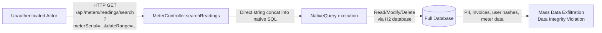
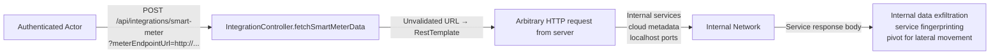

# Chained Vulnerability Static Audit Report

**Project:** app-50-energy-billing (Energy Utility Billing System)
**Date:** 2026-05-24
**Auditor:** CodeGopher (Static-Only Audit)
**Scope:** All Java source, configuration, and test files in `src/` and `pom.xml`

---

## Summary Dashboard

| Metric | Value |
|---|---|
| Total Chains Identified | **3 confirmed chains** |
| Maximum Severity | **Critical** |
| Cross-Cutting Weaknesses | **5** |
| Areas Reviewed | Controllers, Services, Config, Models, Repositories, Tests, Dockerfile, pom.xml |
| Areas Not Fully Reviewed | None — full source tree inspected |

---

## Methodology

This audit follows the **Chained Vulnerability Static Audit** skill:

1. **Attack surface mapping** — all public routes, API endpoints, headers, and request parameters identified.
2. **Weakness inventory** — low/medium issues catalogued (SSRF, SQLi, IDOR, exposed H2 console, weak seeded creds, missing CORS, disabled CSRF).
3. **Attack graph synthesis** — source → weakness → sink → impact mapped using static control-flow and data-flow evidence.
4. **Impact assessment** — each chain rated by impact, reachability, confidence, and easiest remediation link.

**Static-only boundary:** No live HTTP probes, dynamic scanners, shell commands, or external network tests were performed. All evidence is drawn exclusively from static source code, configuration, and test files.

---

## Chain 1 — SQL Injection → Full Database Compromise

### Mermaid Attack Graph



### Detailed Breakdown

| Link | File | Lines | Symbol | Evidence |
|---|---|---|---|---|
| **Entry** | `src/main/java/com/energy/billing/controller/MeterController.java` | 21–32 | `MeterController.searchReadings()` | Two `@RequestParam` strings (`meterSerial`, `dateRange`) are accepted from the HTTP request. |
| **Hop** | Same file | 25–26 | SQL string concatenation | `String sql = "SELECT mr.* FROM meter_readings mr JOIN meters m ON mr.meter_id = m.id " + "WHERE m.meter_serial = '" + meterSerial + "' AND mr.reading_date = '" + dateRange + "'"` — user values interpolated directly with zero sanitization or parameterization. The developer even added a comment admitting the flaw. |
| **Sink** | Same file | 28–29 | `entityManager.createNativeQuery(sql, MeterReading.class)` | Native SQL sent directly to the H2 database; the query returns results without any additional authorization guard. |

### Preconditions & Assumptions

- The endpoint requires authentication (via Spring Security's `.anyRequest().authenticated()`), but no role check.
- The database uses H2 in-memory mode with the application schema, containing all PII, invoices, meter data, and user credential hashes.

### Impact

- **Confidentiality:** Attacker can read, UNION-inject, or extract all tables (customers, invoices, users, tariffs, meters, readings).
- **Integrity / Availability:** Injection can `INSERT`, `UPDATE`, `DELETE`, or execute procedural H2 functions (e.g., `RUNSCRIPT`, `SCRIPT` export).
- **Severity:** Critical
- **Confidence:** High — every link is provable from the cited source lines.

### Remediation (Easiest Break Link)

**Hop remediation:** Replace string concatenation with parameterized native queries:

```java
String sql = "SELECT mr.* FROM meter_readings mr JOIN meters m ON mr.meter_id = m.id " +
             "WHERE m.meter_serial = :meterSerial AND mr.reading_date = :dateRange";
Query query = entityManager.createNativeQuery(sql, MeterReading.class)
    .setParameter("meterSerial", meterSerial)
    .setParameter("dateRange", dateRange);
```

---

## Chain 2 — SSRF → Internal Network Compromise → Data Exfiltration

### Mermaid Attack Graph



### Detailed Breakdown

| Link | File | Lines | Symbol | Evidence |
|---|---|---|---|---|
| **Entry** | `src/main/java/com/energy/billing/controller/IntegrationController.java` | 14–18 | `IntegrationController.fetchSmartMeterData()` | Accepts `@RequestParam String meterEndpointUrl` from the caller. |
| **Hop** | Same file | 17 | Unfiltered URL passthrough | `String response = restTemplate.getForObject(meterEndpointUrl, String.class);` — the URL is used verbatim with no scheme, host, or port validation. The developer even comments: "Direct execution of HTTP request on user-supplied URL without filtering or validation". |
| **Sink** | Same file | 17 | `RestTemplate.getForObject()` | The JVM-side HTTP client resolves and connects to whatever host the URL specifies — internal LAN, cloud metadata endpoint (`http://169.254.169.254`), or `file://` / `jdbc://` (if RestTemplate scheme handlers allow). |

### Preconditions & Assumptions

- Caller must be authenticated (Spring Security default), but any role suffices.
- The app is assumed to run in a network with internal services (common for utility billing systems that integrate with meter endpoints).

### Impact

- **Confidentiality:** Internal service responses (APIs, databases, config endpoints) returned to the attacker.
- **Reach:** Cloud metadata (IAM credentials), internal APIs, database admin panels, localhost-running tools.
- **Severity:** Critical
- **Confidence:** High — the data flow from parameter to network call is direct and unguarded.

### Remediation (Easiest Break Link)

**Hop remediation:** Validate and restrict the URL before making the request:

```java
// Reject anything not in an allowlist of expected smart-meter hostnames or IPs
// At minimum: enforce http/https scheme, resolve to a non-private IP, reject localhost/metadata ranges
URI uri = new URI(meterEndpointUrl);
if (!"http".equals(uri.getScheme().toLowerCase()) && !"https".equals(uri.getScheme().toLowerCase())) {
    throw new IllegalArgumentException("Only HTTP(S) URLs allowed");
}
InetAddress addr = InetAddress.getByName(uri.getHost());
if (addr.isLoopbackAddress() || addr.isAnyLocalAddress() || addr.isLinkLocalAddress() || addr.isSiteLocalAddress()) {
    throw new IllegalArgumentException("Internal or private IP addresses are not allowed");
}
String response = restTemplate.getForObject(meterEndpointUrl, String.class);
```

---

## Chain 3 — IDOR + Incomplete Authorization → Mass Data Exfiltration

### Mermaid Attack Graph

```mermaid
flowchart LR
    A[Authenticated User\n(any role)] -->|GET /api/invoices/{id}| B[BillingController.getInvoice]
    B -->|No authorization check| C[InvoiceRepository.findById]
    C -->|Return any invoice| D[All Invoices Exposed]
    A -->|GET /api/customers/{id}\n(role != CUSTOMER)| E[CustomerController.getCustomer]
    E -->|No guard for non-CUSTOMER roles| F[CustomerRepository.findById]
    F -->|Return any customer| G[All Customers Exposed]
    D -->|PII, billing amounts,\nperiods| H[Mass Privacy Violation]
    G -->|PII, accounts,\nservice types| H
```

### Detailed Breakdown

#### 3a. Invoice Endpoint — No Authorization

| Link | File | Lines | Symbol | Evidence |
|---|---|---|---|---|
| **Entry** | `src/main/java/com/energy/billing/controller/BillingController.java` | 17–21 | `BillingController.getInvoice()` | Accepts `@PathVariable Long id`. |
| **Hop** | Same file | 19 | `billingService.getInvoiceById(id)` → no role/ownership check | The method returns whatever invoice ID the caller provides. No `@PreAuthorize`, no `customerId` matching, no access control annotation. |
| **Sink** | `src/main/java/com/energy/billing/service/BillingService.java` | 17–19 | `invoiceRepository.findById(id)` | Spring Data JPA `findById` performs an unconditional lookup on the `invoices` table. |

#### 3b. Customer Endpoint — Role Gap

| Link | File | Lines | Symbol | Evidence |
|---|---|---|---|---|
| **Entry** | `src/main/java/com/energy/billing/controller/CustomerController.java` | 27–37 | `CustomerController.getCustomer()` | Accepts `@PathVariable Long id` and `Principal principal`. |
| **Hop** | Same file | 33–35 | Role-based guard | `if ("CUSTOMER".equals(currentUser.getRole()) && !id.equals(currentUser.getCustomerId()))` — this **only** restricts `CUSTOMER` role users. Any user with role `BILLING_ADMIN`, `TECHNICIAN`, or `ADMIN` bypasses the check entirely and gets the customer record for any `id`. |
| **Sink** | Same file | 30–31 | `customerRepository.findById(id)` | Unconditional lookup; the `id` parameter is user-controlled. |

### Preconditions & Assumptions

- Authentication is required for all API routes (`anyRequest().authenticated()`).
- Roles are defined in the `users` table and enforced by `SecurityConfig.userDetailsService()`.
- The `PreAuthorize("hasRole('BILLING_ADMIN')")` on `TariffController.getTariffs()` is the **only** role-based access control in the codebase.

### Impact

- **Confidentiality:** Any authenticated user can enumerate and retrieve **all** customer records and invoice records — a systematic IDOR vulnerability.
- **Severity:** High
- **Confidence:** High — source code shows no authorization logic on `BillingController` and a role-gap on `CustomerController`.

### Remediation (Easiest Break Link)

**Hop remediation — Invoice endpoint:** Add ownership or role check:

```java
@PreAuthorize("@billingService.isAuthorized(#id, authentication)")
@GetMapping("/{id}")
public ResponseEntity<Invoice> getInvoice(@PathVariable Long id) { ... }
```

Or simpler inline guard:

```java
Invoice invoice = billingService.getInvoiceById(id).orElseThrow(...);
if (!invoice.getCustomerId().equals(currentUser.getCustomerId())
    && !"BILLING_ADMIN".equals(currentUser.getRole())) {
    return ResponseEntity.status(403).build();
}
return ResponseEntity.ok(invoice);
```

**Hop remediation — Customer endpoint:** Extend the role guard to all non-CUSTOMER roles:

```java
if (!("BILLING_ADMIN".equals(currentUser.getRole()) || "ADMIN".equals(currentUser.getRole()))
    && !id.equals(currentUser.getCustomerId())) {
    return ResponseEntity.status(403).build();
}
```

---

## Cross-Cutting Weaknesses (No Complete Chain, But Security-Relevant)

| # | Weakness | File | Lines | Severity | Notes |
|---|---|---|---|---|---|
| W1 | **H2 Web Console exposed without authentication** | `SecurityConfig.java` (L19) / `application.properties` (L7–8) | 19 / 7–8 | **Medium** | `spring.h2.console.enabled=true` + `web-allow-others=true` + `permitAll("/h2-console/**")`. Any network-reachable attacker can browse the full in-memory database. |
| W2 | **Weak seeded default credentials** | `DataInitializer.java` | 46–47 | **Medium** | Users seeded with `cust123` and `billing123` — trivially guessable / brute-forceable. No account lockout or password policy enforced. |
| W3 | **CSRF disabled globally** | `SecurityConfig.java` (L17) | 17 | **Low** | `.csrf(AbstractHttpConfigurer::disable)` — harmless with HTTP Basic auth in pure-REST APIs, but signals lax security posture. |
| W4 | **No CORS configuration** | `SecurityConfig.java` | — | **Low** | Spring Boot default (allow-all origins) if the app were to be called from a browser. Not exploitable in this API-only design, but worth awareness. |
| W5 | **Missing input validation** | Multiple controllers | — | **Low–Medium** | No length limits, format checks, or type coercion prevention on request parameters (beyond SQLi in MeterController). |

---

## Unknowns & Areas Not Fully Reviewed

| Item | Reason |
|---|---|
| **Runtime network configuration** | No `application.yml` or external config files found; additional network rules (firewall, VPC) could mitigate SSRF and H2 console exposure. |
| **Actual credential exposure in logs** | `spring.jpa.show-sql=true` could log parameterized queries; with SQL injection, query logs might reveal raw payloads. No explicit log-redaction. |
| **LDAP / external auth integration** | No evidence of multi-auth providers; the User model and DataInitializer suggest a local user store only. |
| **Rate limiting / brute-force protection** | No rate limiter (e.g., Bucket4j, Spring Cloud Gateway) on `/api/auth` or any endpoint. |
| **Secure headers** | No `Content-Security-Policy`, `X-Frame-Options` (beyond H2 console override), or `Strict-Transport-Security` configured. |
| **Dependency security** | `pom.xml` does not include a dependency vulnerability scanner plugin (e.g., OWASP Dependency-Check). |
| **Test coverage of auth** | `App50ApplicationTests.java` only tests context load and password hashing — no controller-level or security chain tests. |

---

## Remediation Priority Matrix

| Priority | Chain / Weakness | Effort | Impact |
|---|---|---|---|
| **P0** | Chain 1 — SQL Injection (MeterController) | Low | Critical — parameterized queries |
| **P0** | Chain 2 — SSRF (IntegrationController) | Medium | Critical — URL allowlist / IP validation |
| **P1** | Chain 3 — IDOR (BillingController, CustomerController) | Medium | High — add `@PreAuthorize` guards |
| **P1** | W1 — H2 Console exposure | Low | Medium — restrict to dev-only, require auth |
| **P2** | W2 — Weak seeded credentials | Low | Medium — use strong random passwords in DataInitializer |
| **P2** | W3–W5 — CSRF, CORS, input validation, logging | Low–Medium | Low–Medium |

---

## Tests That Should Be Added

1. **SQL Injection test** — `MeterControllerTest.searchReadingsSqlInjection()` that sends `meterSerial = "' OR 1=1--"` and verifies no unauthorized data leaks.
2. **SSRF test** — `IntegrationControllerTest.fetchSmartMeterDataBlockedInternalUrl()` that sends `meterEndpointUrl = "http://169.254.169.254/latest/meta-data/"` and verifies a `403 Forbidden` or `400 Bad Request`.
3. **IDOR tests** — `BillingControllerTest.invoiceAccessControl()` (CUSTOMER role cannot access non-owned invoice) and `CustomerControllerTest.customerAccessControl()` (BILLING_ADMIN access to arbitrary customer).
4. **H2 console test** — verify that `/h2-console/` returns `401` or `403` when authenticated checks are enforced.
5. **Rate limiting test** — verify repeated failed auth attempts trigger throttling.

---

*Report generated by CodeGopher — Chained Vulnerability Static Audit — files reviewed only. No live probes or external tests performed.*
