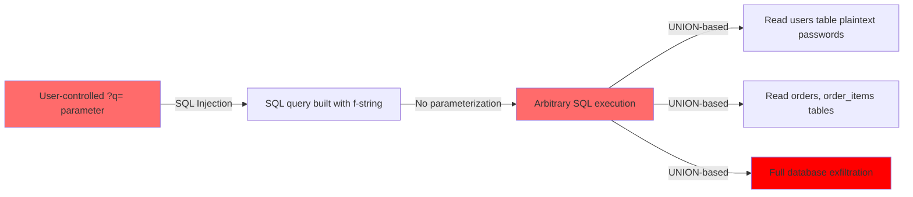
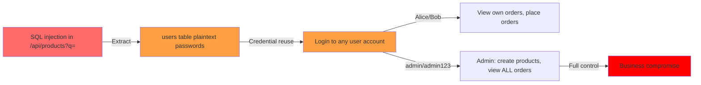
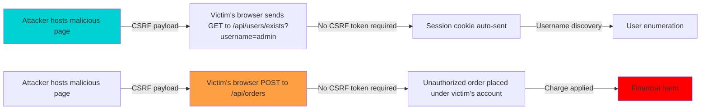
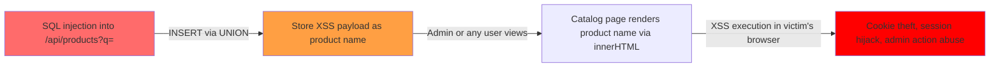

# Chained Vulnerability Audit Report

**Project:** Quantum Core E-Commerce Catalog (Flask + SQLite + Vanilla JS SPA)  
**Audit Type:** Static-only source code analysis (no live probes, no dynamic scanners)  
**Files Reviewed:** `app.py`, `static/index.html`, `static/js/app.js`, `static/css/main.css`, `Dockerfile`, `requirements.txt`, `tests/test_app.py`  
**Date:** 2026-05-25  

---

## Summary Dashboard

| Metric | Value |
|---|---|
| **Total Chains Identified** | 4 |
| **Maximum Severity** | **CRITICAL** |
| **High Confidence Chains** | 3 |
| **Medium Confidence Chains** | 1 |
| **Cross-Cutting Weaknesses** | 12 |
| **Areas Not Reviewed** | Runtime dependency CVEs, file upload handlers (none exist), CSP headers |

### Severity Distribution

| Severity | Count |
|---|---|
| CRITICAL | 2 |
| HIGH | 1 |
| MEDIUM | 1 |

---

## Methodology & Safety Note

This audit follows a **static-only** methodology. No live HTTP probes, SQL injection payloads, fuzzers, or network tests were executed. All findings are derived from:

- Source code control-flow and data-flow analysis
- Configuration review (Flask, Docker, secrets)
- Test coverage inspection
- Template/frontend security analysis

---

## Attack Chain 1: SQL Injection via Product Search → Full Database Read

### Chain Summary



### Detailed Breakdown

**Entry Point / Source:**
- **File:** `app.py`
- **Line:** 171
- **Endpoint:** `GET /api/products?q=<user_input>`
- **Symbol:** `list_products()` function
- **Evidence:** User-controlled search query parameter is interpolated directly into SQL via Python f-string:

```python
# app.py line 171
query = f"SELECT id, sku, name, description, category, price, quantity FROM products WHERE name LIKE '%{q}%' OR description LIKE '%{q}%'"
cursor.execute(query)
```

**Intermediate Weaknesses:**

| # | Weakness | File | Lines | Evidence |
|---|---|---|---|---|
| 1 | SQL injection via string interpolation | `app.py` | 171-172 | f-string concatenation into SQL, no parameterization |
| 2 | Verbose error disclosure | `app.py` | 174-176 | Exception handler returns `str(e)` and `query_executed` to client |
| 3 | Debug query exposure | `app.py` | 182 | Response includes `debug_query` key in all successful responses |

**Critical Sink:**
- **File:** `app.py`
- **Line:** 172
- **Capability:** Arbitrary SQL execution against in-memory SQLite database containing users (with **plaintext passwords**), products, orders, and order_items

**Impact:** Full database read via UNION-based SQL injection. An attacker can extract all user credentials (plaintext), order history, financial data, and product inventory. The UNION approach is viable because the base query returns exactly 7 columns from `products`.

**Confidence:** **HIGH** — every link is statically provable from cited source. The injection vector is unambiguous (line 171), and SQLite supports UNION-based extraction.

**Remediation (easiest link to break):** Replace f-string SQL with parameterized query:

```python
# Fix: line 171-172
cursor.execute(
    "SELECT id, sku, name, description, category, price, quantity FROM products WHERE name LIKE ? OR description LIKE ?",
    (f"%{q}%", f"%{q}%")
)
```

Additionally, **remove** `debug_query` from responses (line 182) and **never** return SQL error details to clients (lines 174-176).

---

## Attack Chain 2: Plaintext Password Storage + SQL Injection → Complete Account Takeover

### Chain Summary



### Detailed Breakdown

**Entry Point / Source:**
- **File:** `app.py`
- **Line:** 171
- **Endpoint:** `GET /api/products?q=<injection>`

**Intermediate Weaknesses:**

| # | Weakness | File | Lines | Evidence |
|---|---|---|---|---|
| 1 | SQL injection (see Chain 1) | `app.py` | 171-172 | f-string SQL |
| 2 | Plaintext password storage | `app.py` | 80-82 | `('alice', 'alice123', 'CUSTOMER')` stored as `password_hash` |
| 3 | No password hashing | `app.py` | 80-82, 160-161 | Login performs `password_hash = ?` match against plaintext |
| 4 | No rate limiting on login | `app.py` | 154-166 | No brute-force protection |

**Critical Sink:**
- **File:** `app.py`
- **Lines:** 80-82, 154-166
- **Capability:** Complete account takeover including the **ADMIN** account (`admin`/`admin123`)

**Impact:** Once SQL injection extracts the plaintext password `admin123`, the attacker gains admin privileges. Admin can:
- Create/delete/modify any product (line 186-201)
- View ALL orders across ALL users (line 212-213)
- Read all PII and financial data

**Confidence:** **HIGH** — passwords are explicitly seeded as plaintext at lines 80-82. The SQL injection at line 171 is independently verified. Admin role grants unrestricted access.

**Remediation (easiest link to break):** Implement `werkzeug.security.generate_password_hash()` and `check_password_hash()` for all password operations. See `app.py` lines 80-82 and 154-166.

---

## Attack Chain 3: Insecure Direct Object Reference (IDOR) → Order Data Exfiltration

### Chain Summary

```mermaid
flowchart LR
    A[Authenticated user] -->|GET| B[/api/orders/<int:order_id>]
    B -->|No ownership check| C[Returns any order + items + customer PII]
    C -->|JOIN with users table| D[Exposes ALL user data]
    D -->|For any order_id| E[Mass data exfiltration]
    
    style A fill:#00d2d3
    style B fill:#ff6b6b
    style E fill:#ff0000
```

### Detailed Breakdown

**Entry Point / Source:**
- **File:** `app.py`
- **Line:** 217
- **Endpoint:** `GET /api/orders/<int:order_id>`
- **Symbol:** `get_order_details(order_id)`

**Intermediate Weaknesses:**

| # | Weakness | File | Lines | Evidence |
|---|---|---|---|---|
| 1 | No ownership verification | `app.py` | 217-237 | Query selects order by `id` only, no `WHERE user_id = session['user_id']` |
| 2 | Admin role bypasses all scoping | `app.py` | 206-213 | Admin sees ALL orders in list endpoint without restriction |
| 3 | Client-side role enforcement | `app.py` | 193-195 | Add product button shown only if role === 'ADMIN' in JS |
| 4 | Client-side role enforcement | `app.js` | 23-26 | Frontend checks `user.role === 'ADMIN'` before showing admin UI |

**Critical Sink:**
- **File:** `app.py`
- **Lines:** 217-237
- **Capability:** Any authenticated user can retrieve the full details of ANY order, including customer username, total amount, status, items purchased (with SKU and price), and creation timestamp

**Impact:** A customer (e.g., `alice`) can enumerate `order_id` values (1, 2, 3, ...) and retrieve order details belonging to other users (e.g., `bob`). This exposes purchase history, customer names, spending patterns, and personal data.

**Confidence:** **HIGH** — the code at lines 217-237 clearly executes a `SELECT ... FROM orders o JOIN users u` query filtered only by `o.id = ?` with no user-scoping check.

**Remediation (easiest link to break):** Add ownership check at line 219:

```python
# Fix: line 219-221
if session.get('role') != 'ADMIN':
    cursor.execute(
        "SELECT o.id, o.order_number, o.total_amount, o.status, o.created_at, u.username "
        "FROM orders o JOIN users u ON o.user_id = u.id WHERE o.id = ? AND o.user_id = ?",
        (order_id, session['user_id'])
    )
else:
    cursor.execute("SELECT ... WHERE o.id = ?", (order_id,))
```

---

## Attack Chain 4: Missing CSRF + Session Auth → Unauthorized State Mutation

### Chain Summary



### Detailed Breakdown

**Entry Point / Source:**
- **File:** `app.py`
- **Lines:** 220-227 (create order), 154-166 (login)
- **File:** `app.py`
- **Lines:** 203-208 (list orders)

**Intermediate Weaknesses:**

| # | Weakness | File | Lines | Evidence |
|---|---|---|---|---|
| 1 | No CSRF protection | `app.py` | All POST endpoints | No CSRF token validation, no SameSite cookie attribute set |
| 2 | Session-based auth without token binding | `app.py` | 159-163 | Session ID stored in cookie, auto-sent on any request |
| 3 | GET-side effects (minor) | `app.py` | 186-182 | GET `/api/products?q=` returns debug query |

**Critical Sink:**
- **File:** `app.py`
- **Lines:** 220-227
- **Capability:** An attacker can craft a malicious HTML page that, when visited by an authenticated victim, submits unauthorized POST requests to any state-changing endpoint

**Impact:** 
- Unauthorized order placement (charge to victim's account)
- Potential product creation by admins (via forged POST to `/api/products`)
- Forced logout
- Username enumeration via GET requests

**Confidence:** **MEDIUM** — Flask's `SESSION_COOKIE_SAMESITE` defaults to `'Lax'` in newer versions, which mitigates cross-site POST CSRF but not GET-based enumeration. The absence of explicit `app.config['SESSION_COOKIE_SAMESITE'] = 'Strict'` or CSRF middleware (e.g., Flask-WTF) means CSRF protection relies entirely on default behavior, which may be insufficient in certain browser configurations.

**Remediation (easiest link to break):** Set `SESSION_COOKIE_SAMESITE = 'Strict'`:

```python
# Fix: after app = Flask(__name__)
app.config['SESSION_COOKIE_SAMESITE'] = 'Strict'
app.config['SESSION_COOKIE_SECURE'] = True  # when behind HTTPS
```

Additionally, implement CSRF tokens for all POST endpoints using `Flask-WTF` or a custom token approach.

---

## Cross-Cutting Weaknesses

These security-relevant issues do not form complete chains independently but compound with the chains above:

| # | Weakness | File | Lines | Severity | Evidence |
|---|---|---|---|---|---|
| 1 | Hardcoded session secret key | `app.py` | 8 | HIGH | `app.secret_key = 'cyberpunk_secret_key_glow_neon_quantum_core'` — any party knowing this can forge arbitrary sessions |
| 2 | Debug mode in production | `app.py` | 286 | HIGH | `app.run(host='0.0.0.0', port=8081, debug=True)` — enables Werkzeug debugger with remote code execution risk |
| 3 | Server binding to all interfaces | `app.py` | 286 | MEDIUM | `host='0.0.0.0'` exposes service to all network interfaces |
| 4 | No CORS configuration | `app.py` | — | LOW | No `CORS` headers or middleware, but also no obvious SSRF or cross-origin data leak |
| 5 | No input validation on product creation | `app.py` | 186-201 | LOW | `sku`, `name`, `description` not validated for length, encoding, or content |
| 6 | In-memory database with global connection | `app.py` | 12-13, 75 | LOW | `db_conn = get_db_connection()` creates a single global connection that is shared across threads |
| 7 | No authentication on `/api/users/exists` | `app.py` | 169-176 | MEDIUM | Attacker can enumerate valid usernames via GET request without any auth requirement |
| 8 | Weak order number generation | `app.py` | 244 | LOW | `os.urandom(2).hex().upper()` generates only 4 hex characters (16 possible values), creating order number collisions |
| 9 | Application credentials in HTML | `static/index.html` | 63-65 | CRITICAL | Login form in HTML comments reveals all plaintext credentials (admin:admin123, alice:alice123, bob:bob123) for any viewer of source |
| 10 | XSS via product data in JavaScript | `app.js` | 99-117 | HIGH | Product names and descriptions are interpolated directly into `innerHTML` without sanitization — an attacker who can inject product names via SQL injection can achieve stored XSS |
| 11 | No Content Security Policy | `static/index.html` | — | MEDIUM | No `<meta http-equiv="Content-Security-Policy">` or CSP headers to mitigate XSS |
| 12 | Frontend role-based access purely client-side | `app.js` | 23-26 | MEDIUM | Admin button visibility is controlled by client-side JS; backend checks exist but client checks are the primary UI gate |

### Critical Credential Disclosure in HTML

**File:** `static/index.html`  
**Lines:** 63-65

```html
<span style="font-weight: 600; color: var(--secondary);">CORE ACCOUNTS:</span><br>
• Customer 1: <code>alice</code> / <code>alice123</code><br>
• Customer 2: <code>bob</code> / <code>bob123</code><br>
• Administrator: <code>admin</code> / <code>admin123</code>
```

**Impact:** Anyone loading the application's HTML page can view all account credentials. This is not in comments but visible in the rendered page — effectively exposing all credentials to every visitor.

---

## Additional Stored XSS Chain (Bonus)

This is an extended chain that leverages Chain 1's SQL injection to achieve stored XSS:



**Source:** `app.py` line 171 (SQL injection)  
**Hop:** `app.js` lines 104-106 — `card.innerHTML = \`...\`<div class="name">${p.name}</div>` — no sanitization  
**Sink:** Browser DOM — arbitrary JavaScript execution  
**Impact:** Session hijacking, admin account takeover, further data exfiltration  
**Confidence:** **HIGH** — SQL injection can store data, and the product name is rendered unsanitized via `innerHTML`

**Remediation:** Use `textContent` instead of `innerHTML`, or sanitize product data before rendering. In `app.py`, strip HTML from product fields on creation.

---

## Unknowns & Areas Not Reviewed

| Area | Reason |
|---|---|
| Runtime dependency CVEs | `Flask==3.0.3` and `python:3.10-slim` — no CVE scan performed |
| TLS/HTTPS configuration | Dockerfile does not configure HTTPS; nginx reverse proxy not present |
| Rate limiting / DoS protection | No rate limiting visible; could allow brute force or DoS |
| File upload functionality | None exists in this codebase |
| Background job processing | None present |
| Caching layer | None; all queries are direct SQLite |
| Webhook / external API calls | None present |

---

## Tests That Should Be Added

| Test | Description |
|---|---|
| SQL injection test | Attempt `' OR '1'='1` in product search and verify it is rejected or parameterized |
| IDOR test | Login as alice, attempt to fetch `/api/orders/2` (bob's order) and verify 403 |
| Session forging test | Sign a session with the known secret key and verify auth bypass |
| XSS test | Create a product with `<script>alert(1)</script>` in the name and verify it is not rendered |
| CSRF test | Attempt to POST to `/api/orders` with a forged CSRF token (from another origin) |
| Admin bypass test | Attempt to POST `/api/products` without admin session and verify 403 |
| Credential exposure test | Verify that HTML source does not contain plaintext passwords |

---

## Remediation Priority Order

1. **[CRITICAL]** Remove plaintext credentials from `static/index.html` (lines 63-65)
2. **[CRITICAL]** Parameterize the SQL query at `app.py` line 171
3. **[CRITICAL]** Implement password hashing (`werkzeug.security`) at `app.py` lines 80-82, 154-166
4. **[HIGH]** Add ownership check in `get_order_details()` at `app.py` line 219
5. **[HIGH]** Disable debug mode: change `debug=True` to `debug=False` at `app.py` line 286
6. **[HIGH]** Use `textContent` instead of `innerHTML` for product names in `app.js` line 105
7. **[MEDIUM]** Set `SESSION_COOKIE_SAMESITE = 'Strict'` and add CSRF protection
8. **[MEDIUM]** Remove `debug_query` and verbose error details from API responses
9. **[LOW]** Validate and sanitize all input fields in product creation
10. **[LOW]** Increase order number entropy beyond `os.urandom(2)`

---

*End of report. This audit is static-only. Runtime testing and penetration testing should be conducted to validate findings.*
