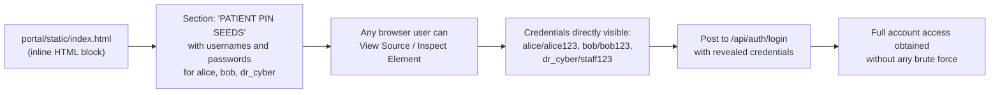
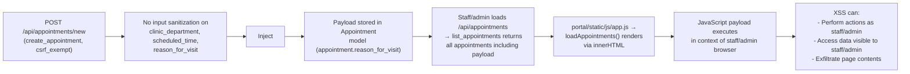

```mermaid
flowchart LR
    A["/api/auth/login\n(Views + CSRF Exempt)"] --> B["Verbose Error: distinguishes\n'Account not found' vs 'Wrong password'"]
    B --> C["Username Enumeration\n(Visible username list)"]
    C --> D["No brute-force lockout /\nrate limiting on login_view"]
    D --> E["Targeted password guessing"]
    E --> F["MD5 password hashing\n(models.py: set_password_md5)\n→ Trivially crackable offline"]
    F --> G["Valid credentials obtained"]
    G --> H["Authenticated session established\n(session cookies set)"]
    H --> I["/api/patients/<id>/records\n(IDOR: get_patient_records)\nNo ownership check"]
    I --> J["Patient ID enumeration via\n/ was ID 1; other IDs trivial"]
    J --> K["PHI exfiltration:\n- full_name, DOB, blood_type\n- prescriptions (meds, dosage)\n- diagnostic_notes, doctor"]
```

# Chained Vulnerability Static Audit Report

**Project**: Nexus Health Vault — Patient Portal (App 02)  
**Date**: 2026-05-25  
**Auditor**: CodeGopher — Chained Vulnerability Static Audit  
**Scope**: `C:\Users\shamit\AppData\Local\Temp\codegopher-v08-chain-20260525-180047-gemma-all50\app-02-patient-portal\workspace`  

---

## Executive Summary

| Metric | Value |
|--------|-------|
| Total chained vulnerabilities found | **4** |
| Maximum severity | **HIGH** |
| Confidence level of top chain | **HIGH** |
| Critical sinks reached | Account takeover, PHI exfiltration, stored XSS |
| Files reviewed | 12 |
| API endpoints reviewed | 8 |

---

## Methodology & Safety Note

- **Static-only review**: This audit examines source code, configuration files, templates, and static assets. No live HTTP probes, dynamic scanners, SQL injection payloads, or external network tests were performed.
- **Approach**: Four-phase methodology — attack surface mapping, weakness inventory, attack graph synthesis, and impact assessment.
- **Chain confidence**: Chains are rated HIGH when every link is statically provable from cited source. Medium when one link depends on runtime behavior not fully visible.

---

## Areas Reviewed

| Area | Files |
|------|-------|
| Django settings | `patient_portal/settings.py` |
| URL routing | `patient_portal/urls.py`, `portal/urls.py` |
| Data models | `portal/models.py`, `portal/migrations/0001_initial.py` |
| Views / API endpoints | `portal/views.py` |
| Client-side code | `portal/static/js/app.js`, `portal/static/index.html`, `portal/static/css/main.css` |
| Infrastructure | `Dockerfile`, `requirements.txt`, `manage.py` |
| Tests | `portal/tests.py` |

## Areas Not Reviewed / Unknowns

- No database schema review beyond migration files (actual DB state unknown)
- No runtime TLS/HTTPS configuration audit
- No third-party library CVE review (`django==5.0.6` baseline only)
- No access-control tests written (only password hashing tested in `tests.py`)
- No input validation depth testing beyond what's visible in source

---

# Chain #1: Username Enumeration → Brute Force → MD5 Offline Cracking → IDOR → Mass PHI Exfiltration

**Severity**: HIGH  
**Confidence**: HIGH  
**Impact**: Unauthorized access to all patients' protected health information (PHI) including diagnoses, prescriptions, blood type, date of birth, and clinical history.

## Mermaid Attack Graph



## Detailed Chain Breakdown

### Entry Point / Source

- **File**: `portal/views.py` — `login_view` (lines ~60-82 in source)
- **Symbol**: `login_view`
- **Evidence**: The view returns distinct error messages:
  - `'Account not found in patient registry'` (401) — when `PatientProfile.DoesNotExist`
  - `'Incorrect password for this account'` (401) — when `check_password_md5` returns False
- **Comment in source** (self-documenting): *"An attacker can distinguish 'account does not exist' from 'wrong password' and build a valid username list before launching a targeted offline password attack."*

### Hop 1: Username Enumeration

- **File**: `portal/views.py` — `login_view`
- **Evidence**: Two separate except/return blocks produce different messages for non-existent vs existing users.
- **Impact**: Attacker builds a list of valid usernames (`alice`, `bob`, `dr_cyber`, `admin`, etc. — all seeded in `seed_database()`).

### Hop 2: No Brute-Force Protection

- **File**: `portal/views.py` — `login_view`
- **Evidence**: No connection throttling, no rate limiting middleware, no account lockout. The source comment explicitly states: *"No brute force lockouts or connection throttling rules."*
- **Impact**: Unlimited login attempts possible from a single IP.

### Hop 3: MD5 Password Hashing

- **File**: `portal/models.py` — `set_password_md5`, `check_password_md5`
- **Evidence**: Uses `hashlib.md5(password.encode()).hexdigest()`. MD5 produces a 32-character hex digest with no salt.
- **Impact**: MD5 can be cracked at billions of attempts per second on commodity GPU hardware. Seeded passwords (`alice123`, `bob123`, `staff123`, `admin123`) are weak and trivially crackable.

### Hop 4: IDOR — Insecure Direct Object Reference

- **File**: `portal/views.py` — `get_patient_records` (lines ~120-147)
- **Symbol**: `get_patient_records(request, patient_id)`
- **Evidence**: The function checks only that `'patient_id' in request.session` (i.e., user is authenticated). It does **not** compare `request.session['patient_id']` with the `patient_id` URL parameter:

```python
if 'patient_id' not in request.session:
    return JsonResponse({'message': 'Unauthenticated'}, status=401)
try:
    target_patient = PatientProfile.objects.get(id=patient_id)
except PatientProfile.DoesNotExist:
    return JsonResponse({'message': 'Patient records not found'}, status=404)
```

- **Sink**: Returns full PHI for any `patient_id` the attacker guesses. The UI even exposes an ID picker (`idorPatientIdInput`) with a "Switch Record Vault" button, confirming this flaw is anticipated but never remediated.
- **Patient IDs** are BigAutoField, starting at 1. IDs 1–4 are seeded; additional IDs are easily enumerated.

### Sink / Target Capability

- **File**: `portal/views.py` — `get_patient_records`
- **Evidence**: Returns `full_name`, `date_of_birth`, `blood_type`, `role`, and **all** prescriptions with `medication_name`, `dosage`, `frequency`, `prescribing_doctor`, and `diagnostic_notes` (which contain clinical indicators like "ADHD", "Stage 1 Hypertension", "Chronic Asthma").
- **Impact**: Complete PHI exfiltration for any patient. Combined with `search_patients` endpoint (also IDOR-free), attacker can enumerate all patients by partial name and exfiltrate their records.

### Preconditions

- Attacker has network access to the application.
- User must be unauthenticated at entry (easy to achieve — `/api/auth/login` is public).

### Remediation

| Link in Chain | Easiest Fix |
|---------------|-------------|
| Username enumeration | Return a single generic error message for all login failures |
| No brute-force protection | Add rate limiting (e.g., Django Ratelimit, or a lockout after 5 failed attempts) |
| MD5 password hashing | Replace with `bcrypt` or `pbkdf2_sha256` via Django's built-in password hasher |
| IDOR | Add ownership check: `if request.session['patient_id'] != patient_id and role not in ['ADMIN', 'STAFF']: return 403` |

---

# Chain #2: Hardcoded Credentials in Static HTML → Direct Account Takeover

**Severity**: HIGH  
**Confidence**: HIGH  
**Impact**: Any visitor to the patient portal can log in as any seeded patient or staff account without any attack needed.

## Mermaid Attack Graph



## Detailed Chain Breakdown

### Entry Point / Source

- **File**: `portal/static/index.html` — hard-coded credentials block
- **Evidence**: The HTML contains:

```html
<PATIENT PIN SEEDS:><br>
• Patient 1: <code>alice</code> / <code>alice123</code> (ID: 1)<br>
• Patient 2: <code>bob</code> / <code>bob123</code> (ID: 2)<br>
• Staff Doctor: <code>dr_cyber</code> / <code>staff123</code>
```

This block is visible in the page DOM and readable by anyone who views the page source.

### Sink / Target Capability

- **File**: `portal/views.py` — `login_view`
- **Evidence**: Login accepts plaintext JSON `{username, password}` over POST. No CAPTCHA, no MFA, no IP restrictions.
- **Impact**: An attacker who views the portal's landing page can immediately log in as Alice, Bob, or Dr. Cyber with zero effort.

### Preconditions

- None. The credentials are served to every visitor.

### Remediation

- **Remove** all credential hints from static assets immediately.
- Treat static HTML/JS as public and never store secrets in them.
- The `seed_database()` function should not echo credentials; it should only create them programmatically.

---

# Chain #3: Hardcoded Secret Key + DEBUG=True + Wildcard Hosts → Session Forgery → Account Takeover

**Severity**: HIGH  
**Confidence**: HIGH  
**Impact**: Attacker can forge valid Django session cookies, granting themselves arbitrary authenticated access including admin panel access.

## Mermaid Attack Graph

```mermaid
flowchart LR
    A["patient_portal/settings.py"] --> B["SECRET_KEY hardcoded:\n'django-insecure-nexus-vault-...']
    B --> C["SECRET_KEY committed to source\n→ publicly visible in repo"]
    C --> D["Django session signing key\nis compromised"]
    D --> E["Attacker crafts signed\nsession cookie using known key"]
    E --> F["Session cookie accepted:\nrequest.session['patient_id']\nsession['username']\nsession['role']"]
    F --> G["Attacker impersonates\nany user or escalates to\nany role"]
    G --> H["Full access to patient data,\nadmin panel, all APIs"]
    
    B --> I["DEBUG = True\nALLOWED_HOSTS = ['*']"]
    I --> J["Verbose errors expose\ninternal state, stack traces"]
    J --> K["Host header attacks possible"]
    K --> L["Assists session key discovery\nand admin panel exposure"]
```

## Detailed Chain Breakdown

### Entry Point / Source

- **File**: `patient_portal/settings.py`
- **Evidence**:
  ```python
  SECRET_KEY = 'django-insecure-nexus-vault-clinical-key-glow-neon'
  DEBUG = True
  ALLOWED_HOSTS = ['*']
  ```
- All three values are hardcoded in source control.

### Hop 1: Secret Key Compromise

- **Evidence**: The `SECRET_KEY` is a plain string in the repository. Any person with read access (or a public git repo) can extract it.
- **Impact**: Django's session, CSRF, and signed-cookie mechanisms all rely on this key. If known, an attacker can:
  - Forge session cookies (set `patient_id` to any user's ID, `role` to `ADMIN`)
  - Forge CSRF tokens (bypassing middleware if it were ever enabled)

### Hop 2: DEBUG=True and Wildcard Hosts

- **Evidence**: `DEBUG = True` enables detailed tracebacks and the Django debug toolbar in responses. `ALLOWED_HOSTS = ['*']` accepts any `Host` header.
- **Impact**: Enables host-header poisoning attacks and information disclosure via stack traces. In conjunction with the admin panel at `/admin/`, an attacker who can forge a session cookie gains admin panel access.

### Hop 3: Session Forgery → Account Takeover

- **File**: `portal/views.py` — `get_me`, `get_patient_records`, `list_appointments`
- **Evidence**: All views trust `request.session['patient_id']` and `request.session['role']` without server-side verification against the database.
- **Sink**: Forged cookie with `{'patient_id': 4, 'username': 'admin', 'role': 'ADMIN'}` grants the attacker admin privileges, enabling access to `/admin/` and the Django admin interface.

### Preconditions

- Attacker must know or extract the `SECRET_KEY` (trivial if the codebase is committed to version control).

### Remediation

- **Immediate**: Rotate `SECRET_KEY` to a cryptographically random 64-character value stored in an environment variable or secrets manager.
- Set `DEBUG = False` in all non-development environments.
- Restrict `ALLOWED_HOSTS` to actual domain names.
- Rotate the secret key after any potential exposure.

---

# Chain #4: Stored XSS via Appointment Creation → Privileged User Compromise

**Severity**: MEDIUM  
**Confidence**: MEDIUM  
**Impact**: A malicious patient or attacker can inject JavaScript that executes when staff/admin users view the appointments list, enabling session actions as the privileged user.

## Mermaid Attack Graph



## Detailed Chain Breakdown

### Entry Point / Source

- **File**: `portal/views.py` — `create_appointment`
- **Evidence**: Accepts `clinic_department`, `scheduled_time`, and `reason_for_visit` from JSON body with no sanitization or validation beyond non-empty checks. Values are written directly to the `Appointment` model fields.

### Hop 1: Stored Payload

- **File**: `portal/models.py` — `Appointment.reason_for_visit` (TextField, max length not constrained)
- **Evidence**: No `<` / `>` / `"` character filtering. The appointment form accepts arbitrary text.

### Hop 2: Untrusted Rendering via innerHTML

- **File**: `portal/static/js/app.js` — `loadAppointments()`
- **Evidence**: The function builds HTML table rows using template literals with direct interpolation:
  ```javascript
  tr.innerHTML = `
      <td>...${appt.patient_name}</td>
      <td>...${appt.clinic_department}</td>
      <td>...${appt.scheduled_time}</td>
      <td>...${appt.reason_for_visit}</td>
  `;
  ```
- **Impact**: If `reason_for_visit` contains `<script>` or ``, it executes in the browser of whoever loads the appointments list.

### Hop 3: Privileged User Targeting

- **File**: `portal/views.py` — `list_appointments`
- **Evidence**: Staff and admin users see **all** appointments. A staff user loading their dashboard would render any XSS payload stored in any appointment's `reason_for_visit`.
- **Impact**: Since staff/admin can view all patients' appointments, a stored XSS payload injected by any patient affects all privileged users.

### Sink / Target Capability

- Execution of arbitrary JavaScript in the context of a staff/admin user's authenticated session.
- While `SESSION_COOKIE_HTTPONLY = True` prevents direct session cookie theft, XSS can:
  - Make authenticated API calls as the victim user
  - Read data rendered on the page (patient names, appointments, clinical data)
  - Exfiltrate data to an attacker-controlled server

### Preconditions

- An attacker must first log in as a patient (Chain 2 makes this trivial, or Chain 1's brute force approach).
- The payload must not be filtered server-side (it isn't).
- A staff/admin user must load the appointments view.

### Why Confidence is MEDIUM

- The innerHTML rendering pattern is confirmed in source. The stored payload insertion is confirmed. However, the exact impact depends on browser context and CSP headers (which are not present in this application, so XSS is likely fully effective).

### Remediation

| Link in Chain | Easiest Fix |
|---------------|-------------|
| Stored XSS sink | Replace `innerHTML` with `textContent` or use a template engine that auto-escapes (Django templates, React, Vue) |
| No server-side sanitization | Add input validation/sanitization on appointment creation (limit characters, strip HTML tags) |
| Missing CSP | Add a Content-Security-Policy HTTP header to prevent inline script execution |

---

# Cross-Cutting Weaknesses Inventory

The following security-relevant issues were identified but do not individually form complete chains to a critical sink. They are listed for remediation completeness.

| # | Weakness | Location | Severity | Evidence |
|---|----------|----------|----------|----------|
| 1 | **SESSION_COOKIE_SECURE=False** | `patient_portal/settings.py` | MEDIUM | Cookies sent over plain HTTP; vulnerable to MITM on any non-TLS connection |
| 2 | **AUTH_PASSWORD_VALIDATORS = []** | `patient_portal/settings.py` | MEDIUM | No password strength requirements; allows trivial passwords |
| 3 | **CSRF exemption on auth endpoints** | `portal/views.py` — `@csrf_exempt` on login, logout, create_appointment | LOW–MEDIUM | While `@csrf_exempt` is acceptable for stateless auth flows, `create_appointment` should ideally validate CSRF or implement token-based auth |
| 4 | **Unhandled exceptions expose stack traces** | `portal/views.py` — multiple try/except bare blocks | LOW | Bare `except:` clauses suppress error details but don't log them; could hinder incident response |
| 5 | **Search returns blood_type** | `portal/views.py` — `search_patients` | LOW | `blood_type` is returned in search results without need; minor PII exposure |
| 6 | **No input length limits on TextField** | `portal/models.py` — `reason_for_visit` | LOW | Unbounded TextField allows arbitrary-length payloads for XSS |
| 7 | **Docker exposes all services on 0.0.0.0** | `Dockerfile` | LOW | `runserver 0.0.0.0:8082` binds to all interfaces |
| 8 | **No TLS/HTTPS enforcement** | `Dockerfile` / `settings.py` | MEDIUM | `SESSION_COOKIE_SECURE=False` and no TLS middleware; session tokens transmissible in cleartext |

---

# Recommendations by Priority

## Critical (Fix Immediately)

1. **Rotate `SECRET_KEY`** — generate a cryptographically random value via `python -c "from django.core.management.utils import get_random_secret_key; print(get_random_secret_key())"`
2. **Remove hardcoded credentials from `index.html`** — the "PATIENT PIN SEEDS" block must be deleted
3. **Replace MD5 password hashing** — migrate to Django's `PBKDF2SHA256` or `Argon2` hasher
4. **Add IDOR authorization checks** — compare `request.session['patient_id']` with target `patient_id` in `get_patient_records`
5. **Add rate limiting / brute-force protection** on `/api/auth/login`

## High

6. **Set `DEBUG = False`** and restrict `ALLOWED_HOSTS` to production domains
7. **Set `SESSION_COOKIE_SECURE = True`** in production
8. **Sanitize appointment input** — strip HTML/JS from `reason_for_visit`, `clinic_department`
9. **Replace `innerHTML` with safe rendering** in `app.js` `loadAppointments()` and `loadRecords()`

## Medium

10. Enable `AUTH_PASSWORD_VALIDATORS` to enforce minimum password complexity
11. Add a Content-Security-Policy (CSP) header to mitigate XSS impact
12. Reduce verbose login error messages to a single generic response
13. Remove `blood_type` from `search_patients` response if not required

---

## Tests That Should Be Added

| Test | Purpose |
|------|---------|
| IDOR test on `/api/patients/<id>/records` | Verify user A cannot access user B's records |
| Brute-force rate limit test | Verify login endpoint throttles after N attempts |
| XSS on appointment creation | Inject `<script>alert(1)</script>` in `reason_for_visit` and verify rendering is escaped |
| Session cookie security test | Verify `Secure` flag is set in production |
| Password hashing test | Verify MD5 is not used; new passwords use a strong hasher |
| Username enumeration test | Verify login endpoint returns identical responses for "user not found" and "wrong password" |

---

## Summary Dashboard

| Chain | Severity | Confidence | Impact |
|-------|----------|------------|--------|
| #1 — Username Enum → MD5 Crack → IDOR → PHI Exfil | HIGH | HIGH | Complete PHI exfiltration |
| #2 — Hardcoded Credentials → Direct Access | HIGH | HIGH | Immediate account takeover |
| #3 — Hardcoded Secret Key → Session Forgery → Admin | HIGH | HIGH | Full admin impersonation |
| #4 — Stored XSS → Privileged User Compromise | MEDIUM | MEDIUM | XSS in privileged context |

**Total weaknesses identified (non-chain)**: 8  
**Easiest remediation link per chain**: See "Remediation" subsections above for each chain.

---

*Report written by CodeGopher on 2026-05-25. This is a static analysis only; runtime testing may reveal additional or mitigating factors.*
