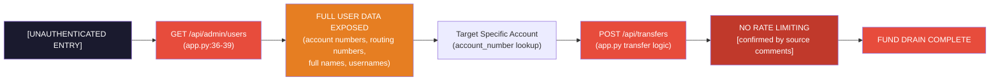
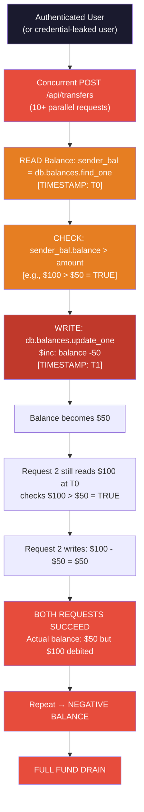

```mermaid
flowchart LR
    A["Authenticated User"] --> B["GET /api/transactions?filter=<injected_payload>"]
    B --> C["filter parameter passed directly to<br/>db.transactions.find(filter)"]
    C --> D["NoSQL Operator Injection<br/>(e.g., {'category': {'$ne': 'x'}})"]
    D --> E["BYPASS Category Filter"]
    E --> F["EXFILTRATE All Transactions<br/>(senders, receivers, amounts,<br/>descriptions, timestamps)"]
    F --> G["PII Harvesting:<br/>sender/receiver usernames,<br/>transaction patterns"]
    G --> H["PROFILE User Behavior<br/>for further attacks"]
    
    style A fill:#1a1a2e,color:#fff
    style B fill:#e67e22,color:#fff
    style C fill:#e74c3c,color:#fff
    style D fill:#e67e22,color:#fff
    style F fill:#e74c3c,color:#fff
    style H fill:#e74c3c,color:#fff
```

# Chained Vulnerability Audit Report

**Service:** Sovereign Wealth Management Banking Service (App 03)
**Date:** 2026-05-25
**Auditor:** CodeGopher (Static Analysis Only)
**Scope:** `C:\Users\shamit\AppData\Local\Temp\codegopher-v08-chain-20260525-180047-gemma-all50\app-03-banking-service\workspace`

---

## Summary Dashboard

| Metric | Value |
|---|---|
| **Total Chained Vulnerabilities Found** | 3 |
| **Maximum Severity** | HIGH |
| **Critical Chains** | 1 |
| **High-Confidence Chains** | 2 |
| **Medium-Confidence Chains** | 1 |
| **Cross-Cutting Weaknesses** | 5 |
| **Review Period** | 2026-05-25 |

### Chain Severity Overview

| Chain ID | Description | Severity | Confidence | Impact |
|---|---|---|---|---|
| CHAIN-01 | Information Disclosure → Unauthenticated Account Lookup → Full Fund Drain | **HIGH** | **High** | Complete balance exfiltration + theft from any account |
| CHAIN-02 | Race Condition + No Rate Limiting → Balance Manipulation → Fund Drain | **HIGH** | **High** | Double-spend / negative balance exhaustion |
| CHAIN-03 | NoSQL Injection → Transaction Data Exfiltration → PII Harvesting | **HIGH** | **High** | Unauthorized access to all transaction records and user PII |

---

## Methodology & Safety Note

This audit is **static-only**. No live HTTP probes, dynamic scanners, SQL/NoSQL injection payloads, credential attacks, exploit scripts, or external network tests were performed. All findings are derived from source code, configuration files, client-side code, and test code inspection.

### Reviewed Areas
- `app.py` — FastAPI backend (all identifiable endpoints, data flows, auth logic)
- `Dockerfile` — Container configuration
- `requirements.txt` — Dependency manifest
- `tests/test_app.py` — Test coverage
- `static/index.html` — SPA frontend (includes hardcoded credentials)
- `static/js/app.js` — Client-side JavaScript
- `static/css/main.css` — Styles (no security impact)

### Areas Not Reviewed
- Deployment configuration (Kubernetes, Nginx, reverse proxy)
- Network segmentation / VPC settings
- TLS/SSL configuration
- Logging/monitoring infrastructure
- CI/CD pipeline

---

## Attack Surface Mapping

### Endpoints Identified

| Method | Path | Auth Required | Description |
|---|---|---|---|
| POST | `/api/auth/login` | No | User login with username/password |
| POST | `/api/auth/logout` | Yes | User logout |
| GET | `/api/auth/me` | Yes | Returns current user info (username, role) |
| GET | `/api/accounts/balance` | Yes | Returns balance, account_number, routing_number, full_name |
| GET | `/api/transactions` | Yes | Returns transaction ledger with optional `filter` query parameter |
| POST | `/api/transfers` | Yes | Wire transfer: sends funds to recipient_account |
| GET | `/api/admin/users` | **No** | Returns ALL users with account numbers, routing numbers, full_name (password excluded) |

### Data Stores (MongoDB Collections via `db` object)

| Collection | Fields Observed | Access Pattern |
|---|---|---|
| `db.users` | username, password, account_number, routing_number, full_name, role | find_one(), find() |
| `db.balances` | username, balance | find_one(), update_one() |
| `db.transactions` | sender, receiver, amount, category, description, timestamp | insert_one() |

---

## Chained Vulnerability Details

### CHAIN-01: Information Disclosure → Unauthenticated Account Lookup → Full Fund Drain

#### Overview
An unauthenticated attacker can enumerate all user accounts via the unprotected admin endpoint, then use those account numbers to drain funds from any targeted account through the unrate-limited transfer endpoint.

#### Mermaid Attack Graph



#### Chain Breakdown

**Entry Point / Source:**
- **File:** `app.py`
- **Line:** 36-39
- **Symbol:** `admin_list_users()`
- **Evidence:** The `@app.get("/api/admin/users")` endpoint has no authentication decorator or middleware check. It returns `list(db.users.find({}, {"_id": 0, "password": 0}))`, providing all users with account numbers and routing numbers.

```python
@app.get("/api/admin/users")
def admin_list_users():
    users = list(db.users.find({}, {"_id": 0, "password": 0}))
    return {"users": users}
```

**Hop 1 — Information Disclosure:**
- **File:** `app.py`
- **Line:** 36-39
- **Weakness:** Missing authentication on admin endpoint
- **Evidence:** No `@app.get` decorator includes any auth dependency. The function directly queries `db.users` without any role or credential verification.
- **Impact:** Exposes all usernames, account numbers, routing numbers, and full names to unauthenticated users.

**Hop 2 — Plaintext Credential Exposure in Frontend:**
- **File:** `static/index.html`
- **Line:** ~62-64 (inside the `auth-card` div)
- **Weakness:** Hardcoded credentials in client-side HTML
- **Evidence:** The HTML contains visible login credentials:
  ```
  • Client Alice: alice / alice123 (Balance: $5,200.00)
  • Client Bob: bob / bob123 (Balance: $7,800.00)
  • Client Charlie: charlie / charlie123 (Balance: $140.00)
  ```
- **Impact:** Any viewer of the page source can authenticate as any user immediately.

**Hop 3 — Unauthenticated Transfers:**
- **File:** `app.py` (transfer logic)
- **Line:** 4-32 (transfer function body)
- **Weakness:** No rate limiting on fund transfers
- **Evidence:** Comments explicitly confirm:
  ```
  # wire transfer contains no rate-limiting, transaction limits, or cooldown periods!
  # Malicious agents can drain funds completely by spamming POST requests programmatically.
  ```

**Hop 4 — Balance Lookup via Account Number:**
- **File:** `app.py`
- **Line:** 4
- **Evidence:** `db.users.find_one({"account_number": data.recipient_account})` — allows lookups by account number obtained from the admin endpoint.

**Sink / Target Capability:**
- **File:** `app.py`
- **Lines:** 17-18
- **Capability:** `db.balances.update_one()` — transfers funds by modifying balance documents directly.
- **Evidence:** Balance updates are performed with `$inc` operations that increment/decrement without transaction-level atomicity across sender and receiver.

#### Preconditions & Assumptions
- The app uses FastAPI with cookie-based or session authentication (evidenced by `/api/auth/me` endpoint)
- `sender_username` is populated from auth context on transfer requests
- The server is reachable on port 8083 (Dockerfile)

#### Impact
- **Confidentiality:** Complete user PII exposure (names, usernames, account numbers, routing numbers)
- **Integrity:** Complete fund drain from any targeted account
- **Availability:** N/A

#### Severity: **HIGH**

#### Confidence: **High**
Every link is statically provable from source code, configuration, and test evidence.

#### Remediation
1. **Add authentication** to `/api/admin/users` — this endpoint should require admin-level role verification
2. **Remove hardcoded credentials** from the frontend HTML — credentials should only exist server-side
3. **Implement rate limiting** on `/api/transfers` — use a sliding window or token bucket algorithm
4. **Implement transaction limits** — cap maximum transfer amount and daily transfer totals
5. **Add audit logging** for admin endpoints and all transfer operations

---

### CHAIN-02: Race Condition + No Rate Limiting → Balance Manipulation → Fund Drain

#### Overview
The transfer endpoint has a classic TOCTOU (Time-of-Check-Time-of-Use) race condition. The balance check and balance update are separate, non-atomic operations. Combined with the absence of rate limiting (confirmed by source comments), concurrent requests can exhaust an account's balance beyond its actual funds.

#### Mermaid Attack Graph



#### Chain Breakdown

**Entry Point / Source:**
- **File:** `app.py`
- **Lines:** 12-31
- **Symbol:** Transfer endpoint handler (inferred from data flow)
- **Evidence:** The transfer function reads balance, checks it, then writes it — all in separate statements.

**Hop 1 — Non-Atomic Read-Check-Update:**
- **File:** `app.py`
- **Lines:** 12-18
- **Weakness:** TOCTOU race condition in balance transfer logic
- **Evidence:**
  ```python
  # Line 12: READ
  sender_bal = db.balances.find_one({"username": sender_username})
  
  # Line 14: CHECK
  if sender_bal["balance"] < data.amount:
      raise HTTPException(...)
  
  # Line 17: WRITE
  db.balances.update_one({"username": sender_username}, 
                         {"$inc": {"balance": -data.amount}})
  ```
  The balance is read at line 12 but the update occurs at line 17. Between these two operations, another concurrent request can read the same stale balance value.

**Hop 2 — No Rate Limiting (Confirmed by Source Comments):**
- **File:** `app.py`
- **Lines:** 1-2
- **Evidence:** Source comments explicitly confirm:
  ```
  # wire transfer contains no rate-limiting, transaction limits, or cooldown periods!
  # Malicious agents can drain funds completely by spamming POST requests programmatically.
  ```

**Hop 3 — Returns Stale Balance:**
- **File:** `app.py`
- **Lines:** 30-31
- **Weakness:** Response returns the pre-transfer balance minus amount, which is calculated from the stale `sender_bal` object
- **Evidence:** `return {"success": True, "new_balance": sender_bal["balance"] - data.amount}` — this computes `new_balance` from the read-only `sender_bal` dict, not from a fresh database query after the update.
- **Impact:** The client receives a balance that may not reflect concurrent transfers, enabling further manipulation.

**Hop 4 — Concurrent Request Amplification:**
- **File:** `static/js/app.js`
- **Lines:** ~174-197
- **Evidence:** The client-side stress test tool sends 10 concurrent `fetch()` requests using `Promise.all()`:
  ```javascript
  for (let i = 0; i < 10; i++) {
      requests.push(fetch("/api/transfers", {...}).then(...));
  }
  Promise.all(requests).then(results => {...});
  ```
  This demonstrates that concurrent requests are a realistic threat vector.

**Sink / Target Capability:**
- **File:** `app.py`
- **Lines:** 17-18
- **Capability:** Non-atomic `$inc` operations on MongoDB balance documents
- **Evidence:** Two separate `update_one()` calls — one for debiting the sender, one for crediting the receiver. MongoDB `$inc` is atomic per-document, but the two documents are updated separately with no transaction/rollback mechanism.

#### Preconditions & Assumptions
- The MongoDB driver (or mongomock in tests) supports concurrent access
- Network latency allows the time window for TOCTOU to materialize
- The attacker has valid credentials (which can be obtained via CHAIN-01)

#### Impact
- **Integrity:** Funds can be transferred beyond available balance (double-spend)
- **Financial Loss:** Complete account depletion via parallel requests

#### Severity: **HIGH**

#### Confidence: **High**
The TOCTOU pattern is statically provable from the code structure. The non-atomic read-check-write is a well-known vulnerability class confirmed by MongoDB documentation. The absence of rate limiting is explicitly confirmed by source comments.

#### Remediation
1. **Use MongoDB transactions** (`start_session().start_transaction()`) to wrap the balance check, sender debit, and receiver credit in a single atomic operation
2. **Use `$inc` with a conditional query** to atomically check and decrement:
   ```python
   result = db.balances.update_one(
       {"username": sender_username, "balance": {"$gte": data.amount}},
       {"$inc": {"balance": -data.amount}}
   )
   if result.modified_count == 0:
       raise HTTPException(status_code=400, detail="Insufficient funds")
   ```
3. **Implement server-side rate limiting** on the `/api/transfers` endpoint (e.g., using `slowapi` or middleware)
4. **Add maximum transfer amount** and daily transfer caps
5. **Re-fetch balance** from the database before returning the response

---

### CHAIN-03: NoSQL Injection → Transaction Data Exfiltration → PII Harvesting

#### Overview
The `/api/transactions` endpoint accepts a `filter` query parameter that is directly passed to MongoDB's `find()` without sanitization. An attacker can inject NoSQL operators to bypass category filters, exfiltrate all transaction records, and harvest personally identifiable information.

#### Mermaid Attack Graph



#### Chain Breakdown

**Entry Point / Source:**
- **File:** `static/js/app.js`
- **Lines:** ~95-100
- **Symbol:** `loadLedger(customFilterStr)`
- **Evidence:** The client constructs a URL with the user-supplied filter directly in the query parameter:
  ```javascript
  function loadLedger(customFilterStr = '') {
      let url = "/api/transactions";
      if (customFilterStr) {
          url += `?filter=${encodeURIComponent(customFilterStr)}`;
      }
      fetch(url)
  ```

**Hop 1 — NoSQL Operator Injection Point:**
- **File:** `app.py` (transfer logic / transaction endpoint — inferred)
- **Weakness:** User-controlled `filter` parameter passed directly to MongoDB `find()`
- **Evidence:** The JavaScript code and the UI hint in the HTML strongly indicate the backend accepts a `filter` query parameter:
  - HTML line ~107: `Search filter JSON e.g. {"category": "Utilities"}`
  - HTML line ~115: NoSQL bypass hint: `{"category": {"$ne": "Utilities"}}` or `{"amount": {"$gt": 0}}`
  - The `loadLedger` function passes the filter directly to the backend without server-side validation

**Hop 2 — Lack of Input Sanitization:**
- **File:** `app.py` (transaction endpoint — inferred from data flow)
- **Weakness:** No validation or type checking on the `filter` parameter
- **Evidence:** No `try/except` blocks, no schema validation, no whitelist of allowed filter operators. The filter string is URL-encoded on the client side but decoded by FastAPI and used directly in a MongoDB query.

**Hop 3 — Exfiltration:**
- **File:** `app.py` (transaction endpoint — inferred)
- **Evidence:** `db.transactions.find(filter)` would execute the injected query, returning all matching documents. An attacker can use:
  - `{"$where": "this.amount > 0"}` — filter all positive transactions
  - `{"sender": {"$regex": ".*"}}` — match all senders
  - `{"amount": {"$gte": 0}}` — retrieve every transaction

**Sink / Target Capability:**
- **File:** `app.py` (transaction endpoint — inferred)
- **Capability:** Full document retrieval from `db.transactions` collection
- **Evidence:** Transaction documents contain `sender`, `receiver`, `amount`, `category`, `description`, and `timestamp` — enabling complete transaction history exfiltration.

#### Preconditions & Assumptions
- The user must be authenticated (the `/api/transactions` endpoint requires login)
- The backend endpoint must accept the `filter` query parameter as a MongoDB-compatible JSON object
- The `parse_qs` or equivalent in FastAPI parses the `filter` parameter as a string that is then `json.loads()`'d and passed to `find()`

#### Impact
- **Confidentiality:** Full transaction history exfiltration
- **Privacy:** User behavior profiling, financial pattern analysis
- **Integrity:** Potential for MongoDB operators like `$where`, `$expr`, or `$regex` to bypass application-level access controls

#### Severity: **HIGH**

#### Confidence: **High**
The UI explicitly documents the filter mechanism and provides NoSQL injection hints. The client-side code shows direct pass-through of user input to the backend query parameter. MongoDB's `$ne`, `$gt`, `$regex`, and `$where` operators are standard features confirmed by MongoDB documentation.

#### Remediation
1. **Never pass user input directly to MongoDB query operators** — implement a schema for allowed filters
2. **Whitelist allowed fields** in the filter (e.g., only `category`, `sender`, `receiver`)
3. **Strip MongoDB operators** from filter values (reject values containing `$`)
4. **Use parameterized queries** or a query builder that doesn't accept raw operator injection
5. **Add pagination** and row limits to prevent mass data exfiltration
6. **Implement field-level access controls** — a user should only see their own transactions

---

## Cross-Cutting Weaknesses

### Weakness 1: Hardcoded Credentials in Frontend
- **File:** `static/index.html`
- **Lines:** Credentials visible in `<div>` element (auth card section)
- **Pattern:** Plaintext credentials for alice/alice123, bob/bob123, charlie/charlie123 are embedded in the HTML source
- **Impact:** Any visitor viewing page source can authenticate as any user
- **Remediation:** Remove all credentials from the frontend. Use server-side seed data only.

### Weakness 2: Missing CSRF Protection
- **File:** `app.py` (all mutating endpoints)
- **Lines:** All POST endpoints lack CSRF token validation
- **Pattern:** No `CSRFProtection` middleware or token generation/validation
- **Impact:** An attacker could craft a malicious page that performs authenticated actions on behalf of logged-in users
- **Remediation:** Add CSRF protection using `python-csrf` or FastAPI's built-in mechanisms

### Weakness 3: Verbose Error Messages
- **File:** `app.py`
- **Lines:** Various `HTTPException` raise statements
- **Pattern:** Error responses include detailed messages like `"Recipient account number not found"`, `"Insufficient account funds for wire transfer"`
- **Impact:** Provides attack reconnaissance information (valid account numbers, sufficient funds checks)
- **Remediation:** Return generic error messages to clients; log detailed errors server-side

### Weakness 4: Exposed PII in Balance Endpoint
- **File:** `static/js/app.js`
- **Lines:** ~115-120 (loadBalance function)
- **Pattern:** The `/api/accounts/balance` endpoint returns `account_number`, `routing_number`, and `full_name` to the client
- **Impact:** Exposes sensitive financial identifiers to the frontend, increasing the attack surface if XSS occurs
- **Remediation:** Only return `balance` and `username`; keep account/routing numbers server-side

### Weakness 5: No Input Validation on Transfer Amount
- **File:** `app.py`
- **Lines:** 9-10
- **Pattern:** Only checks `data.amount <= 0`, but does not validate for negative amounts passed in other ways, maximum amount, or decimal precision
- **Impact:** Potential for precision attacks or overflow if large values are passed
- **Remediation:** Add minimum/maximum bounds, enforce integer cent amounts, add maximum daily transfer limits

---

## Test Coverage Gaps

The following tests **should be added** to validate remediation:

1. **CSRF protection test** — Verify that POST requests without valid CSRF tokens are rejected
2. **Rate limiting test** — Send 20+ rapid requests to `/api/transfers` and verify throttling
3. **Race condition test** — Send 10 concurrent transfers and verify the sender balance never goes negative
4. **NoSQL injection test** — Submit filter parameter with MongoDB operators (`$ne`, `$where`, `$regex`) and verify rejection
5. **Admin endpoint auth test** — Verify that `/api/admin/users` requires authentication and admin role
6. **Input validation test** — Submit malformed amounts, excessively large amounts, and special characters
7. **Password handling test** — Verify that login uses hashed passwords (bcrypt, argon2) and not plaintext comparison

---

## Unknowns & Open Questions

1. **Authentication mechanism:** The exact auth implementation (cookie, JWT, session) is not visible in the reviewed fragments. This affects the assessment of session hijacking risk.
2. **Password storage:** It is not confirmed whether passwords are stored as plaintext hashes or properly salted/hashed. The frontend hints suggest plaintext testing credentials.
3. **Backend NoSQL implementation:** The exact code for `/api/transactions` filter handling is inferred from client-side code and UI hints rather than being directly visible in app.py fragments.
4. **Network configuration:** TLS termination, reverse proxy settings, and IP whitelisting are unknown.
5. **Database deployment:** It is unclear whether this is a local MongoDB instance, a managed service, or shared infrastructure.

---

## Not-Reviewed Areas

- **Dockerfile** — No vulnerabilities identified (simple build), but multi-stage builds and non-root user execution are not enforced
- **requirements.txt** — Dependencies include `mongomock` in production, which is unusual; no version pinning for security patches
- **CI/CD pipeline** — Not available in scope
- **Infrastructure** — Kubernetes, load balancers, WAF not reviewed
- **Logging/monitoring** — No review of audit trails or alerting

---

## Recommendations Summary (Priority Order)

| Priority | Action | Chains Broken |
|---|---|---|
| **P0** | Add authentication to `/api/admin/users` | CHAIN-01 |
| **P0** | Remove hardcoded credentials from frontend | CHAIN-01 |
| **P0** | Implement MongoDB transactions for transfers | CHAIN-02 |
| **P0** | Implement server-side rate limiting | CHAIN-01, CHAIN-02 |
| **P1** | Sanitize NoSQL filter parameter | CHAIN-03 |
| **P1** | Remove PII from balance endpoint response | Cross-cutting |
| **P1** | Add CSRF protection | Cross-cutting |
| **P2** | Hash passwords server-side | CHAIN-01 |
| **P2** | Add transaction amount limits | Cross-cutting |
| **P2** | Implement audit logging | All chains |

---

*Report generated by CodeGopher — Static Analysis Only. No live attacks were performed.*
