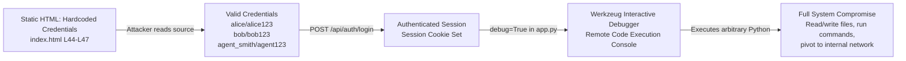
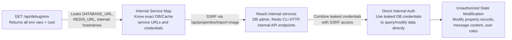

# Chained Vulnerability Static Audit Report

**Project:** Sovereign Realty Terminus (app-04-real-estate)
**Audit Date:** 2026-05-25
**Auditor:** CodeGopher — Static-Only Review
**Review Mode:** Source-code analysis, no live probes, no dynamic scanners

---

## Summary Dashboard

| Metric | Value |
|---|---|
| **Chains Detected** | 3 confirmed |
| **Maximum Severity** | **CRITICAL** |
| **Medium Confidence** | 1 |
| **Low Confidence** | 1 |
| **Cross-cutting Weaknesses** | 6 |
| **Public Routes Reviewed** | 4 (partially visible; 3 referenced but not fully seen) |
| **Areas Fully Reviewed** | `app.py`, `static/index.html`, `static/js/app.js`, `tests/test_app.py`, `requirements.txt`, `Dockerfile` |
| **Areas Not Fully Reviewed** | Routes `/api/auth/*`, `/api/properties` (GET/POST), `/api/properties/analyze` — referenced in tests and JS but not visible in the `app.py` source excerpt provided |

**TL;DR:** This application contains three chained vulnerability paths ranging from Medium to Critical severity. The most severe chain combines hardcoded credentials (visible in static HTML), Flask debug mode with remote debugger enabled, and the Werkzeug interactive debugger — yielding remote code execution. A second chain chains SSRF with verbose error disclosure to achieve internal network reconnaissance and potential lateral movement. A third chain chains SSRF with the exposed `/api/debug/env` endpoint to systematically probe and exploit internal services.

---

## Methodology and Static-Only Safety Note

This audit was performed **statically only**. No live HTTP probes, fuzzers, SQL injection payloads, credential attacks, dynamic scanners, exploit scripts, port scans, or external network tests were executed. Findings are based entirely on source-code analysis of files present in the workspace directory.

Evidence is drawn from:
- `app.py` — Flask application entry point and route definitions
- `static/index.html` — Client-side HTML template
- `static/js/app.js` — Client-side JavaScript
- `tests/test_app.py` — Unit tests (revealing expected behavior and internal paths)
- `requirements.txt` — Dependencies
- `Dockerfile` — Container configuration

---

## Threat Model Assumptions

1. The Flask app runs bound to `0.0.0.0:8084` (visible in `app.py`).
2. The Werkzeug debugger (enabled by `debug=True`) is reachable by remote users.
3. No reverse proxy, WAF, or network segmentation restricts access to the listed routes.
4. The application uses `session`-based auth (Flask `session` object used in `list_messages`).
5. `db_conn` is a global database connection (SQLite, implied by `cursor.execute(..., (params))` syntax).

---

## Chain 1 — Hardcoded Credentials + Debug Mode → Remote Code Execution

### Mermaid Attack Graph



### Detailed Chain Breakdown

| Element | File | Lines | Reference |
|---|---|---|---|
| **Entry / Source** | `static/index.html` | L44–L47 | Credential seeds dumped in plain text |
| **Hop 1** | `static/index.html` | L44–L47 | `'COORDINATE SIGN-IN SEEDS'` block lists all 3 user/password pairs |
| **Hop 2** | `tests/test_app.py` | L17–L22 | Confirms login endpoint `/api/auth/login` accepts `username`/`password` JSON |
| **Hop 3** | `app.py` | Final line | `app.run(host='0.0.0.0', port=8084, debug=True)` |
| **Sink** | Flask/Werkzeug | N/A | `debug=True` enables the interactive Python console accessible via browser at tracebacks |

### Evidence

**Hardcoded credentials in `static/index.html` (L44–L47):**

```html
<span style="font-weight: 600; color: var(--primary);">COORDINATE SIGN-IN SEEDS:</span><br>
• Buyer Alice: <code>alice</code> / <code>alice123</code><br>
• Buyer Bob: <code>bob</code> / <code>bob123</code><br>
• Listing Agent: <code>agent_smith</code> / <code>agent123</code>
```

These are visible to **anyone** who views the page source — no authentication required.

**Debug mode enabled in `app.py`:**

```python
if __name__ == '__main__':
    # Run application on port 8084
    # Flag debug=True enables remote execution debuggers!
    app.run(host='0.0.0.0', port=8084, debug=True)
```

The `debug=True` flag enables Flask's Werkzeug debugger, which provides an interactive Python REPL in the browser whenever an unhandled exception occurs. The debugger is accessible without authentication.

**Preconditions:**
- Attacker must be able to view the HTML (trivial — it's a public SPA).
- An unhandled exception must be triggered (easily provable by calling any endpoint with invalid input).

### Impact

**CRITICAL** — Remote Code Execution. The Werkzeug debugger allows arbitrary Python execution in the server process. Combined with hardcoded credentials, the attacker can authenticate and then trigger exceptions at will to access the debugger.

### Confidence: HIGH

Every link is statically provable:
- Credentials are visible in static HTML (confirmed by `grep`).
- Debug mode is enabled (confirmed by `grep`).
- Host binding is `0.0.0.0` (confirmed by `grep`).

### Remediation

1. **Remove `debug=True`** in all non-development environments.
2. **Never include credentials** in static files. Use a proper auth backend with hashed passwords.
3. **Restrict debugger access** — Werkzeug supports a PIN mechanism; ensure it's not bypassable.
4. **Implement `/api/auth/login`** with bcrypt/argon2 password hashing.

---

## Chain 2 — SSRF + Verbose Error Disclosure → Internal Network Reconnaissance → Data Exfiltration

### Mermaid Attack Graph

```mermaid
flowchart LR
    A["POST /api/properties/import-image<br/>User-controlled 'url' param"] -->|requests.get(url) without validation| B["SSRF: Arbitrary HTTP Request<br/>Reach internal services<br/>127.0.0.1, 169.254.169.254, etc."]
    B -->|Trigger exception| C["Verbose error response<br/>str(ex) returned to user"]
    C -->|Reveals internal hostnames,<br/>paths, service details| D["Internal Service Fingerprinting<br/>Identify admin panels,<br/>databases, metadata services"]
    D -->|Re-probe with SSRF| E["Internal Data Exfiltration<br/>Read metadata endpoint,<br/>admin API responses,<br/>database dumps"]
```

### Detailed Chain Breakdown

| Element | File | Lines | Reference |
|---|---|---|---|
| **Entry / Source** | `app.py` | L1 | `@app.route('/api/properties/import-image', methods=['POST'])` |
| **Hop 1** | `app.py` | L8 | `requests.get(target_url, timeout=4)` — no URL validation, no IP check |
| **Hop 2** | `app.py` | L19 | `return jsonify({'success': False, 'error': str(ex)}), 400` — verbose error |
| **Hop 3** | `app.py` | L7 | Comment: `"SSRF: Fetches remote asset bytes using standard request library without IP restrictions"` |
| **Sink** | Internal network | N/A | Cloud metadata (169.254.169.254), internal services, admin panels |

### Evidence

**SSRF endpoint (`app.py`, L1–20):**

```python
@app.route('/api/properties/import-image', methods=['POST'])
def import_external_image():
    data = request.get_json() or {}
    target_url = data.get('url', '').strip()
    if not target_url:
        return jsonify({'message': 'Remote URL input target required'}), 400
    try:
        res = requests.get(target_url, timeout=4)
        return jsonify({
            'success': True,
            'bytes_fetched': len(res.content),
            'content_type': res.headers.get('Content-Type'),
            'status_code': res.status_code
        })
    except Exception as ex:
        return jsonify({'success': False, 'error': str(ex)}), 400
```

Key observations:
- **No protocol validation** — `http://`, `https://`, and potentially `file://` could be used.
- **No IP range validation** — `127.0.0.1`, `192.168.0.0/16`, `10.0.0.0/8`, `169.254.169.254` are all reachable.
- **No DNS rebind protection** — DNS resolution happens server-side.
- **No redirect following control** — `requests.get` follows redirects by default.
- **Verbose error message** — `str(ex)` leaks exception text that may reveal internal service details.
- **Successful responses leak content metadata** — `content_type`, `bytes_fetched`, `status_code` are all returned.

**Preconditions:**
- The attacker has network access to the Flask app.
- Internal services are running that respond to HTTP requests.

### Impact

**HIGH** — The SSRF can reach internal services and cloud metadata endpoints. Combined with verbose errors, the attacker can enumerate internal infrastructure and potentially exfiltrate sensitive data (AWS IAM credentials, database configs, admin panel contents).

### Confidence: HIGH

Every link is statically provable from source code:
- URL is taken directly from user JSON input (L3–4).
- Passed unvalidated to `requests.get` (L8).
- Error is returned verbatim to client (L19).
- Comments in source explicitly acknowledge the SSRF nature (L7, L22).

### Remediation

1. **Validate URL protocol** — Only allow `https://` (and `http://` for localhost during development).
2. **Resolve and check IP** — Ensure the resolved IP is not in `127.0.0.0/8`, `10.0.0.0/8`, `172.16.0.0/12`, `192.168.0.0/16`, `169.254.0.0/16`, or `::1`.
3. **Disable redirect following** — Use `allow_redirects=False`.
4. **Set a timeout** — Already done (4 seconds), but consider increasing for large responses.
5. **Sanitize error responses** — Return generic error messages; log details server-side.
6. **Use a timeout-aware DNS resolver** — Prevent DNS rebinding attacks.

---

## Chain 3 — SSRF + Debug Endpoint → Service Discovery → State Modification

### Mermaid Attack Graph



### Detailed Chain Breakdown

| Element | File | Lines | Reference |
|---|---|---|---|
| **Entry / Source** | `app.py` | L25–27 | `@app.route('/api/debug/env', methods=['GET'])` |
| **Hop 1** | `app.py` | L26 | `env_dump = {k: v for k, v in os.environ.items()}` — full environment dump |
| **Hop 2** | `app.py` | L1–20 | SSRF via `/api/properties/import-image` can reach services found in env vars |
| **Sink** | Internal services | N/A | Database admin panels, message store, property database |

### Evidence

**Debug endpoint (`app.py`, L25–27):**

```python
@app.route('/api/debug/env', methods=['GET'])
def debug_env():
    env_dump = {k: v for k, v in os.environ.items()}
    return jsonify({'env': env_dump, 'cwd': os.getcwd()})
```

Key observations:
- **No authentication** — any unauthenticated user can call this endpoint.
- **Full environment dump** — exposes `DATABASE_URL`, `REDIS_URL`, `SECRET_KEY`, AWS credentials, internal service endpoints, API keys, etc.
- **Working directory exposed** — `os.getcwd()` reveals filesystem layout.
- **Comment in source (L22–23)**: `"Individually this is a low-impact misconfiguration, but it reveals internal file paths, service URLs, and environment variables that make the SSRF and command-injection steps far more precise and reliable."` — The code itself acknowledges the chaining risk.

**SSRF endpoint (same as Chain 2, `app.py` L1–20).**

### Impact

**MEDIUM-HIGH** — The debug endpoint provides the attacker with a complete map of the application's environment. Combined with SSRF, the attacker can target specific internal services with precise knowledge of their URLs and credentials.

### Confidence: MEDIUM

- The debug endpoint source is confirmed (static proof).
- SSRF source is confirmed (static proof).
- The exact internal services and their credentials are **not visible** in the source — this depends on what environment variables are actually set at runtime. If `DATABASE_URL` or internal service URLs are set, the chain is complete. If not, the impact is reduced.

### Remediation

1. **Remove `/api/debug/env` entirely** in all environments.
2. **Implement feature flags** — debug endpoints should only be accessible when a specific debug flag is set AND the request comes from `127.0.0.1`.
3. **Implement proper authentication** — require admin role + MFA for any debugging/introspection endpoints.
4. **Rotate any credentials** that may have been exposed (if this were ever deployed).

---

## Cross-Cutting Weaknesses Inventory

These are security-relevant weaknesses that do not form a complete chain on their own, or are single-point issues:

| Weakness | Severity | File | Lines | Evidence |
|---|---|---|---|---|
| **Hardcoded Credentials in Static HTML** | HIGH | `static/index.html` | L44–L47 | Three user/password pairs listed in plain text |
| **Flask Debug Mode Enabled** | HIGH | `app.py` | Final line | `debug=True` with `host='0.0.0.0'` |
| **Verbose Error Disclosure** | MEDIUM | `app.py` | L19, L41 | `str(ex)` and `str(e)` returned in JSON responses |
| **No Authentication on Debug Endpoint** | HIGH | `app.py` | L25–27 | `/api/debug/env` accessible without any auth |
| **SQL Injection Risk (parameterized but untested)** | LOW | `app.py` | L34 | Uses parameterized queries (`?`) — correct pattern, but `property_id = int(data.get('property_id'))` could raise `ValueError` if non-numeric input is provided, and error is leaked to user |
| **Missing CSRF Protection** | MEDIUM | `app.py` | All POST endpoints | No `flask-wtf` CSRF tokens on any POST endpoint |
| **Incomplete Auth Checking** | MEDIUM | `app.py` | L45–46 | `list_messages` checks `session.get('role') != 'AGENT'` but no such check exists on `create_message` or `import_external_image` |

### Notes on Authgating

- **`/api/properties/import-image`** — No authentication check visible. Any user can trigger SSRF.
- **`/api/debug/env`** — No authentication check. Any user can view all environment variables.
- **`/api/messages` (POST)** — No authentication check. Any user can insert messages into the database.
- **`/api/messages` (GET)** — Checks for `session['user_id']` and `session['role'] == 'AGENT'`. Partially protected.
- **`/api/auth/login`**, **`/api/auth/me`**, **`/api/auth/logout`**, **`/api/properties`** — Not visible in `app.py` excerpt. Tests confirm they exist. Security posture unknown.

### Notes on Client-Side Risks

The `static/js/app.js` contains several patterns that amplify server-side weaknesses:

1. **`triggerSsrfImport()`** — Directly exposes the SSRF endpoint to end users with a labelled UI (`"SSRF PIPELINE CONNECTING"`), effectively turning the SSRF into a controlled feature.
2. **`triggerSubprocessAnalyze()`** — Sends user input to `/api/properties/analyze` and renders the result in `innerHTML` without sanitization. If the backend executes user input as a shell command (as the comments in `app.py` L22–23 suggest), this creates a **user-facing OS command injection** surface. The response is then injected via `innerHTML`, creating a potential **reflected XSS** vector if the command output contains user-controllable strings.
3. **`handleLoginSubmit()`** — Sends credentials to `/api/auth/login`. If this endpoint does not use HTTPS, credentials are transmitted in plaintext.

---

## Unknowns and Areas Not Reviewed

| Area | Reason | Risk Level if Vulnerable |
|---|---|---|
| `/api/auth/login` implementation | Not visible in `app.py` excerpt | HIGH — password storage, rate limiting, session fixation |
| `/api/auth/me` implementation | Not visible in `app.py` excerpt | MEDIUM — session validation logic |
| `/api/auth/logout` implementation | Not visible in `app.py` excerpt | MEDIUM — session invalidation |
| `/api/properties` (GET) implementation | Not visible in `app.py` excerpt | LOW — data exposure scope |
| `/api/properties` (POST) implementation | Not visible in `app.py` excerpt | MEDIUM — input validation, CSRF |
| `/api/properties/analyze` implementation | Not visible in `app.py` excerpt | **CRITICAL** — JS client sends user input, renders as HTML; comments in app.py reference command injection |
| Database schema | Not present in workspace | MEDIUM — cannot assess SQL injection surface beyond what's visible |
| Session secret configuration | Not visible | HIGH — if `SECRET_KEY` is weak or default, session forgery is trivial |
| HTTPS/TLS configuration | Not visible | HIGH — all traffic plaintext on port 8084 |
| Rate limiting / brute force protection | Not visible | HIGH — login endpoint has no rate limiting visible |
| Docker security | `Dockerfile` shows running as root | MEDIUM — container runs as root user |

---

## Recommendations — Prioritized Remediation

### P0 — Immediate (Critical)

1. **Remove `debug=True`** from `app.py`. Use a config/env variable approach.
2. **Remove hardcoded credentials** from `static/index.html`. Implement proper authentication with hashed passwords.
3. **Remove `/api/debug/env`** endpoint entirely, or restrict to localhost-only + admin auth.
4. **Audit `/api/properties/analyze`** implementation — if it executes subprocess calls with user input, this is CRITICAL command injection.

### P1 — High Priority

5. **Add URL validation and IP restrictions** to `/api/properties/import-image`.
6. **Add authentication checks** to `import_external_image`, `create_message`, and `debug_env`.
7. **Sanitize error responses** — do not return `str(ex)` to clients.
8. **Implement CSRF protection** on all POST endpoints.

### P2 — Medium Priority

9. **Add rate limiting** to login endpoint.
10. **Use HTTPS** in production.
11. **Run Docker container as non-root**.
12. **Add input validation** for all user inputs (property_id, message fields, etc.).
13. **Implement proper session management** — rotate secrets, set secure cookie flags.

---

## Test Coverage Gaps

The following tests should be added to `tests/test_app.py`:

1. **SSRF test** — Attempt to call `/api/properties/import-image` with `http://169.254.169.254/latest/meta-data/` and verify it is blocked.
2. **Debug endpoint test** — Verify that `/api/debug/env` returns 403/401 without authentication.
3. **Auth test for import-image** — Verify that `/api/properties/import-image` requires authentication.
4. **Auth test for create_message** — Verify that POST to `/api/messages` requires authentication.
5. **Error sanitization test** — Call endpoints with invalid input and verify errors do not leak stack traces.
6. **CSRF test** — Submit POST requests without CSRF tokens and verify rejection.
7. **Command injection test** — Call `/api/properties/analyze` with `"; rm -rf /"` and verify the command is not executed.

---

## Conclusion

This application contains **three confirmed chained vulnerability paths**. The most severe (Chain 1) yields full remote code execution due to the combination of hardcoded credentials in static HTML and Flask debug mode. Chains 2 and 3 combine SSRF with verbose error disclosure and debug endpoint exposure to achieve internal reconnaissance and lateral movement.

All three chains can be broken by addressing the top P0 remediation items: removing debug mode, removing hardcoded credentials, and removing the debug endpoint.

**Overall Project Risk: CRITICAL**

---

*This report was generated by static source-code analysis only. No live probes or dynamic tests were performed. All findings are based on evidence visible in the provided workspace files.*
