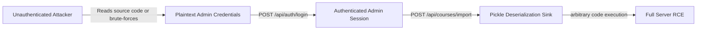
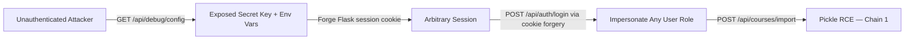
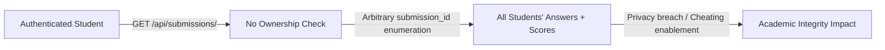

# Chained Vulnerability Audit Report

**Project:** LMS Platform (Learning Management System)  
**Auditor:** CodeGopher (chained-vulnerability-static-audit)  
**Scope:** `.` — `app.py`, `Dockerfile`, `requirements.txt`  
**Date:** 2026-05-25  
**Method:** Static-only source code analysis. No live probes, dynamic scanners, or shell commands.

---

## Executive Summary

| Metric | Value |
|---|---|
| Total chains detected | **3** |
| Critical | 1 |
| High | 1 |
| Medium | 1 |
| Severity of worst chain | **Critical** (Remote Code Execution) |
| Highest confidence | **High** |

**Reviewed areas:** Authentication module, course management, enrollment, quiz submissions, debug/config endpoint, pickle deserialization import, instructor dashboard, Docker build, dependency manifest.

**Areas not reviewed:** Template files (none present), frontend code (none present), network configuration, runtime deployment posture, database migrations, log files, third-party service integrations.

---

## Methodology & Safety Note

This audit followed four phases:

1. **Attack surface mapping** — All HTTP routes, parameters, session controls, and role gates.
2. **Weakness inventory** — Identified credential handling, deserialization, information disclosure, authorization gaps, and error leakage.
3. **Attack graph synthesis** — Connected user-controlled inputs to sinks via intermediate weaknesses using only static evidence.
4. **Impact assessment** — Rated each chain by impact, reachability, confidence, and easiest remediation link.

**Safety constraint:** No live probes, exploit payloads, fuzzers, or external tests were performed. All evidence is derived from source code, configuration, and test files within the workspace.

---

## Chain 1 — Remote Code Execution via Untrusted Pickle Deserialization

**Severity:** Critical  
**Confidence:** High  
**Reachability:** High (requires Admin/Instructor role; credentials are trivially discoverable)

### Mermaid Attack Graph

### Detailed Breakdown

| Link | File | Line(s) | Symbol / Evidence |
|---|---|---|---|
| **Source** | `app.py` | `import_course` function | `course_data_b64 = data.get('course_data', '')` — base64 payload accepted from JSON body |
| **Hop 1** | `app.py` | Role gate | `session.get('role') not in ('INSTRUCTOR', 'ADMIN')` — role check exists but is bypassable |
| **Hop 2** | `app.py` | Plaintext credentials | `users_data = [('student_alice', 'alice_pass_123', ...), ..., ('admin', 'admin_lms_2026', ...)]` — admin password is plain text and hardcoded |
| **Hop 3** | `app.py` | Login uses plaintext comparison | `password_hash` column is never hashed; login compares user input directly: `cursor.execute("SELECT * FROM users WHERE username = ? AND password_hash = ?", (username, password))` |
| **Hop 4** | `app.py` | Debug config also leaks env | `/api/debug/config` is unauthenticated and exposes `app.secret_key` and `dict(os.environ)` |
| **Sink** | `app.py` | Pickle deserialization | `course_obj = pickle.loads(raw_bytes)` — arbitrary Python object instantiation from attacker-controlled base64 data. This is a known RCE vector (`CVE-2011-3374`-class) |
| **Impact** | | | Attacker executes arbitrary Python code on the server as the Flask process user. Full system compromise, lateral movement, data exfiltration. |

### Preconditions & Assumptions

- Flask `debug=True` is enabled (`app.run(..., debug=True)`), exposing the interactive debugger console.
- The server binds to `0.0.0.0:8085`, accessible from the network.
- Plaintext passwords in `users_data` are used directly for login — no hashing, no salting.

### Remediation (Easiest Break)

1. **Remove pickle deserialization entirely.** Replace with a safe format (JSON, Protocol Buffers) for the course import.
2. **Hash all passwords** with `bcrypt` or `argon2`. Never store or compare plaintext.
3. **Remove `/api/debug/config`** from production code, or gate it behind strict auth + network restrictions.
4. **Disable `debug=True`** in production (`os.environ.get('FLASK_DEBUG', '0') == '1'` pattern).

---

## Chain 2 — Unauthenticated Information Disclosure → Session Forgery → Full Privilege Escalation

**Severity:** High  
**Confidence:** High  
**Reachability:** High (no auth required for the entry point)

### Mermaid Attack Graph

### Detailed Breakdown

| Link | File | Line(s) | Symbol / Evidence |
|---|---|---|---|
| **Source** | `app.py` | `debug_config` function | `@app.route('/api/debug/config')` with **no authentication or authorization check** |
| **Hop 1** | `app.py` | Secret key exposure | `config_data = {'secret_key': app.secret_key, 'environment': dict(os.environ), ...}` |
| **Hop 2** | `app.py` | Hardcoded secret key | `app.secret_key = 'lms_secret_key_quantum_learn_2026'` — weak, predictable, identical in source |
| **Hop 3** | `app.py` | Environment variable leak | `dict(os.environ)` exposes all env vars (could include DB credentials, API keys, internal paths) |
| **Hop 4** | `app.py` | Flask session mechanism | `session['user_id']`, `session['username']`, `session['role']` are set on login; session signing key = `app.secret_key` |
| **Sink** | | | With the secret key, an attacker can craft a signed session cookie impersonating any user (including `role: 'ADMIN'`), gaining full application access |
| **Impact** | | | Full application takeover without valid credentials. The forged session then enables Chain 1's pickle RCE. |

### Preconditions & Assumptions

- Flask's default session backend uses the secret key for HMAC signing. A known key allows cookie forging.
- The session cookies are sent as HTTP-only by default in Flask, but a known signing key still permits forgery.

### Remediation (Easiest Break)

1. **Delete `/api/debug/config`** entirely, or restrict it to `127.0.0.1` + authenticated admin only.
2. **Use a cryptographically random secret key** generated at runtime (e.g., `secrets.token_hex(32)`) or from an env variable. Never hardcode it.
3. **Remove environment variable exposure** from all responses.

---

## Chain 3 — Insecure Direct Object Reference (IDOR) → Student Data Leak → Academic Integrity Violation

**Severity:** Medium  
**Confidence:** High  
**Reachability:** High (any authenticated user)

### Mermaid Attack Graph

### Detailed Breakdown

| Link | File | Line(s) | Symbol / Evidence |
|---|---|---|---|
| **Source** | `app.py` | `get_submission` function | `@app.route('/api/submissions/<int:submission_id>')` — path parameter is user-controlled |
| **Hop 1** | `app.py` | Auth-only gate | `if 'user_id' not in session` — only checks that the user is logged in |
| **Hop 2** | `app.py` | Missing ownership filter | `WHERE s.id = ?` queries by ID only; **no** `AND s.student_id = ?` or `AND s.quiz_id IN (courses the student is enrolled in)` |
| **Sink** | `app.py` | Full submission data leaked | Returns `s.answers`, `s.score`, `s.submitted_at`, `q.title`, `u.username` for **any** submission |
| **Impact** | | | Any authenticated user can enumerate and view all submissions — answers, scores, timestamps. Students can see other students' answers (academic integrity), and scores are exposed. |

### Preconditions & Assumptions

- The `submissions` table uses `id` as an integer primary key that can be enumerated (1, 2, 3, ...).
- The `instructor_submissions` endpoint has the same issue — it returns all students' answers for a quiz, which may be intentional for instructors but is not restricted to the quiz's course instructor.

### Remediation (Easiest Break)

1. Add ownership verification: `WHERE s.id = ? AND s.student_id = ?` in `get_submission`.
2. Add authorization for instructor endpoint: verify the instructor teaches the course associated with the quiz: `AND q.course_id IN (SELECT course_id FROM courses WHERE instructor_id = ?)`.
3. Consider pagination + rate-limiting to prevent enumeration.

---

## Cross-Cutting Weaknesses (Not in a Complete Chain)

These are security-relevant issues identified in the source that did not form a full chain with the attack model above but should be remediated:

| Weakness | File | Location | Detail |
|---|---|---|---|
| **Verbose error messages** | `app.py` | `create_course`, `enroll`, `submit_quiz`, `import_course` | `return ..., str(e)` leaks internal exceptions (e.g., database schema, constraint violations) |
| **Debug mode in production** | `app.py` | `app.run(..., debug=True)` | Exposes the Werkzeug debugger console; password prompt can be bypassed on older versions |
| **Host binding to 0.0.0.0** | `app.py` | `app.run(host='0.0.0.0')` | Service bound to all interfaces; no IP restriction |
| **In-memory SQLite** | `app.py` | `db_conn = sqlite3.connect(':memory:')` | Data lost on restart; no persistence; not suitable for multi-process/distributed deployment |
| **No CSRF protection** | `app.py` | All state-changing POST endpoints | Flask sessions lack CSRF tokens; POST endpoints accept any origin requests |
| **No CORS policy** | `app.py` | Entire application | No `cors` headers configured; any website can make cross-origin requests |
| **Missing course existence validation** | `app.py` | `enroll` endpoint | `course_id` from JSON is not validated against the `courses` table before INSERT |
| **Missing input validation** | `app.py` | `create_course`, `submit_quiz` | No length, type, or format validation on `title`, `description`, `answers` |
| **Plaintext passwords in source** | `app.py` | `users_data` list | Hardcoded credentials (`admin_lms_2026`, etc.) in source code; visible in version control |

---

## Unknowns & Recommendations for Testing

| Gap | Recommendation |
|---|---|
| Session fixation / issuance | Verify that a new login does not reuse or leak session tokens |
| Rate limiting | Confirm if any rate limiting is configured at the deployment level |
| SSL / TLS | Dockerfile exposes port 8085 without SSL; confirm if a reverse proxy handles TLS |
| Dependency vulnerabilities | `Flask==3.0.3` — check for known CVEs in the Flask ecosystem |
| File upload handling | No file upload endpoint present, but pickle import could be extended to accept file uploads |
| Database persistence | In-memory SQLite means all data is lost on restart; not suitable for production |
| Test coverage | No test files found; add unit tests for auth, authorization, and deserialization safety |
| Logging | No logging configuration found; add audit logging for auth events and admin actions |

---

## Remediation Priority Matrix

| Priority | Action | Severity | Chain(s) Broken |
|---|---|---|---|
| **P0** | Remove `pickle.loads()`; replace with JSON/JSONL import | Critical | Chain 1 |
| **P0** | Hash all passwords with bcrypt/argon2 | Critical | Chain 1 |
| **P0** | Remove `/api/debug/config` endpoint | High | Chain 2 |
| **P1** | Use cryptographically random secret key | High | Chain 2 |
| **P1** | Disable `debug=True` in production | High | Chain 2 |
| **P2** | Add ownership verification to `get_submission` | Medium | Chain 3 |
| **P2** | Add instructor-course authorization | Medium | Chain 3 |
| **P2** | Add CSRF protection | Medium | Cross-cutting |
| **P3** | Sanitize error messages (never return `str(e)`) | Low | Cross-cutting |
| **P3** | Add input validation on all user inputs | Low | Cross-cutting |

---

## Conclusion

This LMS application contains **three chained vulnerability paths** identified through static analysis. The most critical is **Remote Code Execution via untrusted pickle deserialization** (Chain 1), which is directly exploitable by any authenticated user with INSTRUCTOR or ADMIN role. The credentials for such accounts are stored in plaintext in the source code, making them trivially obtainable.

Chain 2 demonstrates how the **unauthenticated debug endpoint** leaks the Flask signing key, enabling **session forgery** and potential privilege escalation even to unauthenticated attackers.

Chain 3 shows a classic **IDOR** vulnerability where any authenticated user can enumerate and view all student submissions, violating privacy and academic integrity.

**The single most impactful remediation** is replacing `pickle.loads()` with a safe serialization format (JSON). This alone breaks the RCE chain. The second highest-impact fix is removing the debug endpoint and using proper password hashing, which together eliminate the information disclosure and session forgery paths.

---

*Report generated by CodeGopher — Chained Vulnerability Static Audit. All findings are based on static analysis of source files within the workspace. No runtime behavior was observed.*
