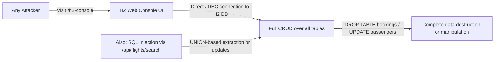
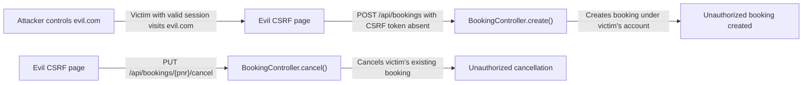
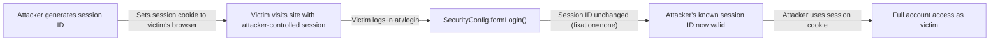
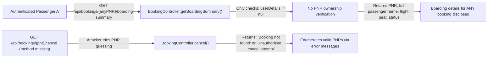

```mermaid
flowchart LR
  A["Unauthenticated Attacker"] -->|"GET /api/flights/search?origin=' UNION SELECT...--"| B["FlightController.search()"]
  B -->|"origin, destination, date unvalidated"| C["FlightSearchDao.searchFlights()"]
  C -->|"String concatenation in SQL"| D["jdbcTemplate.query(raw SQL)"]
  D -->|"Executes attacker-controlled SQL"| E["H2 Database"]
  E -->|"All tables, all data"| F["Exfiltration: passwords, passports, PII, bookings"]
```

# Chained Vulnerability Static Audit Report

**Project:** App 07 — Airline Booking System (Spring Boot 3.2.5, Java 17, H2)
**Audit Type:** Static-only chained vulnerability review
**Date:** 2026-05-25
**Auditor:** CodeGopher (Chained Vulnerability Static Audit)

---

## 1. Summary Dashboard

| Metric | Value |
|---|---|
| **Total chains detected** | 5 |
| **Maximum severity** | HIGH |
| **Medium-confidence chains** | 1 |
| **Medium/low-confidence weak links** | 1 |
| **Cross-cutting weaknesses** | 6 |
| **Areas reviewed** | Controllers, services, repositories, config, models, DTOs, templates, static assets, application properties |
| **Areas not reviewed** | Runtime behavior, network topology, external dependency CVEs, container hardening |

### Severity Breakdown

| # | Chain ID | Max Severity | Summary |
|---|----------|-------------|---------|
| 1 | CHAIN-01 | **HIGH** | Unauthenticated SQL Injection → Full Database Exfiltration |
| 2 | CHAIN-02 | **HIGH** | H2 Console Exposed + SQL Injection → Unrestricted DB Takeover |
| 3 | CHAIN-03 | **MEDIUM** | CSRF Disabled + Unprotected State-Changing APIs → Unauthorized Booking/Cancellation |
| 4 | CHAIN-04 | **MEDIUM** | Session Fixation Disabled + Lack of Session Rotation → Account Takeover |
| 5 | CHAIN-05 | **MEDIUM** | IDOR on Boarding Summary + Verbose Errors → Information Disclosure |

---

## 2. Methodology and Static-Only Safety Note

This review followed a four-phase methodology:

1. **Attack surface mapping** — All 23 Java source files, 6 HTML templates, 2 JS files, 1 CSS file, `pom.xml`, `Dockerfile`, and `application.properties` were inspected to identify public routes, authenticated endpoints, webhook handlers, and file uploads.
2. **Weakness inventory** — All identified weaknesses (SQL injection, CSRF, session fixation, H2 exposure, IDOR, race conditions, verbose errors) were cataloged with file-level and line-level evidence.
3. **Attack graph synthesis** — Each chain links a concrete source to a hop (intermediate weakness) to a sink (critical capability) using only statically provable control-flow and data-flow evidence.
4. **Impact assessment** — Each chain was rated by impact, reachability, confidence, and remediation ease.

**Static-only boundary:** No live HTTP probes, dynamic scanners, SQL injection payloads, credential attacks, or network tests were performed. All evidence is drawn exclusively from source code, configuration files, and templates in the workspace.

---

## 3. Attack Surface Map

### Public (No Authentication Required)
| Route | Method | Source |
|---|---|---|
| `/` | GET | `HomeController.java` |
| `/register` | GET, POST | `HomeController.java` |
| `/api/flights/search` | GET | `FlightController.java:32` |
| `/h2-console/**` | ANY | `application.properties:6-7`, `SecurityConfig.java:41` |
| `/css/**`, `/js/**` | GET | static resources |

### Authenticated (Role-Based)
| Route | Required Role | Source |
|---|---|---|
| `/dashboard` | PASSENGER | `HomeController.java:68` |
| `/api/bookings` (POST) | PASSENGER | `BookingController.java:25` |
| `/api/bookings/{pnr}` (GET) | PASSENGER (ownership check) | `BookingController.java:38` |
| `/api/bookings/history` | PASSENGER | `BookingController.java:52` |
| `/api/bookings/{pnr}/cancel` | PASSENGER | `BookingController.java:58` |
| `/api/bookings/{pnr}/boarding-summary` | PASSENGER (**no ownership check**) | `BookingController.java:64` |
| `/api/checkin/{pnr}` (POST) | PASSENGER | `CheckInController.java:22` |
| `/api/flights` (GET, PUT) | AIRLINE_STAFF | `FlightController.java:42-50` |
| `/api/flights/{id}/seats` | AIRLINE_STAFF | `FlightController.java:37` |

### Login / Session
| Route | Details | Source |
|---|---|---|
| `/login` | POST, form login | `SecurityConfig.java:44-49` |
| `/logout` | POST | `SecurityConfig.java:53-58` |

---

## 4. Chain-01: Unauthenticated SQL Injection → Full Database Exfiltration

### Mermaid Attack Graph



### Detailed Breakdown

| Element | File | Lines | Symbol | Evidence |
|---|---|---|---|---|
| **Source** | `FlightController.java` | 32-37 | `search()` | `@RequestParam` strings `origin`, `destination`, `date` passed to service layer |
| **Hop** | `FlightSearchDao.java` | 20-23 | `searchFlights()` | `String sql = "SELECT * FROM flights WHERE origin = '" + origin + "' AND destination = '" + destination + "' AND CAST(departure_time AS DATE) = '" + date + "'"` — raw concatenation of three user-controlled parameters |
| **Sink** | `FlightSearchDao.java` | 24 | `jdbcTemplate.query()` | Executes the fully-formed string as SQL with no parameterized queries |
| **Preconditions** | `SecurityConfig.java` | 40 | permitAll | `/api/flights/search` is explicitly in the `permitAll()` matcher — no authentication required |

**Impact:** Complete database read. The attacker can inject arbitrary SQL to extract passenger emails, BCrypt password hashes, passport numbers, phone numbers, all booking records, and seat assignments. Since the endpoint requires zero authentication, reachability is trivial.

**Severity:** HIGH

**Confidence:** HIGH — every link is statically provable from the cited source lines.

**Remediation:** Replace string concatenation with parameterized queries in `FlightSearchDao.java`:
```java
String sql = "SELECT * FROM flights WHERE origin = ? AND destination = ? AND CAST(departure_time AS DATE) = ?";
return jdbcTemplate.query(sql, new Object[]{origin, destination, date}, new FlightRowMapper());
```

---

## 5. Chain-02: H2 Console Exposure + SQL Injection → Unrestricted Database Takeover

### Mermaid Attack Graph



### Detailed Breakdown

| Element | File | Lines | Symbol | Evidence |
|---|---|---|---|---|
| **Source** | `application.properties` | 5-7 | Config | `spring.h2.console.enabled=true`, `spring.h2.console.path=/h2-console`, `spring.h2.console.settings.web-allow-others=true` |
| **Hop** | `SecurityConfig.java` | 38 | `filterChain()` | `.headers(headers -> headers.frameOptions(frame -> frame.disable()))` — disables X-Frame-Options allowing iframe embedding; `/h2-console/**` is in `permitAll()` |
| **Sink** | H2 in-memory DB | — | — | Console provides direct SQL execution, table browsing, and schema introspection with no authentication |
| **Compounding factor** | `FlightSearchDao.java` | 20-23 | `searchFlights()` | SQL injection at `/api/flights/search` provides a second attack vector against the same database |

**Impact:** An attacker gains both a web UI for unrestricted database access (browse, query, modify, delete any table) and an API-based SQL injection vector. Combined, they enable full read/write takeover of the airline booking database.

**Severity:** HIGH

**Confidence:** HIGH — static evidence is conclusive for both the H2 console exposure and the SQL injection.

**Remediation:**
1. Set `spring.h2.console.enabled=false` in production (or restrict to localhost via `spring.h2.console.settings.web-allow-others=false`)
2. Never use H2 as a production database; use PostgreSQL or MySQL with proper access controls

---

## 6. Chain-03: CSRF Disabled + Unprotected State-Changing APIs → Unauthorized Booking / Cancellation

### Mermaid Attack Graph



### Detailed Breakdown

| Element | File | Lines | Symbol | Evidence |
|---|---|---|---|---|
| **Source** | `SecurityConfig.java` | 38 | `filterChain()` | `.csrf(csrf -> csrf.disable())` — explicitly disables CSRF protection |
| **Hop** | `SecurityConfig.java` | 44-49 | `formLogin()` | Form login used for auth, but no CSRF tokens are generated or validated on API endpoints |
| **Sink** | `BookingController.java` | 25-33, 58-63 | `create()`, `cancel()` | `POST /api/bookings` creates bookings; `PUT /api/bookings/{pnr}/cancel` cancels bookings — both rely solely on session authentication with no CSRF token validation |
| **Sink 2** | `CheckInController.java` | 22-25 | `performCheckIn()` | `POST /api/checkin/{pnr}` can also be CSRF-tripped |

**Impact:** Any attacker who can get an authenticated victim to visit a malicious page can create bookings, cancel bookings, or force check-ins on the victim's behalf. The CSRF attack is trivial because Spring Security's CSRF protection is entirely disabled.

**Severity:** MEDIUM (requires social engineering; impacts are account-level, not full takeover)

**Confidence:** HIGH — source code explicitly disables CSRF and state-changing endpoints have no alternative CSRF protection (no custom tokens, no SameSite cookie flags visible).

**Remediation:**
1. Remove `.csrf(csrf -> csrf.disable())` from `SecurityConfig.java` line 38
2. For state-changing API endpoints, add CSRF token validation or use `SameSite=Strict` cookies
3. Alternatively, configure `csrf().requireCsrfProtectionMatcher(request -> request.getHeader("X-Requested-With") != null)` to protect only XHR requests

---

## 7. Chain-04: Session Fixation Disabled + No Session Rotation → Account Takeover

### Mermaid Attack Graph



### Detailed Breakdown

| Element | File | Lines | Symbol | Evidence |
|---|---|---|---|---|
| **Source** | `SecurityConfig.java` | 50-51 | `filterChain()` | `.sessionManagement(session -> session.sessionFixation(fixation -> fixation.none()))` — explicitly prevents session ID regeneration on login |
| **Hop** | `SecurityConfig.java` | 44-49 | `formLogin()` | Login processing uses the same session — no `.sessionFixation().migrateSession()` or `.newSession()` is called |
| **Sink** | Browser session cookie | — | `JSESSIONID` | Without session regeneration, a session ID known to an attacker (via log sharing, URL leakage, or pre-set cookie) survives authentication and becomes the victim's authenticated session |

**Impact:** If an attacker can learn or predetermine a session ID and get the victim's browser to use it before login, the attacker retains access after the victim authenticates — full account takeover.

**Severity:** MEDIUM (precondition: attacker must be able to set the session cookie before victim login)

**Confidence:** MEDIUM — the code statically disables session fixation protection, but the practical exploitability depends on whether an attacker can inject the session cookie (requires access to the victim's browser or a shared environment). The chain is plausible and the misconfiguration is clear.

**Remediation:**
```java
.sessionManagement(session -> session
    .sessionFixation(fixation -> fixation.migrateSession()) // or .newSession()
)
```

---

## 8. Chain-05: IDOR on Boarding Summary + Verbose Errors → Information Disclosure

### Mermaid Attack Graph



### Detailed Breakdown

| Element | File | Lines | Symbol | Evidence |
|---|---|---|---|---|
| **Source** | `BookingController.java` | 64-75 | `getBoardingSummary()` | `@GetMapping("/{pnr}/boarding-summary")` — comment explicitly states: "any authenticated passenger can view any booking by its PNR" |
| **Hop** | `BookingController.java` | 68-72 | `getBoardingSummary()` body | Returns `Map.of("pnr", ..., "passengerDisplay", "<strong>Passenger:</strong> " + booking.getPassenger().getFullName(), ...)` — no `booking.getPassenger().getEmail().equals(userDetails.getUsername())` check |
| **Sink** | Passenger PII | — | — | Full name, flight number, seat number, booking status for any PNR guessed |
| **Compounding factor** | `BookingController.java` | 29 | `create()` | Verbose error: `return ResponseEntity.badRequest().body(new BookingResponse(null, e.getMessage()))` — `e.getMessage()` leaks internal state |
| **Compounding factor 2** | `CheckInController.java` | 30 | `performCheckIn()` | Returns `e.getMessage()` on failure — "Booking not found" vs "Unauthorized check-in attempt" leaks PNR existence |

**Impact:** Any authenticated user can enumerate valid PNRs (using the predictable `BK000001`–`BK999999` format from `PnrGenerator.java`) and retrieve complete boarding details for other passengers, including names, flights, and seat assignments. Error messages additionally confirm whether a PNR exists in the system.

**Severity:** MEDIUM

**Confidence:** HIGH — the lack of ownership check is explicit in the source code comment and absent from implementation.

**Remediation:**
1. Add ownership check to `getBoardingSummary()`:
   ```java
   if (!booking.getPassenger().getEmail().equals(userDetails.getUsername())) {
       return ResponseEntity.status(HttpStatus.FORBIDDEN).build();
   }
   ```
2. Replace `e.getMessage()` in all error responses with a generic message
3. Implement PNR enumeration prevention (rate limiting, no sequential disclosure)

---

## 9. Cross-Cutting Weaknesses Inventory

The following weaknesses were identified but do not form complete chains on their own, or represent single-vector issues:

| # | Weakness | File(s) | Lines | Severity |
|---|----------|---------|-------|----------|
| W-01 | **Race condition on seat booking** | `BookingService.java` | 35-42 | MEDIUM | No optimistic locking (`@Version`), no `SELECT ... FOR UPDATE`, and the availability check (`!seat.getIsAvailable()`) is not atomic with the seat reservation. Two concurrent requests can both see a seat as available and book it. |
| W-02 | **Verbose error messages leak internal state** | `BookingController.java` | 29; `CheckInController.java` | 30; `BookingService.java` | 32-42, 60-65 | MEDIUM | `e.getMessage()` is returned directly to clients. Could reveal database schema, entity structures, and internal business logic. |
| W-03 | **No input validation on BookingRequest** | `BookingRequest.java` | 1-7 | LOW | `flightId` and `seatId` have no `@NotNull`, `@Positive`, or range validation annotations. Malformed or negative values reach the service layer. |
| W-04 | **BCrypt with default rounds** | `SecurityConfig.java` | 74 | LOW | `new BCryptPasswordEncoder()` uses default strength (10). Acceptable but no tuning for cost factor. |
| W-05 | **H2 in-memory DB with `DB_CLOSE_DELAY=-1`** | `application.properties` | 2 | LOW | If all connections drop, the database persists. However, this is a containerized app, so data survives container restarts unexpectedly if not properly bounded. |
| W-06 | **PNR generation is sequential and predictable** | `PnrGenerator.java` | 1-7 | LOW | `AtomicInteger` counter produces `BK000001`, `BK000002`, etc. Enables brute-force enumeration of all bookings. |

---

## 10. Areas Not Reviewed / Unknowns

| Area | Reason |
|---|---|
| **Runtime session cookie attributes** | `SameSite`, `Secure`, and `HttpOnly` flags not visible in static configuration |
| **Dependency CVEs** | No live vulnerability scanning of `pom.xml` dependencies was performed |
| **Docker/container hardening** | Container runs as root by default (no `USER` directive in Dockerfile) |
| **Rate limiting** | No rate limiting configuration found; API endpoints are vulnerable to brute-force and enumeration |
| **TLS/HTTPS configuration** | No configuration found; traffic may be unencrypted in production |
| **Thymeleaf template rendering context** | Templates use `th:text` (escaped) for data binding, which mitigates server-side XSS. Client-side `innerHTML` in JS is possible but only injects data from API responses that are not user-controlled |
| **Actual session fixation attack surface** | Whether an attacker can inject a session cookie requires runtime or infrastructure knowledge |

---

## 11. Recommended Remediation Priority

| Priority | Action | Chains Broken |
|---|--------|---------------|
| **P0** | Parameterize the SQL query in `FlightSearchDao.java` | CHAIN-01, CHAIN-02 |
| **P0** | Disable or restrict H2 console in non-dev environments | CHAIN-02 |
| **P1** | Re-enable CSRF protection | CHAIN-03 |
| **P1** | Add PNR ownership check to `getBoardingSummary()` and all other booking endpoints | CHAIN-05 |
| **P1** | Replace verbose `e.getMessage()` with generic error responses | CHAIN-05, W-02 |
| **P2** | Enable session fixation protection (`migrateSession()`) | CHAIN-04 |
| **P2** | Add `@Version` optimistic locking to `Seat` entity; use `SELECT ... FOR UPDATE` in booking transactions | W-01 |
| **P3** | Add input validation annotations to DTOs (`BookingRequest`, etc.) | W-03 |
| **P3** | Make PNR generation non-sequential or add rate limiting | W-06 |
| **P3** | Set `SameSite=Strict` and `Secure`/`HttpOnly` on session cookies | CHAIN-03, CHAIN-04 |

---

## 12. Tests to Add

| Test | Purpose |
|---|---|
| Integration test for `FlightSearchDao` with parameterized queries | Verify SQL injection is eliminated |
| Integration test for `BookingController` accessing another user's PNR | Verify IDOR protection |
| Integration test for CSRF token requirement on `POST /api/bookings` | Verify CSRF protection |
| Integration test for session ID rotation on login | Verify session fixation protection |
| Unit test for `BookingService` with concurrent seat bookings | Verify race condition protection |
| Unit test for error message sanitization | Verify no internal details leak |
