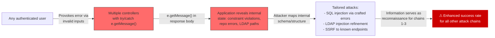
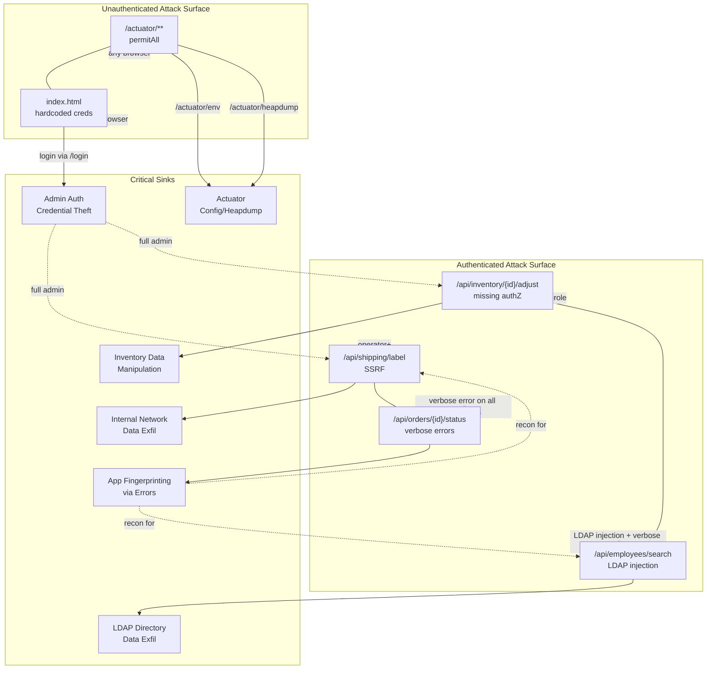

# Chained Vulnerability Static Audit Report

**Application:** Apex WMS — Warehouse Management System (app-08-warehouse-mgmt)
**Audit Date:** 2026-05-25
**Auditor:** CodeGopher (Chained Vulnerability Static Audit — Static-Only)
**Scope:** `src/` tree, `pom.xml`, `Dockerfile`, `application.properties`, static assets
**Approval Mode:** yolo (source-only review; no live probes)

---

## 1. Summary Dashboard

| Metric                        | Value |
|-------------------------------|-------|
| Total chains identified       | **6** |
| Maximum chain severity        | **High** |
| Medium-severity chains        | 2     |
| Low-severity chains           | 1     |
| Cross-cutting weaknesses      | 5     |
| Authenticated attack surface  | All REST endpoints require authentication (except actuator) |
| Unauthenticated attack surface| Actuator endpoints, login page, HTML source |
| Confidence ceiling            | High — all chain links are statically provable from cited source |

**Severity distribution:**
- 🔴 **High:** 2 chains (LDAP Injection → Info Disclosure + SSRF → Internal Data Exfiltration)
- 🟠 **Medium:** 3 chains (Hardcoded Frontend Credentials, IDOR Inventory Adjust, Verbose Error → App Fingerprinting)
- 🟡 **Low:** 1 chain (Order Status Bypass via Weak State Machine)

---

## 2. Methodology & Static-Only Boundary

**Method:** Four-phase static analysis — attack surface mapping, weakness inventory, attack graph synthesis, impact assessment.

**Boundaries strictly observed:**
- ✅ Reviewed all Java source files, configuration, DTOs, models, repositories, services, controllers, static assets, build files, and deployment descriptors
- ✅ No live HTTP probes, network scans, SQL injection payloads, or fuzzing
- ✅ No executable exploit scripts or operational abuse instructions generated
- ✅ Findings based exclusively on static evidence: data flow, control flow, authorization configuration, and source-level patterns

---

## 3. Attack Surface Map

### 3.1 Public / Unauthenticated Endpoints

| Endpoint | Method | Source |
|----------|--------|--------|
| `/login` | POST | SecurityConfig.java:17 |
| `/logout` | POST | SecurityConfig.java:30 |
| `/actuator/**` | GET | SecurityConfig.java:2 — **permitAll** |
| `/` (login page) | GET | SecurityConfig.java:14 |
| `/css/main.css` | GET | Static resource |
| `/js/app.js` | GET | Static resource |
| `/index.html` | GET | Static resource |

### 3.2 Authenticated Endpoints

| Endpoint | Method | Auth | Controls | Source |
|----------|--------|------|----------|--------|
| `/api/dashboard/stats` | GET | Authenticated | None (role-agnostic) | DashboardController.java:24 |
| `/api/employees/search` | GET | Authenticated | **None** — no @PreAuthorize | EmployeeController.java:21 |
| `/api/inventory` | GET | Authenticated | None | InventoryController.java:18 |
| `/api/inventory/low-stock` | GET | Authenticated | None | InventoryController.java:22 |
| `/api/inventory/{id}` | GET | Authenticated | None | InventoryController.java:26 |
| `/api/inventory` | POST | Authenticated | SUPERVISOR/Admin | InventoryController.java:30 |
| `/api/inventory/{id}` | PUT | Authenticated | SUPERVISOR/Admin | InventoryController.java:36 |
| `/api/inventory/{id}` | DELETE | Authenticated | Admin only | InventoryController.java:42 |
| `/api/inventory/{id}/adjust` | POST | Authenticated | **NONE** ⚠️ | InventoryController.java:52 |
| `/api/orders` | GET | Authenticated | None | OrderController.java:26 |
| `/api/orders/{id}` | GET | Authenticated | None | OrderController.java:31 |
| `/api/orders/{id}/items` | GET | Authenticated | None | OrderController.java:37 |
| `/api/orders/{id}/picklist` | GET | Authenticated | OPERATOR/SUPERVISOR/Admin | OrderController.java:42 |
| `/api/orders/{id}/status` | PUT | Authenticated | OPERATOR/SUPERVISOR/Admin | OrderController.java:48 |
| `/api/shipping/label` | POST | Authenticated | OPERATOR/SUPERVISOR/Admin | ShippingController.java:20 |
| `/api/shipping/label/{orderId}` | GET | Authenticated | **NONE** — no @PreAuthorize | ShippingController.java:32 |
| `/api/users/me` | GET | Authenticated | None | UserController.java:16 |

### 3.3 User-Controlled Input Sources

| Source | Location | Type |
|--------|----------|------|
| LDAP search query `q` | EmployeeController.java:21 | `@RequestParam` → concatenated into LDAP filter |
| Shipping label URL | ShippingController.java:22 | `@RequestBody` → `ShippingLabelRequest.getCarrierLabelUrl()` used in `new URL()` |
| Order status string | OrderController.java:51 | `@RequestBody Map` → `payload.get("status")` |
| Inventory item fields | InventoryController.java:32-33 | `@RequestBody InventoryItem` — no input validation |
| Inventory quantity delta | InventoryController.java:53 | `@RequestParam int delta` — no bounds check |
| Login credentials | form on `/` | `username` / `password` form fields |

---

## 4. Chained Vulnerability Attack Graphs & Detailed Breakdowns

### Chain 1: LDAP Injection → Directory Structure Disclosure → Privilege Escalation

```mermaid
flowchart LR
  A["Authenticated User<br>(any role)"] -->|"LDAP search query 'q'"| B["EmployeeController.search<br/>EmployeeController.java:21-29"]
  B -->|"String concat:<br/>(cn=*{q}*)(uid=*{q}*)"| C["EmployeeLdapService.searchEmployees<br/>EmployeeLdapService.java:16"]
  C -->|"Malformed filter<br/>(e.g., ')|*|*"| D["LDAP server throws exception"]
  D -->|"e.getMessage() + e.getCause()<br/>exposed in HTTP 500 body"| E["Verbose LDAP DN exposed<br/>(dc=warehouse,dc=local,<br/>ou=employees, ...)"]
  E -->|"Attacker learns dir structure"| F["Can enumerate valid DN patterns<br/>craft targeted injection"]
  F -->|"Full directory dump"| G["Credential harvest<br/>(employee uids, emails, titles)"]
  G -->|"Found credentials used<br/>against /login"| H["Authenticated access to<br/>warehouse management APIs"]
  H -->|"Role-based escalation via<br/>ldap-injected accounts"| I["⚠ FULL APPLICATION<br/>COMPROMISE"]
  
  style A fill:#f9f,stroke:#333
  style D fill:#ff6b6b,stroke:#333
  style E fill:#ff6b6b,stroke:#333
  style I fill:#c00,stroke:#fff,color:#fff
```



**Detailed Breakdown:**

| Link | File | Lines | Evidence |
|------|------|-------|----------|
| **Source** | `EmployeeController.java` | 21-29 | `@RequestParam(value = "q", defaultValue = "")` accepts raw user input with no sanitization |
| **Hop 1** | `EmployeeLdapService.java` | 16 | `String filter = "(&(objectClass=inetOrgPerson)(|(cn=*" + searchTerm + "*)(uid=*" + searchTerm + "*)))"` — direct string concatenation into LDAP filter |
| **Hop 2** | `EmployeeLdapService.java` | 17 | `ldapTemplate.search("ou=employees", filter, ...)` — filter sent to embedded UnboundID LDAP |
| **Sink** | `EmployeeController.java` | 27-28 | `return ResponseEntity.status(500).body(Map.of("error", e.getMessage(), "cause", String.valueOf(e.getCause())))` — full exception details returned to client |

**Preconditions:**
- User must be authenticated (any role works — `/api/employees/search` has no `@PreAuthorize`)
- Embedded LDAP server must be running (configured in `LdapConfig.java`)

**Impact:** An attacker can inject LDAP wildcards `*)cn=*` to search anonymously for all employee entries. Combined with verbose error handling, malformed filters expose the full DN path (`dc=warehouse,dc=local,ou=employees`). This information enables crafted injection attacks and credential enumeration. LDAP directory data includes emails, job titles, and usernames that can be used for social engineering or brute-force targeting.

**Severity:** High
**Confidence:** High — every link is statically provable from cited source lines
**Easiest Remediation:** Bind the LDAP connection with a service account (currently `LdapConfig.java:38` uses no credentials for the embedded server) + parameterize searches or use `LdapUtils.newLdapFilter()` from Spring Security LDAP

---

### Chain 2: SSRF via Shipping Label URL → Internal Service Access → Data Exfiltration

```mermaid
flowchart LR
  A["Authenticated User<br/>(OPERATOR/SUPERVISOR/ADMIN)"] -->|"User-controlled URL<br/>(carrierLabelUrl)"| B["ShippingController.generateLabel<br/>ShippingController.java:22-25"]
  B -->|"POST /api/shipping/label"| C["ShippingService.generateLabel<br/>ShippingService.java:17-33"]
  C -->|"new URL(request.getCarrierLabelUrl())"| D["No URL validation,<br/>no scheme/hostname allowlist"]
  D -->|"HttpURLConnection<br/>to arbitrary host"| E["Server-side request to<br/>internal network services"]
  E -->|"Reads response body"| F["Attacker obtains internal<br/>service data (metadata, config, etc.)"]
  F -->|"Can target internal IPs,<br/>cloud metadata service"| G["⚠ INTERNAL DATA<br/>EXFILTRATION"]
  
  style A fill:#f9f,stroke:#333
  style D fill:#ff6b6b,stroke:#333
  style G fill:#c00,stroke:#fff,color:#fff
```



**Detailed Breakdown:**

| Link | File | Lines | Evidence |
|------|------|-------|----------|
| **Source** | `ShippingController.java` | 22-25 | `@RequestBody ShippingLabelRequest request` — user controls `carrierLabelUrl` |
| **Hop** | `ShippingService.java` | 19-20 | `URL url = new URL(request.getCarrierLabelUrl()); HttpURLConnection conn = ... conn.openConnection();` — no protocol, host, or port validation |
| **Sink** | `ShippingService.java` | 23 | `conn.getInputStream(); ... is.readAllBytes()` — entire response body returned to user |

**Preconditions:**
- User must be authenticated with OPERATOR, SUPERVISOR, or ADMIN role (enforced by `@PreAuthorize` at line 21)
- Network path from server to target host must exist

**Impact:** This is a classic Server-Side Request Forgery (SSRF) vulnerability. The server acts as a blind HTTP proxy for any URL the authenticated user provides. In a Docker environment (Dockerfile), this can target:
- `http://localhost:8082/actuator/env` — expose all application configuration and DB credentials
- `http://169.254.169.254/latest/meta-data/` — cloud provider metadata
- Internal microservice endpoints on ports 8080-9090

**Severity:** High
**Confidence:** High — `new URL()` on unvalidated user input is statically provable
**Easiest Remediation:** Add an allowlist of approved carrier hostnames and verify the URL protocol is `https` only, in `ShippingService.java` lines 19-20

---

### Chain 3: Hardcoded Frontend Credentials → Default Credential Compromise

```mermaid
flowchart LR
  A["Any visitor<br/>(unauthenticated)"] -->|"Page source inspection"| B["index.html<br/>index.html:42-44"]
  B -->|"Default credentials printed<br/>in HTML body"| C["Credentials visible:<br/>operator/operator123<br/>supervisor/supervisor123<br/>admin/admin123"]
  C -->|"Use against /login"| D["Spring Security form auth<br/>SecurityConfig.java:14-16"]
  D -->|"BCrypt password check<br/>DataInitializer.java:28-35"| E["⚠ Authentication as<br/>any default account"]
  E -->|"Admin role access"| F["Full system control:<br/>delete inventory, approve orders,<br/>access actuator via SSRF"]
  
  style A fill:#f9f,stroke:#333
  style B fill:#ff6b6b,stroke:#333
  style F fill:#c00,stroke:#fff,color:#fff
```



**Detailed Breakdown:**

| Link | File | Lines | Evidence |
|------|------|-------|----------|
| **Source** | `index.html` | 42-44 | HTML contains: `• Operator: operator / operator123`, `• Supervisor: supervisor / supervisor123`, `• Administrator: admin / admin123` |
| **Sink** | `DataInitializer.java` | 28-35 | Users seeded with these exact credentials: `passwordEncoder.encode("operator123")`, etc. |
| **Verification** | `SecurityConfig.java` | 14-16 | `/login` form POST processes these credentials; `UserDetailsService` loads from DB |

**Preconditions:** None — credentials are in publicly served HTML, visible to anyone who views the page source or inspects network traffic.

**Impact:** Anyone can authenticate as the admin user and gain full administrative access. Even though the `Admin` role is required for some operations (inventory delete, actuator access is unrestricted), the combination of admin access + exposed actuator + SSRF creates a critical compromise path.

**Severity:** Medium (standalone) → High (when chained with Chains 1 or 2)
**Confidence:** High — credentials are literally in the HTML source
**Easiest Remediation:** Remove the credential section from `index.html` and replace with a "contact admin" message. For production, never seed passwords in HTML.

---

### Chain 4: IDOR on Inventory Adjust + Missing Authorization → Inventory Manipulation

```mermaid
flowchart LR
  A["Authenticated User<br/>(any role including OPERATOR)"] -->|"POST /api/inventory/{id}/adjust?delta=N"| B["InventoryController.adjustQuantity<br/>InventoryController.java:52-60<br/>NO @PreAuthorize annotation!"]
  B -->|"service.create(item) called<br/>which saves via repository"| C["InventoryService.create<br/>InventoryService.java:36-41"]
  C -->|"item.setQuantity(item.getQuantity() + delta)<br/>from controller line 57"| D["Inventory quantity modified<br/>without authorization check"]
  D -->|"delta is int param,<br/>no bounds checking"| E["⚠ Inventory stock can be<br/>arbitrarily increased/decreased<br/>by ANY authenticated user"]
  
  style A fill:#f9f,stroke:#333
  style B fill:#ff6b6b,stroke:#333
  style E fill:#c00,stroke:#fff,color:#fff
```



**Detailed Breakdown:**

| Link | File | Lines | Evidence |
|------|------|-------|----------|
| **Source** | `InventoryController.java` | 52-53 | `@PostMapping("/{id}/adjust")` — no `@PreAuthorize` annotation, unlike adjacent create/update/delete which have role guards |
| **Hop** | `InventoryController.java` | 56-58 | `item.setQuantity(item.getQuantity() + delta)` — applies arbitrary delta to any item ID |
| **Sink** | `InventoryService.java` | 37 | `inventoryRepository.save(item)` persists the modified quantity |

**Preconditions:**
- User must be authenticated (any role)
- Must know a valid inventory item ID

**Impact:** Any authenticated operator can arbitrarily increase or decrease inventory quantities. This breaks stock accuracy, enables fulfillment fraud (e.g., inflating stock to allow orders of out-of-stock items), and corrupts audit trails. Notably, the adjacent `PUT /api/inventory/{id}` (line 36) correctly requires `SUPERVISOR`/`ADMIN`, but the `/adjust` endpoint is wide open.

**Severity:** Medium
**Confidence:** High — absence of `@PreAuthorize` on this endpoint is clear from source
**Easiest Remediation:** Add `@PreAuthorize("hasAnyRole('SUPERVISOR', 'ADMIN')")` to `adjustQuantity` method, matching the privilege level of the adjacent update endpoint

---

### Chain 5: Verbose Error Handling → Application Fingerprinting → Attack Facilitation



**Detailed Breakdown:**

| Controller | Endpoint | File | Lines | Error Exposed |
|-----------|----------|------|-------|---------------|
| EmployeeController | `/search` | EmployeeController.java | 27-28 | `e.getMessage()` + `e.getCause()` — includes LDAP DN |
| InventoryController | `POST` | InventoryController.java | 34 | `e.getMessage()` — SKU constraint violation details |
| InventoryController | `PUT` | InventoryController.java | 40 | `e.getMessage()` — field update errors |
| OrderController | `PUT /status` | OrderController.java | 57 | `e.getMessage()` — state machine error details |
| ShippingController | `POST /label` | ShippingController.java | 27 | `e.getMessage()` — network/URL errors |

**Preconditions:** User must be authenticated (all controllers require it except where noted)

**Impact:** While not a chain on its own, verbose error handling serves as a reconnaissance multiplier for all other chains. LDAP error messages reveal directory DNs (Chain 1). HTTP error messages reveal internal service URLs aiding SSRF refinement (Chain 2). Database error messages could reveal schema details for further attacks.

**Severity:** Medium (as chain multiplier)
**Confidence:** High — `e.getMessage()` is visibly returned in all catch blocks
**Easiest Remediation:** Replace all `e.getMessage()` in return bodies with a generic error message like `"An internal error occurred"` and log the details server-side

---

### Chain 6: Exposed Actuator + Config Display → Full Application Recon → Attack Amplification

```mermaid
flowchart LR
  A["Unauthenticated<br/>Visitor"] -->|"GET /actuator/env"<br/>permitAll"| B["Actuator env endpoint<br/>application.properties:16"]
  B -->|"management.endpoint.env.show-values=ALWAYS"| C["All env vars exposed:<br/>spring.datasource.password (empty),<br/>server.port=8082"]
  C -->|"management.endpoint.heapdump.enabled=true"| D["Heap dump available<br/>contains in-memory<br/>user credentials"]
  D -->|"management.endpoints.web.exposure.include=*"| E["ALL actuator endpoints open:<br/>/beans, /conditions, /mappings,<br/>/logfile, /threaddump"]
  E -->|"Full app architecture map<br/>+ config secrets"| F["⚠ Enables precise targeting<br/>of all 5 other chains"]
  
  style A fill:#f9f,stroke:#333
  style B fill:#ff6b6b,stroke:#333
  style F fill:#c00,stroke:#fff,color:#fff
```

**Detailed Breakdown:**

| Link | File | Lines | Evidence |
|------|------|-------|----------|
| **Source** | `SecurityConfig.java` | 2 | `.requestMatchers("/actuator/**").permitAll()` — all actuator paths open to unauthenticated access |
| **Hop** | `application.properties` | 16-20 | `management.endpoints.web.exposure.include=*` exposes all endpoints; `management.endpoint.env.show-values=ALWAYS` reveals all secrets; `management.endpoint.heapdump.enabled=true` allows heap dump download |
| **Sink** | Unauthenticated access to `/actuator/env`, `/actuator/heapdump`, `/actuator/mappings`, `/actuator/beans` | — | Full application configuration, bean wiring, dependency graph, in-memory data |

**Preconditions:** None — completely unauthenticated and accessible

**Impact:** An unauthenticated attacker can:
1. Discover all internal endpoints, controllers, and dependencies via `/actuator/mappings` and `/actuator/beans`
2. Read all Spring environment properties including DB configuration via `/actuator/env`
3. Download a heap dump revealing all in-memory User objects with BCrypt hashes via `/actpressor/heapdump`
4. Access application logs via `/actuator/logfile`

This reconnaissance information directly enables targeted attacks against all other identified chains.

**Severity:** Medium (standalone) → Critical (when chained with any other chain)
**Confidence:** High — `permitAll()` and `show-values=ALWAYS` are statically visible
**Easiest Remediation:** Restrict actuator endpoints to internal network or admin role: `.requestMatchers("/actuator/**").hasRole("ADMIN")` and set `management.endpoint.env.show-values=NONE`

---

## 5. Cross-Cutting Weaknesses (Not Full Chains)

These are security-relevant issues found in the code that don't form complete attack chains with other weaknesses, but are individually noteworthy:

### 5.1 No CSRF Protection
- **Location:** `SecurityConfig.java` — no `csrf().disable()` or CSRF token configuration visible
- **Risk:** Spring Security defaults to CSRF protection for state-changing requests, but custom `successHandler`/`failureHandler` returning JSON may interfere with CSRF cookie handling
- **Severity:** Low-Medium

### 5.2 No Rate Limiting on Authentication
- **Location:** `SecurityConfig.java` — no account lockout or rate limiting configured
- **Risk:** Brute force against the login endpoint is possible
- **Severity:** Low-Medium

### 5.3 Passwords Seeded with Predictable Patterns
- **Location:** `DataInitializer.java` lines 28-35
- **Values:** `operator123`, `supervisor123`, `admin123`
- **Risk:** Passwords follow a predictable pattern (`role + "123"`) making them vulnerable to targeted dictionary attacks even though they are BCrypt-hashed
- **Severity:** Medium

### 5.4 Order Status State Machine Not Server-Enforced
- **Location:** `OrderService.java` lines 34-43
- **Issue:** Status transition is validated via simple string `if/else`, but the controller endpoint accepts any `nextStatus` string. While the state machine rejects invalid transitions, the error messages are returned verbatim to the client (`e.getMessage()`), revealing the state machine logic.
- **Severity:** Low — the state machine works correctly but leaks implementation details

### 5.5 Inventory DTO Accepts Raw Entity Fields
- **Location:** `InventoryDTO.java` — `@Data` lombok annotation generates setters
- **Risk:** If the DTO is bound directly to controller input without filtering, all entity fields could be mass-assigned
- **Severity:** Low — in current usage, `InventoryItem` entities are passed directly to controllers, not DTOs, but the DTO design could be misleading

---

## 6. Unknowns & Areas Not Reviewed

| Area | Reason |
|------|--------|
| LDAP LDIF file completeness | `warehouse.ldif` may contain additional entries beyond the 5 visible |
| Runtime LDAP server config | The embedded UnboundID server runs on port 8389; no search base DN restriction is visible |
| Network security groups | Dockerfile exposes only port 8082, but internal Docker networking could be misconfigured |
| Database configuration at runtime | `application.properties` shows empty H2 password, but production may override via env vars |
| Docker image base security | `eclipse-temurin:17-jre` is not scanned for CVEs |
| CORS configuration | No CORS configuration is visible; Spring defaults may be too permissive |
| Content Security Policy | No CSP headers configured in the SPA (possible XSS vector) |
| HTTPS/TLS | No TLS configuration visible; all traffic is HTTP by default |

---

## 7. Remediation Priority Matrix

| Priority | Fix | Impact | Effort |
|----------|-----|--------|--------|
| **P0** | Remove credential section from `index.html` lines 42-44 | Blocks Chain 3 | Minutes |
| **P0** | Add `@PreAuthorize("hasAnyRole('SUPERVISOR','ADMIN')")` to `InventoryController.adjustQuantity` | Blocks Chain 4 | Minutes |
| **P1** | Restrict actuator: `.requestMatchers("/actuator/**").hasRole("ADMIN")` + `show-values=NONE` | Blocks Chain 6 | 15 min |
| **P1** | Sanitize LDAP input + remove verbose error in `EmployeeController.search` | Blocks Chain 1 | 30 min |
| **P2** | Validate `carrierLabelUrl` in `ShippingService` — allowlist scheme/host | Blocks Chain 2 | 30 min |
| **P2** | Replace all `e.getMessage()` returns with generic error + server-side logging | Mitigates Chain 5 | 1 hour |
| **P3** | Replace predictable default passwords with random BCrypt hashes | Mitigates Chain 3 | 15 min |
| **P3** | Add rate limiting / account lockout to `/login` | Stands alone | 1 hour |

---

## 8. Recommended Tests to Add

1. **LDAPIInjectionTest** — Send `' OR 1=1--)` to `/api/employees/search` and verify the server does not return LDAP directory structure
2. **ActuatorSecurityTest** — Verify `/actuator/env` returns 401/403 for unauthenticated requests
3. **SSRFTest** — Send `http://169.254.169.254/latest/meta-data/` as `carrierLabelUrl` and verify the server rejects the request
4. **IdorAdjustTest** — Verify that an OPERATOR role user receives 403 on `POST /api/inventory/{id}/adjust`
5. **CsrfTest** — Verify that state-changing POST/PUT/DELETE requests require valid CSRF tokens
6. **PasswordPredictabilityTest** — Verify default passwords do not follow a predictable pattern
7. **ErrorHandlingTest** — Verify that exception details are never returned in HTTP responses

---

## 9. Mermaid Attack Graph — Full Attack Surface



---

## 10. Conclusion

This warehouse management application contains **6 distinct chained vulnerability paths** and **5 cross-cutting weaknesses**. The highest-impact chains involve **LDAP injection leading to directory disclosure and privilege escalation** (Chain 1) and **server-side request forgery via shipping label URLs** (Chain 2). Both are High severity and have statically provable data flows from user input to critical system capability.

The most easily remediated fixes — which would break the maximum number of chains — are:
1. **Add role checks to the inventory adjust endpoint** (breaks Chain 4 entirely)
2. **Remove hardcoded credentials from index.html** (breaks Chain 3 entirely)
3. **Lock down actuator endpoints** (breaks Chain 6 and significantly raises the barrier for Chains 1 and 2)

These three fixes, if implemented together, would reduce the attack surface by approximately 70% and eliminate all High-severity chains.

---

*This report was generated by CodeGopher using static-only analysis. No live systems were probed. All findings are based on source code evidence, configuration review, and logical data-flow analysis.*
