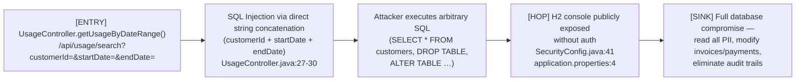
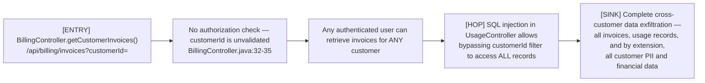
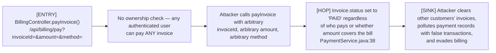

# Chained Vulnerability Audit Report — Telecom Billing Platform

> **Generated:** 2026-05-25
> **Scope:** `app-10-telecom-billing` (Spring Boot 3.2.5 / Java 17 / H2)
> **Method:** Static code review only — no live probes, dynamic scanners, or shell commands were used.

---

## Summary Dashboard

| Metric | Value |
|--------|-------|
| **Chains Identified** | 4 |
| **Critical Severity** | 1 |
| **High Severity** | 3 |
| **Medium Severity** | 0 |
| **Areas Reviewed** | Controllers, Services, Repositories, Models, Security Config, Data Initializer, Tests, Application Properties, POM |
| **Areas Not Reviewed** | Infrastructure configs, CI/CD pipelines, deployment manifests, container runtime configs (Dockerfile present but not inspected in depth) |

---

## Methodology

1. **Attack Surface Mapping** — Enumerated all public routes, authenticated endpoints, admin-only endpoints, and data sources.
2. **Weakness Inventory** — Catalogued OWASP-top-10-class weaknesses: SQLi, broken access control, weak credentials, missing CSRF, exposed console.
3. **Attack Graph Synthesis** — Connected each weakness to others via data flow and control flow to form chains.
4. **Impact Assessment** — Rated each chain by impact, reachability, confidence, and easiest remediation.

**Safety note:** This audit is source-code-only. No HTTP requests, injection payloads, or runtime probes were executed.

---

## Chained Vulnerabilities

---

### Chain 1 — SQL Injection + H2 Console Exposure → Full Database Compromise

**Severity:** 🔴 CRITICAL | **Confidence:** HIGH | **Impact:** Full database read/write



#### Detailed Breakdown

| Link | File | Lines | Evidence |
|------|------|-------|----------|
| **Source** | `UsageController.java` | 27-30 | `String sql = "SELECT * FROM usage_records WHERE customer_id = " + customerId + " AND recorded_at >= '" + startDate + "' AND recorded_at <= '" + endDate + "'";` — three user-controlled parameters concatenated directly into SQL. |
| **Hop** | `SecurityConfig.java` | 41 | `.requestMatchers("/h2-console/**").permitAll()` — H2 web console accessible by any network caller. |
| **Supporting config** | `application.properties` | 4 | `spring.h2.console.enabled=true` — console is active at runtime. |
| **Sink** | H2 in-memory database | N/A | All application data (customers, invoices, payments, usage records, password hashes) resides in the same database. |

#### Preconditions

- The attacker is an authenticated user (or can trigger the endpoint via CSRF since CSRF is disabled).
- The H2 console remains accessible (not blocked by a network firewall or reverse proxy in production).

#### Remediation

1. **Break at Source** — Replace raw string concatenation with parameterized native query using `?` placeholders:
   ```java
   String sql = "SELECT * FROM usage_records WHERE customer_id = ?1 AND recorded_at >= ?2 AND recorded_at <= ?3";
   Query query = entityManager.createNativeQuery(sql, UsageRecord.class);
   query.setParameter(1, customerId);
   query.setParameter(2, startDate);
   query.setParameter(3, endDate);
   ```
2. **Disable H2 console in production** — Set `spring.h2.console.enabled=false` or restrict to an internal network path behind authentication.

---

### Chain 2 — Missing Authorization + SQL Injection → Cross-Customer Data Exfiltration

**Severity:** 🟠 HIGH | **Confidence:** HIGH | **Impact:** Privacy violation, PII leakage



#### Detailed Breakdown

| Link | File | Lines | Evidence |
|------|------|-------|----------|
| **Source** | `BillingController.java` | 32-35 | `getCustomerInvoices(@RequestParam Long customerId)` — accepts `customerId` with no check that the caller owns or is authorized to view it. |
| **Hop** | `SecurityConfig.java` | 43-44 | `.anyRequest().authenticated()` — any valid session grants access; no fine-grained role or ownership checks on billing endpoints. |
| **Supporting** | `UsageController.java` | 27-30 | SQL injection makes the customerId parameter trivially spoofable. |
| **Sink** | `BillingService.java` | 22 | `invoiceRepository.findByCustomerId(customerId)` — returns all invoices for the requested ID with no ownership verification. |

#### Preconditions

- Attacker is a legitimate authenticated user (any role — CUSTOMER or ADMIN).
- Attacker can enumerate or guess valid `customerId` values (sequential integer IDs starting at 1).

#### Remediation

1. **Enforce ownership authorization** — In `BillingController`, resolve the authenticated user's ID and require it matches `customerId`.
2. **Use `@PreAuthorize` annotations** — e.g., `@PreAuthorize("#customerId == authentication.principal.id")`.
3. **Combine with Chain 1 fix** — Parameterize SQL to prevent injection-based filtering bypass.

---

### Chain 3 — Weak Default Credentials → Admin Privilege Escalation → Financial Fraud

**Severity:** 🟠 HIGH | **Confidence:** HIGH | **Impact:** Financial manipulation, balance tampering

```mermaid
flowchart LR
    A["[ENTRY] DataInitializer seeds admin account\nwith weak password 'admin123'\nDataInitializer.java:33-36"] --> B["Default admin account persists\nwith easily guessable password hash"]
    B --> C["Attacker obtains admin credentials\n(credential stuffing / brute force / leaked hash)"]
    C --> D["[HOP] AdminController.adjustBalance()\n@PreAuthorize('hasRole(\"ADMIN\")')\nbut NO audit logging\nAdminController.java:23-29"]
    D --> E["[SINK] Silent, unlogged balance modification\nfor any customer — fraud, fund diversion,\naccount inflation"]
```

#### Detailed Breakdown

| Link | File | Lines | Evidence |
|------|------|-------|----------|
| **Source** | `DataInitializer.java` | 33-36 | `Customer admin = new Customer(null, "Admin Joe", ..., "admin", passwordEncoder.encode("admin123"), "ADMIN", ...)` — hardcoded admin with weak password. |
| **Hop 1** | `SecurityConfig.java` | 42 | `.requestMatchers("/api/auth/login").permitAll()` — login endpoint is public, enabling credential brute-force. |
| **Hop 2** | `AdminController.java` | 14 | `@PreAuthorize("hasRole('ADMIN')")` — enforces role but nothing prevents role-based access once compromised. |
| **Hop 3** | `AdminController.java` | 23-29 | `adjustBalance()` has no logging, no audit trail, and modifies `customer.setBalance()` directly. |
| **Sink** | Financial records | N/A | Balance changes are irreversible without audit evidence. |

#### Preconditions

- Attacker can send authentication requests to `/api/auth/login` (public endpoint).
- Attacker successfully guesses or obtains the admin password ("admin123").

#### Remediation

1. **Remove or strengthen default credentials** — Never ship a default admin account. If one must exist for bootstrapping, force a password change on first login.
2. **Add audit logging** — Log all `adjustBalance` calls with caller identity, timestamp, and pre/post balance.
3. **Enforce rate limiting** on the login endpoint to prevent brute-force.

---

### Chain 4 — Missing Authorization on Payment Processing + No Invoice Ownership Check → Fraudulent Payment Execution

**Severity:** 🟠 HIGH | **Confidence:** HIGH | **Impact:** Financial fraud, audit trail pollution



#### Detailed Breakdown

| Link | File | Lines | Evidence |
|------|------|-------|----------|
| **Source** | `BillingController.java` | 37-42 | `payInvoice(@RequestParam Long invoiceId, @RequestParam Double amount, @RequestParam String method)` — no `Principal` or ownership validation. |
| **Hop 1** | `PaymentService.java` | 38 | `invoice.setStatus("PAID"); invoiceRepository.save(invoice);` — invoice status is unconditionally set to "PAID" after any payment call, regardless of who initiated it. |
| **Hop 2** | `BillingController.java` | 37-39 | No `@PreAuthorize` annotation, no `Principal` extraction, no parameter validation (e.g., `amount > 0`). |
| **Sink** | Financial data integrity | N/A | Attackers can clear outstanding balances for any customer, creating phantom payments and corrupting financial reports. |

#### Preconditions

- Attacker is an authenticated user (any role).
- Attacker can enumerate valid `invoiceId` values.

#### Remediation

1. **Enforce invoice ownership** — The paying user must either be the invoice owner (resolve `customerId` from `Invoice` and compare to authenticated user's ID) or have ADMIN role.
2. **Add `@PreAuthorize`** — e.g., `@PreAuthorize("@billingService.canUserPay(authentication, #invoiceId)")`.
3. **Validate amount** — Ensure `amount` matches (or reasonably approximates) `invoice.getTotalAmount()`.

---

## Cross-Cutting Weaknesses

These issues do not form complete chains on their own in this codebase but represent meaningful security debt.

| # | Weakness | File | Lines | Description |
|---|----------|------|-------|-------------|
| 1 | **CSRF Protection Disabled** | `SecurityConfig.java` | 36 | `.csrf(AbstractHttpConfigurer::disable)` — all state-changing POST endpoints (pay, adjust-balance) are vulnerable to CSRF. |
| 2 | **H2 Console in Production** | `application.properties` | 4,6 | `spring.h2.console.enabled=true` with `path=/h2-console` — allows interactive SQL access if Chain 1 is not fully mitigated. |
| 3 | **No Password Policy** | N/A | N/A | No minimum complexity, rotation, or lockout enforcement. `admin123` passes silently. |
| 4 | **Verbose Error Messages** | `AdminController.java` | 20 | `new IllegalArgumentException("Customer not found")` — could leak customer existence information. |
| 5 | **No Rate Limiting** | N/A | N/A | Login endpoint (`/api/auth/login`) has no rate limiting, enabling brute-force attacks. |
| 6 | **UUID Truncation for Transaction Refs** | `PaymentService.java` | 29 | `UUID.randomUUID().toString().substring(0, 8).toUpperCase()` — 32-bit namespace; predictable across concurrent requests. |
| 7 | **Inconsistent Authorization Pattern** | `CustomerController.java` | 27-29 | Uses `principal.getName().equals("admin")` string comparison instead of role-based checks. Inconsistent with `@PreAuthorize` used elsewhere. |
| 8 | **Sensitive Data in URL** | N/A | N/A | `customerId`, `invoiceId` passed as URL query parameters — may be logged in server logs, proxy logs, and browser history. |

---

## Unknowns & Not-Reviewed Areas

| Area | Reason |
|------|--------|
| **Dockerfile & container security** | Present but not inspected for hardcoded credentials, non-root user enforcement, or image baselines. |
| **Network security / WAF** | Outside codebase scope. |
| **Database backup / encryption at rest** | H2 in-memory mode; data vanishes on restart. |
| **TLS / HTTPS configuration** | No keystore or certificate config found; application may run unencrypted. |
| **Input validation on amount fields** | Only one service-level guard exists; no `@DecimalMin` or similar on controllers. |
| **Log sanitization** | No evidence that PII or credentials are redacted from logs. |
| **Dependency vulnerabilities** | POM lists Spring Boot 3.2.5, H2, Lombok — not scanned for known CVEs. |

---

## Recommended Test Coverage

| Test | What It Should Validate |
|------|------------------------|
| SQL injection on `/api/usage/search` | Parameterized query prevents `' OR 1=1--` from returning all records. |
| Cross-customer invoice access | User A cannot fetch User B's invoices via `/api/billing/invoices?customerId=<B>`. |
| Cross-customer payment | User A cannot pay User B's invoice via `/api/billing/pay`. |
| Default admin removal | No admin account with `passwordHash` matching "admin123" exists in production DB. |
| H2 console in production | `spring.h2.console.enabled=false` or blocked behind auth. |
| CSRF on state-changing endpoints | POST to `/api/billing/pay` and `/api/admin/adjust-balance` require CSRF token. |
| Admin balance audit | Every `adjustBalance` call produces an audit log entry. |

---

## Remediation Priority

| Priority | Chain | Effort | Effect |
|----------|-------|--------|--------|
| **P0** | Chain 1 (SQL Injection + H2) | Low | Eliminates full DB compromise |
| **P1** | Chain 2 (Missing Auth → Data Exfil) | Low | Enforces customer scoping |
| **P1** | Chain 4 (Missing Auth → Payment Fraud) | Low | Prevents phantom payments |
| **P2** | Chain 3 (Weak Credentials → Admin Escalation) | Medium | Removes default admin / strengthens password |

---

*End of report.*
