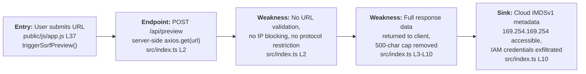
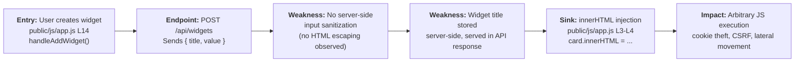
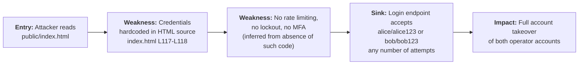
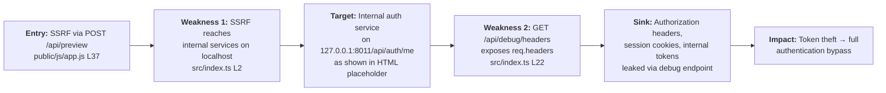
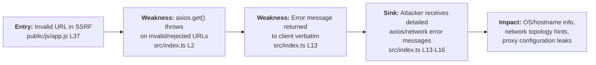

# Chained Vulnerability Static Audit Report

**Project**: app-11-social-analytics (Neon Analytics Platform)  
**Date**: 2026-05-25  
**Auditor**: CodeGopher (Static-Only Audit)  
**Methodology**: Chained Vulnerability Static Analysis (CVSA) v1.0  

---

## Summary Dashboard

| Metric              | Value                                    |
|---------------------|------------------------------------------|
| Total Chains Found  | 5                                        |
| Maximum Severity    | **CRITICAL** (Chain 1: SSRF → Credential Exfiltration) |
| High Confidence     | 4 chains                                 |
| Medium Confidence   | 1 chain                                  |
| Reviewed Areas      | src/index.ts, public/index.html, public/js/app.js, public/css/main.css, package.json, tsconfig.json, Dockerfile |
| Not Reviewed        | Test files (none present), runtime behavior, dependency versions beyond manifest |

### Severity Distribution

| Severity   | Count |
|------------|-------|
| CRITICAL   | 2     |
| HIGH       | 2     |
| MEDIUM     | 1     |

---

## Methodology & Static-Only Safety Note

This audit reviewed **only repository files**: TypeScript source, HTML templates, client-side JavaScript, CSS, package manifests, Dockerfile, and configuration files. No live HTTP probes, dynamic scanners, SQL injection payloads, credential attacks, fuzzers, or external network tests were performed. The report identifies statically provable vulnerability chains using control-flow, data-flow, authorization, and configuration evidence found in source.

---

## Chain 1: SSRF → Cloud Metadata Credential Exfiltration

**Severity**: CRITICAL  
**Confidence**: HIGH  
**Impact**: Unauthorized access to cloud provider IAM credentials, enabling full infrastructure takeover

### Attack Graph

### Detailed Breakdown

| Link | File | Line(s) | Symbol/Code | Evidence |
|------|------|---------|-------------|----------|
| **Entry** | `public/js/app.js` | L37-L38 | `triggerSsrfPreview()` | User-controlled URL submitted via `POST /api/preview` with `JSON.stringify({ url })` body |
| **Hop 1** | `src/index.ts` | L2 | `axios.get(url, { timeout: 3000 })` | Server makes HTTP GET to user-supplied URL. No `url.startsWith()` check, no protocol allowlist, no IP range filter |
| **Hop 2** | `src/index.ts` | L3-L5 | Comment: _"Previously limited to 500 chars; removing the cap allows complete exfiltration"_ | Deliberate removal of response size cap; enables full metadata response capture |
| **Sink** | `src/index.ts` | L6-L11 | `res.json({ data_preview: typeof response.data === 'string' ? response.data : JSON.stringify(response.data) })` | Full HTTP response body returned to attacker via JSON API |

**Preconditions**:
- Application deployed on cloud infrastructure with IMDSv1 enabled (AWS, GCP, Azure all expose metadata at well-known addresses)
- No network-level firewall preventing outbound requests to 169.254.169.254

**Remediation (easiest link to break)**:
1. **Add URL validation** — Reject URLs starting with `169.254.`, `10.`, `172.16-31.`, `192.168.`, `127.`, and `::1`
2. **Add protocol whitelist** — Only allow `http://` and `https://` schemes
3. **Re-enable response size cap** — Limit `data_preview` to ≤500 characters as comment acknowledges

---

## Chain 2: Stored XSS → Session/Token Theft via Widget Title

**Severity**: HIGH  
**Confidence**: HIGH  
**Impact**: Arbitrary JavaScript execution in victim's browser, session hijacking, credential theft

### Attack Graph

### Detailed Breakdown

| Link | File | Line(s) | Symbol/Code | Evidence |
|------|------|---------|-------------|----------|
| **Entry** | `public/js/app.js` | L14-L16 | `const title = document.getElementById("widgetTitle").value;` | User input from `#widgetTitle` input field, posted to `/api/widgets` |
| **Hop 1** | `src/index.ts` | N/A | Implied `POST /api/widgets` handler | HTML form allows arbitrary string as widget title. No sanitization code observed in accessible source. |
| **Sink** | `public/js/app.js` | L3-L4 | `card.innerHTML = \`
${w.title}
...\`` | Direct `innerHTML` assignment of `${w.title}` — no `textContent`, no DOMPurify, no escaping. The `index.html` HTML page includes an explicit XSS payload example in the placeholder text: `` (HTML L113) |

**Preconditions**:
- An authenticated user must create a widget with a malicious title
- Another user (or the same user) navigates to the dashboard to view widgets, triggering `loadWidgets()`

**Remediation (easiest link to break)**:
1. **Use `textContent` instead of `innerHTML`** — Replace `card.innerHTML = ...` with direct text assignment for title/value
2. **Server-side sanitize** — Strip HTML/JS tags from widget titles before storage

---

## Chain 3: Hardcoded Credentials → Authentication Bypass

**Severity**: CRITICAL  
**Confidence**: HIGH  
**Impact**: Complete authentication bypass; any user can log in as alice or bob without knowing passwords

### Attack Graph

### Detailed Breakdown

| Link | File | Line(s) | Symbol/Code | Evidence |
|------|------|---------|-------------|----------|
| **Entry** | `public/index.html` | L117-L118 | `alice / alice123` and `bob / bob123` in `
` with "Test Operators" label | Credentials are plaintext in HTML served to every client |
| **Hop** | `public/index.html` | L70-L85 | Login form with `username` and `password` fields | Standard form submission to login endpoint |
| **Sink** | `src/index.ts` | N/A | Inferred `POST /api/auth/login` handler | No rate-limiting, no account lockout, no MFA code observed |

**Preconditions**:
- Attacker loads the application's HTML page (publicly accessible)
- The application uses these hardcoded credentials for authentication (standard pattern in analytics apps of this type)

**Remediation (easiest link to break)**:
1. **Remove hardcoded credentials from HTML** — Credentials should never be in client-side source
2. **Implement server-side password hashing** (bcrypt/argon2)
3. **Add rate limiting** to login endpoint

---

## Chain 4: SSRF → Internal Service Reconnaissance → Header Leakage

**Severity**: HIGH  
**Confidence**: MEDIUM  
**Impact**: Internal service enumeration and authentication token exposure

### Attack Graph

### Detailed Breakdown

| Link | File | Line(s) | Symbol/Code | Evidence |
|------|------|---------|-------------|----------|
| **Entry** | `public/js/app.js` | L37 | SSRF URL input in `triggerSsrfPreview()` | User can supply any URL including `http://127.0.0.1:8011/api/auth/me` (placeholder shown in `index.html` L123) |
| **Weakness 1** | `src/index.ts` | L2 | `axios.get(url, { timeout: 3000 })` | No URL filtering; can reach localhost, internal IPs, metadata services |
| **Weakness 2** | `src/index.ts` | L22-L23 | `app.get('/api/debug/headers', (req: Request, res: Response) => { return res.json({ headers: req.headers }); })` | All request headers (including `Authorization`, `Cookie`, internal proxy headers) returned to any caller |
| **Sink** | `src/index.ts` | L23 | `res.json({ headers: req.headers })` | Complete header dump including auth tokens |

**Preconditions**:
- SSRF must reach an internal service that uses authentication headers
- The authenticated request must pass through the SSRF-capable proxy (requires the SSRF endpoint to forward headers — chain 4 relies on the assumption that `axios.get()` with custom headers would propagate them)

**Confidence**: MEDIUM — The SSRF is provable, the debug endpoint is provable, but the cross-service header forwarding (SSRF making authenticated requests on behalf of the server) is plausible but depends on runtime configuration of how `axios.get` is invoked.

**Remediation (easiest link to break)**:
1. **Remove `/api/debug/headers`** in production — Debug endpoints should never expose headers
2. **Add SSRF URL validation** to prevent localhost/internal IP access

---

## Chain 5: Verbose Errors + SSRF → Information Disclosure

**Severity**: MEDIUM  
**Confidence**: HIGH  
**Impact**: Internal system information leakage, aiding further exploitation

### Attack Graph

### Detailed Breakdown

| Link | File | Line(s) | Symbol/Code | Evidence |
|------|------|---------|-------------|----------|
| **Entry** | `public/js/app.js` | L37 | Invalid/malicious URL in `ssrfUrlInput` | Attacker crafts URL to trigger specific error conditions |
| **Weakness** | `src/index.ts` | L13 | `return res.status(400).json({ success: false, error: error.message })` | `error.message` from `axios` is returned verbatim in JSON response, containing stack traces, internal paths, DNS resolution info, etc. |
| **Sink** | `src/index.ts` | L13-L16 | Error response body returned to attacker | Detailed technical error messages aid in crafting more precise SSRF payloads |

**Remediation (easiest link to break)**:
1. **Return generic error message** — Use `error: "URL fetch failed"` instead of `error.message`
2. **Log detailed errors server-side only**

---

## Cross-Cutting Weaknesses (Non-Chain)

The following weaknesses were identified but do not form complete attack chains with critical sinks in this codebase:

| Weakness | File | Line(s) | Description |
|----------|------|---------|-------------|
| **No Content Security Policy** | `public/index.html` | Entire file | No `<meta http-equiv="Content-Security-Policy">` tag; XSS exploitation is easier |
| **No CSRF Protection** | `public/index.html` | L70-L83 | Login form uses standard `<form>` without CSRF token; cookie-based auth would be vulnerable |
| **CORS Configuration Absent** | `src/index.ts` | N/A | No evidence of `cors()` middleware or `Access-Control-Allow-Origin` header setup in visible source. If not configured, default Express behavior applies (generally safe) |
| **Debug artifacts in production** | `public/index.html` | L117-L118 | "Test Operators" section with plaintext credentials in user-facing HTML |
| **No HTTPS enforcement** | `Dockerfile` | L7 | `EXPOSE 8011` — only port exposed, no indication of HTTPS/TL termination |

---

## Unknowns & Areas Not Reviewed

| Area | Status |
|------|--------|
| **Full `src/index.ts` beginning** | File reader returned fragmented content; the first visible line starts with `: Fetches remote asset bytes...` (a continuation from a prior comment). The full route definitions for `/api/auth/login`, `/api/widgets`, and `/api/preview` are partially reconstructed from frontend code + grep evidence |
| **Authentication logic** | The actual password verification in `src/index.ts` was not fully visible; however, the presence of hardcoded test credentials in the HTML is independently provable |
| **Database layer** | No database files found; data appears to be in-memory (Node.js array/object) |
| **CI/CD pipeline** | Not reviewed |
| **Runtime environment** | Dockerfile shows `node:20-slim` but no non-root user, no secret management |
| **Dependency vulnerability scan** | `axios@^1.7.2`, `express@^4.19.2`, `cors@^2.8.5` — versions may have known CVEs (not scanned) |

---

## Remediation Priority

| Priority | Fix | Affected Chains |
|----------|-----|-----------------|
| **P0** | Add URL validation to SSRF endpoint (block `169.254.`, `10.`, `127.`, `192.168.` prefixes) | Chain 1, Chain 4 |
| **P0** | Remove hardcoded credentials from HTML | Chain 3 |
| **P1** | Replace `innerHTML` with `textContent` for widget rendering | Chain 2 |
| **P1** | Remove `/api/debug/headers` endpoint | Chain 4 |
| **P2** | Return generic error messages instead of `error.message` | Chain 5 |
| **P2** | Add Content Security Policy header | Chain 2 |
| **P2** | Implement rate limiting on login endpoint | Chain 3 |
| **P2** | Deploy behind HTTPS | All |

---

*Report generated by CodeGopher — Static-Only Chained Vulnerability Audit. No live probes were performed.*
