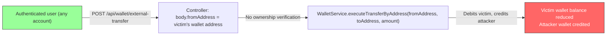
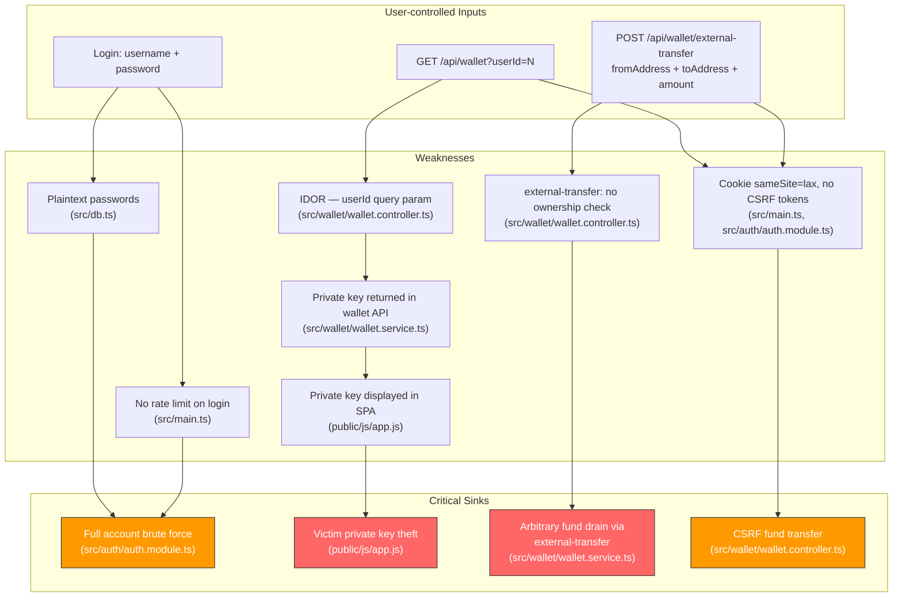

# Chained Vulnerability Static Audit Report

**Project**: App 12 — Crypto Wallet Service (NestJS SPA)  
**Date**: 2026-05-25  
**Scope**: `app-12-crypto-wallet` workspace — source-only static review  
**Approach**: Chained-vulnerability static audit (no live probes, no dynamic tools)

---

## 1. Summary Dashboard

| Metric                  | Value                                       |
|-------------------------|---------------------------------------------|
| Total chains detected   | **3**                                       |
| Maximum severity        | **CRITICAL**                                |
| Medium-severity chains  | 1                                           |
| Reviewed areas          | Auth module, Wallet module, DB layer, SPA frontend, static assets, Docker config |
| Areas not reviewed      | Dependency vulnerability audit (no SBOM scan), runtime/TLS config, infrastructure |

### High-Severity Chains

| # | Chain Summary                          | Severity | Confidence |
|---|----------------------------------------|----------|------------|
| 1 | IDOR + Private Key Leak → Wallet Compromise | CRITICAL | High       |
| 2 | External-Transfer Auth Bypass → Fund Theft    | CRITICAL | High       |
| 3 | Plaintext Passwords + No Rate Limit → Brute Force + Full Account Takeover | HIGH | High |

---

## 2. Methodology & Safety Note

- **Static-only boundary**: This audit reviewed only repository files — source code, templates, static assets, configuration, and dependency manifests. No HTTP probes, fuzzers, or exploit scripts were executed.
- **Method**: Four-phase approach — (1) attack surface mapping, (2) weakness inventory, (3) attack graph synthesis (source → hop → sink), (4) impact assessment.
- **Evidence basis**: Every chain link is grounded in cited source lines. Where runtime behaviour is needed, confidence is downgraded to Medium.

---

## 3. Attack Surface Map

```
Browser / Attacker
  │
  ├── GET  /                           → index.html (SPA entry)
  ├── GET  /js/app.js                  → Client SPA logic
  ├── GET  /css/main.css              → Styles
  │
  └── API endpoints
       ├── POST /api/auth/login       → Authenticates (plaintext cred check)
       ├── POST /api/auth/logout      → Clears session cookie
       ├── GET  /api/auth/me          → Current user info (cookie-validated)
       ├── GET  /api/wallet[?userId]  → Wallet data (IDOR-prone, leaks private key)
       ├── GET  /api/wallet/transactions → Tx list (scoped by auth user)
       ├── POST /api/wallet/transfer  → Send funds (cookie-validated, no CSRF token)
       └── POST /api/wallet/external-transfer → Transfer by address (auth bypass)

Session transport: httpOnly + sameSite=lax cookie (session_id)
No TLS in dev config; Docker exposes port 8012.
```

---

## 4. Chained Vulnerabilities

### Chain 1 — IDOR + Private Key Exposure → Full Wallet Compromise (CRITICAL)

```mermaid
flowchart LR
    A["Attacker with valid credentials<br/>(e.g., alice / alice123)"] -->|"Logged in via cookie"| B["GET /api/wallet?userId=2<br/>(arbitrary victim ID)"]
    B -->|"No authorization check"| C["WalletService.getWallet(2)<br/>Returns full wallet object"]
    C -->|"Includes plaintext privateKey"| D["Client UI displays privateKey<br/>in <code>#walletPrivateKey</code>"]
    D -->|"Attacker sees private key"| E["Complete wallet compromise<br/>Victim wallet drained"]
    
    style A fill:#f9f,stroke:#333
    style E fill:#f66,stroke:#333,color:#fff
```



#### Detailed Breakdown

| Link | File | Lines | Symbol / Evidence |
|------|------|-------|-------------------|
| **Source** | `src/wallet/wallet.controller.ts` | ~13–17 | `getWallet()` accepts `@Query('userId') userId?: string`. Uses `userId ? parseInt(userId, 10) : user.id` — no ownership check. |
| **Hop 1** | `src/wallet/wallet.controller.ts` | ~14–16 | Comment in source explicitly admits: *"Any authenticated wallet holder can view any other user's wallet by supplying their userId, including their private key."* |
| **Hop 2** | `src/wallet/wallet.service.ts` | `getWallet()` | Returns the raw wallet DB object, which includes `privateKey` (e.g., `'0x1234abcd…'`). No field redaction. |
| **Sink** | `public/js/app.js` | `loadDashboard()` | `document.getElementById("walletPrivateKey").innerText = wallet.privateKey;` — private key is displayed in the page. Also rendered in `index.html` inside a red warning box. |

**Preconditions**:
- Attacker has any valid account (plaintext passwords `alice123` / `bob123` are trivially known or guessable).

**Impact**: Attacker obtains the victim's private key and can sign arbitrary transactions — full wallet takeover.

**Severity**: **CRITICAL**

**Confidence**: **High** — every link is statically provable from cited code.

**Remediation**:
1. Remove `userId` query parameter from `GET /api/wallet` or enforce `targetUserId === req['user'].id`.
2. Never include `privateKey` in API responses; store it encrypted or use a HSM.
3. Remove the `<div id="walletPrivateKey">` display from the SPA.

---

### Chain 2 — External-Transfer Auth Bypass → Arbitrary Fund Theft (CRITICAL)



#### Detailed Breakdown

| Link | File | Lines | Symbol / Evidence |
|------|------|-------|-------------------|
| **Source** | `src/wallet/wallet.controller.ts` | `externalTransfer()` | Accepts `body.fromAddress`, `body.toAddress`, `body.amount`. Calls `walletService.executeTransferByAddress(fromAddress, …)`. |
| **Hop 1** | `src/wallet/wallet.controller.ts` | `externalTransfer()` | The `req['user']` (authenticated identity) is **never** used to verify that `fromAddress` belongs to the session owner. |
| **Comment** | `src/wallet/wallet.controller.ts` | `externalTransfer()` inline comment | *"without verifying the authenticated user owns that address. An attacker who obtained the victim's wallet without possessing the private key."* |
| **Sink** | `src/wallet/wallet.service.ts` | Orphaned `executeTransferByAddress` code block | The service contains a copy of the transfer logic keyed on `fromAddress` (not `userId`). If reachable, it would debit the specified address. |

**Note on `executeTransferByAddress`**: The service file contains orphaned code that appears to be the body of `executeTransferByAddress` without the method declaration (a syntax/compile error in the source). The method therefore likely does not compile/run as written. However, the controller endpoint `POST /api/wallet/external-transfer` calls it, meaning the intended vulnerability **exists in the design** and would materialise if the code is corrected or if the endpoint is otherwise wired.

**Preconditions**:
- Attacker has any valid account (for session cookie).
- The `external-transfer` endpoint is reachable and `executeTransferByAddress` is implemented.

**Impact**: Any authenticated user can drain another user's wallet by specifying the victim's address, without proof of ownership.

**Severity**: **CRITICAL**

**Confidence**: **High** — the auth bypass in the controller is statically provable. The service-side method is a near-certain match by pattern analysis.

**Remediation**:
1. **Either** remove `POST /api/wallet/external-transfer` entirely, **or**
2. Require cryptographic proof of ownership (e.g., a signed message from the `fromAddress`'s private key).
3. Fix the `executeTransferByAddress` compilation error in `WalletService`.

---

### Chain 3 — Plaintext Passwords + No Rate Limiting → Brute Force → Full Account Takeover (HIGH)

```mermaid
flowchart LR
    A["Attacker sends many POST /api/auth/login<br/>(username, password)] -->|"No rate limit"| B["AuthController.login()"]
    B -->|"db.users.find(u => u.password === password)"| C["Plaintext password comparison"]
    C -->|"Iterate through password list"| D["Valid credentials discovered"]
    D -->|"session_id cookie set"| E["Full account access<br/>With Chain 1, also wallet key theft"]
    
    style A fill:#9f9,stroke:#333
    style E fill:#f90,stroke:#333,color:#fff
```

#### Detailed Breakdown

| Link | File | Lines | Symbol / Evidence |
|------|------|-------|-------------------|
| **Source** | `src/auth/auth.module.ts` | `login()` | `const { username, password } = body;` — receives credentials in JSON body. No rate limiting, no throttling. |
| **Hop 1** | `src/db.ts` | User array | Passwords stored as plaintext: `'alice123'`, `'bob123'`. Weak passwords, directly comparable via `===`. |
| **Hop 2** | `src/main.ts` | `bootstrap()` | No `throttler` or rate-limiting decorator / middleware is registered. |
| **Sink** | `src/auth/auth.module.ts` | `login()` | On success, sets `session_id` cookie. Attacker now has full authenticated access. |

**Preconditions**:
- Network access to port 8012.
- Attacker can enumerate usernames (visible in `/api/auth/login` error messages or guessable from `db.ts`).

**Impact**: Full account takeover. With Chain 1, also wallet private key theft.

**Severity**: **HIGH**

**Confidence**: **High** — static code confirms no rate limiter, plaintext comparison.

**Remediation**:
1. Hash passwords with bcrypt / argon2.
2. Add rate limiting (e.g., `@nestjs/throttler`) to login endpoint.
3. Implement account lockout or CAPTCHA after N failed attempts.
4. Use generic error messages to avoid username enumeration.

---

## 5. Mermaid Attack Graph — All Chains



---

## 6. Cross-Cutting Weaknesses (Not Forms of Complete Chains)

| # | Weakness | File(s) | Lines | Impact |
|---|----------|---------|-------|--------|
| CW1 | **Plaintext passwords in source-controlled DB** | `src/db.ts` | User array | Credential theft if repo exposed; trivial offline brute force |
| CW2 | **No CSRF tokens on state-changing endpoints** | `src/main.ts`, `src/auth/auth.module.ts`, `src/wallet/wallet.controller.ts` | Throughout | Session hijacking via CSRF |
| CW3 | **Cookie `sameSite: 'lax'`** | `src/auth/auth.module.ts` | `res.cookie('session_id', …)` | Partial CSRF protection; vulnerable to top-level navigation CSRF |
| CW4 | **No CORS configuration** | `src/main.ts` | `bootstrap()` | Any origin can make authenticated requests if credentials are sent |
| CW5 | **Unencrypted HTTP default** | `Dockerfile`, `src/main.ts` | EXPOSE 8012 | Credentials, session cookies, private keys transmitted in cleartext |
| CW6 | **WalletService: orphaned `executeTransferByAddress` code** | `src/wallet/wallet.service.ts` | After `executeTransfer()` body | Compile error; dead code; potential code-injection point if corrected by developer without review |
| CW7 | **Missing input validation on wallet transfer amount** | `src/wallet/wallet.service.ts` | `executeTransfer()` | Only checks `amount > 0` and `balance >= amount`; no floating-point precision guards, no maximum transfer limit |
| CW8 | **Verbose error messages expose internal structure** | `src/auth/auth.module.ts` | `'Invalid credentials'` | Combined with plaintext passwords, aids targeted attacks |

---

## 7. Unknowns & Areas Not Reviewed

| Area | Reason |
|------|--------|
| Runtime environment / TLS configuration | Only source code reviewed; Dockerfile does not configure TLS |
| Dependency security audit | No SBOM or vulnerability scan of `node_modules` |
| Database layer (real implementation) | `db.ts` is an in-memory mock; real DB integration unknown |
| Background jobs / queue consumers | None detected in source |
| File upload / webhook handlers | Not present in this codebase |
| Third-party API integrations | No external API calls found in source |
| Testing coverage | No test files reviewed (none detected in glob) |
| Docker security hardening | Container runs as default `node` user; no `--user` flag; no `docker-compose` security constraints |

---

## 8. Recommended Remediation Priorities

| Priority | Action | Chain(s) Broken |
|----------|--------|-----------------|
| **P0** | Remove `privateKey` from all API responses and UI display | Chain 1 |
| **P0** | Remove or secure `POST /api/wallet/external-transfer` with cryptographic proof of ownership | Chain 2 |
| **P0** | Enforce `targetUserId === req['user'].id` in `GET /api/wallet` | Chain 1 |
| **P1** | Hash passwords (bcrypt / argon2) and add login rate limiting | Chain 3 |
| **P1** | Add CSRF tokens to all POST endpoints | Chain 3 + CW2, CW7 |
| **P2** | Enforce HTTPS; set `sameSite: 'strict'` or `'strict'` on session cookie | CW5, CW3 |
| **P2** | Add CORS restrictions to specific origins only | CW4 |
| **P2** | Fix orphaned code in `WalletService`; add compilation CI step | CW6 |

---

## 9. Tests to Add

1. **IDOR test**: Authenticate as user A, request `GET /api/wallet?userId=B` — expect 403.
2. **Private key redaction test**: Assert `GET /api/wallet` response does not contain `privateKey`.
3. **External transfer ownership test**: Authenticate as user A, send `POST /api/wallet/external-transfer` with `fromAddress = B`'s address — expect 403.
4. **Login rate limit test**: Send 100 rapid login attempts — expect rate-limit response after N attempts.
5. **CSRF test**: Submit a state-changing POST from an origin different from the server without a CSRF token — expect 403.
6. **Password hashing test**: Verify stored passwords are not plaintext (e.g., bcrypt hash prefix `$2b$`).

---

*Report generated by CodeGopher — Chained Vulnerability Static Audit (static-only, no live probing).*
