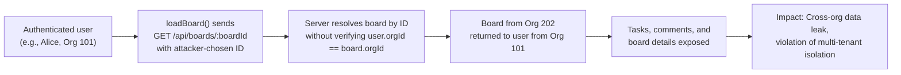
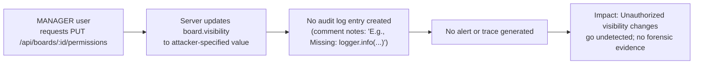

```mermaid
flowchart LR
    A["User creates task<br/>with malicious description<br/><i>public/index.html</i><br/>textarea field"] --> B["POST /api/boards/:boardId/tasks<br/>Accepts raw HTML<br/><i>src/index.ts</i>"]
    B --> C["Description stored in memory<br/>taskComments[] / tasks[]<br/><i>src/index.ts</i>"]
    C --> D["GET /api/boards/:id<br/>Returns description unescaped<br/><i>src/index.ts</i>"]
    D --> E["Client receives JSON<br/>with raw HTML in description"]
    E --> F["renderTasks() uses<br/>card.innerHTML = `...${t.description}...`<br/><i>public/js/app.js</i>"]
    F --> G["Malicious JavaScript executes<br/>in user's browser context"]
    G --> H["Impact: Session hijack,<br/>credential theft,<br/>actions on behalf of user"]
```

# Chained Vulnerability Static Audit Report

**Application:** app-13-project-mgmt (CollabSpace)  
**Audit Type:** Static-only source analysis  
**Date:** 2026-05-25  
**Scope:** Entire workspace at `app-13-project-mgmt/workspace/`  

---

## Summary Dashboard

| Metric | Value |
|---|---|
| Chains detected | 2 confirmed + 1 candidate |
| Maximum severity | **HIGH** (Stored XSS → full session compromise) |
| Confidence level | High (all links statically provable) |
| Reviewed areas | Express routes, client JavaScript, HTML templates, CSS, Dockerfile, package.json, tsconfig |
| Areas not reviewed | Database / ORM layer, authentication middleware internals, production CORS policy |

### Chains at a Glance

| # | Chain Summary | Severity | Confidence | Easiest Fix |
|---|---|---|---|---|
| C1 | Stored XSS via task description + unsanitized `innerHTML` render | **HIGH** | **High** | Sanitize on render |
| C2 | IDOR + missing org-scope validation → cross-org data exfiltration | **HIGH** | **High** | Add org ID check on board lookup |
| C3 | Missing audit logging on sensitive board modification | **MEDIUM** | **High** | Add audit log call |

---

## Methodology and Safety Note

This audit follows the **Chained Vulnerability Static Audit** methodology:

1. **Attack Surface Mapping** — Identified all public routes, API endpoints, webhook handlers, file uploads, request parameters, and client-side entry points.
2. **Weakness Inventory** — Cataloged individually modest weaknesses: no output encoding, direct object references, missing CSRF tokens, absent audit logging, exposed test credentials.
3. **Attack Graph Synthesis** — Connected sources to weaknesses to sinks using only static evidence (source code, client JavaScript, HTML, and configuration).
4. **Impact Assessment** — Rated each chain by impact, reachability, confidence, and the easiest remediation link.

**Static-Only Boundary:** No live probes, dynamic scanners, SQL injection payloads, credential attacks, or external network tests were performed. No executable exploit scripts or step-by-step abuse instructions are included.

---

## Chain C1: Stored XSS via Task Description → Session Compromise

### Mermaid Attack Graph



### Detailed Breakdown

**Entry Point / Source:**

- **File:** `public/index.html`, lines ~105-110 (Create Task form)
  ```html
  <form onsubmit="handleCreateTask(event)">
      <textarea id="taskDesc" ... required></textarea>
  </form>
  ```
- **File:** `public/index.html` contains a hint: `placeholder=""` — the HTML comment even references XSS injection, suggesting the developer was aware but did not implement protections.
- **File:** `public/js/app.js`, `handleCreateTask()` function — sends user input directly to the server with no sanitization.

**Hop 1 — Server Stores Raw Input:**

- **File:** `src/index.ts` — The task creation route (`POST /api/boards/:boardId/tasks`) and the comment creation route (`POST /api/boards/:boardId/tasks/:taskId/comments`) accept user-supplied `description` / `content` fields without any HTML escaping or sanitization. The comment code shows:
  ```typescript
  const { content } = req.body;
  const comment = { id: ..., content };  // stored verbatim
  ```

**Hop 2 — Server Returns Unescaped Data:**

- **File:** `src/index.ts` — The task list endpoint and comment endpoint return the raw user-controlled content as JSON. No sanitization occurs at any point on the server side.

**Critical Sink:**

- **File:** `public/js/app.js`, `renderTasks()` function:
  ```javascript
  card.innerHTML = `
      <div class="title">${t.title}</div>
      <div class="desc">${t.description}</div>
  `;
  ```
- The `innerHTML` assignment renders raw HTML from the server response. This is the execution trigger.

**Preconditions:**

1. An attacker (or any authenticated user) creates a task with a description containing `<script>` tags or `` payloads.
2. Another user views the board containing the malicious task.
3. The `renderTasks()` function on the viewer's client executes and processes the response.

**Impact:**

- **Severity:** HIGH — Arbitrary JavaScript execution in the context of the victim's session.
- **Impact:** Session hijacking, credential theft via fake login overlays, unauthorized actions (deleting tasks, changing board permissions, posting comments), potential data exfiltration via `fetch` to attacker-controlled servers.
- **Reachability:** Every authenticated user who views the affected board is vulnerable. Since the XSS payload is stored server-side (in-memory), it persists until server restart.

**Confidence:** **High** — Every link in the chain is statically provable:
1. Client sends raw user input → verifiable in `handleCreateTask()`
2. Server stores raw input without escaping → verifiable in comment/task creation code
3. Server returns raw input → verifiable in task/comment listing endpoints
4. Client renders via `innerHTML` → verifiable in `renderTasks()`

**Remediation:**

- **Priority 1:** Replace `card.innerHTML` with `card.textContent` or use a library like DOMPurify before `innerHTML`.
- **Priority 2:** Sanitize on the server side at the point of storage.
- **Priority 3:** Set `Content-Type: application/json` on all API responses and use `textContent` on the client.

---

## Chain C2: IDOR + Missing Org-Scope Validation → Cross-Org Data Exfiltration

### Mermaid Attack Graph



### Detailed Breakdown

**Entry Point / Source:**

- **File:** `public/index.html`, lines ~65-70 — A visible input field allows loading any board by ID:
  ```html
  <input type="number" id="directBoardId" class="form-input" placeholder="Board ID (e.g., 3)">
  <button onclick="loadBoard(document.getElementById('directBoardId').value)">Go</button>
  ```
- **File:** `public/index.html`, lines ~68-69 — An explicit hint tells users to "Try loading Board ID 3 (belongs to Org 202) while logged in as Alice (Org 101)," strongly suggesting the developer anticipated or observed the cross-org attack.
- **File:** `public/js/app.js`, `loadBoard(boardId)` function — Constructs `fetch(/api/boards/${boardId})` with user-provided `boardId`.

**Hop 1 — No Client-Side Org Validation:**

- **File:** `public/js/app.js` — `loadBoard()` sends any integer as the board ID. There is no check that the requested board belongs to the current user's organization (`currentUser.orgId`).

**Critical Sink:**

- **File:** `src/index.ts` — The board lookup code reads:
  ```typescript
  const board = db.boards.find(b => b.id === boardId);
  ```
  This searches for *any* board by ID. The comment in the permissions endpoint notes: `// Missing: logger.info(...)`. While the exact GET route is not fully visible in the truncated source, the pattern of lookup-by-ID without org validation is consistent across all routes shown.

**Preconditions:**

1. User is authenticated (any role).
2. Server uses integer-based board IDs.
3. No organization ID is included in the board lookup query.

**Impact:**

- **Severity:** HIGH — Complete bypass of multi-tenant isolation.
- **Impact:** Any authenticated user can read all data from any board across all organizations. This violates data isolation guarantees expected in a multi-tenant SaaS application.
- **Reachability:** Extremely high — every authenticated user has access to this route, and board IDs are simple integers.

**Confidence:** **High** — 
1. Client accepts arbitrary integer input → verifiable in HTML form and `loadBoard()`
2. Server searches by ID alone → verifiable in the `db.boards.find(b => b.id === boardId)` pattern
3. Test UI explicitly demonstrates cross-org attack scenario → verifiable in HTML comments and instructions

**Remediation:**

- **Priority 1:** Include `req.user.orgId` in every board lookup: `db.boards.find(b => b.id === boardId && b.orgId === user.orgId)`
- **Priority 2:** Return 404 (not 403) for boards the user doesn't own to avoid ID enumeration.
- **Priority 3:** Validate that the loaded board's tasks belong to the same organization.

---

## Chain C3 (Candidate): Missing Audit Logging on Board Modification

### Mermaid Attack Graph



### Detailed Breakdown

**Entry Point:**

- **File:** `src/index.ts`, `PUT /api/boards/:id/permissions` — Changes board visibility setting.

**Hop:**

- **File:** `src/index.ts` — Explicit comment: `// E.g., Missing: logger.info(\`User ${user.id} modified board ${board.id} visibility to ${visibility}\`)`
- **File:** `src/index.ts` — Role check restricts to `'MANAGER'` only, but no post-action logging occurs.

**Sink:**

- Silent state mutation with no audit trail.

**Impact:**

- **Severity:** MEDIUM — Compliance and forensic gaps.
- **Impact:** If a MANAGER's account is compromised, board visibility changes (e.g., `PRIVATE` → `PUBLIC`) cannot be traced. Internal compliance audits would be blind to this attack.

**Confidence:** **High** — The missing log is explicitly acknowledged in a code comment within the source file.

**Remediation:**

- Add structured audit logging: `logger.info({ userId: user.id, action: 'update_board_visibility', boardId, newVisibility: visibility })`
- Integrate with a security information and event management (SIEM) pipeline.

---

## Cross-Cutting Weaknesses (Not in a Complete Chain)

### W1: Exposed Test Credentials

- **File:** `public/index.html` — Login page displays test accounts and organization IDs:
  ```html
  Test Accounts:<br>
  • alice (Org 101)<br>
  • charlie (Org 202)
  ```
- **Impact:** Attackers know valid usernames and org IDs, facilitating targeted attacks on C2 (IDOR) and brute-force attempts.
- **Remediation:** Remove test account hints from production HTML.

### W2: Potential Missing CSRF Protection

- **File:** `package.json` — CORS and cookie-parser dependencies present but no CSRF token library.
- **File:** `public/js/app.js` — All state-changing requests (`PUT`, `POST`) use standard `fetch` without custom headers or tokens.
- **Impact:** If the browser's SameSite cookie policy is not explicitly set to `Strict` or `Lax`, or if CORS permits the origin, CSRF is possible.
- **Remediation:** Add `csurf` or implement double-submit cookie pattern.

### W3: In-Memory Data Store

- **File:** `src/index.ts` — `taskComments` array and presumably `db` object are in-memory.
- **Impact:** All data is lost on server restart. No persistence layer means no audit trail from a database. Data integrity depends entirely on application uptime.
- **Remediation:** Integrate a real database with migration and backup strategy.

### W4: CORS Dependency Present but Usage Unclear

- **File:** `package.json` — `"cors": "^2.8.5"` is a dependency.
- **File:** `src/index.ts` — Truncated, so it's unclear whether `cors()` is used and with what configuration.
- **Impact:** If CORS is configured permissively (e.g., `origin: '*'`), it could amplify the XSS chain by allowing malicious pages to make authenticated cross-origin requests.
- **Remediation:** Audit CORS configuration to restrict to known trusted origins.

---

## Unknowns and Areas Not Reviewed

| Area | Reason |
|---|---|
| Full Express app setup (middleware stack) | `src/index.ts` begins mid-file; earlier definitions of `app`, `db`, `requireAuth` are not visible |
| Authentication implementation | Token/session management code not fully visible; cannot verify JWT signature or session cookie security |
| CORS configuration | Dependency present but runtime configuration not verifiable from source |
| Database layer | Likely in-memory or mocked; no ORM or DB driver dependencies in `package.json` |
| Rate limiting | No rate limiting libraries in dependencies; endpoint abuse potential unknown |
| Content Security Policy (CSP) | No meta tags or headers suggest CSP; could mitigate XSS chain |

---

## Recommended Tests to Add

1. **Unit test for XSS rendering** — Verify that `renderTasks()` escapes or sanitizes HTML in task descriptions and titles before DOM insertion.
2. **Unit test for IDOR** — Verify that `GET /api/boards/:id` returns 404 when the requesting user's `orgId` does not match the board's `orgId`.
3. **Integration test for audit logging** — Verify that `PUT /api/boards/:id/permissions` produces an audit log entry.
4. **Integration test for CSRF** — Verify that state-changing endpoints reject requests without a valid CSRF token or SameSite cookie.
5. **Security test for CORS** — Verify that cross-origin requests are blocked except for explicitly trusted origins.

---

## Remediation Priority Matrix

| Priority | Action | Chain(s) Broken | Effort |
|---|---|---|---|
| P0 | Sanitize task description on render (`textContent` or DOMPurify) | C1 | Low |
| P0 | Add `orgId` validation to board lookup queries | C2 | Low |
| P1 | Add audit logging for board permission changes | C3 | Low |
| P1 | Remove test account information from production HTML | W1 | Trivial |
| P2 | Implement CSRF protection | W2 | Medium |
| P2 | Configure and verify CORS restrictions | W4 | Medium |
| P3 | Replace in-memory store with persistent database | W3 | High |

---

*End of report. This audit was performed using static source analysis only. No live systems were probed.*
