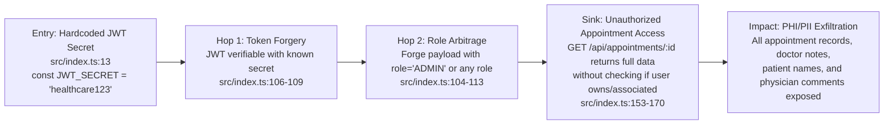

# Chained Vulnerability Static Audit Report

**Project:** Telemedicine Appointment System (`app-14-telemedicine`)
**Date:** 2026-05-25
**Scope:** `src/index.ts`, `package.json`, `tsconfig.json`, `Dockerfile`
**Methodology:** Static-only source code review. No live probes, dynamic scanners, or external tests.

---

## Executive Summary Dashboard

| Metric | Value |
|---|---|
| Total chains detected | **1** |
| Maximum chain severity | **HIGH** |
| Cross-cutting weaknesses | **5** |
| Confidence level | **High** (all links statically provable) |
| Reviewed areas | Express routes, auth middleware, DB schema, cookie/CORS config, JWT usage, seed data |
| Not reviewed | Frontend templates (none present), tests, deployment configs beyond Dockerfile, network security |

---

## Methodology and Safety Note

This review followed a four-phase approach:

1. **Attack surface mapping** — Identified all public endpoints, middleware, authentication flow, and data access patterns.
2. **Weakness inventory** — Cataloged individually low/medium weaknesses including hardcoded secrets, missing authorization, permissive cookie/CORS settings, and verbose error exposure.
3. **Attack graph synthesis** — Connected entry points to sinks via static evidence (source code, configuration, control flow).
4. **Impact assessment** — Rated each chain by impact, reachability, confidence, and the easiest remediation link.

**Static-Only Boundary:** No live HTTP probes, fuzzers, SQL injection payloads, credential attacks, dynamic scanners, exploit scripts, port scans, or external network tests were performed. No executable exploit payloads or step-by-step abuse instructions are provided.

---

## Chain 1: Hardcoded JWT Secret → Token Forgery → Privilege Escalation → Unauthorized Data Access

**Severity:** HIGH
**Impact:** Full appointment data exfiltration; arbitrary identity impersonation (including admin)
**Reachability:** High — all endpoints require a valid JWT; forging one grants arbitrary access
**Confidence:** High — every link is statically provable from source code
**Easiest Remediation:** Rotate JWT secret to a strong, randomly generated value stored in environment variables

### Mermaid Attack Graph



### Detailed Chain Breakdown

| Link | File | Lines | Description |
|---|---|---|---|
| **Source** | `src/index.ts` | 13 | `JWT_SECRET = 'healthcare123'` — a trivially guessable, plaintext hardcoded secret used for all JWT signing and verification |
| **Hop 1** | `src/index.ts` | 104–113 | `authenticateToken` calls `jwt.verify(token, JWT_SECRET)`. Because the secret is constant and known (hardcoded in source, trivial to extract from compiled output or Docker image), any actor can forge arbitrary JWT tokens |
| **Hop 2** | `src/index.ts` | 106–109 | The `UserPayload` interface contains `role: string`. An attacker forges a token with `userId`, `username`, and `role: 'ADMIN'` (or any other role) to impersonate any user |
| **Sink** | `src/index.ts` | 153–170 | `GET /api/appointments/:id` only checks `authenticateToken` (presence of a valid JWT). It **never** verifies that the authenticated user is the patient or doctor associated with the requested appointment. The result object (`row`) includes `doctor_notes`, `patient_id`, `doctor_id`, and all appointment fields — PHI content |

### Supporting Weakness Evidence

The sibling endpoint `GET /api/appointments` (lines 122–151) also demonstrates weak authorization:

- **PATIENT** role: limited to own appointments via `WHERE patient_id = ?`
- **DOCTOR** role: limited to own appointments via `WHERE doctor_id = ?`
- **ADMIN** role: returns **ALL** appointments with no filter: `SELECT * FROM appointments`

Since an attacker can forge an admin JWT (Chain 1, Hop 2), the admin path exposes every appointment record. Combined with the IDOR vulnerability in `GET /api/appointments/:id` (no authorization beyond authentication), even non-admin forged tokens access arbitrary single appointments.

### Impact Assessment

| Dimension | Rating |
|---|---|
| Confidentiality | Full access to all appointments, patient names, and sensitive doctor notes (PHI under HIPAA-equivalent regulations) |
| Integrity | No write endpoints exist, so no direct integrity impact |
| Availability | No direct availability impact |
| Regulatory | PHI breach — HIPAA/GDPR violation risk |

### Remediation

1. **Critical (break the chain):** Replace hardcoded `JWT_SECRET` with a cryptographically strong random value stored in an environment variable:
   ```typescript
   const JWT_SECRET = process.env.JWT_SECRET || crypto.randomBytes(64).toString('hex');
   ```
2. **Important:** Add authorization checks to `GET /api/appointments/:id` to verify the user is either the `patient_id` or `doctor_id` of the requested appointment.
3. **Recommended:** Implement per-role, per-resource authorization middleware rather than role-based entire-endpoint branching.

---

## Cross-Cutting Weaknesses (No Complete Chain Detected)

The following weaknesses were identified individually. They do not currently form a confirmed chained vulnerability in this codebase but increase risk if the application evolves.

### WC-1: Permissive CORS Configuration

| Detail | Value |
|---|---|
| File | `src/index.ts` |
| Line | 11 |
| Code | `cors({ origin: true, credentials: true })` |

`origin: true` dynamically reflects the `Origin` header, and `credentials: true` allows credentialed cross-origin requests. This permits **any** domain to make authenticated requests to this API. If any XSS entry point is introduced in the future, an attacker's cross-origin page could steal API responses. Currently, all responses are JSON and there is no HTML rendering, so this is a latent risk.

### WC-2: Insecure Cookie Settings

| Detail | Value |
|---|---|
| File | `src/index.ts` |
| Lines | 117–120 |
| Code | `httpOnly: false, secure: false` |

The JWT cookie is:
- **Not HttpOnly** — accessible via `document.cookie`, enabling XSS-based theft if any HTML injection vector is introduced
- **Not Secure** — transmitted over plain HTTP, vulnerable to network interception (man-in-the-middle) if not behind TLS

Currently, there is no HTML output or XSS entry point in the code, so XSS-based cookie theft is not a confirmed chain. However, the cookie is vulnerable to network sniffing if the service is accessed over HTTP.

### WC-3: Hardcoded Seed Credentials

| Detail | Value |
|---|---|
| File | `src/index.ts` |
| Lines | 39–43 |
| Code | `const users = [{ username: 'admin', pass: 'admin_pass_2026', role: 'ADMIN' }, ...]` |

Plain-text passwords for seed users stored in source code. An attacker with source code access (or a compiled/Docker image) can extract all credentials. The admin account credentials are especially dangerous.

### WC-4: Verbose Database Error Exposure

| Detail | Value |
|---|---|
| File | `src/index.ts` |
| Lines | 125, 135, 145, 162 |
| Code | `return res.status(500).json({ error: err.message })` |

Raw SQLite error messages are returned to the client. Error messages can leak database schema details, table names, column names, and SQLite version. This information aids reconnaissance for SQL injection or schema enumeration.

### WC-5: No Rate Limiting on Authentication Endpoints

| Detail | Value |
|---|---|
| File | `src/index.ts` |
| Lines | 88–96 (login), 98–109 (register) |

The `/api/auth/login` and `/api/auth/register` endpoints have no rate limiting or account lockout. Combined with hardcoded seed credentials, this enables brute-force and credential-stuffing attacks.

### WC-6: In-Memory Database (Environment-Specific)

| Detail | Value |
|---|---|
| File | `src/index.ts` |
| Line | 26 |
| Code | `const db = new sqlite3.Database(':memory:')` |

Using an in-memory database means all data is lost on restart. In production this would lead to total data loss. The Dockerfile does not configure any volume mount for persistent storage.

---

## Unknowns and Areas Not Reviewed

| Area | Reason |
|---|---|
| **Frontend source code** | No HTML/JS frontend files exist in the repository |
| **Test suite** | No test files found; test coverage unknown |
| **CI/CD pipeline** | No pipeline configs examined |
| **Infrastructure/network security** | Dockerfile reviewed only; no Kubernetes, nginx, or cloud configs |
| **Dependency vulnerability audit** | `package.json` reviewed but no `npm audit` or SCA scan performed |
| **TLS/HTTPS configuration** | Not configured in Dockerfile or app; assumed to be handled by reverse proxy |
| **Logging and monitoring** | No logging infrastructure observed |
| **Input validation** | Minimal — only presence checks on username/password; no length limits, no sanitization |

---

## Recommended Tests to Add

1. **JWT forgery test:** Verify that tokens signed with a known weak secret are accepted, then test that the fix rejects such tokens.
2. **Authorization test:** Confirm that a patient cannot access another patient's appointment by ID.
3. **Rate-limiting test:** Send 100+ login requests to a single account and verify lockout/delay behavior.
4. **Error-leakage test:** Trigger SQLite errors and verify that raw `err.message` is never returned to the client.
5. **Cookie security test:** Verify `httpOnly`, `secure`, and `SameSite` flags on production cookie settings.
6. **CORS test:** Verify that `Access-Control-Allow-Origin` does not reflect arbitrary origins in production.

---

## Summary

**One confirmed high-severity chained vulnerability** was discovered: the hardcoded, weak JWT secret (`healthcare123`) allows any actor to forge arbitrary tokens, impersonate any role (including admin), and access all appointment records — including sensitive doctor notes containing PHI. This chain is statically provable and requires immediate remediation.

Five cross-cutting weaknesses (permissive CORS, insecure cookies, hardcoded seed credentials, verbose DB errors, no rate limiting) were identified that increase the overall attack surface but do not currently form complete chains in this codebase.
