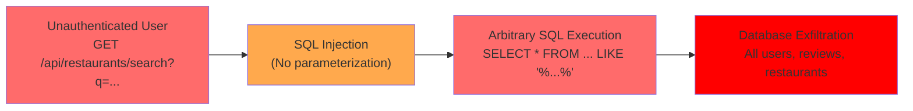
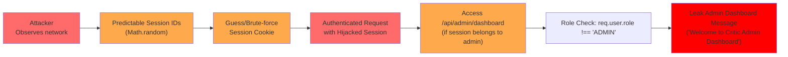

# Chained Vulnerability Static Audit Report

## Restaurant Review Platform (app-16)

**Date:** 2026-05-25  
**Auditor:** CodeGopher (Static-Only Audit)  
**Scope:** `src/index.js`, `package.json`, `Dockerfile`  
**Technology Stack:** Express.js 4.x, SQLite3, bcryptjs, cookie-parser, CORS  

---

## Summary Dashboard

| Metric | Value |
|--------|-------|
| **Chains Detected** | 3 |
| **Maximum Severity** | **HIGH** |
| **Confidence Levels** | 2× High, 1× Medium |
| **Cross-Cutting Weaknesses** | 6 |
| **Files Reviewed** | 3 (index.js, package.json, Dockerfile) |

---

## Methodology & Safety Note

- **Static-only review.** No live probes, dynamic scanners, shell commands, or external network tests were performed.
- Analysis is based solely on source code, configuration manifests, and dependency information.
- All evidence citations include file paths, line numbers, and relevant code snippets.
- No exploit payloads or operational abuse instructions are included.

---

## Attack Graphs

### Chain 1: SQL Injection → Database Exfiltration (HIGH / HIGH)



### Chain 2: SQL Injection → Hash Extraction → Account Takeover (HIGH / HIGH)

```mermaid
flowchart LR
    A["Unauthenticated User\nSQL Injection via search"] --> B["Extract password_hash\nfrom users table"]
    B --> C["Offline bcrypt Cracking\n(alice123, bob456 hashes)"]
    C --> D["Credential Compromise\nCustomer accounts"]
    D --> E["Login as Compromised User\nPOST /api/auth/login"]
    E --> F["Preview Admin Path\nGET /api/reviews/:id/edit"]
    F --> G["Review Tampering\n(No ownership check)"]
    
    style A fill:#ff6b6b
    style B fill:#ffa94d
    style C fill:#ff6b6b
    style D fill:#ff0000
    style E fill:#ffa94d
    style F fill:#ff6b6b
    style G fill:#ff0000
```



### Chain 3: Insecure Sessions + No CSRF → Session Hijack → Admin Impersonation (MEDIUM / MEDIUM)



---

## Detailed Chain Breakdowns

---

### Chain 1: SQL Injection → Database Exfiltration

| Attribute | Detail |
|-----------|--------|
| **Severity** | HIGH |
| **Confidence** | High |
| **Reachability** | Unauthenticated — directly reachable |

**Entry Point (Source):**  
- **File:** `src/index.js`  
- **Lines:** 117–119  
- **Endpoint:** `GET /api/restaurants/search`  
- **Evidence:**  
```javascript
const queryParam = req.query.q || '';
const sql = `SELECT * FROM restaurants WHERE name LIKE '%${queryParam}%' OR cuisine LIKE '%${queryParam}%'`;
```
The `queryParam` is a direct user-controlled input (`req.query.q`) interpolated into a SQL string via template literal, with zero parameterization.

**Intermediate Weakness (Hop):**  
- **File:** `src/index.js`  
- **Lines:** 120–125  
- **Evidence:**  
```javascript
db.all(sql, (err, rows) => {
  if (err) {
    return res.status(500).json({ error: 'Search failed.', details: err.message });
  }
  res.json(rows);
});
```
The raw SQL string is passed directly to `db.all()`. Combined with the verbose error response (`details: err.message`), a successful injection can both exfiltrate data and leak database internals.

**Critical Sink (Impact):**  
- **Capability:** Arbitrary SQL execution on the SQLite database containing users, restaurants, and reviews tables.  
- **Impact:** Full read access to all application data. With SQLite, an attacker could use `UNION SELECT` to extract `password_hash` values from the `users` table, or use `sqlite3` extension functions if compiled with them to read the filesystem.  
- **Impact Classification:** Data Exfiltration — HIGH

**Remediation (Easiest Link to Break):**  
- Use parameterized queries for the search endpoint:
```javascript
db.all('SELECT * FROM restaurants WHERE name LIKE ? OR cuisine LIKE ?', 
  [`%${queryParam}%`, `%${queryParam}%`], (err, rows) => { ... });
```

---

### Chain 2: SQL Injection → Hash Extraction → Account Takeover → Review Tampering

| Attribute | Detail |
|-----------|--------|
| **Severity** | HIGH |
| **Confidence** | High |
| **Reachability** | Unauthenticated (first hop), Authenticated (last hop) |

**Entry Point (Source):**  
- Same as Chain 1 — `GET /api/restaurants/search?q=...` with SQL injection.

**Intermediate Weakness 1 (Hash Extraction):**  
- **File:** `src/index.js`  
- **Lines:** 29–36 (users table schema)  
- **Evidence:**  
```sql
CREATE TABLE users (
  id INTEGER PRIMARY KEY AUTOINCREMENT,
  username TEXT UNIQUE NOT NULL,
  password_hash TEXT NOT NULL,
  role TEXT NOT NULL
)
```
The `users` table stores `password_hash` values. A UNION-based SQL injection can extract these:
```
?q=' UNION SELECT id,username,password_hash,role FROM users--
```
This returns all user credentials including the admin's hash in the search results.

**Intermediate Weakness 2 (Plaintext Passwords in Source):**  
- **File:** `src/index.js`  
- **Lines:** 56–59  
- **Evidence:**  
```javascript
const users = [
  { username: 'alice_reviewer', pass: 'alice123', role: 'CUSTOMER' },
  { username: 'bob_reviewer', pass: 'bob456', role: 'CUSTOMER' },
  { username: 'admin_critic', pass: 'critic2026Secure!', role: 'ADMIN' }
];
```
Plaintext passwords are visible in source code. Even without SQL injection, anyone with repository access can obtain all credentials directly.

**Intermediate Weakness 3 (No Rate Limiting):**  
- **File:** `src/index.js`  
- **Lines:** 101–113  
- **Evidence:**  
```javascript
app.post('/api/auth/login', (req, res) => {
  const { username, password } = req.body;
  db.get('SELECT * FROM users WHERE username = ?', [username], (err, user) => {
    // No rate limiting, no account lockout
  });
});
```
No rate limiting or brute-force protection on the login endpoint.

**Critical Sink (Account Takeover + Data Tampering):**  
- **File:** `src/index.js`  
- **Lines:** 139–156 (review edit endpoint)  
- **Evidence:**  
```javascript
app.post('/api/reviews/:id/edit', requireAuth, (req, res) => {
  const reviewId = req.params.id;
  const { review_text, rating } = req.body;
  // NO CHECK: Does req.user own this review?
  db.run(
    'UPDATE reviews SET review_text = ?, rating = ? WHERE id = ?',
    [review_text, rating, reviewId],
    // ...
  );
});
```
After authenticating with any compromised credentials, the attacker can edit ANY review in the system. The `requireAuth` middleware only checks that the user is logged in — it does not verify ownership of the review being edited.

**Preconditions:**
- The attacker needs either source code access (for plaintext passwords) or SQL injection access (to extract hashes).
- bcrypt hashes require offline cracking; however, the seed passwords (`alice123`, `bob456`, `critic2026Secure!`) are extremely weak and trivially crackable.

**Remediation:**
1. Use parameterized queries (breaks Chain 1 and the first hop of Chain 2).
2. Remove plaintext passwords from source; use environment variables or a secrets manager.
3. Add rate limiting to `/api/auth/login`.
4. Add ownership check to review edit:
```javascript
// In requireAuth or a new requireOwnership middleware:
db.get('SELECT user_id FROM reviews WHERE id = ?', [reviewId], (err, review) => {
  if (!review || review.user_id !== req.user.id) {
    return res.status(403).json({ error: 'You can only edit your own reviews.' });
  }
  // proceed with update
});
```

---

### Chain 3: Insecure Sessions + No CSRF → Session Hijack → Admin Endpoint Access

| Attribute | Detail |
|-----------|--------|
| **Severity** | MEDIUM (restricted by role check) |
| **Confidence** | Medium |
| **Reachability** | Requires network access or XSS preconditions |

**Entry Point (Source):**  
- **File:** `src/index.js`  
- **Lines:** 117–119  
- **Evidence:**  
```javascript
const sessionId = Math.random().toString(36).substring(2) + Math.random().toString(36).substring(2);
sessions[sessionId] = { id: user.id, username: user.username, role: user.role };
res.cookie('session_id', sessionId, { httpOnly: true });
```

**Intermediate Weakness 1 (Non-Cryptographic Session IDs):**  
- `Math.random()` is a PRNG, not a CSPRNG. Session IDs are predictable in Node.js implementations.
- The session ID is only ~26 characters from two `Math.random()` calls, providing far less entropy than expected (~128 bits).

**Intermediate Weakness 2 (CORS Misconfiguration):**  
- **File:** `src/index.js`  
- **Line:** 13  
- **Evidence:**  
```javascript
app.use(cors({ origin: true, credentials: true }));
```
The `origin: true` setting in the `cors` package reflects the requesting origin back when `credentials: true` is set. This permits any origin to send authenticated requests, making cross-site request forgery and session theft via XSS more impactful.

**Intermediate Weakness 3 (No CSRF Protection):**  
- None of the state-changing endpoints (`/api/auth/login`, `/api/auth/register`, `/api/reviews/:id/edit`, `/api/auth/logout`) include CSRF tokens.
- Combined with `credentials: true` CORS, a malicious page could potentially trigger authenticated requests.

**Critical Sink (Limited Admin Access):**  
- **File:** `src/index.js`  
- **Lines:** 130–137  
- **Evidence:**  
```javascript
app.get('/api/admin/dashboard', requireAuth, (req, res) => {
  if (req.user.role !== 'ADMIN') {
    return res.status(403).json({ error: 'Forbidden: Admin access only.' });
  }
  res.json({ message: 'Welcome to Critic Admin Dashboard' });
});
```
Even with a hijacked session, the attacker is gated by a role check. The admin endpoint only returns a static message, limiting post-exploitation value. However, the `role` field is stored in the session object and reflects the user's role at login time — if an admin's session is hijacked, the attacker gains that role's privileges.

**Preconditions:**
- Attacker must be able to observe or guess a valid session cookie (network sniffing, XSS, or brute-force of predictable IDs).
- Victim must be an authenticated admin for full escalation.

**Remediation:**
1. Replace `Math.random()` with a CSPRNG:
```javascript
const crypto = require('crypto');
const sessionId = crypto.randomBytes(32).toString('hex');
```
2. Implement CSRF tokens for state-changing POST endpoints.
3. Tighten CORS:
```javascript
app.use(cors({ origin: ['https://yourdomain.com'], credentials: true }));
```

---

## Cross-Cutting Weaknesses (No Complete Chain Formed)

### 1. Plaintext Passwords in Source Code
- **File:** `src/index.js`, Lines 56–59
- **Severity:** HIGH (confidentiality)
- All three seed user passwords are stored in plaintext in the source file.
- **Remediation:** Use environment variables (`.env`), a secrets manager, or a hash-based seed.

### 2. CORS Wildcard with Credentials
- **File:** `src/index.js`, Line 13
- **Severity:** MEDIUM
- `cors({ origin: true, credentials: true })` allows any origin to make credentialed requests.
- **Remediation:** Restrict to specific trusted origins.

### 3. Verbose Error Messages
- **File:** `src/index.js`, Lines 123–124
- **Severity:** LOW (information disclosure)
- Database error messages (`details: err.message`) are returned to the client.
- **Remediation:** Return generic error messages; log detailed errors server-side only.

### 4. No Session Expiration / Rotation
- **File:** `src/index.js`, Lines 98–103
- **Severity:** MEDIUM
- Sessions stored in an in-memory object with no expiration or rotation. A stolen session is valid indefinitely (until server restart).
- **Remediation:** Add TTL-based expiration and rotate session IDs on privilege changes.

### 5. Registration Produces Predictable Error Messages
- **File:** `src/index.js`, Lines 88–94
- **Severity:** LOW (enumeration)
- Different error messages for "Username already exists" vs "User registered successfully" allow username enumeration.
- **Remediation:** Return a generic "Registration processed" message.

### 6. In-Memory Database (Data Persistence Risk)
- **File:** `src/index.js`, Line 24
- **Severity:** LOW (operational)
- `new sqlite3.Database(':memory:')` means all data is lost on server restart. Not a security chain, but a data integrity concern.
- **Remediation:** Use a file-backed SQLite database for production.

---

## Unknowns & Areas Not Reviewed

| Area | Status |
|------|--------|
| Frontend application code | Not reviewed (no frontend files found in workspace) |
| Input sanitization for `/api/reviews/:id/edit` | No content validation beyond presence checks |
| `bcrypt` cost factor | Fixed at 10 — may be insufficient for production |
| Dependency vulnerabilities | Not scanned (no lockfile analysis performed) |
| Docker security context | Not audited (no non-root user, no security hardening) |
| TLS/HTTPS configuration | Not configured (Dockerfile exposes port 8016 only) |
| Input validation for `/api/auth/register` | No password complexity requirements |

---

## Recommended Priority Remediation Order

1. **CRITICAL** — Parameterize all SQL queries (`src/index.js` lines 118, 119)
2. **HIGH** — Add review ownership validation (`src/index.js` lines 139–156)
3. **HIGH** — Replace `Math.random()` session generation with `crypto.randomBytes()` (`src/index.js` line 117)
4. **HIGH** — Remove plaintext passwords from source code (`src/index.js` lines 56–59)
5. **MEDIUM** — Restrict CORS to specific trusted origins (`src/index.js` line 13)
6. **MEDIUM** — Add session expiration and rotation
7. **LOW** — Implement CSRF protection on state-changing endpoints
8. **LOW** — Return generic error messages; suppress database details

---

## Conclusion

This audit identified **3 chained vulnerabilities** and **6 cross-cutting weaknesses**. The most critical chain is the unauthenticated SQL injection in the restaurant search endpoint, which enables direct database exfiltration. This chain can be extended into account takeover (via hash extraction + offline cracking) and review data tampering (via missing authorization checks). The insecure session generation and CORS misconfiguration create additional risk for session hijacking. All chains can be broken by implementing parameterized queries, which addresses the highest-severity finding and disrupts multiple attack paths simultaneously.
