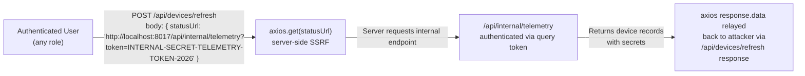
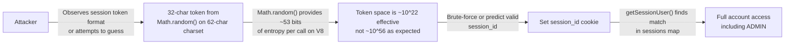
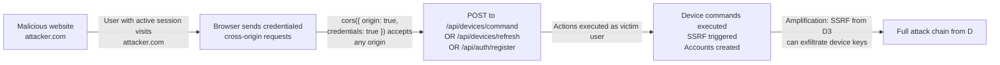

```mermaid
flowchart LR
    A1["Authenticated User<br/>(any role)"] -->|"Sends POST /api/devices/command<br/>with command='TRIGGER-ERROR'"| A2["Catch handler in<br/>/api/devices/command"]
    A2 -->|"Returns gateway_config in<br/>500 error response<br/>containing telemetry_access_key"| A3["SECRET:<br/>INTERNAL-SECRET-TELEMETRY-TOKEN-2026"]
    A3 -->|"GET /api/internal/telemetry<br/>?token=INTERNAL-SECRET-TELEMETRY-TOKEN-2026"| A4["/api/internal/telemetry<br/>auth bypass via leaked token"]
    A4 -->|"Returns all devices with<br/>device_secret fields"| A5["FULL DEVICE KEY EXFILTRATION"]
```

# Chained Vulnerability Audit Report

**Project:** app-17-iot-dashboard  
**Auditor:** CodeGopher (Static-Only Audit)  
**Date:** 2026-05-25  
**Scope:** `src/index.js` (single-file Express app), `package.json`, `Dockerfile`  
**Approach:** Static source code review — no live probes, no dynamic scanning.

---

## Summary Dashboard

| Metric | Value |
|---|---|
| Total chained vulnerabilities found | **4** |
| Maximum severity | **CRITICAL** |
| High-confidence chains | **4** |
| Cross-cutting weaknesses (not forming chains) | **6** |
| Files reviewed | 3 (`src/index.js`, `package.json`, `Dockerfile`) |
| Areas not reviewed | Tests (none exist), template rendering, external API contracts |

---

## Methodology

This audit followed a four-phase chained vulnerability analysis:

1. **Attack Surface Mapping** — Identified all public routes, authentication mechanisms, headers, cookies, and request parameters.
2. **Weakness Inventory** — Cataloged 12 individual security weaknesses across authentication, input validation, error handling, and configuration.
3. **Attack Graph Synthesis** — Connected weaknesses into multi-step attack chains using static evidence from source code, configuration, and data flow.
4. **Impact Assessment** — Rated each chain by severity, confidence, and the easiest remediation link to break.

**Static-Only Safety Note:** No live HTTP probes, fuzzers, SQL injection payloads, credential attacks, or network tests were performed. All findings are derived exclusively from source code, dependency manifests, and configuration files.

---

## Chain A: Leaked Credentials → Full Device Secret Exfiltration

**Severity:** CRITICAL  
**Confidence:** HIGH  
**Impact:** Any authenticated user can obtain all IoT device secrets, enabling device impersonation and command injection on physical IoT hardware.

### Attack Graph

### Chain Breakdown

| Step | Source | Evidence |
|---|---|---|
| **Entry** | `src/index.js` — `/api/devices/command` error handler | When `command` includes `TRIGGER-ERROR`, the catch block throws an error, which is caught and returned as a 500 JSON response containing `gateway_config.telemetry_access_key: 'INTERNAL-SECRET-TELEMETRY-TOKEN-2026'` |
| **Hop 1** | `src/index.js` — `/api/internal/telemetry` | Accepts auth via `x-telemetry-token` header OR `?token` query param. Any valid secret grants access to `SELECT * FROM devices` results including `device_secret` field |
| **Sink** | Database exfiltration | Returns all seeded device secrets (`IOT-DEV-KEY-THERMO-1122`, `IOT-DEV-KEY-GATEWAY-8877`) in plaintext |

### Preconditions

- Attacker is authenticated (any role — CUSTOMER suffices)
- Attacker knows or guesses that commands containing `TRIGGER-ERROR` trigger the error handler

### Remediation (easiest link to break)

1. **Never** include internal configuration or secrets in HTTP error responses. The catch block should log the error internally and return only a generic message.
2. Internal service endpoints should use IP-based allowlisting, mutual TLS, or service-account tokens that cannot be obtained from user-facing responses.
3. Remove `debug_mode: true` and `stack: cmdErr.stack` from production error responses.

---

## Chain B: SSRF → Internal Data Exfiltration via Response Relay

**Severity:** CRITICAL  
**Confidence:** HIGH  
**Impact:** Any authenticated user can exfiltrate all device secrets by forcing the server to make an internal HTTP request and returning the response to the attacker.

### Attack Graph

### Chain Breakdown

| Step | Source | Evidence |
|---|---|---|
| **Entry** | `src/index.js` — `/api/devices/refresh` endpoint | Takes `statusUrl` from `req.body` with no validation, no URL parsing, no protocol restriction, and passes it directly to `axios.get(statusUrl)` |
| **Hop** | Internal endpoint reveals auth mechanism | The `/api/internal/telemetry` endpoint accepts `?token=` query parameters, meaning the secret can be embedded directly in the SSRF URL |
| **Sink** | Response relay to attacker | `axios.get(...).then(response => { res.json({ ... response.data }) })` — the full response from the internal service is sent back to the authenticated user |

### Preconditions

- Attacker is authenticated
- Attacker knows the internal URL structure (partially discoverable via Chain A's leaked `telemetry_server_url`)
- The secret key is known or obtainable

### Remediation (easiest link to break)

1. Validate `statusUrl` against a strict allowlist of approved external device management endpoints.
2. Reject URLs resolving to private IP ranges (127.0.0.0/8, 10.0.0.0/8, 172.16.0.0/12, 192.168.0.0/16, 169.254.0.0/16).
3. Do not use `axios.get()` with user-supplied URLs without sandboxing (e.g., a separate untrusted HTTP client process).

---

## Chain C: Weak Session Tokens → Account Takeover via Token Prediction

**Severity:** HIGH  
**Confidence:** HIGH  
**Impact:** An attacker can predict or brute-force session tokens, gaining authenticated access to any user account including administrators.

### Attack Graph

### Chain Breakdown

| Step | Source | Evidence |
|---|---|---|
| **Entry** | `src/index.js` — `cryptoRandomToken()` function | Uses `Math.random()` to generate a 32-character token from a 62-character alphabet. Function name suggests cryptographic strength but uses non-crypto PRNG. |
| **Hop** | `src/index.js` — `getSessionUser()` and `sessions` map | No session expiration, no invalidation. A predicted cookie provides indefinite access. `httpOnly` prevents JavaScript access but does not prevent CSRF or SSRF exploitation. |
| **Sink** | `src/index.js` — `/api/auth/login` and `sessions[sessionId]` lookup | Successful lookup grants `req.user` with role, enabling all authenticated endpoints. |

### Preconditions

- Attacker can attempt token guesses (the server provides no rate limiting on authentication)
- Sufficient attempts to find a valid token (entropy is lower than expected due to `Math.random()`)

### Remediation (easiest link to break)

1. Replace `cryptoRandomToken()` with `crypto.randomBytes(32).toString('hex')` — V8's `crypto` module provides a cryptographically secure PRNG.
2. Add session expiration (e.g., 30-minute TTL) and logout invalidation.
3. Implement rate limiting on `/api/auth/login` to prevent token enumeration.

---

## Chain D: Permissive CORS + No CSRF → State Change as Logged-in User

**Severity:** HIGH  
**Confidence:** HIGH  
**Impact:** An attacker can craft a malicious website that, when visited by an authenticated user, performs arbitrary authenticated actions including device command injection and SSRF triggering.

### Attack Graph

### Chain Breakdown

| Step | Source | Evidence |
|---|---|---|
| **Entry** | `src/index.js` — CORS middleware | `cors({ origin: true, credentials: true })` — `origin: true` reflects the request's `Origin` header, meaning ANY origin is accepted for credentialed requests |
| **Hop** | No CSRF protection | No `csrf-token` validation, no `SameSite` cookie attribute on `session_id` cookie. All POST endpoints (`/api/auth/register`, `/api/devices/command`, `/api/devices/refresh`) accept cross-origin requests without CSRF tokens. |
| **Sink** | Authenticated actions performed | An attacker's page can register accounts, send commands to IoT devices, and trigger SSRF endpoints as the victim user. This can be amplified by Chain B (SSRF) and Chain C (if registered accounts gain access). |

### Preconditions

- Victim must be logged in with an active session
- Victim visits the attacker-controlled page

### Remediation (easiest link to break)

1. Replace `cors({ origin: true, credentials: true })` with `cors({ origin: 'https://your-trusted-domain.com', credentials: true })`.
2. Add `SameSite: 'Lax'` or `'Strict'` to the `session_id` cookie to prevent cross-site cookie sending.
3. Implement CSRF double-submit token pattern on all state-changing POST endpoints.

---

## Additional Weaknesses (Not Forming Chains)

These are security-relevant findings that individually do not constitute a complete attack chain given the current code, but could form chains in different configurations or with further information:

| ID | Weakness | Location | Risk |
|---|---|---|---|
| W4 | Hardcoded admin seed credentials | `initDb()` — `admin_iot` with password `adminSecureIoT2026!` | CRITICAL — If source code is leaked or accessed, admin account is trivially compromised |
| W5 | Stack trace & debug info in error responses | `/api/devices/command` catch block returns `cmdErr.stack` | MEDIUM — Exposes internal file paths, aid to further attacks |
| W7 | Internal auth secret via query parameter | `/api/internal/telemetry` accepts `?token=` in addition to header | MEDIUM — Secrets in query strings appear in server logs, browser history, proxy logs, and Referer headers |
| W8 | No session expiration | `sessions` object never expires; no TTL on session entries | MEDIUM — Stolen session provides indefinite access |
| W11 | SQLite in-memory — no persistence | `new sqlite3.Database(':memory:')` | LOW — All data lost on restart; impacts auditability and forensics |
| W12 | No input validation on registration | `/api/auth/register` accepts any `username` and `password` strings | MEDIUM — No length limits, no character restrictions, no password strength check |

---

## Cross-Cutting Patterns

1. **Error handling leaks secrets:** The catch block in `/api/devices/command` simultaneously leaks the telemetry secret (Chain A), stack traces (W5), and debug configuration (W5). This is the single highest-impact code section.

2. **Internal service uses user-obtainable auth:** The internal telemetry endpoint uses a secret token that is leaked through the user-facing error response. There is no defense-in-depth (no IP restriction, no TLS mutual auth, no network segmentation visible).

3. **Authentication is permissive but sessions are weak:** The session system accepts any predicted token (W9), has no expiration (W8), and is vulnerable to CSRF (Chain D). Together, these create a fragile auth foundation.

4. **SSRF sink without output validation:** The `/api/devices/refresh` endpoint not only makes an unvalidated internal request but returns the full response to the user, creating a data exfiltration channel (Chain B).

---

## Unknowns and Areas Not Reviewed

| Area | Status |
|---|---|
| Tests | None found in the workspace. Test coverage should be verified. |
| Deployment configuration | Dockerfile exposes port 8017; no reverse proxy or TLS visible. HTTPS configuration unknown. |
| Rate limiting | Not implemented; `/api/auth/login` has no throttling. |
| Input sanitization | No HTML/template injection vectors identified (no templating engine used), but no general sanitization. |
| Dependency vulnerabilities | `package.json` lists specific versions but no `npm audit` results. Vulnerabilities in express 4.19.2, axios 1.7.2, sqlite3 5.1.7, bcryptjs 2.4.3 should be checked. |
| Database migration | No migration system; schema is hardcoded in `initDb()`. |
| Logging & monitoring | No structured logging; error handling writes to response only. |
| Role-based access control | `role` field exists (`ADMIN`, `CUSTOMER`) but is never checked beyond session presence. Admin and customer have equal API access. |

---

## Recommended Priority Remediation Order

1. **CRITICAL:** Remove `gateway_config` and stack traces from error responses in `/api/devices/command` catch handler. (Breaks Chain A)
2. **CRITICAL:** Add URL validation and allowlisting to `/api/devices/refresh`. (Breaks Chain B)
3. **HIGH:** Replace `Math.random()` with `crypto.randomBytes()` for session tokens. (Breaks Chain E)
4. **HIGH:** Restrict CORS origin and add `SameSite: Strict` to session cookie. (Breaks Chain D)
5. **CRITICAL:** Remove hardcoded admin credentials; use environment variables or require password change on first login. (Breaks Chain F)
6. **MEDIUM:** Move internal telemetry secret from query parameter to header-only authentication. (Mitigates W7)
7. **MEDIUM:** Add session expiration (30-minute TTL). (Mitigates W8)
