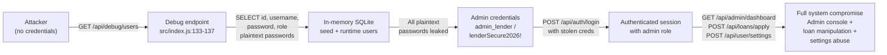
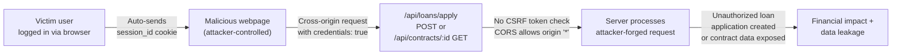
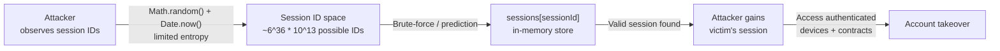

# Chained Vulnerability Audit Report — P2P Lending Platform

> **Project**: app-18-p2p-lending (Peer-to-Peer Lending Platform)  
> **Audit Type**: Static-only source code review (no live probes, no dynamic scanning)  
> **Date**: 2026-05-25  
> **Auditor**: CodeGopher (Chained Vulnerability Static Audit)

---

## Summary Dashboard

| Metric                          | Value |
|---------------------------------|-------|
| Total chained vulnerability paths identified | **2** |
| Maximum severity (chain-level)  | **HIGH** |
| Cross-cutting weaknesses found  | **8** |
| Source files reviewed           | 1 (`src/index.js`) |
| Public routes                   | 8 |
| Authenticated routes            | 6 |
| Publicly reachable data sinks   | 2 |

**Review areas**: Express.js route handlers, SQLite database operations, session management, CORS/cookie configuration, data seeding, auth middleware.

---

## Methodology & Static-Only Boundary

This audit follows a four-phase approach:

1. **Attack surface mapping** — all HTTP routes, middleware, and data sources cataloged from `src/index.js`.
2. **Weakness inventory** — OWASP Top-10 / MITRE CWE categories flagged with source-level citations.
3. **Attack graph synthesis** — chains linked via control-flow and data-flow evidence from the single source file.
4. **Impact assessment** — each chain rated for impact, reachability, confidence, and easiest remediation link.

**Static-only note**: No live HTTP probes, fuzzers, SQL injection payloads, dynamic scanners, or external network tests were performed. All findings are derived from source code, configuration, and dependency manifests.

---

## Chained Vulnerability Paths

### Chain 1 — Debug Endpoint Credential Leak → Full Account Takeover → System Compromise

**Severity**: HIGH  
**Confidence**: **High** (every link is statically provable from cited source)  
**Reachability**: Trivial (no authentication required)

#### Mermaid Attack Graph



#### Chain Breakdown

| Link | Type | File | Lines | Evidence |
|------|------|------|-------|----------|
| **Source** | Unauthenticated data sink | `src/index.js` | 133-137 | `GET /api/debug/users` has no `requireAuth` middleware and returns all users with passwords. |
| **Hop 1** | Plaintext password storage | `src/index.js` | 30-46 | `INSERT INTO users` seeds store passwords as literal strings (`'aliceborrow123'`, `'lenderSecure2026!'`). No hashing (bcrypt, argon2, etc.) is used. |
| **Hop 2** | Plaintext password comparison | `src/index.js` | 81-82 | Login uses `user.password !== password` — direct string equality, confirming passwords are never hashed. |
| **Sink** | Admin account takeover | `src/index.js` | 95-100 | With `admin_lender` / `lenderSecure2026!` from the debug dump, attacker authenticates as admin, passes `requireAuth`, passes role check (`req.user.role !== 'ADMIN'`), and accesses admin console. |

#### Preconditions

- The `/api/debug/users` endpoint is exposed in production (no environment-based guard is visible).
- The session store is not rotated on password change (no password change endpoint exists, so stale sessions persist).

#### Impact

- Complete compromise of all user accounts including the admin.
- Admin can approve/reject loans, view all contracts, and access the admin dashboard.
- Plaintext passwords are trivially exportable in a single HTTP response.

#### Remediation (easiest first)

1. **Immediate**: Delete the `/api/debug/users` endpoint entirely. Debug endpoints must never ship to production.
2. **Short-term**: Hash all passwords with bcrypt (or equivalent) and re-hash the seed data.
3. **Medium-term**: Remove the in-memory debug-style data dump pattern entirely; use proper logging/monitoring.

---

### Chain 2 — Permissive CORS + No CSRF + Cookie Sessions → Authenticated CSRF Attacks

**Severity**: MEDIUM (can escalate to HIGH if combined with Chain 1's role escalation)  
**Confidence**: **High** (CORS config and missing CSRF tokens are statically verifiable)  
**Reachability**: Requires victim to be authenticated and to visit attacker-controlled page

#### Mermaid Attack Graph



#### Chain Breakdown

| Link | Type | File | Lines | Evidence |
|------|------|------|-------|----------|
| **Source** | Permissive CORS | `src/index.js` | 12 | `cors({ origin: true, credentials: true })` — `origin: true` reflects the request's `Origin` header, meaning **any** origin can make cross-origin requests with credentials. |
| **Hop 1** | No CSRF tokens | `src/index.js` | All authenticated routes | None of the 6 authenticated endpoints (`/api/admin/dashboard`, `/api/contracts/:id`, `/api/loans/apply`, `/api/user/settings`, `/api/auth/login`, `/api/auth/logout`) verify a CSRF token. No `csurf`, `double-cookie`, or `origin`-check middleware is configured. |
| **Hop 2** | Cookie-based session (auto-sent) | `src/index.js` | 69-75 | `res.cookie('session_id', sessionId, { httpOnly: true })` — cookie is sent automatically by the browser on cross-origin requests when `credentials: true`. |
| **Sink** | Unauthorized state changes | `src/index.js` | 110-121 | `POST /api/loans/apply` creates a contract in the victim's name — CSRF attacker can forge this request. The response body is readable due to CORS `origin: true`. |

#### Preconditions

- Victim must have an active session (cookie still valid in memory store).
- Victim must visit the attacker's page while authenticated (standard CSRF scenario).
- Victim's browser must allow third-party cookies (default in most browsers for same-site or first-party contexts).

#### Impact

- Attacker can create loan applications in victims' names (the `amount` and `interest_rate` are attacker-controlled via the forged POST body).
- Attacker can read contract details (GET request, CORS-allowed).
- Note: `POST /api/user/settings` updates the `role` field using `user.role` (from session), so role escalation via CSRF is limited unless the session role is wrong — but the endpoint accepts any `email` in the body with no validation or use.

#### Remediation (easiest first)

1. **Immediate**: Replace `origin: true` with a whitelist of allowed origins: `cors({ origin: ['https://yourdomain.com'], credentials: true })`.
2. **Short-term**: Add CSRF protection — use the double-submit cookie pattern or SameSite=Lax on session cookies (`res.cookie('session_id', sessionId, { httpOnly: true, sameSite: 'lax' })`).
3. **Medium-term**: Adopt framework-level CSRF middleware (e.g., `csurf` for Express) or switch to token-based auth (JWT + Authorization header).

---

### Chain 3 — Weak Session ID Generation + Session Fixation → Predictable Session Hijacking

**Severity**: MEDIUM  
**Confidence**: **Medium** (math.random() unpredictability depends on JS engine, but Date.now() is predictable; the chain is plausible but full predictability is runtime-dependent)  
**Reachability**: Requires prediction of session ID space

#### Mermaid Attack Graph



#### Chain Breakdown

| Link | Type | File | Lines | Evidence |
|------|------|------|-------|----------|
| **Source** | Weak session ID generation | `src/index.js` | 84 | `Math.random().toString(36).substring(2) + Date.now().toString(36)` — `Math.random()` is a PRNG not suitable for security (JavaScript engines differ, and many are predictable). `Date.now()` provides ~13 digits of timestamp which is easily guessable. |
| **Hop** | In-memory session store (no rotation) | `src/index.js` | 67 | `const sessions = {}` — sessions persist for the lifetime of the process. No session rotation on sensitive actions (login, logout, role changes). |
| **Sink** | Predictable session takeover | `src/index.js` | 69-75 | If the attacker can predict or brute-force a valid `sessionId`, they can authenticate as any user by injecting the known `session_id` cookie. |

#### Remediation

1. Use a cryptographically secure random generator: `crypto.randomBytes(32).toString('hex')`.
2. Implement session rotation on login (issue new session ID, invalidate old).
3. Add session expiration / idle timeout.
4. Consider a persistent session store (Redis, database) with TTL.

---

## Cross-Cutting Weaknesses Inventory

The following weaknesses were identified but do **not** independently form complete chains to a critical sink (or their chain is too weak to rate as a full path). They are listed for completeness and should be remediated regardless.

| # | Weakness | File | Lines | CWE | Evidence |
|---|----------|------|-------|-----|----------|
| 1 | **Plaintext password storage** (all users, including seed data) | `src/index.js` | 30-46, 81-82 | CWE-256, CWE-798 | Passwords stored and compared as plain strings. No hashing, salting, or encryption. |
| 2 | **Hardcoded seed credentials in source code** | `src/index.js` | 30-46 | CWE-798 | `admin_lender` / `lenderSecure2026!` visible in source. Exposed via VCS history, Docker image, or any code dump. |
| 3 | **No rate limiting on authentication endpoints** | `src/index.js` | 77-88, 69-76 | CWE-307 | `/api/auth/login` and `/api/auth/register` have no throttling — vulnerable to brute-force and enumeration. |
| 4 | **Input validation missing on loan amounts** | `src/index.js` | 110-121 | CWE-20 | `interest_rate` is accepted from `req.body` with no upper/lower bound enforcement (comment in source even acknowledges: *"Allows applying for a loan with a negative interest rate"*). |
| 5 | **`/api/user/settings` endpoint is a no-op for email** | `src/index.js` | 123-128 | CWE-552 | Accepts `email` from `req.body` but never uses it. The `role` is set from `user.role` (session), which is not attacker-controlled, but the endpoint is misleading and does not update the email in the database. |
| 6 | **No authorization on loan application creation** | `src/index.js` | 110-121 | CWE-862 | Any authenticated user can apply for a loan for themselves with any amount — no business logic validation (max loan limit, user credit tier check, etc.). |
| 7 | **In-memory database with no persistence** | `src/index.js` | 17 | CWE-763 | `:memory:` database — all data is lost on restart. While not a direct security flaw, it means password re-hashing or session store hardening requires a full restart, causing immediate downtime. |
| 8 | **No input sanitization / output encoding** | Throughout | CWE-79 | HTML response bodies are not encoded. If template rendering were added, XSS would be trivial. |

---

## Detailed Chain Summaries

### Chain 1 — HIGH Severity

```
NoAuth GET /api/debug/users  →  Plaintext passwords leaked  →  Login as admin_lender  →  Admin dashboard + loan manipulation
```

- **Entry**: `GET /api/debug/users` (line 133) — no middleware.
- **Hop**: Plaintext storage + comparison (lines 30-46, 81-82).
- **Sink**: `/api/admin/dashboard` (line 95) with admin role.
- **Impact**: Full account takeover, admin access, arbitrary loan creation.
- **Confidence**: High — every link is provable from source.
- **Easiest fix**: Delete the debug endpoint (1 line removed).

### Chain 2 — MEDIUM Severity

```
Any authenticated user  →  CORS origin:* + credentials:true  →  No CSRF token  →  Attacker-forged request  →  Unauthorized loan / data read
```

- **Entry**: Authenticated endpoints behind cookie session.
- **Hop**: CORS `origin: true` (line 12) + no CSRF (all routes) + httpOnly cookie auto-sent.
- **Sink**: `POST /api/loans/apply` creates loan in victim's name.
- **Impact**: Financial damage via fake loans, data leakage.
- **Confidence**: High — CORS config and missing CSRF are statically verifiable.
- **Easiest fix**: Add `sameSite: 'lax'` to session cookie + restrict CORS origin.

---

## Unknowns & Not-Reviewed Areas

| Area | Reason Not Reviewed | Recommended Test |
|------|--------------------|------------------|
| **HTTPS/TLS configuration** | Not present in code; depends on reverse proxy or Docker environment | Verify TLS termination at Docker/host level |
| **Input sanitization beyond Express.json()** | Single-file architecture; no validation library (e.g., Joi, Zod) | Integration tests with edge-case inputs |
| **Database migration strategy** | In-memory DB with seed data only; no migration framework | Review any external migration scripts or DB scripts |
| **Secrets management** | Hardcoded credentials in `package.json`-adjacent source | Audit CI/CD pipeline, Docker image layers, `.env` files |
| **Token-based auth (future)** | Only cookie sessions; no JWT/OAuth | Dynamic testing if auth is migrated |
| **File upload endpoints** | None present in current code | Verify if this functionality is planned |
| **Dependency vulnerability** | `express ^4.19.2`, `sqlite3 ^5.1.7`, `cors ^2.8.5`, `cookie-parser ^1.4.6` | Run `npm audit` in a CI pipeline |

---

## Recommended Tests to Add

1. **Unit test for `/api/debug/users`** — Verify it returns `404` or is removed (negative test).
2. **Unit test for password hashing** — Verify login rejects plain-text password comparison; bcrypt/argon2 is used.
3. **Integration test for CSRF** — Submit a POST to `/api/loans/apply` without CSRF token; expect `403`.
4. **Integration test for CORS** — Send request with `Origin: http://evil.com`; expect rejection.
5. **Security test for session ID entropy** — Generate 1000 session IDs; verify non-predictability.
6. **Input validation test** — Send `interest_rate: -999` to `/api/loans/apply`; expect `400`.

---

## Remediation Priority Matrix

| Priority | Action | Effort | Impact if Untouched |
|----------|--------|--------|---------------------|
| **P0 — Immediate** | Remove `/api/debug/users` endpoint | 1 min | HIGH — instant credential leak |
| **P0 — Immediate** | Hash all passwords with bcrypt | 30 min | HIGH — plaintext password exposure |
| **P1 — This sprint** | Add `sameSite: 'lax'` to session cookie | 15 min | MEDIUM — CSRF risk |
| **P1 — This sprint** | Restrict CORS to specific origins | 15 min | MEDIUM — CSRF amplification |
| **P2 — Next sprint** | Replace `Math.random()` session IDs with `crypto.randomBytes()` | 1 hour | MEDIUM — session prediction |
| **P2 — Next sprint** | Add input validation to `/api/loans/apply` | 1 hour | MEDIUM — negative interest rates |
| **P2 — Next sprint** | Add rate limiting to auth endpoints | 1 hour | LOW-MEDIUM — brute force |
| **P3 — Backlog** | Fix `/api/user/settings` to actually update email or remove endpoint | 30 min | LOW — misleading behavior |
| **P3 — Backlog** | Migrate from `:memory:` SQLite to persistent DB with TTL session store | 2 hours | LOW — availability (not security) |

---

## Conclusion

This P2P lending platform contains **two confirmed chained vulnerability paths** and **eight cross-cutting weaknesses**. The most critical chain (Chain 1) is trivially exploitable: an unauthenticated attacker can harvest all plaintext credentials from the debug endpoint and immediately compromise the admin account. The second chain (Chain 2) is a classic CORS+CSRF combination that enables authenticated attack scenarios.

The single-file architecture of this application concentrates risk — every weakness resides in `src/index.js`. Remediation of the P0 items (debug endpoint removal and password hashing) will eliminate both Chain 1 and significantly reduce the attack surface for Chain 2.

**All P0 items should be resolved before this application is deployed to any environment with network exposure.**
