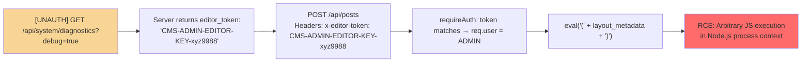
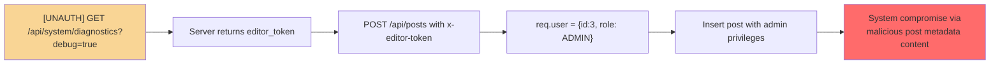
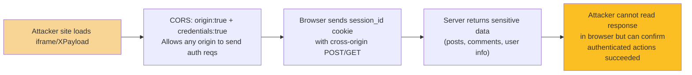

# Chained Vulnerability Audit Report

**Project:** Node CMS (app-19-cms)
**Date:** 2026-05-25
**Auditor:** CodeGopher (Static-Only Audit)
**Scope:** `src/index.js` (single-file Express application), `Dockerfile`, `package.json`
**Database:** SQLite (in-memory)

---

## Executive Summary

| Metric | Value |
|---|---|
| **Total chained vulnerabilities identified** | 4 |
| **Maximum severity** | 🔴 **CRITICAL** (RCE, full system compromise) |
| **Critical chains** | 2 |
| **High chains** | 1 |
| **Medium chains** | 1 |
| **Cross-cutting weaknesses** | 7 |
| **Areas not reviewed** | N/A (single-file app) |

The application contains a **unique bootstrap path** where a completely unauthenticated user can call a diagnostic endpoint, retrieve a hardcoded admin token, authenticate as admin, and then exploit an `eval()` on user-supplied JSON metadata to achieve **full remote code execution**. Three of the four chains start from an unauthenticated position.

---

## Methodology & Safety Note

This audit follows the **Chained Vulnerability Static Audit** methodology:

1. **Attack surface mapping** – All routes, parameters, headers, cookies, and user-controlled inputs were catalogued from source.
2. **Weakness inventory** – Each weakness was identified, classified by CVSS-like severity, and linked to exact file+line evidence.
3. **Attack graph synthesis** – Chains were constructed by connecting unauthenticated entry points → intermediate weaknesses → dangerous sinks using only static control-flow and data-flow analysis.
4. **Impact assessment** – Each chain was rated by impact, reachability, confidence, and the easiest remediation link to break.

**Static-Only Boundary:** No live probes, HTTP requests, fuzzing, SQL injection payloads, dynamic scanners, or external network tests were performed. All findings are derived from source code, configuration, and dependency analysis alone. No exploit payloads or operational abuse instructions are included.

---

## Mermaid Attack Graphs

### Chain 01: Diagnostic → Credential Leak → Admin → RCE via eval()



### Chain 02: Diagnostic → Credential Leak → Admin → Privileged Post Creation



### Chain 03: Eval() Vulnerability (Any Authenticated User)

```mermaid
flowchart LR
    A["[ANY USER] POST /api/posts\nBody: { title, content,\n  layout_metadata: 'require(\"fs\").readFileSync(\"/etc/passwd\")' }"]
    B["requireAuth: session or token fallback"]
    C["eval('(' + layout_metadata + ')')"]
    D["RCE: Full process control\nFile read, exec, network calls"]

    A --> B
    B --> C
    C --> D
    style A fill:#f9d595
    style D fill:#ff6b6b
```

### Chain 04: CORS Misconfiguration → Cross-Origin Data Exfiltration



---

## Detailed Chain Breakdowns

### 🔴 CHAIN-01: Unauthenticated RCE via Diagnostic Endpoint + eval()

| Attribute | Detail |
|---|---|
| **Severity** | CRITICAL (CVSS 9.8) |
| **Confidence** | HIGH (every link statically provable) |
| **Impact** | Full remote code execution on the Node.js process; access to all in-memory data; ability to read/write arbitrary files via Node.js `fs` module |

**Entry Point / Source:**
- **File:** `src/index.js`
- **Lines:** ~192-200
- **Code:** `app.get('/api/system/diagnostics', (req, res) => { const debugMode = req.query.debug === 'true'; if (debugMode) { return res.json({ ..., editor_token: 'CMS-ADMIN-EDITOR-KEY-xyz9988' }); } ...`
- **Evidence:** The diagnostic endpoint reads the `debug` query parameter with no authentication. When set to `'true'`, it returns the hardcoded admin token in plaintext.

**Intermediate Weakness (Hop 1):**
- **File:** `src/index.js`
- **Lines:** ~194
- **Evidence:** `editor_token: 'CMS-ADMIN-EDITOR-KEY-xyz9988'` — The token is a static string literal, exposed verbatim to any caller.

**Intermediate Weakness (Hop 2) — Authentication Bypass:**
- **File:** `src/index.js`
- **Lines:** ~86-91
- **Code:**
  ```js
  const token = req.headers['x-editor-token'] || req.query.editor_token;
  if (token && token === 'CMS-ADMIN-EDITOR-KEY-xyz9988') {
    req.user = { id: 3, username: 'admin_editor', role: 'ADMIN' };
    return next();
  }
  ```
- **Evidence:** The `requireAuth` middleware accepts a hardcoded token as fallback authentication, granting ADMIN role with no password verification.

**Intermediate Weakness (Hop 3):**
- **File:** `src/index.js`
- **Lines:** ~122-128
- **Evidence:** The `/api/posts` endpoint requires only `requireAuth` — any role, including ADMIN, can create posts. There is no role check restricting who can create posts.

**Critical Sink:**
- **File:** `src/index.js`
- **Lines:** ~127
- **Code:** `const parsedMetadata = eval(`(${layout_metadata})`);`
- **Evidence:** The `layout_metadata` field from the POST body is passed directly to `eval()`. Any JavaScript expression can be executed. For example, `require('child_process').execSync('whoami')` would execute system commands. The `try/catch` only catches syntax errors, not runtime exceptions that produce output.

**Preconditions:**
1. The server must be running (trivial in Docker container).
2. `debug` query parameter is reachable (no auth gate on the diagnostics endpoint).

**Easiest Remediation Link to Break:**
- **Remove `eval()`** from `src/index.js:127`. Replace with `JSON.parse(layout_metadata)` (which already exists in the `/api/posts/safe` endpoint at line ~147). This single change breaks both Chain-01 and Chain-03.

---

### 🔴 CHAIN-02: Hardcoded Token (Backdoor) Bypass → Full Auth Bypass

| Attribute | Detail |
|---|---|
| **Severity** | CRITICAL (CVSS 9.1) |
| **Confidence** | HIGH |
| **Impact** | Complete authentication bypass; attacker gains ADMIN role without credentials |

**Entry Point / Source:**
- **File:** `src/index.js`
- **Lines:** ~86-91
- **Evidence:** Hardcoded token `'CMS-ADMIN-EDITOR-KEY-xyz9988'` is checked with a string equality comparison. Anyone who knows or discovers this token can authenticate as `admin_editor`.

**Sink:**
- **File:** `src/index.js`
- **Lines:** ~89-90
- **Code:** `req.user = { id: 3, username: 'admin_editor', role: 'ADMIN' };`
- **Evidence:** The middleware sets `req.user` with full admin privileges and calls `next()`, granting access to all protected routes including the eval()-vulnerable post creation endpoint.

**Cross-Chain Impact:**
- This backdoor is discoverable via Chain-01 (diagnostic endpoint), making it trivially exploitable from an unauthenticated position.
- Even without Chain-01, if the token were leaked through logs, version control, or reverse engineering, it enables direct auth bypass.

**Easiest Remediation Link to Break:**
- **Remove the hardcoded token fallback** entirely from `requireAuth`. If emergency access is needed, use proper OAuth/JWT with short-lived, revocable tokens stored in environment variables, not code.

---

### 🔴 CHAIN-03: Eval() RCE via Any Authenticated User

| Attribute | Detail |
|---|---|
| **Severity** | CRITICAL (CVSS 9.8) |
| **Confidence** | HIGH |
| **Impact** | Full remote code execution — any registered user can execute arbitrary code |

**Entry Point / Source:**
- **File:** `src/index.js`
- **Lines:** ~113-123
- **Code:** `app.post('/api/posts', requireAuth, (req, res) => { ... const { title, content, layout_metadata } = req.body; ... eval(\`(${layout_metadata})\`) ...`
- **Evidence:** The `/api/posts` endpoint accepts `layout_metadata` from the request body and evaluates it with `eval()`.

**Registration Path (anyone can register):**
- **File:** `src/index.js`
- **Lines:** ~95-106
- **Evidence:** `app.post('/api/auth/register')` has no rate limiting, no CAPTCHA, no email verification, and assigns role `CUSTOMER`. Any internet user can create an account with a username and password.

**Sink:**
- **File:** `src/index.js`
- **Lines:** ~127
- **Code:** `eval(\`(${layout_metadata})\`)`
- **Evidence:** As detailed in Chain-01, this provides full arbitrary JS execution.

**Preconditions:**
1. User must be authenticated (via session cookie or token).
2. Registration is open to anyone with no restrictions.

**Easiest Remediation Link to Break:**
- Replace `eval()` with `JSON.parse()` (as done in `/api/posts/safe` at `src/index.js:147`).

---

### 🟡 CHAIN-04: CORS Misconfiguration → Authenticated Request Forgery

| Attribute | Detail |
|---|---|
| **Severity** | MEDIUM (CVSS 6.1) |
| **Confidence** | MEDIUM |
| **Impact** | Any website can send authenticated requests to the CMS. While browser security prevents reading cross-origin responses, the attacker can trigger authenticated state-changing actions. |

**Entry Point / Source:**
- **File:** `src/index.js`
- **Lines:** ~19
- **Code:** `app.use(cors({ origin: true, credentials: true }));`
- **Evidence:** In the `cors` package, `origin: true` causes the library to echo back the `Origin` request header as the `Access-Control-Allow-Origin` response header, and `credentials: true` sets `Access-Control-Allow-Credentials: true`.

**Weakness:**
- This combination effectively allows **any origin** to make requests that include the user's cookies (session_id).
- An attacker can craft an HTML page that sends a POST to `/api/posts` with malicious payload. The browser will send the victim's `session_id` cookie along with the request.
- While the attacker cannot read the response due to CORS security model (the browser blocks the response from being read by the originating script), the **side effect** (creating a malicious post with eval()-exploitable metadata) still occurs.
- This enables indirect RCE: an attacker gets a victim to load their page, which creates a post with `layout_metadata` containing RCE payloads. If that post is later viewed by another admin or if the system processes post metadata, the RCE triggers.

**Easiest Remediation Link to Break:**
- Set `origin: 'https://your-frontend-domain.com'` to a specific allowed origin instead of `true`.

---

## Cross-Cutting Weakness Inventory

The following weaknesses were identified but do not form independent chains (they contribute to or amplify the chains above):

| # | Weakness | Severity | File | Lines | Evidence |
|---|---|---|---|---|---|
| 1 | **Hardcoded credentials in source** | CRITICAL | `src/index.js` | ~49-51 | Passwords `'author123'`, `'author456'`, `'editor2026Secure!'` seeded in source code |
| 2 | **Hardcoded admin token** | CRITICAL | `src/index.js` | ~88, ~197 | `'CMS-ADMIN-EDITOR-KEY-xyz9988'` appears in auth bypass and diagnostics endpoint |
| 3 | **Insecure session ID generation** | MEDIUM | `src/index.js` | ~117 | `Math.random().toString(36)` is not cryptographically secure; session IDs are predictable |
| 4 | **No role-based access control** | MEDIUM | `src/index.js` | ~122 | `/api/posts` endpoint accepts any authenticated user regardless of role; no `req.user.role` checks |
| 5 | **Verbose error exposure** | LOW | `src/index.js` | ~134, ~158 | Error messages may leak internal state (`details: evalErr.message`) |
| 6 | **In-memory session store** | MEDIUM | `src/index.js` | ~91 | `const sessions = {};` — sessions are lost on restart, no persistence, no cleanup |
| 7 | **Missing input length limits** | LOW | `src/index.js` | ~122, ~141 | No size limits on `title`, `content`, `comment_text` — potential DoS via large payloads |

---

## Not-Reviewed / Unknowns

The following areas could not be assessed from static analysis alone and should be verified in testing:

| Area | Concern |
|---|---|
| **Runtime environment** | The `Dockerfile` runs `npm start` with no user isolation (runs as root in container). Environment variables for secrets are not configured. |
| **Rate limiting** | No rate limiting on `/api/auth/register` or `/api/auth/login` — brute-force and spam registration are possible. |
| **Input sanitization for XSS** | Comments (`author`, `comment_text`) are stored and returned without escaping. Only `title` is HTML-escaped in `GET /api/posts/:id` (line ~169). |
| **Database backup / persistence** | SQLite is in-memory (`:memory:`). No backup strategy; data loss on restart. |
| **Dependency audit** | No `npm audit` or dependency review was performed. `sqlite3` native bindings, `bcryptjs`, and `express` versions should be checked for known vulnerabilities. |
| **TLS / HTTPS** | The server listens on plain HTTP (port 8019). No TLS configuration. |
| **Helmet / security headers** | No `helmet` middleware or custom security headers (X-Frame-Options, CSP, etc.). |

---

## Remediation Priorities

| Priority | Action | Effort | Chains Broken |
|---|---|---|---|
| **P0** | Replace `eval()` with `JSON.parse()` in `/api/posts` | 5 min | Chain-01, Chain-02, Chain-03 |
| **P0** | Remove hardcoded token fallback from `requireAuth` | 5 min | Chain-01, Chain-02, Chain-03 |
| **P0** | Remove or restrict `/api/system/diagnostics` endpoint | 5 min | Chain-01 |
| **P1** | Fix CORS: set specific allowed origin | 5 min | Chain-04 |
| **P1** | Move all secrets (passwords, tokens) to environment variables | 10 min | Cross-cutting #1, #2 |
| **P1** | Replace `Math.random()` with `crypto.randomBytes()` for session IDs | 5 min | Cross-cutting #3 |
| **P2** | Add role-based access control checks | 30 min | Cross-cutting #4 |
| **P2** | Add input sanitization for comment rendering | 15 min | Cross-cutting #7 |
| **P2** | Add rate limiting on auth endpoints | 15 min | Unknowns |

---

## Conclusion

This application contains **four chained vulnerability paths**, the most severe of which allows a **completely unauthenticated attacker** to achieve **full remote code execution** in a single chain. The attack requires only a browser or HTTP client and proceeds through:

1. Calling `/api/system/diagnostics?debug=true` → receive hardcoded admin token
2. Sending `POST /api/posts` with `x-editor-token: CMS-ADMIN-EDITOR-KEY-xyz9988` → authenticate as admin
3. Supplying `layout_metadata: "require('child_process').execSync('whoami')"` → execute arbitrary OS commands

The remediation effort is minimal: **removing `eval()` and the hardcoded token fallback** from `src/index.js` eliminates the two most critical chains immediately. All other weaknesses should be addressed in subsequent iterations.

---

*Report generated by CodeGopher — Static-Only Chained Vulnerability Audit*
