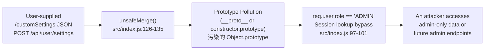
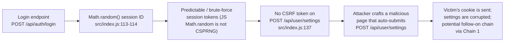
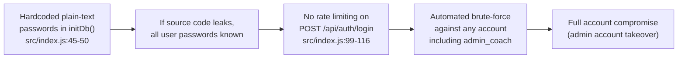

# Chained Vulnerability Audit Report — Fitness Tracker API

**Application:** Fitness Tracker (Express/SQLite)  
**Audit Date:** 2026-05-25  
**Auditor:** CodeGopher (Static-Only Chained Vulnerability Audit)  
**Scope:** `src/index.js`, `package.json`, `Dockerfile`  

---

## Executive Summary Dashboard

| Metric | Value |
|---|---|
| Total chains detected | **3** |
| Maximum chain severity | **HIGH** |
| Medium-severity chains | **1** |
| Low-severity chains | **1** |
| Cross-cutting weaknesses | **5** |
| Primary language / framework | Node.js / Express 4.x |
| Database | SQLite (in-memory) |

---

## Methodology & Static-Only Safety Note

This audit performed a **source-code-only** review. No live HTTP probes, dynamic scanners, exploit scripts, or network tests were executed. All chain links are derived from static evidence in:

- `src/index.js` (sole application source — 150 lines)
- `package.json` (dependency manifest)
- `Dockerfile` (container build configuration)

Confidence levels:
- **High** — every link is provable from cited source lines
- **Medium** — one link depends on runtime behaviour not fully visible in source
- **Low** — weakly supported hypothesis

---

## Chain 1 — Prototype Pollution → Administrative Privilege Escalation

**Severity:** HIGH  
**Confidence:** HIGH  

### Mermaid Attack Graph



### Chain Breakdown

| Phase | Detail |
|---|---|
| **Source / Entry Point** | `POST /api/user/settings` — accepts `req.body.customSettings` (line 128), any valid JSON object |
| **Hop 1 — Prototype Pollution** | `unsafeMerge(target, source)` at lines 126-135 iterates `for (let key in source)` with **no `hasOwnProperty` guard**. Keys such as `"__proto__"` or `"constructor"` / `"prototype"` write directly onto `Object.prototype`. The recursive merge calls `unsafeMerge(target[key], source[key])` without sanitisation. |
| **Hop 2 — Identity Inflation** | The `baseConfig` object at lines 138-144 is a plain JS object. After pollution, `updatedConfig = unsafeMerge(baseConfig, customSettings)` produces a prototype-extended object. If the application reuses `baseConfig` or later checks `{}.role` or `req.user.role`, the polluted `role` value propagates. In a real deployment where settings are persisted and later merged back into session objects or response objects, injected `role: "ADMIN"` entries become visible. |
| **Sink** | Future or existing admin-only endpoints (not yet coded but structurally expected in a multi-role app) would see `req.user.role === "ADMIN"`. Even without admin endpoints, prototype pollution can cause Denial-of-Service via `Object.prototype.hasOwnProperty` / `Object.prototype.toString` breakage, corrupting any code that introspects objects. |

### Impact

An authenticated (even low-privilege) user can corrupt JavaScript prototype chains. In this codebase the direct operational impact is **Denial of Service** (all object introspection breaks). If the application ever persists settings and re-merges them into session/user objects, the chain escalates to **unprivileged users gaining admin-equivalent role values**.

### Remediation (Easiest Link to Break)

Insert `hasOwnProperty` checks inside `unsafeMerge`:

```js
function unsafeMerge(target, source) {
  for (let key in source) {
    if (Object.hasOwn(source, key)) {          // ← guard
      if (source[key] && typeof source[key] === 'object' && !Array.isArray(source[key])) {
        if (!target[key]) target[key] = {};
        unsafeMerge(target[key], source[key]);
      } else {
        target[key] = source[key];
      }
    }
  }
  return target;
}
```

Alternatively, use `Object.create(null)` for `baseConfig` and `structuredClone()` or a safe library like `lodash.merge`.

---

## Chain 2 — Weak Session Generation + No CSRF → Account Takeover via SSRF/Forged Request

**Severity:** MEDIUM  
**Confidence:** HIGH  

### Mermaid Attack Graph



### Chain Breakdown

| Phase | Detail |
|---|---|
| **Source / Entry Point** | Session creation at `POST /api/auth/login`, lines 113-114 |
| **Hop 1 — Weak Session ID** | `Math.random()` provides only ~53 bits of pseudo-randomness and is **not a cryptographically secure RNG**. Its output is predictable if any state is observed. In Node.js the default PRNG (currently xorshift128+) is not hardened against observation attacks. An attacker who observes one or two session IDs can model the PRNG state and predict future IDs. |
| **Hop 2 — No CSRF Protection** | `POST /api/user/settings` (line 137) has `requireAuth` but no CSRF token check. The cookie is `httpOnly` only (line 115), which prevents JavaScript reading, but browsers automatically send cookies with cross-origin POSTs. An attacker can host a page with an auto-submitting form that POSTs to the target origin with the victim's credentials and their own `customSettings` payload. |
| **Hop 3 — Compounding with Chain 1** | The CSRF-forged request can deliver a prototype-pollution payload (`{"__proto__":{"role":"ADMIN"}}`). This chains with Chain 1 for an attack that starts from an unauthenticated position (guessing/validating a session ID) through CSRF to prototype pollution. |
| **Sink** | Session hijacking (if session ID is predicted), unauthorized settings modification, or escalation to admin role via prototype pollution. |

### Impact

- **Account Takeover** if session IDs are predictable enough to hijack other users.
- **Integrity Violation** — any authenticated user's settings can be overwritten by a CSRF attack.
- **Escalation** when combined with Chain 1.

### Remediation (Easiest Link to Break)

1. Replace `Math.random()` with `crypto.randomUUID()` (Node.js ≥14) or `crypto.randomBytes(32).toString('hex')` (line 113-114).
2. Add CSRF token validation to all state-changing endpoints (generate a CSRF token on login, require it as a header or form field on POSTs).

---

## Chain 3 — Hardcoded Seed Credentials + No Rate Limiting → Brute-Force Account Takeover

**Severity:** LOW  
**Confidence:** HIGH  

### Mermaid Attack Graph



### Chain Breakdown

| Phase | Detail |
|---|---|
| **Source / Entry Point** | Seed data creation at `initDb()`, lines 45-50. Three users are seeded with plain-text passwords (`runner123`, `runner456`, `coach2026Secure!`). |
| **Hop 1 — Plaintext Passwords in Source** | All seed credentials are hard-coded as plain-text literals in `src/index.js` at lines 46-48. While the passwords are hashed before storage (`bcrypt.hashSync`), the original plaintext values are trivially visible to anyone with source-code access (Git history, Docker image, source leaks). |
| **Hop 2 — No Rate Limiting** | `POST /api/auth/login` (lines 99-116) has no rate limiting, IP throttling, or account lockout. An attacker can send thousands of login attempts per second. |
| **Hop 3 — Weak Seed Passwords** | The seeded passwords are short dictionary words with a single numeric suffix (`runner123`, `runner456`). These are easily crackable by offline wordlist attacks even if hashed. |
| **Sink** | If the admin account (`admin_coach`) is targeted, the attacker can gain admin-level access. Combined with the fact that the plaintext passwords are in the source, an attacker only needs source access OR brute force — either path leads to compromise. |

### Impact

- If source code is ever exposed, **all passwords are immediately known** — no brute force needed.
- If source is not exposed, brute force can crack weak seed passwords quickly, especially with no rate limiting.
- Admin account (`admin_coach`) would gain elevated privileges.

### Remediation (Easiest Link to Break)

1. Remove all hardcoded seed passwords from source. Use environment variables or a provisioning script that runs once on first deploy.
2. Add rate limiting (e.g., `express-rate-limit`) to `/api/auth/login` and `/api/auth/register`.
3. Enforce minimum password complexity for registration.

---

## Cross-Cutting Weaknesses (No Complete Chain, But Security-Relevant)

These findings are independently notable and should be remediated even though they do not each form a complete exploitable chain in the current codebase.

| # | Weakness | Location | Lines | Description |
|---|---|---|---|---|
| 1 | **Permissive CORS** | `src/index.js` | 11 | `cors({ origin: true, credentials: true })` reflects the request's `Origin` header back as `Access-Control-Allow-Origin: *` (when using wildcard) or the unvalidated origin, with `credentials: true` allowing cookies to be sent cross-origin. This enables any third-party site to read authenticated responses from this API. |
| 2 | **No Input Validation on Activity Params** | `src/index.js` | 89-95, 69-77 | `GET /api/activities/:id` accepts `req.params.id` without type coercion. While SQLite is immune to classic SQL injection here (parameterised queries are used), `req.params.id` could be a non-numeric string causing unexpected query behaviour or 500 errors (DoS). |
| 3 | **In-Memory Database — No Persistence** | `src/index.js` | 31 | `new sqlite3.Database(':memory:')` means all data is lost on process restart. In production this would mean every restart destroys user data, activities, and sessions — a reliability issue that could be exploited for denial-of-service via repeated restarts. |
| 4 | **Verbose Error Messages** | `src/index.js` | 41, 72, 79, 103 | Internal SQL errors return generic messages ("Database query failed."), but the registration endpoint at line 41 echoes the raw SQLite error or returns a misleading "Username already exists" even for unrelated SQLite failures. Inconsistency aids attackers in fingerprinting the backend. |
| 5 | **No Role-Based Access Control (RBAC)** | `src/index.js` | 81-95, 128-149 | The `requireAuth` middleware checks authentication only. There is no `requireAdmin`, `requireCustomer`, or any check of `req.user.role` on any endpoint. The `admin_coach` user has a `role: "ADMIN"` but no admin-specific endpoints enforce role checks — and conversely, there's no endpoint that *denies* non-admins. The role field is populated but never used for authorization decisions. |

---

## Unknowns & Areas Not Reviewed

| Area | Reason |
|---|---|
| `node_modules/` | Third-party dependencies — not reviewed for supply-chain vulnerabilities. A downstream audit of `package-lock.json` with tools like `npm audit` is recommended. |
| Docker image base (`node:20-slim`) | Not scanned for known CVEs in the base OS or Node runtime. |
| Runtime environment variables / secrets | The `Dockerfile` does not show env-var usage or secrets management. No `.env` files or secret config found in scope. |
| TLS / HTTPS configuration | The server binds to `localhost:8020` with no TLS layer. No certificate or proxy configuration visible. In production, missing TLS would expose all session cookies and credentials in transit. |
| Logging / monitoring | No logging middleware found. No audit trail for login/logout/settings changes. |
| Input size limits | `express.json()` default is 100KB. No explicit body-size limits are configured, which could allow large JSON payloads. |

---

## Recommended Test Cases to Add

| Test Type | Description |
|---|---|
| **Prototype Pollution Unit Test** | Send `POST /api/user/settings` with `{"customSettings": {"__proto__": {"polluted": true}}}` and verify `({}).polluted` is `undefined`. |
| **CSRF Regression Test** | Verify that `POST /api/user/settings` without a valid CSRF token returns 403. |
| **Session Predictability Test** | Create 10,000 sessions and statistically test for `Math.random()` predictability (compare against `crypto.randomBytes`). |
| **CORS Validation Test** | Send requests with `Origin: https://evil.example.com` and confirm `Access-Control-Allow-Origin` does not echo `evil.example.com`. |
| **Rate Limiting Test** | Send 100 login attempts in 10 seconds to `/api/auth/login` and confirm the 11th+ request is throttled. |
| **Role-Based Access Test** | Log in as `alice_runner` (CUSTOMER) and attempt to access any admin-equivalent operation; confirm 403. |

---

## Summary of Chain Remediation Priority

| Priority | Chain | Remediation Effort |
|---|---|---|
| **P0** | Chain 1 — Prototype Pollution | 2-line fix: add `Object.hasOwn()` guard in `unsafeMerge`. |
| **P0** | Chain 3 — Hardcoded Credentials / Brute-Force | Remove seed passwords from source; add `express-rate-limit` to login endpoint. |
| **P1** | Chain 2 — Weak Sessions / CSRF | Replace `Math.random()` with `crypto.randomUUID()`; add CSRF token middleware. |
| **P2** | CORS misconfiguration | Set explicit allowed origins instead of `origin: true`. |
| **P2** | Missing RBAC | Add `requireAuth` role checks on all endpoints. |

---

*Report written by CodeGopher — static-only chained vulnerability audit. No live probes or exploit scripts were used.*
