# Chained Vulnerability Static Audit Report

**Project:** Food Delivery Order System (FastAPI)
**Repository:** `app-22-food-delivery`
**Auditor:** CodeGopher (Static-Only Audit)
**Date:** 2026-05-25
**Scope:** `app.py` (200 lines), `requirements.txt`, `Dockerfile`

---

## Summary Dashboard

| Metric | Value |
|---|---|
| **Chains detected** | **3** |
| **Maximum severity** | **CRITICAL** |
| **Medium confidence** | 1 chain |
| **Low confidence** | 2 chains |
| **Cross-cutting weaknesses** | 9 |
| **Reviewed files** | `app.py`, `requirements.txt`, `Dockerfile` |
| **Not reviewed** | None (single-file application) |

### Severity Breakdown

| Severity | Count |
|---|---|
| CRITICAL | 1 |
| HIGH | 0 |
| MEDIUM | 2 |

---

## Methodology and Safety Note

- **Static-only boundary:** This audit reviewed source files, configuration, and dependency manifests only.
- **No live probes, fuzzers, or dynamic scanners** were used.
- **No exploit scripts or operational abuse instructions** are included.
- Confidence levels:
  - **High:** Every link is provable from source code.
  - **Medium:** Plausible chain, one link depends on typical runtime/HTTP behavior.
  - **Low:** Weakly supported; requires assumptions about deployment or infrastructure.

---

## Attack Graphs

### Chain 1: Session Hijacking via XSS-Accessible Cookie

```mermaid
flowchart LR
    A[Unauthenticated attacker] -->|Brute-force username enumeration| B[Reveal valid usernames]
    B -->|Log in with weak default creds| C[Obtain session_id cookie]
    C -->|Cookie: httponly=False, secure=False| D[Cookie accessible via script]
    D -->|If any XSS vector exists in app or proxied frontend| E[Steal session via document.cookie]
    E -->|Use stolen cookie| F[Impersonate victim user]
    F -->|Read orders, view menu, place orders| G[Full account takeover]
```



### Chain 2: Webhook Token Forgery → Payment Status Manipulation


### Chain 3: Rate-Limited Registration Abuse → Account Flooding + DoS

```mermaid
flowchart LR
    A[Attacker] -->|No rate limiting on /register| B[Mass-create accounts]
    B -->|Fill DB with junk users| C[Database bloat, resource exhaustion]
    C -->|Login endpoint still functional| D[Slow enumeration possible via timing]
    D -->|No brute-force protection on /login| E[Offline password cracking]
    E -->|Read password hashes from memory| F[Recover plaintext credentials]
```



---

## Detailed Chain Breakdowns

---

### Chain 1: Session Hijacking via Insecure Cookie Configuration

| Field | Detail |
|---|---|
| **Entry Point / Source** | `app.py:118-119` — `login()` sets `httponly=False`, `secure=False` on `session_id` cookie |
| **Hop 1** | `app.py:115-121` — No `samesite` attribute set; cookie is sent with all requests including XHR/fetch |
| **Hop 2** | `app.py:108` — `sessions` store is a simple in-memory dict with no expiry; sessions persist until server restart |
| **Sink** | `app.py:79-82` — `get_current_user()` trusts any valid `session_id` from cookies; no IP binding, no User-Agent validation |
| **Impact** | Any attacker who can inject JavaScript into the user's browser (via XSS in this or a proxied frontend) can steal session cookies via `document.cookie` and impersonate the user. Without `HttpOnly`, the cookie is fully readable by client-side scripts. Without `Secure`, cookies may be transmitted over cleartext HTTP. |
| **Severity** | **HIGH** |
| **Confidence** | **High** — Cookie flags and `get_current_user()` dependency are directly readable in source |
| **Preconditions** | 1) User logs in over non-HTTPS or proxy strips Secure flag. 2) XSS vector exists somewhere (in this app or in a frontend not shown here). |
| **Remediation** | Set `httponly=True`, `secure=True`, `samesite='Lax'` (or `'Strict'`) on the session cookie. Add session expiry. Consider binding session to fingerprint (IP/User-Agent) for defense-in-depth. |

**Evidence:**

- `app.py:118-119`:
  ```python
  response.set_cookie(
      key="session_id",
      value=session_id,
      httponly=False,  # <-- VULNERABLE
      secure=False     # <-- VULNERABLE
  )
  ```
- `app.py:79-82`:
  ```python
  def get_current_user(request: Request):
      session_id = request.cookies.get("session_id")
      if not session_id or session_id not in sessions:
          raise HTTPException(status_code=401, detail="Unauthenticated")
      return sessions[session_id]  # <-- No additional checks
  ```

---

### Chain 2: Webhook Token Forgery → Unauthorized Payment Status Manipulation

| Field | Detail |
|---|---|
| **Entry Point / Source** | `app.py:17` — `PAYMENT_SECRET = "mock_sk_live_51O1W2e3R4t5Y6u7I8o9P0a1S2d3F4g5H6j7K8l9Z0x1C2v3B4n5M"` — hardcoded secret visible in source |
| **Hop 1** | `app.py:178` — Simple string comparison: `if req.auth_token != PAYMENT_SECRET` — no HMAC, no message authentication, no request origin verification |
| **Hop 2** | `app.py:183-191` — Once authenticated, the webhook updates **any** order's `payment_status` by `order_id` with no ownership or business-logic validation |
| **Sink** | `app.py:190` — `UPDATE orders SET payment_status = ? WHERE id = ?` — writes directly to DB; status can be set to `'PAID'`, `'REFUNDED'`, or any string the caller chooses |
| **Impact** | An attacker who reads the source code (or is exposed in a repo leak) can forge payment webhooks for **any order in the system**, marking unpaid orders as paid. This enables unauthorized order fulfillment, inventory discrepancies, and financial fraud. |
| **Severity** | **CRITICAL** |
| **Confidence** | **High** — Source code is directly readable; the hardcoded secret, weak comparison, and permissive UPDATE are all statically provable |
| **Preconditions** | 1) Source code is accessible (repo, Docker image, or deployed binary). 2) The `/api/payment/webhook` endpoint is network-reachable. |
| **Remediation** | 1) Never hardcode secrets; use environment variables or a secrets manager. 2) Implement proper HMAC-SHA256 signature verification of webhook payloads. 3) Validate that the requesting origin is a known payment provider. 4) Validate that the order exists and is in a valid pre-payment state before updating. |

**Evidence:**

- `app.py:17`:
  ```python
  PAYMENT_SECRET = "mock_sk_live_51O1W2e3R4t5Y6u7I8o9P0a1S2d3F4g5H6j7K8l9Z0x1C2v3B4n5M"
  ```
- `app.py:178`:
  ```python
  if req.auth_token != PAYMENT_SECRET:  # <-- Simple string compare, no HMAC
      raise HTTPException(status_code=401, detail="Unauthorized webhook source")
  ```
- `app.py:183-191`:
  ```python
  cursor.execute("SELECT * FROM orders WHERE id = ?", (req.order_id,))
  order = cursor.fetchone()
  if not order:
      raise HTTPException(status_code=404, detail="Order not found")
  cursor.execute(
      "UPDATE orders SET payment_status = ? WHERE id = ?",
      (req.payment_status, req.order_id)  # <-- No validation of payment_status value
  )
  ```

---

### Chain 3: No Rate Limiting + No CSRF → Bulk Registration DoS + CSRF Order Manipulation

| Field | Detail |
|---|---|
| **Entry Point / Source** | No rate limiting on any endpoint; no CSRF tokens on state-changing routes |
| **Hop 1** | `app.py:85-96` — `/api/auth/register` has no rate limit, no CAPTCHA, no account cooldown; allows unlimited account creation |
| **Hop 2** | `app.py:85-96` — Registration returns `"Username already exists"` on `IntegrityError`, enabling **username enumeration** |
| **Hop 3** | `app.py:99-122` — `/api/auth/login` also has no brute-force protection; users have weak default passwords (e.g., `alice_pass_123`) |
| **Hop 4** | `app.py:137-164` — `/api/orders` POST has no CSRF protection; any cross-site request from a logged-in user's browser will place an order |
| **Sink** | `app.py:157` — Orders are inserted with `user["id"]` from the stolen/exploited session; combined with Chain 1, an attacker places orders in the victim's name |
| **Impact** | An attacker can: (a) flood the system with fake accounts causing DoS/resource exhaustion, (b) enumerate valid usernames, (c) brute-force weak credentials, and (d) via CSRF, force logged-in users to place orders. When chained with Chain 1 (cookie theft), the result is full account takeover with the ability to place orders under the victim's identity. |
| **Severity** | **MEDIUM** (per hop), **HIGH** (when chained with Chain 1) |
| **Confidence** | **Medium** — CSRF exploitation depends on browser behavior and the presence of a cross-origin attack vector; rate limiting absence is static |
| **Preconditions** | 1) A victim is logged in (cookie present). 2) The attacker can cause the victim's browser to send a request to `/api/orders`. 3) No CSP/CSRF middleware is configured. |
| **Remediation** | 1) Add rate limiting (e.g., `slowapi` or a middleware like `asgi-lifespan` with Redis). 2) Add CSRF token protection (e.g., `twisted.web` or custom double-submit cookie pattern). 3) Implement account cooldowns and CAPTCHA on registration. 4) Use environment variables for default credentials; never hardcode test accounts with weak passwords in production. |

**Evidence:**

- `app.py:85-96` (no rate limit on register):
  ```python
  @app.post("/api/auth/register")
  def register(req: RegisterRequest):
      cursor = db_conn.cursor()
      hashed = bcrypt.hashpw(req.password.encode('utf-8'), bcrypt.gensalt()).decode('utf-8')
      try:
          cursor.execute(...)
  ```
- `app.py:106-107` (verbose error, username enumeration):
  ```python
  except sqlite3.IntegrityError:
      raise HTTPException(status_code=400, detail="Username already exists")
  ```
- `app.py:137` (no CSRF on order placement):
  ```python
  @app.post("/api/orders")
  def place_order(req: OrderRequest, user: dict = Depends(get_current_user)):
  ```
- `app.py:22` — Comment explicitly acknowledges the lack of idempotency:
  ```python
  # idempotency checks on order placement. Clients can send infinite duplicate order
  # requests, causing denial of service, resource exhaustion, or bulk db entries.
  ```

---

## Cross-Cutting Weaknesses Inventory

| # | Weakness | Location | Impact | Severity |
|---|---|---|---|---|
| 1 | **Hardcoded secrets** (PAYMENT_SECRET) | `app.py:17` | Credential exposure if code is leaked | HIGH |
| 2 | **Hardcoded test credentials** (alice, bob, etc.) | `app.py:42-46` | Default accounts with weak passwords | MEDIUM |
| 3 | **In-memory session store** (no expiry, no persistence) | `app.py:75` | Sessions never expire; survive server crashes | LOW-MEDIUM |
| 4 | **No rate limiting** on auth endpoints | `app.py:85, 99` | Brute-force and enumeration possible | MEDIUM |
| 5 | **No CSRF protection** on POST endpoints | `app.py:85, 99, 137` | Cross-site request forgery possible | MEDIUM |
| 6 | **Username enumeration** via registration error | `app.py:106-107` | Attacker learns valid usernames | LOW |
| 7 | **Verbose error messages** (e.g., "Menu item {id} not found") | `app.py:150` | Information disclosure | LOW |
| 8 | **No TLS enforcement** in deployment | `Dockerfile`, `app.py:202` | Cookies transmitted over cleartext possible | MEDIUM |
| 9 | **No idempotency on orders** | `app.py:137-164` | Duplicate orders from retried requests; DoS | LOW-MEDIUM |

---

## Unknowns and Not-Reviewed Areas

| Area | Reason |
|---|---|
| **Frontend code** | No HTML, JS, or template files found; XSS attack surface assumed from external frontend |
| **Network configuration** | No ingress/egress policies, load balancer config, or WAF rules visible |
| **Database encryption** | In-memory SQLite; no encryption at rest or in transit |
| **Logging / monitoring** | No audit logging of login, order, or webhook events |
| **Dependency vulnerabilities** | `fastapi==0.111.0`, `bcrypt==4.1.3`, `uvicorn==0.30.1` — no `requirements.txt` lock file or CVE review |
| **CI/CD pipeline** | Not present; no pre-commit hooks, linting, or secret scanning configured |
| **CORS policy** | No `CORSMiddleware` configured; FastAPI defaults may allow all origins |

---

## Recommended Tests to Add

1. **Session cookie security test** — Verify `httponly`, `secure`, and `samesite` flags are correctly set.
2. **Webhook HMAC verification test** — Ensure payment webhooks require HMAC-SHA256 signatures from a trusted payment provider.
3. **Rate limiting test** — Send 100+ registration/login requests and verify the endpoint throttles or rejects.
4. **CSRF test** — Submit a forged POST request from a different origin and verify it is rejected.
5. **Order idempotency test** — Send duplicate order requests and verify only one is created.
6. **Input validation test** — Send malformed or extremely large payloads to `/api/orders` and `/api/payment/webhook`.
7. **Secrets scanning** — Ensure hardcoded secrets are excluded from version control and Docker images.

---

## Remediation Priority

1. **CRITICAL** — Replace hardcoded `PAYMENT_SECRET` with environment variable + implement HMAC signature verification on `/api/payment/webhook`.
2. **HIGH** — Set `httponly=True`, `secure=True`, `samesite='Lax'` on session cookies.
3. **MEDIUM** — Add rate limiting to `/api/auth/register` and `/api/auth/login`.
4. **MEDIUM** — Add CSRF token validation to all POST endpoints.
5. **MEDIUM** — Remove or de-hardcode test accounts with weak passwords.
6. **LOW** — Implement session expiry and idempotency keys for order placement.

---

*Report generated by CodeGopher — Chained Vulnerability Static Audit (static-only, no live probes).*
