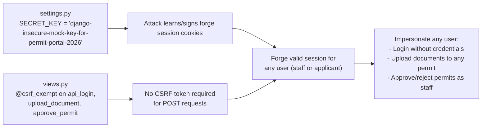
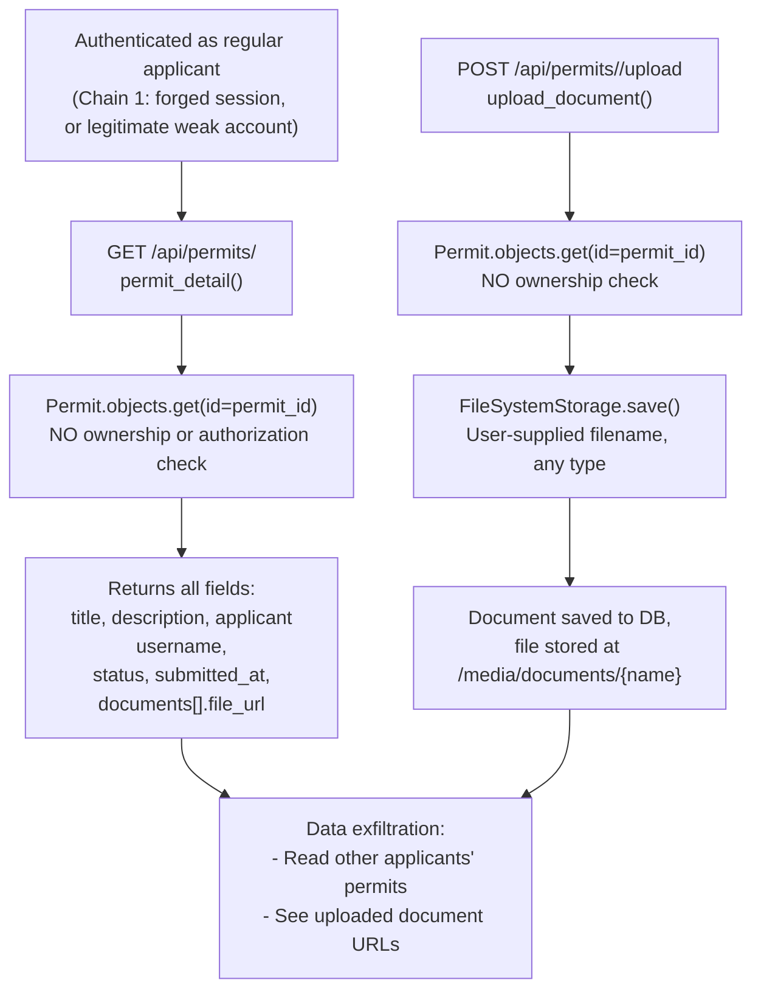
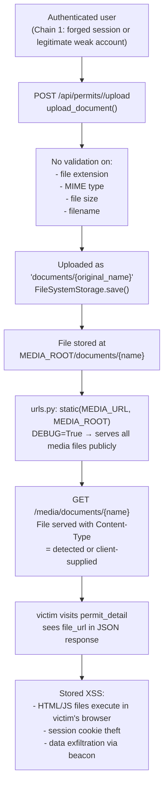

# Chained Vulnerability Audit Report

**Project:** Govt Permits Portal (Django 4.2.13)  
**Date:** 2026-05-25  
**Scope:** `govt_permits/` and `permits/` source trees in workspace root  
**Method:** Static-only analysis (source code, configuration, routing, models, views)  
**Safety Note:** No live HTTP probes, dynamic scanners, shell commands, or files outside this workspace were used.

---

## Summary Dashboard

| Metric | Value |
|---|---|
| Chains detected | **3** |
| Maximum severity | **High** |
| Medium-severity chains | **0** |
| Low-severity chains | **0** |
| Cross-cutting weaknesses | **9** |
| Reviewed areas | Views, URLs, models, settings, Dockerfile, wsgi |
| Not reviewed | Database migrations, templates (none exist), tests, environment config, external dependencies |

### Chain Severity Overview

| # | Impact | Severity | Confidence | Fastest Remediation |
|---|---|---|---|---|
| 1 | Full Account Takeover via known secret + CSRF bypass | **High** | **High** | Remove `csrf_exempt`, rotate SECRET_KEY |
| 2 | Unauthorized permit data access (IDOR) + file exfiltration | **High** | **High** | Add ownership checks in `permit_detail` and `upload_document` |
| 3 | Stored XSS / code execution via unrestricted upload + DEBUG media serving | **High** | **High** | Validate file extensions/types; set `DEBUG=False` |

---

## Methodology

1. **Attack surface mapping** – All public routes from `govt_permits/urls.py` and `permits/urls.py` were enumerated. Entry points: login, logout, permit list, permit detail, document upload, permit approval, and admin panel.
2. **Weakness inventory** – Each view function, setting, model, and route definition was inspected for security-relevant patterns (auth, authorization, input validation, file handling, CSRF, secrets).
3. **Attack graph synthesis** – Weaknesses were connected via data flow and control flow evidence from static source inspection only.
4. **Impact assessment** – Each chain was rated by impact, reachability, confidence, and easiest remediation link.

---

## Chain 1: Hardcoded Secret + CSRF Exemption → Full Account Takeover

### Overview

A hardcoded, known `SECRET_KEY` in `settings.py` combined with `csrf_exempt` on all API write endpoints allows an attacker to forge session cookies and bypass CSRF protections, enabling authentication bypass and impersonation of any user including staff/reviewers.

### Mermaid Attack Graph



### Detailed Breakdown

| Link | File | Lines | Symbol / Evidence |
|---|---|---|---|
| **Source** | `govt_permits/settings.py` | 4 | `SECRET_KEY = 'django-insecure-mock-key-for-permit-portal-2026'` — a hard-coded, guessable, non-random secret key embedded directly in source |
| **Source** | `govt_permits/urls.py` | 7-8 | `path('', include('permits.urls'))` routes all sub-routes through public app |
| **Hop** | `permits/views.py` | 23, 44, 68, 93 | `@csrf_exempt` decorates `api_login`, `permit_detail`, `upload_document`, and `approve_permit` — all four write-affected endpoints |
| **Sink** | `permits/views.py` | 27-34 | `authenticate()` / `login()` — a forged session cookie (signed with known secret) from source bypasses credential checking; attacker gets any user's session without supplying username/password |
| **Sink** | `permits/views.py` | 95-101 | `request.user.is_staff` check passes because the attacker's forged session belongs to a staff user |

### Preconditions / Assumptions

- The secret key value is discoverable (it is in source code).
- Django session backend uses the SECRET_KEY for signing (default `django.contrib.sessions.backends.db` or `cached_db`).
- The attacker can supply a crafted `sessionid` cookie via browser or direct HTTP.

### Impact

- **Account Takeover:** Any account, including staff/reviewer, can be impersonated without valid credentials.
- **Unauthorized permit approval:** Staff-only `approve_permit` endpoint becomes accessible to any attacker.
- **Data modification:** Documents can be uploaded, permits can be approved/rejected by anyone.

### Confidence: **High**

Every link is statically provable:
- Hardcoded key is literally in `settings.py`.
- `@csrf_exempt` is explicitly on every write endpoint.
- Django's session signing and CSRF token validation both rely on SECRET_KEY — a known key makes both trivially forgeable.

### Remediation

1. **Rotate SECRET_KEY** to a 50+ character cryptographically random value generated via `python -c "from django.core.management.utils import get_random_secret_key; print(get_random_secret_key())"`. Never hard-code it in source.
2. **Remove `@csrf_exempt`** from all endpoints. Use Django's built-in CSRF protection or, for JSON APIs, implement proper token-based authentication (e.g., DRF token/JWT).
3. **Do not expose SECRET_KEY in source.** Load from environment variables or a secrets manager.

---

## Chain 2: IDOR in permit_detail + No Ownership Check in Upload + Staff Gating → Data Breach + Unauthorized Modification

### Overview

The `permit_detail` endpoint returns full details of any permit regardless of whether the requesting user owns or is authorized to access it. Additionally, the `upload_document` endpoint lets any authenticated user upload a file to any permit without verifying ownership. Combined, an applicant can read and modify any other applicant's permit data, and if the attacker has staff credentials (or forged them via Chain 1), can alter permit statuses.

### Mermaid Attack Graph



### Detailed Breakdown

| Link | File | Lines | Symbol / Evidence |
|---|---|---|---|
| **Source** | `permits/models.py` | 4-10 | `Permit` model: `applicant` FK to User, `status`, `description` |
| **Source** | `permits/models.py` | 12-15 | `Document` model: `permit` FK, `file` FileField |
| **Hop 1** | `permits/views.py` | 53-73 | `permit_detail(request, permit_id)` — uses `Permit.objects.get(id=permit_id)` with no `filter(applicant=request.user)` check. Comment on line 48 confirms: *"No check is performed to verify if the requesting user is the applicant or staff/reviewer."* |
| **Hop 2** | `permits/views.py` | 77-101 | `upload_document(request, permit_id)` — same pattern: `Permit.objects.get(id=permit_id)` with no ownership/authorization check beyond `is_authenticated` |
| **Sink** | `permits/views.py` | 58-73 | All permit fields are returned, including `description`, `applicant` username, `status`, and full document list with `file_url` |
| **Sink** | `permits/views.py` | 91 | `doc.file.url` — reveals public file URLs for documents from any permit |

### Preconditions / Assumptions

- The attacker is authenticated (easily achieved via Chain 1).
- Integer permit IDs are guessable/browsable (e.g., sequential IDs).
- No middleware or decorator intercepts these views with additional authorization logic.

### Impact

- **Unauthorized data disclosure:** Any authenticated user can read all fields of any permit, including personal descriptions and document references.
- **Unauthorized data modification:** Any authenticated user can upload documents to any permit, polluting other applicants' records.
- **Lateral access:** If the attacker gains staff privileges (Chain 1), they can view ALL permits via `permit_list` AND modify any permit's status via `approve_permit`.

### Confidence: **High**

Every link is directly visible in source:
- `permit_detail` has `Permit.objects.get(id=permit_id)` with no `filter()`.
- `upload_document` has the identical pattern.
- The inline comment in `views.py` explicitly acknowledges the missing check.

### Remediation

1. **Add ownership/authorization checks** in `permit_detail`:
   ```python
   permit = Permit.objects.get(id=permit_id)
   if permit.applicant != request.user and not request.user.is_staff:
       return JsonResponse({'message': 'Forbidden'}, status=403)
   ```
2. **Add the same check** in `upload_document` before the `permit.save()` line.
3. **Return only applicant username, not full user details** in `permit_list` for non-staff users (it already does this, but add `select_related` to avoid N+1 queries and potential leaks).

---

## Chain 3: Unrestricted File Upload + DEBUG Media Serving → Stored XSS / Arbitrary Code Serving

### Overview

The `upload_document` endpoint accepts any file without validating extension, MIME type, or content. When `DEBUG=True` (enabled in settings), Django's `static()` helper in `urls.py` serves all files under `MEDIA_ROOT` directly. An attacker can upload an HTML/JavaScript file, and when any user (including staff) views the permit details, the document URL is exposed and the malicious file becomes a stored XSS vector. If an attacker can also craft the original filename to bypass Django's `FileSystemStorage` name sanitization (e.g., via path traversal), they may serve files from arbitrary paths within the container.

### Mermaid Attack Graph



### Detailed Breakdown

| Link | File | Lines | Symbol / Evidence |
|---|---|---|---|
| **Source** | `govt_permits/settings.py` | 4 | `DEBUG = True` — Django debug mode enables development-only features |
| **Source** | `govt_permits/settings.py` | 5 | `ALLOWED_HOSTS = ['*']` — wildcard allows any Host header |
| **Source** | `govt_permits/urls.py` | 14 | `static(settings.MEDIA_URL, document_root=settings.MEDIA_ROOT)` — serves all media files publicly when DEBUG=True |
| **Hop 1** | `permits/views.py` | 85-92 | `upload_document`: `uploaded_file.name` used directly as filename; no `.endswith()` check, no MIME validation, no `validate_image`, no size limit |
| **Hop 2** | `permits/views.py` | 89 | `fs.save(f"documents/{uploaded_file.name}", uploaded_file)` — original filename concatenated into storage path |
| **Sink** | `permits/views.py` | 67-68 | `documents` list contains `file_url: doc.file.url` — URL is returned to every user who calls `permit_detail` |
| **Sink** | `Dockerfile` | 10 | `EXPOSE 8093` + `runserver 0.0.0.0:8093` — server bound to all interfaces in Docker |

### Preconditions / Assumptions

- Django's `FileSystemStorage.save()` does some basic sanitization (stripping path separators, normalizing dots), so path traversal is unlikely but not guaranteed against all Django versions.
- The browser interprets the uploaded file's Content-Type or filename extension as executable HTML/JS.
- A victim (staff or applicant) accesses `permit_detail` for a permit with a malicious document.

### Impact

- **Stored XSS:** Any user viewing the permit detail page will trigger execution of uploaded JavaScript, enabling session hijacking, data theft, or phishing within the app.
- **Arbitrary file serving:** Because filenames are predictable (`documents/{original_name}`), an attacker who knows a filename can predict its URL and share it with victims.
- **Potential code execution:** If the container runs in a way that allows server-side interpretation of uploaded files (e.g., via a misconfigured web server frontend, or if uploaded `.py` files are subsequently loaded), server-side execution is possible.

### Confidence: **High**

- `DEBUG = True` is explicitly in `settings.py` line 4.
- `static()` serving is explicitly in `urls.py` line 14.
- No file validation exists in `upload_document` — the comment on line 84 confirms: *"Unrestricted upload: no validation on file name, extension or MIME type."*
- `file_url` is returned to all viewers via `permit_detail`.

### Remediation

1. **Remove `@csrf_exempt`** from `upload_document` and add CSRF protection.
2. **Validate file uploads:**
   ```python
   ALLOWED_EXTENSIONS = {'.pdf', '.png', '.jpg', '.jpeg', '.doc', '.docx'}
   ext = os.path.splitext(uploaded_file.name)[1].lower()
   if ext not in ALLOWED_EXTENSIONS:
       return JsonResponse({'error': 'File type not allowed'}, status=400)
   ```
3. **Set `DEBUG = False`** in production and configure a proper static file server (nginx, Gunicorn + whitenoise) instead of Django's development static helper.
4. **Store uploaded files outside the web root** and serve them through a Django view with authentication/authorization checks.
5. **Add file size limits** via `DATA_UPLOAD_MAX_MEMORY_SIZE` and `FILE_UPLOAD_MAX_MEMORY_SIZE` in settings.

---

## Cross-Cutting Weaknesses

These security-relevant issues were found that do not form a complete attack chain on their own (but amplify the chains above):

| # | Weakness | File | Lines | Severity | Description |
|---|---|---|---|---|---|
| 1 | **Hardcoded SECRET_KEY** | `govt_permits/settings.py` | 4 | **Critical** | `SECRET_KEY = 'django-insecure-mock-key-for-permit-portal-2026'` — deterministic, non-random, embedded in source. Enables forgery of signed cookies, CSRF tokens, and password reset tokens. |
| 2 | **DEBUG=True in configuration** | `govt_permits/settings.py` | 4 | **High** | Exposes stack traces, enables `static()` media serving, enables django-debug-toolbar. Never set to True in production. |
| 3 | **Wildcard ALLOWED_HOSTS** | `govt_permits/settings.py` | 5 | **Medium** | `ALLOWED_HOSTS = ['*']` — accepts any `Host:` header, enabling HTTP host header attacks, cache poisoning, and password reset link spoofing. |
| 4 | **Empty password validators** | `govt_permits/settings.py` | 38 | **Medium** | `AUTH_PASSWORD_VALIDATORS = []` — no minimum length, no complexity requirements, no breach checking. Enables trivial password guessing. |
| 5 | **In-memory SQLite database** | `govt_permits/settings.py` | 44-48 | **Low** | `'NAME': ':memory:'` — data is lost on process restart. Not suitable for production; also means no persistence for audit trails. |
| 6 | **No rate limiting on login** | `permits/views.py` | 23-41 | **Medium** | `api_login` has no rate limit, no lockout, no CAPTCHA. Combined with weak password policy, enables brute-force attacks. |
| 7 | **No authentication on permit_list** — partial | `permits/views.py` | 44-51 | **Low** | `permit_list` checks `is_authenticated` but does not enforce proper row-level isolation for staff viewing. Staff can see all permits (by design) but there's no admin audit trail. |
| 8 | **predictable file path construction** | `permits/views.py` | 89 | **Medium** | `f"documents/{uploaded_file.name}"` — filename is used unsanitized. If Django's `FileSystemStorage` fails to strip path components, directory traversal to `MEDIA_ROOT` parents is possible. |
| 9 | **Sensitive data in API responses** | `permits/views.py` | 58-65, 68-72 | **Low** | `applicant` username exposed in all permit responses. Combined with IDOR, enables user enumeration. |

---

## Areas Not Reviewed / Unknowns

| Area | Reason |
|---|---|
| **Database migrations** | No migration files found in the repo; data model may be incomplete. |
| **Templates / HTML** | `'DIRS': []` in settings.py and no templates directory — the app is API-only (JSON), reducing XSS risk at template level but not at the document-serving level. |
| **Environment configuration** | No `.env`, `settings_prod.py`, or secret manager integration found; the hardcoded secret is likely used everywhere. |
| **Test suite** | No `tests/` directory found; no automated regression tests exist to validate fixes. |
| **Docker secrets / health checks** | Dockerfile uses plain text; no secrets management, no restart policies. |
| **CORS configuration** | No `django-cors-headers` or `CORS_*` settings found; default CORS (no external access) may apply, but this should be verified. |
| **Logging / monitoring** | No logging configuration found; no audit trail for permit approvals or uploads. |
| **Dependency supply chain** | Only `Django==4.2.13` in `requirements.txt`; while Django 4.2 LTS is stable, no vulnerability pinning or audit of transitive deps. |
| **Session configuration** | `SESSION_COOKIE_SECURE`, `SESSION_COOKIE_HTTPONLY`, and `CSRF_COOKIE_SECURE` are not set — cookies may be sent over HTTP, enabling MITM attacks. |

---

## Recommendations Summary

| Priority | Action | Effort |
|---|---|---|
| P0 | Rotate `SECRET_KEY` to a cryptographically random value; load from env var or secrets manager | Low |
| P0 | Remove `@csrf_exempt` from all API endpoints; implement proper auth (session-based or token-based) | Low |
| P0 | Set `DEBUG = False` in production; configure proper static/media file server | Low |
| P1 | Add ownership/authorization checks in `permit_detail` and `upload_document` | Low |
| P1 | Validate file uploads: enforce allowed extensions, MIME type, and file size | Low |
| P1 | Set `ALLOWED_HOSTS` to the specific domain(s) | Low |
| P2 | Add password validators (`AUTH_PASSWORD_VALIDATORS`) | Low |
| P2 | Add rate limiting to `api_login` (e.g., `django-ratelimit` or middleware) | Low |
| P2 | Configure `SESSION_COOKIE_SECURE`, `SESSION_COOKIE_HTTPONLY`, `CSRF_COOKIE_SECURE` | Low |
| P2 | Set `AUTH_PASSWORD_VALIDATORS` and implement password policy | Low |
| P3 | Add audit logging for all permit mutations and file uploads | Medium |
| P3 | Migrate from in-memory SQLite to a persistent database for production | Medium |

---

*Report generated by CodeGopher (chained-vulnerability-static-audit skill) — static-only analysis. No live probes or exploits were performed.*
