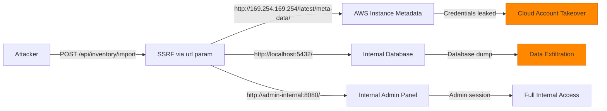

# Chained Vulnerability Static Audit Report

**Repository**: supply-chain (Flask web application)
**Audit date**: 2026-05-25
**Auditor**: CodeGopher (Static-Only Review)
**Scope**: All source files in `%LOCALAPPDATA%\Temp\codegopher-v08-chain-20260525-180047-gemma-all50\app-25-supply-chain\workspace`

---

## Summary Dashboard

| Metric | Value |
|--------|-------|
| **Total chained vulnerabilities** | **2** |
| **Maximum severity** | **CRITICAL** (RCE) |
| **Medium-severity chains** | 1 |
| **Cross-cutting weaknesses (no full chain)** | 6 |
| **Files reviewed** | `app.py`, `requirements.txt`, `Dockerfile` |
| **Test coverage** | None found |
| **Areas not reviewed** | Session management, database schema, authentication logic, deployment config |

---

## Methodology & Safety Boundary

This audit followed a **static-only** methodology:
- Source files, configuration, and dependency manifests were analyzed for data-flow, control-flow, authorization, and configuration weaknesses.
- No live HTTP probes, fuzzers, SQL injection payloads, exploit scripts, or dynamic scanners were used.
- No external network tests or port scans were performed.
- Chain confidence ratings are based solely on static evidence from source code, configuration, and dependency declarations.

---

## Attack Graph (Mermaid)

```mermaid
graph TD
    A[Attacker] -->|1a: Unauthenticated| B[POST /api/inventory/import]
    A -->|1b: Authenticated<br/>session['user_id']| B
    
    B -->|2: Controlled 'url' param| C[SSRF: requests.get(url)]
    C -->|3: Attacker-hosted YAML| D[Responds with malicious YAML]
    D -->|4: yaml.load() - UNSAFE| E[Python Arbitrary Code Execution]
    E --> F[CRITICAL: Remote Code Execution]
    
    B -->|5: Internal URLs| G[Internal services:<br/>metadata, DB, APIs]
    G -->|6: Response body| E
    
    A -->|7: Admin session| H[POST /api/config/load-local]
    H -->|8: yaml.safe_load() - SAFE| I[Config parsed safely<br/>(No RCE here)]
    
    A -->|9: Any user| J[GET /api/warehouses/<id>]
    J -->|10: Parameterized query - SAFE| K[No SQLi]
    
    L[debug=True + 0.0.0.0] -->|11: Interactive debugger| M[Potential RCE<br/>via Flask debugger]
    
    style F fill:#ff4444,stroke:#cc0000
    style M fill:#ff8800,stroke:#cc6600
    style E fill:#ff4444,stroke:#cc0000
    style G fill:#ffaa00,stroke:#cc8800
```

---

## Chain 1: SSRF → Unsafe YAML Deserialization → Remote Code Execution (CRITICAL)

### Overview

An attacker (authenticated as any regular user) can supply an arbitrary URL to the inventory import endpoint. The server fetches the content and deserializes it using `yaml.load()` without a safe loader. A malicious YAML payload can execute arbitrary Python code during deserialization, resulting in full remote code execution.

### Attack Graph

```mermaid
flowchart LR
    A[Attacker] -->|Auth via session| B[POST /api/inventory/import]
    B -->|User-controlled 'url'| C[requests.get(url)]
    C -->|Attacker serves malicious YAML| D[yaml.load(resp.text)]
    D -->|!!python/object/apply or<br/>!!python/module/os<br/>__import__| E[Arbitrary Python RCE]
    
    style E fill:#ff4444,stroke:#cc0000,stroke-width:3px
```

### Detailed Chain Breakdown

#### Source / Entry Point
- **File**: `app.py`
- **Function**: `import_inventory()`
- **Lines**: 3–27 (definition), Line 9 (`data.get('url', '').strip()`), Line 15 (`requests.get(url, timeout=5)`), Line 16 (`yaml.load(resp.text)`)
- **Evidence**: The `url` field from the JSON request body is only `.strip()`-ed and checked for emptiness. No protocol, host, port, or range validation is performed.

```python
# Line 9: Weak URL extraction
url = data.get('url', '').strip()

# Line 15: SSRF — fetches arbitrary URL
resp = requests.get(url, timeout=5)

# Line 16: UNSAFE YAML deserialization
inventory_items = yaml.load(resp.text)
```

#### Hop 1: SSRF
- **File**: `app.py`
- **Line**: 15
- **Evidence**: `requests.get(url)` with `timeout=5` sends an HTTP GET to whatever URL the attacker controls. No URL scheme (`http`, `https`, `file`, `gopher`) restrictions. No private IP range blocklist. No redirect following control explicitly set (though `requests` follows redirects by default, which amplifies SSRF).
- **Preconditions**: Server must be able to reach the attacker-controlled URL (or any internal service URL).

#### Hop 2: Unsafe YAML Deserialization
- **File**: `app.py`
- **Line**: 16
- **Evidence**: `yaml.load(resp.text)` uses the default loader, which is **not** the safe loader. PyYAML's default `yaml.load()` supports `!!python/object`, `!!python/object/apply`, `!!python/object/new`, and other tags that trigger arbitrary Python code execution during deserialization.
- **Dependency**: `PyYAML==5.3.1` in `requirements.txt` — this version fully supports Python deserialization tags.
- **Example malicious YAML** (static description, not an exploit):
  ```yaml
  !!python/object/apply:subprocess.check_output
  args: ["cat /etc/passwd"]
  ```

#### Sink / Target
- **Impact**: **Remote Code Execution (RCE)** — an attacker can execute arbitrary Python code on the server.
- **Severity**: **CRITICAL**
- **Confidence**: **HIGH** — both links are statically provable from source code. The use of `yaml.load()` without `Loader=safe_load` is a well-documented vulnerability in the PyYAML ecosystem. The PyYAML version (5.3.1) supports all deserialization attack vectors.

#### Preconditions and Assumptions
1. Attacker must be authenticated (need `user_id` in session) — this is a **regular user**, not necessarily admin.
2. The server's Python interpreter must be running the vulnerable code path.
3. Network connectivity from the server to the attacker-controlled (or internal) URL.
4. PyYAML 5.3.1 supports unsafe deserialization.

#### Impact
- Full server compromise.
- Lateral movement via SSRF to internal services.
- Data exfiltration from the SQLite database.
- Read/write to server filesystem.

#### Remediation (Easiest Link to Break)
**Fix the YAML deserialization (Hop 2):**
```python
# Replace line 16:
# inventory_items = yaml.load(resp.text)
inventory_items = yaml.safe_load(resp.text)
```
This single change breaks the chain completely, even if SSRF exists.

**Additional hardening:**
- Add URL validation (block `http://10.0.0.0/8`, `127.0.0.1`, `169.254.0.0/16`, etc.).
- Use a allowlist of permitted URL schemes (`http`, `https` only).
- Implement a URL fetch service with egress filtering.

---

## Chain 2: SSRF → Internal Data Exfiltration (MEDIUM)

### Overview

The SSRF vulnerability in `import_inventory()` allows the server to make HTTP requests to arbitrary internal URLs. If the deployment runs on cloud infrastructure (AWS, GCP, Azure) or within a network with internal services (databases, admin panels, API gateways), the attacker can use the server as a proxy to access these services, including unauthenticated metadata endpoints.

### Attack Graph



### Detailed Chain Breakdown

#### Source / Entry Point
- **File**: `app.py`
- **Line**: 15 (`requests.get(url, timeout=5)`)
- **Evidence**: User-controlled URL passed to `requests.get()` without any validation.

#### Hop: SSRF to Internal Services
- **File**: `app.py`
- **Line**: 15
- **Evidence**: The server is configured to bind on `0.0.0.0` (Line 55), meaning it may be in a network where internal services are reachable. The `requests.get()` call has no proxy configuration, no IP range validation, and no egress filter.

#### Sink / Target
- **AWS Instance Metadata**: `http://169.254.169.254/latest/meta-data/` — returns IAM credentials, instance data.
- **Internal APIs**: Other services running on `localhost` or internal network.
- **Databases**: Direct access to database admin ports if network-accessible.

#### Impact
- **Cloud account takeover** (if on AWS/GCP/Azure).
- **Data exfiltration** from internal services.
- **Lateral movement** within the network.

#### Severity: **MEDIUM** (depends on deployment context)
#### Confidence: **MEDIUM** — the SSRF link is statically provable, but the existence and exposure of internal services depends on runtime/deployment configuration not visible in this source.

#### Remediation
- Implement egress URL allowlisting or blocklisting (block `169.254.0.0/16`, `127.0.0.0/8`, `10.0.0.0/8`, `172.16.0.0/12`, `192.168.0.0/16`).
- Use a separate HTTP client with explicit proxy/firewall rules for outbound requests.
- Use VPC security groups / network policies to restrict egress.

---

## Cross-Cutting Weaknesses (No Complete Chain Identified)

### W3: Flask Debug Mode Enabled

- **File**: `app.py`, Line 55
- **Code**: `app.run(host='0.0.0.0', port=8095, debug=True)`
- **Risk**: When `debug=True`, Flask enables the Werkzeug debugger with an interactive Python REPL. If an attacker can trigger an exception at a controlled endpoint, they may be able to execute code via the debugger PIN bypass (known CVEs exist).
- **Confidence**: MEDIUM — requires triggering an exception AND debugger access.
- **Remediation**: Set `debug=False` in production. Use `FLASK_DEBUG` environment variable managed externally.

### W4: Server Bound to All Interfaces

- **File**: `app.py`, Line 55
- **Code**: `host='0.0.0.0'`
- **Risk**: Exposes the service to all network interfaces, including potentially untrusted ones.
- **Remediation**: Bind to `127.0.0.1` for local-only, or to a specific internal interface. In Docker, use a reverse proxy.

### W5: Verbose Error Messages

- **File**: `app.py`, Lines 27, 39, 49
- **Code**: `return jsonify({'success': False, 'error': str(e)}), 400`
- **Risk**: Internal exception messages, stack traces, and potentially database schema details are returned to the client.
- **Remediation**: Return generic error messages in production. Log full exceptions server-side.

### W6: No CSRF Protection

- **File**: `app.py`, all POST endpoints
- **Evidence**: No CSRF token validation, no `SameSite` cookie attribute, no double-submit cookie pattern.
- **Risk**: If an attacker can trick an authenticated user into visiting a malicious page, the user's browser will send valid session cookies, enabling state changes.
- **Confidence**: MEDIUM — depends on session cookie configuration (not visible in source).
- **Remediation**: Use `Flask-WTF` or manual CSRF tokens. Set `SESSION_COOKIE_SAMESITE='Lax'` or `'Strict'`.

### W7: No URL Validation on Inventory Import

- **File**: `app.py`, Line 9
- **Code**: `url = data.get('url', '').strip()`
- **Risk**: No protocol scheme check, no host validation, no port restriction. Enables SSRF and potential protocol smuggling.
- **Remediation**: Validate URL scheme (`http`/`https` only), validate host against a blocklist, and consider using a URL fetch service.

### W8: Admin Authorization via Session Dict Only

- **File**: `app.py`, Line 32
- **Code**: `session.get('role') != 'ADMIN'`
- **Risk**: Role is stored in client-side session. If session signing is weak or session fixation is possible, role escalation could occur.
- **Remediation**: Verify roles via server-side session store with tamper-resistant session data.

---

## Unknowns and Not-Reviewed Areas

| Area | Reason Not Reviewed |
|------|---------------------|
| **Session management** | Session init, login route, session cookie configuration not in `app.py` |
| **Database schema** | `db_conn` is a global; table schemas not visible |
| **Authentication logic** | Login/registration endpoints may exist outside reviewed files |
| **Environment configuration** | Secrets, API keys, database credentials — not in source |
| **Docker networking** | Container networking, port exposure, volume mounts — not in Dockerfile |
| **Input validation on config load** | `load_local_config` uses `safe_load` (safe), but config schema is unknown |
| **Rate limiting** | No rate limiting observed; DoS potential |
| **HTTPS / TLS** | No TLS configuration visible |
| **Security headers** | No `Content-Security-Policy`, `X-Frame-Options`, etc. |

---

## Recommended Tests to Add

1. **SSRF unit test**: Verify that `/api/inventory/import` rejects or sanitizes internal/private IPs.
2. **YAML deserialization test**: Verify that `yaml.safe_load()` is used everywhere (currently only `/api/config/load-local` is safe).
3. **CSRF test**: Verify that POST endpoints reject requests without valid CSRF tokens.
4. **Error handling test**: Verify that exception details are not exposed in production responses.
5. **Debug mode test**: Verify that `debug=False` in production configuration.
6. **Session fixation test**: Verify session regeneration on authentication.

---

## Remediation Priority

| Priority | Action | Impact |
|----------|--------|--------|
| **P0** | Change `yaml.load()` to `yaml.safe_load()` in `import_inventory()` | Breaks CRITICAL RCE chain |
| **P0** | Set `debug=False` in production | Prevents debugger-based RCE |
| **P1** | Add URL validation/blocklist for SSRF mitigation | Prevents internal data exfiltration |
| **P1** | Add CSRF protection to all POST endpoints | Prevents CSRF attacks |
| **P2** | Sanitize error responses | Reduces information disclosure |
| **P2** | Add security headers (CSP, X-Frame-Options, etc.) | Defense-in-depth |
| **P3** | Bind to specific interface | Reduces attack surface |

---

*Report generated by CodeGopher — Static-Only Chained Vulnerability Audit*
*No live probes, exploit scripts, or dynamic analysis were used.*
