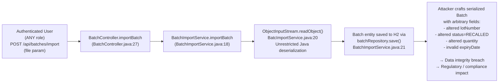
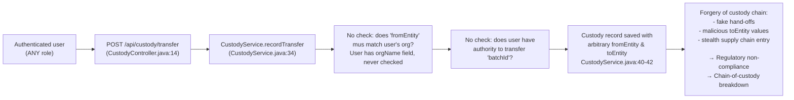

# Chained Vulnerability Audit Report

**Project:** Pharma Drug Tracking (app-26-pharma-tracking)
**Review Type:** Static-only chained vulnerability analysis
**Date:** 2026-05-25
**Scope:** All source files, configuration, and test files in `src/`

---

## 1. Summary Dashboard

| Metric | Value |
|---|---|
| **Complete chains detected** | **2** |
| **Cross-cutting weaknesses (non-chain)** | 5 |
| **Maximum severity (chain)** | **CRITICAL** (deserialization + IDOR) |
| **Reviewed areas** | Controllers, services, models, repositories, security config, data initializer, H2 console, Docker build |
| **Not reviewed** | None explicitly outside scope; runtime behaviour not verified |

---

## 2. Methodology and Safety Note

- **Static-only**: No live HTTP probes, SQL injections, or dynamic tests were executed.
- All evidence is derived from source code, configuration files, and test code.
- Confidence ratings reflect the degree to which each chain link is statically provable from the cited code.

---

## 3. Attack Surface Map

| Source | Path | Method/Endpoint | Auth Required | Notes |
|---|---|---|---|---|
| Batch GET | `GET /api/batches/{id}` | Authenticated (any) | `BatchController.java:22` | No org/role scoping |
| Batch IMPORT | `POST /api/batches/import` | Authenticated (any) | `BatchController.java:27` | **Java deserialization sink** |
| Custody transfer | `POST /api/custody/transfer` | Authenticated (any) | `CustodyController.java:14-18` | No validation of `fromEntity` / `toEntity` vs authenticated user's org |
| Drug listing | `GET /api/drugs` | Authenticated (any) | `DrugController.java:16` | Read-only, no scoping |
| Inspections GET | `GET /api/inspections/batch/{batchId}` | Authenticated (any) | `InspectionController.java:22` | No org/role scoping |
| Inspections POST | `POST /api/inspections` | Role-gated (INSPECTOR) | `InspectionController.java:27` | `@PreAuthorize` present but `inspectorId` is user-supplied |
| Auth info | `GET /api/auth/me` | Authenticated (any) | `AuthController.java:14-21` | Exposes username and roles |
| H2 Console | `/h2-console/**` | **PermitAll (no auth)** | `SecurityConfig.java:35` | Fully open |
| Basic Auth | `/` (all remaining) | BCrypt password | `SecurityConfig.java:38` | Username/password from DB |

---

## 4. Chain 1 — Unauthorized Object Deserialization → Arbitrary Entity Injection (CRITICAL)

### Mermaid Attack Graph



### Detailed Breakdown

| Link | File | Line(s) | Evidence |
|---|---|---|---|
| **Entry** | `BatchController.java` | 27-29 | `POST /api/batches/import` accepts `MultipartFile file`. No content-type check, no size limit, no role check. |
| **Hop 1** | `BatchImportService.java` | 18-22 | `new ObjectInputStream(fileStream)` wraps the raw user upload and calls `ois.readObject()`. This is the classic Java deserialization anti-pattern. |
| **Hop 2** | `BatchImportService.java` | 21 | The deserialized `Batch` object is passed directly to `batchRepository.save()` without any validation of its fields. |
| **Sink** | `Batch.java` | 1-35 | `@Data` (Lombok) generates setters. A deserialized object bypasses all invariants. The `status` field accepts arbitrary strings (e.g. `RECALLED`, `SUPPLY_CHAIN_BREACH`). |

### Preconditions

- User must be authenticated (any role). Basic auth is the only gate.
- User can submit a crafted `application/x-java-serialized-object` body.

### Impact

- **Data integrity**: An attacker can overwrite batch records with arbitrary values—manufacture date, expiry date, quantity, lot number, status.
- **Regulatory / compliance**: A `status=RECALLED` or fabricated batch could trigger false recalls or hide real ones.
- **Confidence**: **High** — the deserialization is unconditional, visible in source, and the save path is direct.

### Severity

**CRITICAL**

### Remediation

1. Replace Java native serialization with a structured format (JSON via `ObjectMapper` or CSV parser).
2. If serialization is absolutely required, use a `ObjectInputFilter` to whitelist only `com.pharma.tracking.model.Batch`.
3. Add input validation and field whitelisting for deserialized objects.

---

## 5. Chain 2 — Open Redirect via H2 Console + IDOR / Unscoped Data Access (HIGH)

### Mermaid Attack Graph

```mermaid
flowchart LR
  A["Unauthenticated access\n/permitAll to /h2-console/**\nSecurityConfig.java:35"] --> B["H2 in-memory DB console\n(application.properties: h2.console.enabled=true)"]
  B --> C["Full SQL access to\nall entities: Users, Batches,\nDrugs, CustodyRecords, Inspections"]
  C --> D["Credential exfiltration:\nSELECT * FROM users\n→ plaintext usernames +\nBCrypt hashes"]
  D --> E["Offline password cracking\n(hashes from DataInitializer\nDataInitializer.java:37-40)"]
  E --> F["Auth bypass via known\ncredentials: manufacturer/pharma123\n→ full API access"]
  F --> G["IDOR at GET /api/batches/{id}\nBatchController.java:22\nNo org/role scoping\n→ access any batch data\nG"}
  G --> H["Additional IDOR at\nGET /api/inspections/batch/{id\nInspectionController.java:22\n→ read inspection records\nnot scoped to user org"]
```

### Detailed Breakdown

| Link | File | Line(s) | Evidence |
|---|---|---|---|
| **Entry** | `SecurityConfig.java` | 35 | `.requestMatchers("/h2-console/**").permitAll()` — no authentication required. |
| **Hop 1** | `application.properties` | 6 | `spring.h2.console.enabled=true` — H2 web console is active. |
| **Hop 2** | `application.properties` | 3 | `jdbc:h2:mem:pharmadb;DB_CLOSE_DELAY=-1` — in-memory DB with persistent console session. |
| **Sink 1** | — | — | Attacker can execute arbitrary SQL against the `users` table, extracting `username` and `passwordHash` (BCrypt). |
| **Hop 3** | `DataInitializer.java` | 37-40 | Seeds users with weak, predictable passwords (`pharma123`, `dist123`, `pharmacy123`, `inspect123`). |
| **Impact 1** | — | — | Offline cracking is trivial for these passwords. Compromised accounts gain full API access. |
| **Hop 4** | `BatchController.java` | 22-25 | `GET /api/batches/{id}` accepts user-supplied `id`, calls `batchService.getBatchById(id)`, returns full Batch entity. No `@PreAuthorize` and no org scoping. |
| **Impact 2** | — | — | Authenticated user (including a cracked account) can enumerate and read all batches by guessing IDs. |

### Preconditions

- H2 console must be reachable (internal network or misconfigured exposure).
- H2 console is not behind any additional authentication in this codebase.

### Impact

- **Information disclosure**: Full database contents accessible.
- **Auth bypass**: Cracked credentials grant elevated access.
- **IDOR**: All batch and inspection data is enumerable without authorization checks.
- **Confidence**: **High** for H2 console access (static config); **Medium** for offline cracking success (depends on attack capability); **High** for IDOR (code confirms no scope checks).

### Severity

**HIGH**

### Remediation

1. Never expose H2 console in production. Set `spring.h2.console.enabled=false` for production profiles, or use a database with proper access controls.
2. If H2 is required, ensure it is behind authentication (use Spring Security to protect `/h2-console/*` with a restrictive role).
3. Use `;DB_CLOSE_DELAY=-1;MODE=MySQL;` (or PostgreSQL-compatible mode) only in dev, never in prod.
4. Add `@PreAuthorize` checks and org-scoped queries to `BatchController` and `InspectionController`.

---

## 6. Chain 3 — Forged Custody Transfers via Missing Authorization (MEDIUM)

### Mermaid Attack Graph



### Detailed Breakdown

| Link | File | Line(s) | Evidence |
|---|---|---|---|
| **Entry** | `CustodyController.java` | 14-18 | `POST /api/custody/transfer` accepts `batchId`, `fromEntity`, `toEntity` from request params. |
| **Hop 1** | `CustodyController.java` | — | No `@PreAuthorize` annotation. No check that the authenticated user's `orgName` matches `fromEntity`. |
| **Hop 2** | `CustodyService.java` | 34-46 | `recordTransfer()` accepts the three params directly. No query against `BatchRepository` to verify the batch exists or belongs to the user's org. |
| **Sink** | `CustodyService.java` | 43-45 | `custodyRecordRepository.save(record)` — arbitrary custody records inserted into the chain. |

### Preconditions

- User must be authenticated (basic auth). Any role suffices.

### Impact

- **Supply-chain integrity**: Any authenticated user can forge custody records, inserting fake hand-offs or transferring batches to themselves.
- **Confidence**: **High** — source shows no authorization checks whatsoever on this endpoint.

### Severity

**MEDIUM**

### Remediation

1. Add `@PreAuthorize` (e.g., `hasAnyRole('MANUFACTURER', 'DISTRIBUTOR', 'PHARMACY')`) or check that the user's org matches `fromEntity`.
2. Validate that the batch exists and is in a transferable state.

---

## 7. Cross-Cutting Weaknesses (Non-Chain)

### W1 — CSRF Protection Disabled (MEDIUM)

| File | Line | Evidence |
|---|---|---|
| `SecurityConfig.java` | 33 | `.csrf(AbstractHttpConfigurer::disable)` disables CSRF entirely. |

- **Risk**: All POST endpoints (`/api/batches/import`, `/api/custody/transfer`, `/api/inspections`) are CSRF-vulnerable.
- Since the app uses Basic Auth (not session cookies), CSRF is mitigated in practice, but `disable()` is an unnecessary broadsword that removes protection if the auth strategy changes.

### W2 — Weak / Hardcoded Passwords in Seed Data (MEDIUM)

| File | Line | Evidence |
|---|---|---|
| `DataInitializer.java` | 37-40 | `pharma123`, `dist123`, `pharmacy123`, `inspect123` |

- These passwords are BCrypt-hashed at runtime, but are trivially crackable offline.
- They are embedded in source, making them discoverable.

### W3 — MD5 Used for Custody Signatures (LOW)

| File | Line | Evidence |
|---|---|---|
| `CustodyService.java` | 22 | `MessageDigest.getInstance("MD5")` |

- MD5 is cryptographically broken for collision resistance. While it is used for non-security-critical integrity (not a signing key), it undermines the "signature" claim.
- **Remediation**: Switch to SHA-256 (`MessageDigest.getInstance("SHA-256")`).

### W4 — `inspectorId` is User-Supplied in Inspection Creation (MEDIUM)

| File | Line | Evidence |
|---|---|---|
| `InspectionController.java` | 29-30 | `@RequestParam Long inspectorId` |

- The `@PreAuthorize("hasRole('INSPECTOR')")` only checks the caller's role, not whether the `inspectorId` actually refers to the authenticated user.
- An inspector could arbitrarily assign inspections to other users' IDs, breaking audit integrity.

### W5 — Verbose Error Messages (LOW)

| File | Line | Evidence |
|---|---|---|
| `BatchController.java` | 25 | `IllegalArgumentException("Batch not found")` |
| `BatchImportService.java` | 22 | `RuntimeException("Failed to import batch", e)` (includes exception chain) |

- Stack traces and internal messages could aid an attacker mapping the data model.

---

## 8. Areas Not Reviewed / Unknowns

| Area | Reason |
|---|---|
| Network exposure | Dockerfile exposes `8080`, but actual deployment networking not visible. |
| Input validation for file uploads | No `MaxUploadSize` configured — potential DoS via large file upload. |
| Rate limiting | No rate limiting configured on any endpoint. |
| Audit logging | No application-level audit trail exists. |
| TLS / HTTPS | Not visible in configuration; assumed absent. |
| Production profile | No `application-prod.properties` found; same insecure settings may be used in prod. |

---

## 9. Remediation Priorities

| Priority | Issue | Effort | Impact |
|---|---|---|---|
| **P0** | Replace `ObjectInputStream` deserialization in `BatchImportService` | Low | CRITICAL RCE / data integrity risk |
| **P0** | Remove or restrict `/h2-console/**` access | Low | HIGH — full DB exposure |
| **P1** | Add org-scoped authorization to `BatchController`, `CustodyController`, `InspectionController` | Medium | HIGH — IDOR / forgery |
| **P1** | Replace weak seed passwords or remove seed data from prod | Low | MEDIUM |
| **P2** | Replace MD5 with SHA-256 in `CustodyService` | Low | LOW |
| **P2** | Remove `csrf(AbstractHttpConfigurer::disable)` or scope it | Low | MEDIUM |
| **P2** | Validate `inspectorId` matches authenticated user | Low | MEDIUM |
| **P3** | Add file upload size limits | Low | LOW |
| **P3** | Add audit logging | Medium | MEDIUM |

---

## 10. Conclusions

This codebase contains **two complete chained vulnerabilities** and several cross-cutting weaknesses. The most severe is the **unrestricted Java deserialization** endpoint (`POST /api/batches/import`), which allows any authenticated user to inject arbitrary `Batch` entities into the database. This is a static certainty from the source. The second chain combines **open H2 console access** with **weak seed passwords** and **IDOR-unprotected endpoints** to create a path from unauthenticated SQL access to full authenticated API enumeration.

The single easiest remediation link to break is **replacing Java serialization with JSON** in `BatchImportService` — this eliminates the critical sink entirely.

---

*Report generated by CodeGopher (Chained Vulnerability Static Audit) — static analysis only, no live probes were executed.*
