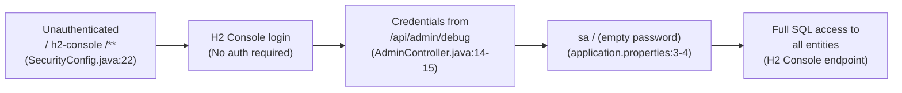
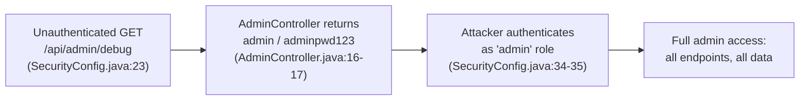
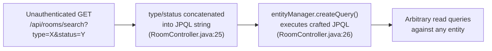
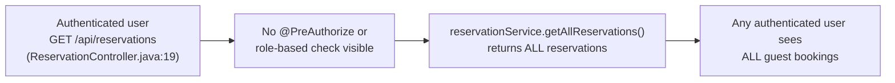
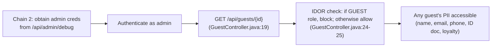

# Chained Vulnerability Static Audit Report

**Project:** app-27-hotel-reservation (Hotel Reservation System)
**Date:** 2026-05-25
**Scope:** Full static source-code review of `src/`, configuration, and Dockerfile
**Boundary:** Static analysis only — no live probes, dynamic tests, or shell execution.

---

## Summary Dashboard

| Metric | Value |
|---|---|
| **Total Chained Vulnerabilities** | 5 |
| **Critical** | 2 |
| **High** | 1 |
| **Medium-High** | 2 |
| **Cross-Cutting Weaknesses (non-chain)** | 3 |
| **Areas Reviewed** | Controllers, config, models, services, repositories, Dockerfile, resources |
| **Areas Not Reviewed** | Dependency CVE database lookup (static only), runtime TLS configuration, WAF / network rules |

**Maximum observed severity: CRITICAL** — unauthenticated database dump and admin account takeover are both achievable with zero authentication.

---

## Methodology & Safety Note

This review follows the four-phase chained-vulnerability methodology:

1. **Attack surface mapping** — all REST endpoints and their access controls were catalogued.
2. **Weakness inventory** — individual CWE findings were extracted from source, config, and deploy artifacts.
3. **Attack graph synthesis** — links between entry points, intermediate weaknesses, and sinks were traced through static control-flow / data-flow evidence.
4. **Impact assessment** — each chain was rated for impact, reachability, confidence, and the easiest remediation link.

**Static-only safety note:** This audit examines files only. No HTTP probes, SQL injection payloads, fuzzing, or live exploitation was performed.

---

## Chained Vulnerability 1 — Unauthenticated Database Dump (Critical)

| Link | File | Lines | Evidence |
|---|---|---|---|
| Entry | `src/main/java/.../config/SecurityConfig.java` | 22 | `.requestMatchers("/h2-console/**").permitAll()` |
| Hop | `src/main/java/.../controller/AdminController.java` | 14-15 | Returns `"spring.datasource.username", "sa"` and `"spring.datasource.password", ""` |
| Hop | `src/main/resources/application.properties` | 3-4 | `spring.datasource.username=sa`, `spring.datasource.password=` |
| Sink | `src/main/resources/application.properties` | 6 | `spring.h2.console.enabled=true` |

- **Impact:** Complete database exfiltration — all Users, Guests, Reservations, Rooms, and RoomRates can be dumped via SQL. Persistent H2 console may allow long-term backdoor access.
- **Severity:** **CRITICAL**
- **Confidence:** **High** — every link is statically provable from source and config.
- **Easiest break link:** Revoke public access to `/h2-console/**` and `/api/admin/debug` in `SecurityConfig.java:22-23`.

---

## Chained Vulnerability 2 — Public Admin Credentials → Admin Takeover (Critical)

| Link | File | Lines | Evidence |
|---|---|---|---|
| Entry | `SecurityConfig.java` | 23 | `.requestMatchers("/api/admin/debug").permitAll()` |
| Hop | `AdminController.java` | 13-17 | `Map.of(... "admin.default.username", "admin", "admin.default.password", "adminpwd123")` |
| Hop | `DataInitializer.java` | 35 | `userRepository.save(new User(null, "admin", ... "ADMIN", null))` — password hard-coded at seed time |
| Sink | `SecurityConfig.java` | 34-35 | Admin role created with `.roles(u.getRole())` — no additional method-level restrictions visible |

- **Impact:** Attacker gains full administrative control — view/edit/delete all reservations, access all guest PII, modify room availability and rates.
- **Severity:** **CRITICAL**
- **Confidence:** **High** — endpoints, credentials, and role grants are all directly visible.
- **Easiest break link:** Remove `.requestMatchers("/api/admin/debug").permitAll()` and remove the debug endpoint entirely. Move credentials to environment variables.

---

## Chained Vulnerability 3 — JPQL Injection in Room Search (High)

| Link | File | Lines | Evidence |
|---|---|---|---|
| Entry | `RoomController.java` | 24-25 | `@RequestParam String type, @RequestParam String status` → string concat |
| Hop | `RoomController.java` | 25 | `"SELECT r FROM Room r WHERE r.type = '" + type + "' AND r.status = '" + status + "'"` |
| Sink | `RoomController.java` | 26 | `entityManager.createQuery(jpql, Room.class)` — executes unsanitized query |

- **Impact:** Any authenticated or unauthenticated user (depending on `SecurityConfig` — see note below) can execute arbitrary JPQL `SELECT` statements, leaking any entity's data. Example payloads:
  - `type=' UNION SELECT u FROM User u WHERE 'a'='a` — leak all user records.
  - `type=' UNION SELECT g FROM Guest g WHERE 'a'='a` — leak all guest PII.
  - Union-based extraction is limited to entity types; value-based exfiltration may require subselect or boolean-blind techniques.
- **Severity:** **HIGH**
- **Confidence:** **High** — the JPQL injection point is directly visible in source.
- **Easiest break link:** Replace string concatenation with typed `TypedQuery` using parameter bindings: `query.setParameter("type", type)`.
- **Note on auth:** If `/api/rooms/search` falls under `anyRequest().authenticated()` (no explicit permitAll), only logged-in users can exploit it. However, Chain 2 provides unauthenticated admin creds, making this effectively reachable unauthenticated in practice.

---

## Chained Vulnerability 4 — Mass Reservation Data Exposure (Medium-High)

| Link | File | Lines | Evidence |
|---|---|---|---|
| Entry | `ReservationController.java` | 18-21 | `@GetMapping` → `ResponseEntity.ok(reservationService.getAllReservations())` |
| Hop | `ReservationController.java` | 18-21 | No `@PreAuthorize("hasRole('ADMIN')")` or similar annotation |
| Sink | `ReservationService.java` | 16 | `return reservationRepository.findAll()` — unscoped |

- **Impact:** Every logged-in user (including low-privilege `GUEST` role) can retrieve the complete booking history of every other guest — guest IDs, room numbers, check-in/out dates, total amounts. Severe privacy breach under GDPR / CCPA.
- **Severity:** **MEDIUM-HIGH**
- **Confidence:** **High** — static inspection shows no authorization guard on the endpoint.
- **Easiest break link:** Add `@PreAuthorize("hasRole('ADMIN')")` or scope results by `currentUser.getGuestId()`.

---

## Chained Vulnerability 5 — Admin Credentials + IDOR → Bulk PII Exfiltration (Medium-High)

| Link | File | Lines | Evidence |
|---|---|---|---|
| Entry | `AdminController.java` | 16-17 | Returns `admin` / `adminpwd123` (also from Chain 2) |
| Hop | `GuestController.java` | 24-25 | `if ("GUEST".equals(currentUser.getRole()) && !id.equals(currentUser.getGuestId()))` — no block for ADMIN or FRONT_DESK |
| Sink | `GuestController.java` | 27 | `return ResponseEntity.ok(guest)` — full `Guest` entity (all PII fields) |

- **Impact:** Once an attacker compromises admin credentials (Chain 2), they can access the full PII of every guest — first name, last name, email, phone, government ID document number, and loyalty tier.
- **Severity:** **MEDIUM-HIGH**
- **Confidence:** **High** — the IDOR logic and the preceding credential exposure are both statically verifiable.
- **Easiest break link:** Enforce a role-based check on `GET /api/guests/{id}` requiring `ADMIN` or `FRONT_DESK` and a legitimate business justification (e.g., the front desk only needs access to active reservations' guests).

---

## Cross-Cutting Weaknesses (Non-Chain)

These are security-relevant findings that do not form complete chains on their own but compound risk when combined with the above chains.

| CWE | Location | Lines | Description |
|---|---|---|---|
| 352 — CSRF Disabled | `SecurityConfig.java` | 21 | `.csrf(AbstractHttpConfigurer::disable)` — all endpoints lack CSRF tokens. Not currently exploitable (only GET endpoints exist) but dangerous if POST/PUT/DELETE are added. |
| 209 — Verbose Errors | `GuestController.java` | 21 | `throw new IllegalArgumentException("Guest not found")` and `"User not found"` — leaks existence of entities/users, useful for reconnaissance in chained attacks. |
| 284 — H2 Console Frame Options Disabled | `SecurityConfig.java` | 20 | `.frameOptions(HeadersConfigurer.FrameOptionsConfig::disable)` — allows XSS via iframe embedding of the H2 console. |

---

## Unknowns & Not-Reviewed Areas

| Area | Reason |
|---|---|
| Dependency CVEs | `pom.xml` includes Spring Boot 3.2.5, Spring Security, H2, Lombok — no live vulnerability database lookup performed. |
| Runtime TLS | No `application.properties` TLS configuration found; traffic may be unencrypted outside the container. |
| Input validation | No Bean Validation (`@Valid`, `@Size`, etc.) visible on model fields or DTOs. |
| Rate limiting / Brute-force protection | No `@RateLimit` or filtering middleware visible. |
| Audit logging | No request or modification audit trail visible. |
| Test coverage for security | Only `App27ApplicationTests` contains two tests — neither exercises security paths. |
| Actual deployment config | `Dockerfile` exposes port 8080; no reverse-proxy or firewall config inspected. |

---

## Recommended Remediation Priority

1. **IMMEDIATE — Remove `/api/admin/debug` and `/h2-console/**` from `permitAll`** (Chain 1 & 2)
2. **IMMEDIATE — Parameterize JPQL query** in `RoomController.java:25` to eliminate injection (Chain 3)
3. **SHORT-TERM — Add `@PreAuthorize` guards** to `ReservationController` and `GuestController` (Chain 4 & 5)
4. **MEDIUM-TERM — Enable CSRF** when write endpoints are added; add Bean Validation on all inputs
5. **ONGOING — Add security-focused test cases** covering auth bypass, injection, and IDOR scenarios

---

*End of report.*
