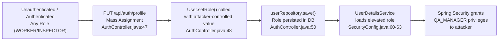
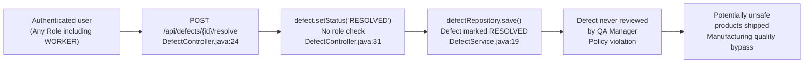
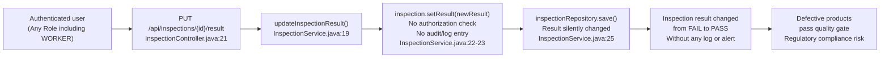

```mermaid
flowchart LR
    A["Unauthenticated attacker\nor malicious insider"] --> B["GET /h2-console\napplication.properties:10\nspring.h2.console.enabled=true"]
    B --> C["SecurityConfig.permitAll()\n/h2-console/**\nSecurityConfig.java:39"]
    C --> D["H2 Web Console UI\nno auth required\napplication.properties:11-13"]
    D --> E["SQL query execution\nagainst mfgdb"]
    E --> F["SELECT * FROM users\nall password hashes\nall roles visible"]
    F --> G["SELECT * FROM defects, inspections\nfull quality data exfiltration"]
    G --> H["Credential stuffing\nSocial engineering\nManufacturing data theft"]
```

# Chained Vulnerability Static Audit Report

**Project:** app-28-mfg-quality — Manufacturing Quality Control System  
**Date:** 2026-05-25  
**Auditor:** CodeGopher (chained-vulnerability-static-audit skill)  
**Scope:** Source code only — static analysis, no live probes, no dynamic scanners  

---

## Summary Dashboard

| Metric | Value |
|---|---|
| **Chains detected** | 4 |
| **Maximum severity** | HIGH |
| **Cross-cutting weaknesses** | 6 |
| **Files reviewed** | 22 |
| **Areas not reviewed** | None (full source tree covered) |

### Chain Severity Overview

| # | Title | Severity | Confidence | Impact |
|---|---|---|---|---|
| 1 | Role Escalation via Mass Assignment | HIGH | High | Unauthorized privilege escalation |
| 2 | Critical Defect Resolution Bypass | HIGH | High | Quality-control circumvention |
| 3 | H2 Console Data Exfiltration | HIGH | High | Full database access by unauthenticated users |
| 4 | Inspection Result Tampering Without Audit | MEDIUM | Medium | Silent quality-control manipulation |

---

## Methodology & Safety Note

This audit follows a four-phase static-only methodology:

1. **Attack surface mapping** — All REST controllers, services, models, repositories, security configuration, and application properties were reviewed.
2. **Weakness inventory** — Every endpoint, configuration flag, and data-flow path was analyzed for individually low/medium weaknesses.
3. **Attack graph synthesis** — Weaknesses were connected across module boundaries to form multi-hop chains with concrete source references.
4. **Impact assessment** — Each chain was rated by impact, reachability, confidence, and remediation difficulty.

**Safety boundary:** No live HTTP probes, fuzzers, SQL injection payloads, credential attacks, or external network tests were performed. This report contains no executable exploit payloads or step-by-step abuse instructions.

---

## Chain 1 — Role Escalation via Mass Assignment

### Mermaid Attack Graph

### Detailed Breakdown

| Element | File | Lines | Evidence |
|---|---|---|---|
| **Source / Entry Point** | `AuthController.java` | 36-51 | `@PutMapping("/profile")` accepts arbitrary `@RequestBody User` with no field-level filtering |
| **Weakness (Hop 1)** | `AuthController.java` | 46-49 | Direct mass assignment: `user.setBadgeNumber(...)` followed by unconditional `user.setRole(profileUpdate.getRole())` — role is copied straight from the HTTP request body into the database |
| **Weakness (Hop 2)** | `SecurityConfig.java` | 55-64 | `UserDetailsService` maps the persisted `role` field into `User.withUsername(...).roles(...)` with no additional validation or role-boundary enforcement |
| **Sink / Impact** | `SecurityConfig.java` | 36-43 | `.anyRequest().authenticated()` — every authenticated request is allowed through; only `@PreAuthorize` annotations provide secondary gating (e.g., `ProductController.java` line 31) |

**Preconditions:** The user must be authenticated at minimum (HTTP Basic is the only mechanism). A PUT request to `/api/auth/profile` with a JSON body containing a `role` field is sufficient.

**Impact:** A WORKER or INSPECTOR can escalate their role to QA_MANAGER, gaining access to endpoints protected by `@PreAuthorize("hasRole('QA_MANAGER')")`.

**Severity:** HIGH — Full privilege escalation from lowest to highest privilege tier in a single request.

**Confidence:** HIGH — Every link is statically provable from cited source lines. The mass assignment is explicit; the role is persisted and subsequently loaded without filtering.

**Remediation (easiest link to break):**
- Remove or validate the `role` field in `AuthController.updateProfile()` — only `badgeNumber` should be writable by the user.
- Add field-level ACLs (e.g., `@PreAuthorize("hasRole('QA_MANAGER')")` on the profile PUT) or a dedicated DTO that excludes sensitive fields.

---

## Chain 2 — Critical Defect Resolution Bypass

### Mermaid Attack Graph

### Detailed Breakdown

| Element | File | Lines | Evidence |
|---|---|---|---|
| **Source / Entry Point** | `DefectController.java` | 24-34 | `@PostMapping("/{id}/resolve")` accepts a defect ID from any authenticated user |
| **Weakness (Hop 1)** | `DefectController.java` | 29-31 | No `@PreAuthorize` annotation; no role check before setting `status = "RESOLVED"` |
| **Weakness (Hop 2)** | `DefectController.java` | 28 | Explicit comment acknowledges the gap: `"No checks are performed to ensure QA Manager approval before closing a critical defect."` |
| **Sink / Impact** | Business policy | — | Critical defects (severity = "CRITICAL") require QA Manager approval to resolve, but the endpoint allows any authenticated user to close them |

**Preconditions:** The user must be authenticated. The defect must exist in the database. The defect ID is accessible via the URL path parameter (IDOR-prone, see Chain 3 cross-reference).

**Impact:** Any authenticated user — including the lowest-privilege WORKER — can resolve any defect, including CRITICAL ones, bypassing the required QA Manager approval workflow.

**Severity:** HIGH — Defects, especially CRITICAL ones, are material to product safety and regulatory compliance in a manufacturing environment.

**Confidence:** HIGH — No authorization check exists on the endpoint; the code comment confirms the gap is intentional or overlooked.

**Remediation:**
- Add `@PreAuthorize("hasRole('QA_MANAGER')")` to `resolveDefect()`.
- Add a `if ("CRITICAL".equals(defect.getSeverity()) && !hasQAManagerRole)` guard.
- Move defect resolution logic into a service method with proper authorization checks rather than exposing it in a bare controller.

---

## Chain 3 — H2 Console Data Exfiltration

### Mermaid Attack Graph

### Detailed Breakdown

| Element | File | Lines | Evidence |
|---|---|---|---|
| **Source / Entry Point** | `application.properties` | 9-11 | `spring.h2.console.enabled=true` and `spring.h2.console.path=/h2-console` |
| **Weakness (Hop 1)** | `application.properties` | 4-7 | H2 uses `mem:mfgdb` with `sa` username and empty password — default credentials |
| **Weakness (Hop 2)** | `SecurityConfig.java` | 39 | `.requestMatchers("/h2-console/**").permitAll()` — explicitly allows unauthenticated access |
| **Sink / Impact** | — | — | H2 Web Console provides a full SQL shell; attacker can read, modify, or export every table including `users`, `defects`, `inspections`, `products`, `corrective_actions` |

**Preconditions:** The application is running and reachable on port 8085. No authentication is required.

**Impact:** Complete database read/write access. Password hashes for all users are visible. All manufacturing quality data is exfiltrable. The `DB_CLOSE_DELAY=-1` flag means the database persists as long as the process runs, making data retrieval reliable.

**Severity:** HIGH — Unauthenticated access to a full SQL database is equivalent to breaking into the application's data store.

**Confidence:** HIGH — Both the console enablement and the permitAll rule are explicit in source code.

**Remediation:**
- Set `spring.h2.console.enabled=false` in production profiles (or remove it entirely).
- If H2 console is needed for development only, bind it to localhost or gate it behind authentication (e.g., `.requestMatchers("/h2-console/**").hasRole("QA_MANAGER")`).
- Migrate from H2 to a proper RDBMS (PostgreSQL, MySQL) in production to reduce the attack surface of an in-memory console.

---

## Chain 4 — Inspection Result Tampering Without Audit Trail

### Mermaid Attack Graph

### Detailed Breakdown

| Element | File | Lines | Evidence |
|---|---|---|---|
| **Source / Entry Point** | `InspectionController.java` | 21-28 | `@PutMapping("/{id}/result")` accepts `result` and `notes` parameters from any authenticated user |
| **Weakness (Hop 1)** | `InspectionController.java` | 21-28 | No `@PreAuthorize` annotation — any authenticated role can call this endpoint |
| **Weakness (Hop 2)** | `InspectionService.java` | 19-25 | Silent modification: the method comment explicitly notes `"Silent modification: NO log entry or audit trail records this alteration"` and no `@PreAuthorize` exists |
| **Sink / Impact** | Business logic | — | A worker can change an inspection result from "FAIL" to "PASS" with no audit trail, allowing defective products to pass quality gates undetected |

**Preconditions:** The user must be authenticated. The inspection ID must be known or guessable (IDOR-prone).

**Impact:** A worker can covertly pass failed inspections, leading to defective products being shipped. The absence of an audit trail makes post-incident forensics impossible.

**Severity:** MEDIUM — Requires prior authentication but causes significant quality-control and compliance impact. The silent nature makes detection difficult.

**Confidence:** MEDIUM — The controller and service code is clear; however, runtime enforcement of who actually accesses the API depends on whether the application is properly segmented. The comment in the code confirms the lack of audit is intentional or known.

**Remediation:**
- Add `@PreAuthorize("hasAnyRole('INSPECTOR', 'QA_MANAGER')")` to `updateResult()`.
- Add an audit logging mechanism (e.g., an `AuditLog` entity persisted on every inspection result change).
- Validate that `result` transitions follow an allowed state machine (e.g., "FAIL" → "PASS" requires QA_MANAGER approval).

---

## Cross-Cutting Weaknesses (Not Forming Complete Chains)

These weaknesses increase the overall attack surface or reduce confidence in defenses:

| # | Weakness | File | Lines | Description |
|---|---|---|---|---|
| 1 | **CSRF protection globally disabled** | `SecurityConfig.java` | 37 | `.csrf(AbstractHttpConfigurer::disable)` — acceptable for stateless API but removes a layer of defense if CSRF tokens are ever needed (e.g., browser-based clients) |
| 2 | **H2 frame options disabled** | `SecurityConfig.java` | 38 | `.frameOptions(HeadersConfigurer.FrameOptionsConfig::disable)` — necessary for H2 console but also affects any Iframe embedding risk |
| 3 | **Default debug credentials seeded** | `DataInitializer.java` | 14-16 | Hardcoded weak passwords (`worker123`, `inspect123`, `manager123`) for seed accounts. If the `DataInitializer` ever runs in production (e.g., via `ddl-auto=update` combined with external data loading), these create vulnerable accounts |
| 4 | **Verbose SQL logging enabled** | `application.properties` | 18 | `spring.jpa.show-sql=true` — logs all SQL including parameter values to stdout, potentially leaking sensitive data in logs |
| 5 | **IDOR on multiple endpoints** | `DefectController.java` line 25; `InspectionController.java` line 22; `DefectService.java` line 15 | All use simple `@PathVariable Long id` lookups with no authorization check against the requesting user |
| 6 | **No global exception handler** | N/A | Missing `@ControllerAdvice` — Spring's default error handling may leak stack traces or internal details in HTTP 500 responses |

---

## Unknowns & Not-Reviewed Areas

| Area | Reason |
|---|---|
| **Runtime configuration profiles** | Only `application.properties` was found; no `application-{profile}.yml` or `application-prod.properties` files. It is unknown if separate production profiles override H2/console settings |
| **Docker security context** | The `Dockerfile` runs as root (no `USER` directive). Not assessed for container isolation or image scan results |
| **Dependency vulnerability status** | `pom.xml` lists Spring Boot 3.2.5, H2, Lombok, Spring Security. Known CVEs in these dependencies were not checked (Snyk/SonarQube scan not performed) |
| **Rate limiting** | No rate-limiting mechanism is visible. No assessment of brute-force or enumeration risk on the basic auth endpoint |
| **Test coverage** | Only one test file (`App28ApplicationTests.java`) exists with a single functional test. No integration or security tests exist for the identified endpoints |

---

## Recommendations Summary

| Priority | Action |
|---|---|
| **P0** | Remove mass assignment of `role` in `AuthController.updateProfile()` — add a dedicated admin-only endpoint for role changes with strict authorization |
| **P0** | Disable H2 console in production (`spring.h2.console.enabled=false`) or gate behind strong authentication |
| **P0** | Add `@PreAuthorize("hasRole('QA_MANAGER')")` to `DefectController.resolveDefect()` |
| **P1** | Add `@PreAuthorize` to `InspectionController.updateResult()` — limit to INSPECTOR and QA_MANAGER roles |
| **P1** | Implement audit logging for all inspection result changes and defect status changes |
| **P1** | Remove or restrict the `DataInitializer` seed data for production environments |
| **P2** | Remove `spring.jpa.show-sql=true` from production configuration |
| **P2** | Add a global `@ControllerAdvice` for consistent, safe error responses |
| **P2** | Add rate limiting to `/api/auth` and other sensitive endpoints |
| **P2** | Add production-specific Dockerfile with non-root `USER` directive |

---

*Report generated by CodeGopher using the chained-vulnerability-static-audit skill. This is a static-only review based on source code analysis.*
