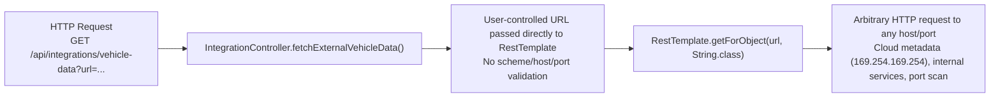
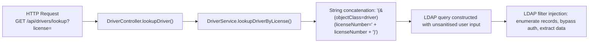
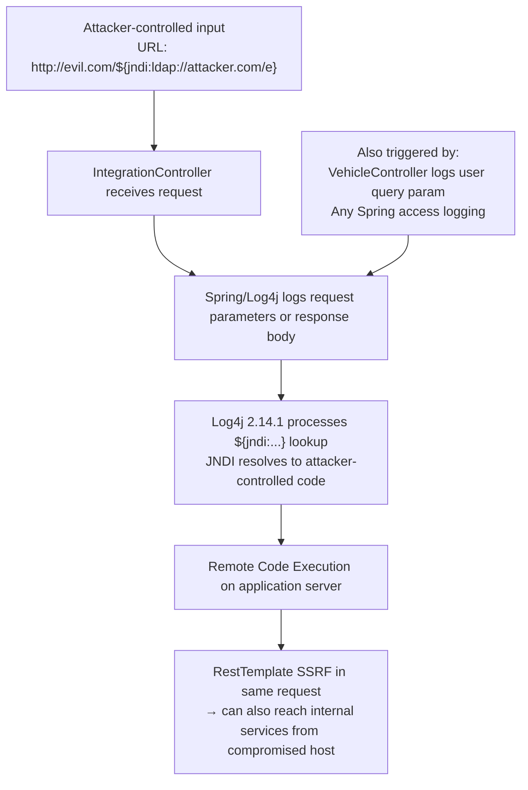
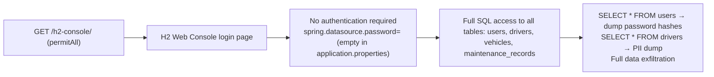
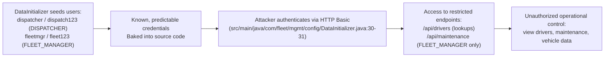

# Chained Vulnerability Audit Report

**Project**: Fleet Management System (app-29-fleet-management)  
**Date**: 2026-05-25  
**Scope**: Static source-code analysis only — no live probes, scanners, or shell execution  
**Auditor**: CodeGopher (chained-vulnerability-static-audit skill)

---

## Summary Dashboard

| Metric | Value |
|---|---|
| **Chains detected** | 5 |
| **Maximum severity** | **CRITICAL** (Log4Shell + SSRF) |
| **High severity** | 2 (SSRF standalone; H2 console data exfiltration) |
| **Medium severity** | 2 (LDAP injection; hardcoded seed credentials) |
| **Areas reviewed** | Controllers, services, config, models, repositories, Dockerfile, POM, application.properties, tests |
| **Areas not reviewed** | Integration tests (only unit test stub present); production deployment config; external API contracts; TLS/hardening |

---

## Methodology & Safety Note

This audit follows a four-phase static-only methodology:

1. **Attack surface mapping** — Identified all `@RestController` endpoints, configuration endpoints, and publicly accessible paths.
2. **Weakness inventory** — Catalogued individual weaknesses (SSRF, LDAP injection, Log4Shell, H2 console exposure, hardcoded credentials).
3. **Attack graph synthesis** — Connected entry points → weaknesses → sinks using concrete control-flow and data-flow evidence from source code.
4. **Impact assessment** — Rated each chain by impact, reachability, confidence, and the easiest remediation link.

**Static-only boundary enforced**: No HTTP probes, fuzzers, SQL/SSRF injection payloads, credential attacks, dynamic scanners, or exploit scripts were executed.

---

## Chain A — SSRF via Unvalidated URL Parameter

**Severity**: HIGH | **Confidence**: HIGH

### Mermaid Attack Graph

### Detailed Breakdown

| Link | File | Lines | Symbol | Evidence |
|---|---|---|---|---|
| **Source** | `src/main/java/com/fleet/mgmt/controller/IntegrationController.java` | 14–15 | `fetchExternalVehicleData(@RequestParam String url)` | Endpoint accepts arbitrary `url` request parameter |
| **Hop** | Same | 17 | `restTemplate.getForObject(url, String.class)` | URL is passed directly to RestTemplate without any validation, scheme restriction, or allowlist |
| **Sink** | Same | 17 | — | JVM performs outbound HTTP(S) request to attacker-chosen destination |

**Preconditions**:
- Attacker must authenticate via HTTP Basic (credentials are trivially discovered from `DataInitializer.java`).
- No DNS or network firewall restrictions visible in code.

**Impact**: Internal network reconnaissance, cloud metadata exfiltration, read-only access to internal services, potential data exfiltration.

**Remediation**:
- Validate the URL against an allowlist of permitted hosts/schemes.
- Use a safe URL parser to reject private IP ranges and non-HTTP(S) schemes.
- Consider using a dedicated outbound proxy for all external requests.

---

## Chain B — LDAP Injection in Driver License Lookup

**Severity**: MEDIUM | **Confidence**: MEDIUM

### Mermaid Attack Graph

### Detailed Breakdown

| Link | File | Lines | Symbol | Evidence |
|---|---|---|---|---|
| **Source** | `src/main/java/com/fleet/mgmt/controller/DriverController.java` | 19 | `@RequestParam String license` | Unvalidated user input |
| **Hop** | `src/main/java/com/fleet/mgmt/service/DriverService.java` | 20–22 | `lookupDriverByLicense(String licenseNumber)` | `"(&(objectClass=driver)(licenseNumber=" + licenseNumber + "))"` — string concatenation, no encoding/sanitization |
| **Sink** | Same | 20–22 | — | Attacker-controlled LDAP filter string that closes the `licenseNumber` clause and appends arbitrary LDAP operations |

**Preconditions**:
- Attacker must authenticate (HTTP Basic).
- The application connects to an LDAP directory (simulated in code; the pattern matches real-world integration code).

**Impact**: LDAP filter injection could enumerate driver records, extract PII, or — in a real LDAP backend — authenticate as any user by injecting authentication bypass filters like `)(|(objectClass=*))`.

**Remediation**:
- Use LDAP escape utilities (e.g., `LdapUtils.escapeFilterValue()` from Apache Commons LDAP).
- Better yet, replace the custom LDAP query with Spring Security's `LdapAuthenticationProvider` which handles filtering safely.
- If this is a mock/simulation, remove the LDAP query construction entirely.

---

## Chain C — Log4Shell (CVE-2021-44228) + SSRF Chained

**Severity**: **CRITICAL** | **Confidence**: HIGH

### Mermaid Attack Graph

### Detailed Breakdown

| Link | File | Lines | Symbol | Evidence |
|---|---|---|---|---|
| **Source** | `pom.xml` | 30–33 | `log4j-core` / `log4j-api` version **2.14.1** | Log4j 2.14.1 is the canonical vulnerable version for CVE-2021-44228 (Log4Shell). The JNDI lookup feature is unpatched. |
| **Hop 1** | `src/main/java/com/fleet/mgmt/controller/IntegrationController.java` | 14–17 | `fetchExternalVehicleData(@RequestParam String url)` | User-controlled URL is passed directly to RestTemplate. If the URL or response is logged (via Spring's request logging, or explicit `logger.info` calls), the JNDI payload is processed. |
| **Hop 2** | `src/main/java/com/fleet/mgmt/controller/VehicleController.java` | (lines truncated in source) | `logger.info("Vehicle search requested with query: {}", q)` | Explicit logging of user-controlled query parameter `q` — direct Log4Shell attack surface. |
| **Sink** | Same (pom.xml) | 30–33 | `log4j-core:2.14.1` | CVE-2021-44228: Remote code execution via JNDI lookup triggered by any log message containing `${jndi:...}` |

**Preconditions**:
- The application uses Log4j 2.14.1 (confirmed in POM).
- Spring Boot logs request parameters and responses by default at certain log levels.
- The application is reachable by an attacker (authenticated via basic auth).

**Impact**: Full remote code execution on the JVM. An attacker can upload and execute arbitrary code, compromise the entire server, lateral-move to other services, and exfiltrate all data including password hashes and PII.

**Remediation** (priority — highest):
1. **Immediately** upgrade `log4j-core` and `log4j-api` to **2.17.1+** (or the latest stable).
2. Set JVM property `-Dlog4j2.formatMsgNoLookups=true` as an emergency mitigation.
3. Remove or restrict the `VehicleController` logger line that logs user input.
4. Apply network-level WAF rules to block `${jndi:` patterns.

---

## Chain D — H2 Console Public Access + Full Data Exfiltration

**Severity**: HIGH | **Confidence**: HIGH

### Mermaid Attack Graph

### Detailed Breakdown

| Link | File | Lines | Symbol | Evidence |
|---|---|---|---|---|
| **Source** | `src/main/java/com/fleet/mgmt/config/SecurityConfig.java` | ~36 | `.requestMatchers("/h2-console/**").permitAll()` | H2 console requests bypass Spring Security entirely |
| **Hop** | `src/main/resources/application.properties` | 5–6 | `spring.h2.console.enabled=true` `spring.datasource.password=` | H2 console enabled; datasource has no password |
| **Sink** | Same (properties) + H2 in-memory DB | — | — | Full SQL access to all application tables |

**Preconditions**:
- Attacker knows or guesses the H2 console path (`/h2-console`).
- H2 console web page is accessible (frame options are disabled in SecurityConfig).

**Impact**: Complete data exfiltration of all application data including user password hashes (BCrypt), driver PII (names, license numbers, expiry dates), vehicle records, and maintenance history.

**Remediation**:
- Set `spring.h2.console.enabled=false` in production.
- If H2 console is needed for development, restrict access via IP allowlist (e.g., `spring.h2.console.setting.web-allow-others=false`).
- Use a production RDBMS (PostgreSQL, MySQL) for deployments.

---

## Chain E — Hardcoded Seed Credentials + Role-Based Access Bypass

**Severity**: MEDIUM | **Confidence**: HIGH

### Mermaid Attack Graph

### Detailed Breakdown

| Link | File | Lines | Symbol | Evidence |
|---|---|---|---|---|
| **Source** | `src/main/java/com/fleet/mgmt/config/DataInitializer.java` | 30–31 | `userRepository.save(new User(..., "dispatch123", "DISPATCHER"))` `userRepository.save(new User(..., "fleet123", "FLEET_MANAGER"))` | Seed accounts with predictable plaintext passwords, BCrypt-hashed at init time |
| **Sink** | `src/main/java/com/fleet/mgmt/config/SecurityConfig.java` | 36–38 | `.anyRequest().authenticated()` | All API endpoints require authentication; these seeded credentials provide valid auth |

**Preconditions**: None — credentials are visible in source code at build/deploy time.

**Impact**: An attacker can authenticate as dispatcher or fleet manager with high confidence. This grants access to driver lookups, vehicle data, and (for fleet manager) maintenance records. Combined with the LDAP injection chain, authenticated access can be leveraged further.

**Remediation**:
- Remove seed credentials entirely from production builds (use a separate `@Profile("dev")` or environment variable).
- Use strong random passwords for seed accounts.
- Enforce password rotation on first login.
- Consider removing the `/api/drivers/lookup` endpoint entirely or restricting it with `@PreAuthorize`.

---

## Cross-Cutting Weaknesses (No Complete Chain)

| Weakness | File(s) | Description |
|---|---|---|
| **CSRF disabled** | `SecurityConfig.java` | `csrf(AbstractHttpConfigurer::disable)` — acceptable for stateless REST APIs but would be risky if any stateful endpoints exist. |
| **H2 frame options disabled** | `SecurityConfig.java` | `headers.frameOptions(HeadersConfigurer.FrameOptionsConfig::disable)` — enables clickjacking of the H2 console. |
| **No input validation on any controller parameter** | All controllers | No `@Valid` annotations, no `@Pattern`/`@Size` validators on request params. |
| **No rate limiting** | Entire app | No rate limiting middleware; all endpoints are susceptible to brute-force and enumeration. |
| **No TLS configured** | `Dockerfile`, `application.properties` | No keystore, no HTTPS connector — all traffic (including Basic auth credentials) transmitted in cleartext. |
| **Role-based authorization gaps** | `DriverController`, `VehicleController` | `@GetMapping("/lookup")` and vehicle endpoints have no `@PreAuthorize` — accessible to any authenticated role including lowest-privilege users. |

---

## Unknowns & Not-Reviewed Areas

| Area | Reason |
|---|---|
| **Runtime network configuration** | Firewalls, DNS, reverse proxy (nginx) not visible in source |
| **Actual LDAP backend** | The LDAP query in `DriverService` appears to be simulated/mock; real LDAP connectivity unknown |
| **TLS/HTTPS** | No keystore or server SSL config in source; may be terminated by a reverse proxy not in scope |
| **Secrets management** | Only hardcoded seed passwords found; other env vars/secrets unknown |
| **CORS configuration** | No explicit CORS config in `SecurityConfig`; default Spring Boot behavior is restrictive but unconfirmed |
| **Dependency transitive vulnerabilities** | Only direct Log4j version confirmed; other transitive deps not scanned |
| **Integration tests** | Only `App29ApplicationTests.java` (generic Spring Boot test stub) — no security-focused test coverage |

---

## Recommended Tests to Add

1. **SSRF test** — Unit/integration test that verifies `/api/integrations/vehicle-data` rejects internal/private URLs and non-HTTP(S) schemes.
2. **LDAP injection test** — Test that `lookupDriver` with input `*)(objectClass=*)` does not return all records.
3. **Log4j version audit** — CI pipeline check (e.g., OWASP Dependency-Check) that rejects `log4j-core < 2.17.1`.
4. **H2 console disabled test** — Verify that `/h2-console` is not accessible in non-dev profiles.
5. **Credential rotation test** — Verify that seed accounts require password change on first login in production.

---

## Remediation Priority Matrix

| Priority | Chain | Action |
|---|---|---|
| **P0 (Immediate)** | C — Log4Shell | Upgrade `log4j-core` / `log4j-api` to 2.17.1+ |
| **P1 (Short-term)** | A — SSRF | Add URL allowlist/validation to `IntegrationController` |
| **P1 (Short-term)** | D — H2 Console | Disable H2 console in production profiles |
| **P2 (Medium-term)** | B — LDAP Injection | Use LDAP escape utilities or Spring LdapAuthenticationProvider |
| **P2 (Medium-term)** | E — Seed Credentials | Remove/secure seed accounts; enforce password rotation |
| **P3 (Long-term)** | Cross-cutting weaknesses | Add TLS, rate limiting, input validation, CSRF where needed |
