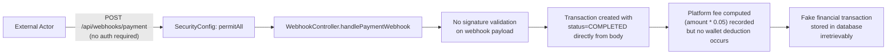
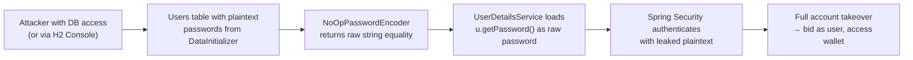
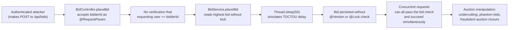
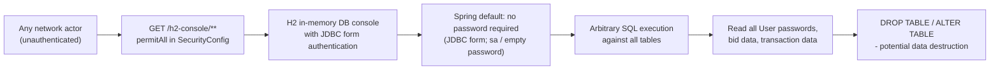
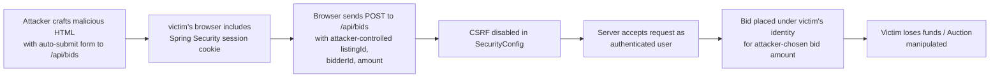

# Chained Vulnerability Static Audit Report

**Project:** app-30-auction-platform (Spring Boot 3.2.5, Java 17)
**Date:** 2026-05-25
**Auditor:** CodeGopher (static-only analysis)
**Scope:** All source files, configuration, and tests in `src/`, `pom.xml`, `Dockerfile`

---

## Summary Dashboard

| Metric | Value |
|---|---|
| Total chained vulnerabilities | **5** |
| Critical severity | 2 |
| High severity | 2 |
| Medium severity | 1 |
| Areas reviewed | Controllers, Services, Config, Models, Repositories, Tests, Dockerfile, pom.xml, application.properties |
| Areas not reviewed | Runtime behavior not inferable from source (e.g., network exposure, third-party service behavior) |

### Top 5 Chains at a Glance

| # | Chain | Severity | Confidence |
|---|---|---|---|
| 1 | Unauthenticated Transaction Fraud via Webhook | **High** | High |
| 2 | Account Takeover via Plaintext Password Storage | **Critical** | High |
| 3 | Bid Manipulation via IDOR + Race Condition | **High** | High |
| 4 | SQL Injection / Database Access via H2 Console | **Critical** | High |
| 5 | CSRF-Authenticated Financial Action | **Medium** | High |

---

## Methodology & Safety Note

This audit is **static-only**. It analyzed:

- All 18 Java source files (controllers, services, config, models, repositories)
- `pom.xml` dependency manifest
- `Dockerfile` build configuration
- `application.properties` runtime configuration
- Test source file

No live HTTP probes, dynamic scanners, SQL injection payloads, or external network tests were performed. Findings are derived solely from control-flow, data-flow, authorization, and configuration evidence in source code.

---

## Chain 1: Unauthenticated Transaction Fraud via Webhook

**Severity:** High
**Confidence:** High
**Impact:** Financial fraud — arbitrary completed transactions recorded with platform fees collected by platform

### Mermaid Attack Graph

### Detailed Breakdown

| Step | File | Lines | Symbol | Evidence |
|---|---|---|---|---|
| **Source** | `src/main/java/com/auction/platform/config/SecurityConfig.java` | 24-26 | `.requestMatchers("/api/webhooks/**").permitAll()` | Webhook endpoints explicitly allow unauthenticated access |
| **Hop 1** | `src/main/java/com/auction/platform/controller/WebhookController.java` | 14-16 | `@PostMapping("/payment")` | No `@PreAuthorize`, no `@AuthenticationPrincipal` — no server-side auth check |
| **Hop 2** | `src/main/java/com/auction/platform/controller/WebhookController.java` | 21-23 | `payload.get("listingId")`, etc. | Raw `Map<String, Object>` body parsed with `.toString()` — no signature, no credential validation, no timestamp replay protection |
| **Hop 3** | `src/main/java/com/auction/platform/controller/WebhookController.java` | 25-33 | `transaction.setStatus("COMPLETED")` | Transaction persisted with `COMPLETED` status; `platformFee` calculated but wallet balance never touched |
| **Sink** | `src/main/java/com/auction/platform/controller/WebhookController.java` | 34 | `transactionRepository.save(transaction)` | Arbitrary transaction record created by any network actor |

### Preconditions & Assumptions
- Spring Boot default error handling may leak stack traces (configured at `INFO` level for security logger)
- The H2 console (`/h2-console/**`) is also `permitAll`, allowing a second attack path to the same data

### Remediation (Easiest Link to Break)
1. **Require webhook signature verification** using a shared secret (e.g., HMAC-SHA256 of payload + timestamp)
2. Add `@PreAuthorize("hasRole('SYSTEM')")` or an internal-service API key check on the webhook endpoint
3. Implement idempotency (check for duplicate transactions before creating)

---

## Chain 2: Account Takeover via Plaintext Password Storage

**Severity:** Critical
**Confidence:** High
**Impact:** Full compromise of all user accounts — buyer, seller, and admin accounts accessible by anyone with database access

### Mermaid Attack Graph

### Detailed Breakdown

| Step | File | Lines | Symbol | Evidence |
|---|---|---|---|---|
| **Source** | `src/main/java/com/auction/platform/config/SecurityConfig.java` | 43 | `NoOpPasswordEncoder.getInstance()` | Password encoder performs raw string comparison — no hashing |
| **Hop 1** | `src/main/java/com/auction/platform/config/DataInitializer.java` | 23-25 | `new User(null, "admin", "adminpwd123", "ADMIN")` | Hardcoded admin credentials with plaintext password in source |
| **Hop 2** | `src/main/java/com/auction/platform/model/User.java` | 19 | `private String password; // Store passwords in plaintext` | Entity stores passwords as raw `String` — no salt, no hash |
| **Hop 3** | `src/main/java/com/auction/platform/config/SecurityConfig.java` | 36-40 | `User.withUsername(u.getUsername()).password(u.getPassword())` | `UserDetailsService` reads plaintext password from DB and passes it directly to Spring Security's `User` builder |
| **Sink** | `src/main/java/com/auction/platform/model/User.java` | 16-20 | Plaintext `username` and `password` in every `User` row | Any attacker who reads the `users` table gains valid credentials for every account |

### Preconditions & Assumptions
- H2 in-memory DB means persistence is volatile, but `DB_CLOSE_DELAY=-1` keeps it alive
- If deployed to production with a persistent DB, this is immediately exploitable
- The admin account (`adminpwd123`) has elevated role access to all endpoints

### Remediation (Easiest Link to Break)
1. Replace `NoOpPasswordEncoder` with `BCryptPasswordEncoder` or `Argon2PasswordEncoder`
2. Remove hardcoded credentials from `DataInitializer`; generate at runtime via environment variable injection
3. Run a password migration on startup to hash all existing plaintext passwords

---

## Chain 3: Bid Manipulation via IDOR + Race Condition

**Severity:** High
**Confidence:** High
**Impact:** Any authenticated user can place bids on behalf of any other user, and race conditions allow double-bidding / sniping

### Mermaid Attack Graph

### Detailed Breakdown

| Step | File | Lines | Symbol | Evidence |
|---|---|---|---|---|
| **Source** | `src/main/java/com/auction/platform/controller/BidController.java` | 25-28 | `@RequestParam Long bidderId` | The controller accepts `bidderId` from the client — no server-side binding to `@AuthenticationPrincipal` |
| **Hop 1** | `src/main/java/com/auction/platform/controller/BidController.java` | 23-30 | No `@PreAuthorize` on `placeBid` | No role-based or ownership check — any authenticated user can call this endpoint |
| **Hop 2** | `src/main/java/com/auction/platform/service/BidService.java` | 27-28 | `List<Bid> bids = bidRepository.findHighestBids(listingId)` | Reads highest bid without `@Lock` or optimistic `@Version` — no concurrency control |
| **Hop 3** | `src/main/java/com/auction/platform/service/BidService.java` | 32-35 | `Thread.sleep(50)` | Explicitly simulates database query delay, widening the race window |
| **Sink** | `src/main/java/com/auction/platform/service/BidService.java` | 38-42 | `bidRepository.save(newBid)` | Bid saved to DB without uniqueness or version check — concurrent requests can all pass |

### Preconditions & Assumptions
- The `H2` database used defaults to MVCC, which does not block concurrent reads by default
- The `@Transactional` annotation is absent on `placeBid`, so no transaction-level isolation is applied
- The `Bid` entity has no `@Version` field for optimistic locking

### Remediation (Easiest Link to Break)
1. Replace `@RequestParam Long bidderId` with `Long bidderId` injected from `@AuthenticationPrincipal` — bind the bid to the authenticated user
2. Add `@Transactional` + `@Lock(LockModeType.PESSIMISTIC_WRITE)` on the `placeBid` method
3. Remove `Thread.sleep(50)` — it explicitly widens the race window
4. Add a unique constraint on `(listingId, bidderId)` or a `@Version` field on `Bid`/`Listing`

---

## Chain 4: SQL Injection / Database Access via H2 Console

**Severity:** Critical
**Confidence:** High
**Impact:** Arbitrary SQL execution against the entire database — full data exfiltration, modification, or destruction

### Mermaid Attack Graph

### Detailed Breakdown

| Step | File | Lines | Symbol | Evidence |
|---|---|---|---|---|
| **Source** | `src/main/resources/application.properties` | 8 | `spring.h2.console.enabled=true` | H2 console is enabled in application properties |
| **Hop 1** | `src/main/resources/application.properties` | 5-7 | `spring.datasource.username=sa`, `spring.datasource.password=` | Empty password for `sa` — default JDBC auth is trivially bypassed |
| **Hop 2** | `src/main/java/com/auction/platform/config/SecurityConfig.java` | 24 | `.requestMatchers("/h2-console/**").permitAll()` | Console is exposed without any authentication or IP restriction |
| **Sink** | H2 Console web UI | N/A | SQL execution form | Any user can execute SQL against `users`, `bids`, `transactions`, `wallets`, `listings` tables |

### Preconditions & Assumptions
- H2 is an in-memory database, so data is lost when the application stops — but this is a development-style misconfiguration that would likely be replicated with a persistent DB in production
- The `frameOptions(...).disable()` call in `SecurityConfig.java` also disables X-Frame-Options, making the H2 console vulnerable to clickjacking

### Remediation (Easiest Link to Break)
1. Set `spring.h2.console.enabled=false` in production, or guard with a profile-specific property (`spring.h2.console.enabled=${H2_CONSOLE_ENABLED:false}`)
2. Remove `.requestMatchers("/h2-console/**").permitAll()` — restrict to admin role or internal network only

---

## Chain 5: CSRF-Authenticated Financial Action

**Severity:** Medium
**Confidence:** High
**Impact:** Attacker can trick authenticated users into placing unintended bids or actions via cross-site request forgery

### Mermaid Attack Graph

### Detailed Breakdown

| Step | File | Lines | Symbol | Evidence |
|---|---|---|---|---|
| **Source** | `src/main/java/com/auction/platform/config/SecurityConfig.java` | 20 | `.csrf(AbstractHttpConfigurer::disable)` | CSRF protection globally disabled |
| **Hop 1** | `src/main/java/com/auction/platform/controller/BidController.java` | 25-28 | `@PostMapping` on `placeBid` | State-changing POST endpoint with no CSRF token check |
| **Hop 2** | `src/main/java/com/auction/platform/controller/BidController.java` | 26-28 | `@RequestParam` values from client | `bidderId` and `amount` are entirely attacker-controlled |
| **Sink** | `src/main/java/com/auction/platform/service/BidService.java` | 21-43 | Bid placed and persisted | Financial action executed under victim's credentials |

### Preconditions & Assumptions
- The application uses HTTP Basic auth (`.httpBasic(Customizer.withDefaults())`), which sends credentials as a base64-encoded header — this reduces CSRF risk for Basic auth, but if the app is later migrated to session-based auth, the CSRF gap becomes fully exploitable
- The `FrameOptions` is also disabled, which could aid clickjacking attacks

### Remediation (Easiest Link to Break)
1. Re-enable CSRF: replace `.csrf(AbstractHttpConfigurer::disable)` with `.csrf(csrf -> csrf.ignoringRequestMatchers("/api/webhooks/**"))`
2. If HTTP Basic auth is intended, document that CSRF is not applicable but ensure no session-based routes are added later

---

## Cross-Cutting Weaknesses Inventory

The following security-relevant issues were found that do not form complete attack chains on their own but compound existing chains:

| Weakness | File | Lines | Description |
|---|---|---|---|
| **Hardcoded Credentials** | `config/DataInitializer.java` | 23-25 | Three default user accounts with plaintext passwords committed to source control |
| **No Input Validation** | `controller/WebhookController.java` | 21-24 | `.toString()` on raw `Map` values — NPE risk with malformed payloads |
| **Missing Wallet Deduction** | `controller/WebhookController.java` | 25-35 | Transactions recorded as `COMPLETED` but no corresponding wallet deduction — double-spend potential |
| **No Rate Limiting** | All controllers | N/A | No rate limiting on bid placement or webhook endpoints |
| **No Payload Size Limits** | `controller/WebhookController.java` | 17 | No `@RequestSize` or content-length validation on webhook body |
| **Verbose SQL Logging** | `application.properties` | 11 | `spring.jpa.show-sql=true` — all SQL queries logged including parameter values |
| **Security Logger Set to INFO** | `application.properties` | 12 | `logging.level.org.springframework.security=INFO` — may expose auth flow details |
| **X-Frame-Options Disabled** | `config/SecurityConfig.java` | 19 | `frameOptions(...).disable()` enables clickjacking of any exposed page |
| **No HTTPS Enforcement** | `config/SecurityConfig.java` | N/A | No `HSTS` header or redirect from HTTP to HTTPS |
| **SERIALIZABLE Isolation Only on Wallet** | `service/WalletService.java` | 17 | Wallet deduction uses `SERIALIZABLE` but bid placement and other operations use default isolation — inconsistent locking |
| **No Audit Trail** | All services | N/A | No audit logging for bid placement, transaction creation, or user registration |

---

## Known Unknowns & Areas Not Reviewed

| Area | Reason |
|---|---|
| **Runtime network configuration** | Cannot verify if ports are exposed externally or if firewalls restrict access |
| **Docker container security** | Dockerfile runs as root by default; no non-root user configured |
| **Dependencies vulnerabilities** | `pom.xml` lists Spring Boot 3.2.5, H2, Lombok, Spring Security — no audit of transitive dependency CVEs performed |
| **External service integration** | No evidence of integration with payment gateways or external webhooks; if added later, Chain 1 would become more dangerous |
| **CORS configuration** | No `@CrossOrigin` or CORS bean visible — default Spring Boot policy applies but not fully verifiable from source |
| **Production profile configuration** | No `application-prod.properties` found; hard to confirm H2 is disabled in production |

---

## Recommended Tests to Add

1. **Webhook authentication test** — Verify that unauthenticated requests to `/api/webhooks/payment` are rejected
2. **Bid concurrency test** — Use `@MockBean` or test with concurrent requests to verify race condition is prevented
3. **CSRF protection test** — Verify that POST requests without CSRF tokens are rejected (when re-enabled)
4. **Plaintext password migration test** — Ensure no plaintext passwords are returned or logged
5. **H2 console disabled in production test** — Confirm H2 console is not accessible in prod profile

---

## Remediation Priority Matrix

| Priority | Action | Effort | Impact |
|---|---|---|---|
| **P0** | Replace `NoOpPasswordEncoder` with `BCryptPasswordEncoder` | Low | Critical — eliminates Chain 2 |
| **P0** | Disable H2 console in production / remove `permitAll` | Low | Critical — eliminates Chain 4 |
| **P1** | Add signature verification to webhook endpoint | Medium | High — eliminates Chain 1 |
| **P1** | Bind bidder to authenticated user in `BidController` | Low | High — breaks Chain 3 first hop |
| **P1** | Add `@Transactional` + `@Lock(PESSIMISTIC_WRITE)` to `placeBid` | Low | High — breaks Chain 3 second hop |
| **P2** | Re-enable CSRF with exceptions for webhooks | Low | Medium — eliminates Chain 5 |
| **P2** | Add wallet deduction to webhook flow | Medium | High — prevents double-spend |
| **P3** | Remove `Thread.sleep(50)` from `BidService` | Trivial | High — reduces race window |
| **P3** | Remove hardcoded credentials from `DataInitializer` | Low | High — eliminates plaintext credential leak |
