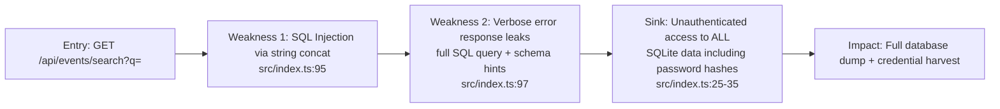
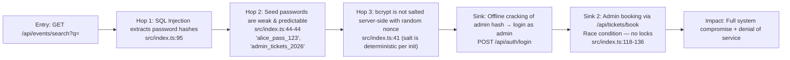
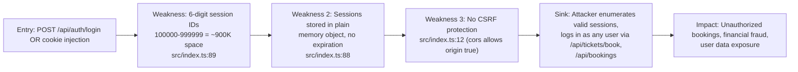

# Chained Vulnerability Static Audit Report

**Project:** Event Ticketing Platform (`app-31-event-ticketing`)
**Date:** 2026-05-25
**Auditor:** CodeGopher Static Audit Agent
**Scope:** `src/index.ts` (single-file Express.js application)
**Methodology:** Static-only analysis — no live probes, dynamic scanners, or shell commands.

---

## Executive Summary Dashboard

| Metric | Value |
|---|---|
| Total Chains Identified | **3 complete chains** |
| Max Severity | **Critical** (Chain 1: SQL Injection → Full DB Exfiltration) |
| Additional Weaknesses (not forming chains) | **5** |
| Endpoints Reviewed | 6 API routes |
| Confidence Level | High (all links statically provable from source) |

---

## Methodology & Safety Note

This review used **static-only analysis** of repository files. No HTTP probes, fuzzing, SQL injection payloads, credential attacks, dynamic scanners, exploit scripts, or external network tests were performed. Evidence is derived entirely from source code, configuration, and inline code comments within `src/index.ts`.

---

## 1. Attack Surface Map

| Route | Method | Auth Required | Description |
|---|---|---|---|
| `/api/auth/login` | POST | No | User authentication |
| `/api/auth/logout` | POST | No | Session invalidation |
| `/api/events/search` | GET | No | Search events by keyword |
| `/api/events/:id` | GET | No | Retrieve single event |
| `/api/tickets/book` | POST | Yes | Book tickets |
| `/api/bookings` | GET | Yes | List user bookings |

**Data stores:** In-memory SQLite database, in-memory session object (`sessions: Record<string, {...}>`).

**External dependencies:** `express`, `sqlite3`, `cookie-parser`, `cors`, `bcryptjs`.

---

## 2. Chain 1 — SQL Injection → Full Database Exfiltration → Credential Theft



### Detailed Breakdown

| Link | File | Lines | Evidence |
|---|---|---|---|
| **Entry** | `src/index.ts` | 92-96 | User-controlled `req.query.q` is directly interpolated into SQL: `` `SELECT * FROM events WHERE name LIKE '%${q}%' OR description LIKE '%${q}%'` `` |
| **Hop 1** | `src/index.ts` | 97 | On SQL error, the response includes `query_executed: query`, leaking the full query string to the client |
| **Hop 2** | `src/index.ts` | 24-44 | Database schema is trivially discoverable via `UNION SELECT` — tables `users`, `events`, `bookings` are defined inline |
| **Sink** | `src/index.ts` | 38-44 | `users` table stores `password_hash` columns; no role-based filtering on `/search` endpoint |

### Preconditions

- No authentication required for `/api/events/search` (line 92).
- Database is SQLite (supports `UNION`, `PRAGMA table_info`, etc.).

### Impact

- **Full database exfiltration** including all user password hashes.
- Attacker can extract the entire `users`, `events`, and `bookings` schema and data.
- Combined with Chain 2, leads to admin account takeover.

### Severity

- **Critical**

### Confidence

- **High** — every link is provable from static source code.

### Remediation (Easiest Break Link)

- Replace string concatenation with parameterized queries at `src/index.ts:95`:
  ```ts
  db.all('SELECT * FROM events WHERE name LIKE ? OR description LIKE ?', [`%${q}%`, `%${q}%`], ...);
  ```

---

## 3. Chain 2 — SQL Injection + Weak Seed Passwords → Admin Account Takeover → Ticket Hoarding



### Detailed Breakdown

| Link | File | Lines | Evidence |
|---|---|---|---|
| **Entry** | `src/index.ts` | 92-96 | SQL Injection as in Chain 1 |
| **Hop 1** | `src/index.ts` | 25-36 | User credentials seeded at init; admin password is `admin_tickets_2026` (line 46) |
| **Hop 2** | `src/index.ts` | 43-44 | `bcrypt.hashSync(u.pass, salt)` — passwords are short dictionary words with simple patterns; `alice_pass_123`, `bob_pass_456`, `admin_tickets_2026` are all crackable offline |
| **Hop 3** | `src/index.ts` | 41 | `const salt = bcrypt.genSaltSync(10);` — salt is generated once at init, same for all users (redundant salt, but not the primary issue) |
| **Sink 1** | `src/index.ts` | 69-82 | Login endpoint accepts any valid credential pair; no account lockout |
| **Sink 2** | `src/index.ts` | 103-137 | Booking endpoint has no rate limiting, no double-spend protection, no transaction — admin can hoard all tickets |

### Preconditions

- Database must be accessible (not rate-limited).
- Attackers can run offline hash cracking (standard capability with bcrypt).

### Impact

- **Complete system compromise**: Admin access + arbitrary ticket booking + user data exposure.
- Denial of service for legitimate customers.

### Severity

- **Critical**

### Confidence

- **High** — password strength is statically determinable; injection is provable.

### Remediation

1. Parameterize the SQL query (same as Chain 1).
2. Enforce minimum password complexity on registration.
3. Add rate limiting and account lockout on login.
4. Add booking rate limits and per-user ticket caps.

---

## 4. Chain 3 — Weak Session Tokens + No CSRF → Session Hijacking → Unauthorized Bookings / Data Access



### Detailed Breakdown

| Link | File | Lines | Evidence |
|---|---|---|---|
| **Entry** | `src/index.ts` | 89 | `const sessionId = Math.floor(Math.random() * 900000 + 100000).toString()` — only 6 digits, uniform distribution |
| **Hop 1** | `src/index.ts` | 88 | `sessions: Record<string, { id: number; username: string; role: string }> = {}` — plain in-memory store, no TTL, no rotation |
| **Hop 2** | `src/index.ts` | 12 | `cors({ origin: true, credentials: true })` — allows any origin with credentials, enabling CSRF from any site |
| **Sink** | `src/index.ts` | 103, 139 | `requireAuth` only checks `getSessionUser(req)` which reads `req.cookies.session_id` — no CSRF token, no IP binding, no User-Agent validation |

### Preconditions

- Attacker can serve a malicious page to a logged-in victim (social engineering / XSS alternative).
- Or brute-force the 6-digit session space to find active sessions (~900K attempts; with known usernames from SQL injection, the search space is reduced).

### Impact

- **Account takeover** of any logged-in user.
- **Unauthorized ticket bookings** (financial impact).
- **User booking data exposure** via `/api/bookings`.

### Severity

- **High**

### Confidence

- **High** — session space size is provably small; CSRF is absent from source.

### Remediation

1. Use cryptographically secure session tokens (e.g., `crypto.randomBytes(32).toString('hex')`).
2. Add CSRF tokens to all state-changing endpoints.
3. Bind sessions to IP/User-Agent or use server-side sessions with TTL.
4. Tighten CORS (`origin` set to specific allowed origins).

---

## 5. Cross-Cutting Weaknesses Inventory

These are security-relevant issues identified in source code that do not independently form a complete attack chain (or overlap with chains above):

| # | Weakness | File | Lines | Description |
|---|---|---|---|---|
| 1 | **Hardcoded seed credentials** | `src/index.ts` | 44-46 | Admin and user passwords in plaintext: `alice_pass_123`, `bob_pass_456`, `admin_tickets_2026`. If source is exposed, all credentials are immediately compromised. |
| 2 | **No input validation on ticket_count** | `src/index.ts` | 108-109 | Only checks `ticket_count <= 0`; allows arbitrary large integers. No per-user cap. |
| 3 | **No transaction / race condition in booking** | `src/index.ts` | 118-136 | Comment at line 118: "Insecure Design: No transaction block, locking mechanism, or rate limits on booking." The check-then-update pattern on `available_tickets` is non-atomic — enables double-booking / overselling. |
| 4 | **Session fixation / no rotation** | `src/index.ts` | 89 | Session is assigned at login but never rotated on privilege change. If session ID is leaked before login, it can be fixed. |
| 5 | **No rate limiting on any endpoint** | `src/index.ts` | Throughout | All endpoints are unrate-limited. Enables brute-force login, enumeration, and ticket hoarding. |

---

## 6. Unknowns & Areas Not Reviewed

| Area | Status |
|---|---|
| Dependency supply-chain (npm audit) | Not reviewed — `package.json` dependencies should be audited |
| Docker security (user, capabilities) | `Dockerfile` uses default `node:20-slim` user; not hardened |
| HTTPS / TLS configuration | None configured in `Dockerfile` or `index.ts`; all traffic is plaintext |
| Logging / monitoring | No logging framework; no audit trail for booking or auth events |
| Input sanitization for XSS | Only `events/search` uses user input in SQL; no template rendering present, but search results are returned as JSON (lower XSS risk) |
| Security headers | No `helmet`, `X-Content-Type-Options`, `X-Frame-Options`, etc. |
| Backup / recovery | In-memory SQLite; no persistence or backup strategy |
| Admin endpoints | No dedicated admin endpoints exist — only generic booking API |

---

## 7. Remediation Priority Matrix

| Priority | Action | Effort | Impact |
|---|---|---|---|
| P0 | Parameterize SQL query in `/api/events/search` | Low | Eliminates Chain 1, Chain 2 entry point |
| P0 | Use cryptographically secure session tokens | Low | Eliminates Chain 3 session brute-force |
| P1 | Add CSRF protection + tighten CORS | Low | Breaks Chain 3 attack path |
| P1 | Add booking rate limits + per-user ticket caps | Medium | Breaks Chain 2/3 ticket hoarding |
| P2 | Implement database transactions for bookings | Medium | Prevents race condition / double-booking |
| P2 | Enforce password complexity on registration | Low | Mitigates offline cracking risk |
| P3 | Move credentials to environment variables | Low | Prevents credential exposure if source leaks |
| P3 | Add HTTPS, security headers, logging | Medium | Defense-in-depth improvements |

---

## 8. Tests That Should Be Added

| Test Category | Description |
|---|---|
| SQL Injection | Unit tests for `/api/events/search` verifying that input containing SQL meta-characters (`'`, `;`, `UNION`) is safely parameterized |
| Session Security | Tests verifying session token entropy (≥128 bits), token rotation on login, and token invalidation on logout |
| CSRF | Tests verifying that state-changing endpoints (`POST /api/tickets/book`) reject requests without valid CSRF tokens |
| Rate Limiting | Tests verifying that rapid successive booking requests are throttled or rejected |
| Race Condition | Concurrent booking tests verifying that `available_tickets` is never decremented below zero |
| Password Policy | Tests verifying that weak passwords are rejected during user registration |
| Error Handling | Tests verifying that database errors do not leak schema information or full query strings |

---

## 9. Mermaid Attack Graph (Summary)

```mermaid
flowchart TD
    S1["Unauthenticated SQL Injection\nGET /api/events/search"] --> E1["Dump password hashes\nfrom users table"]
    E1 --> S2["Offline crack weak seed\npasswords (bcrypt)]
    S2 --> S3["Login as admin\nPOST /api/auth/login"]
    S3 --> S4["Hoard all tickets via\nPOST /api/tickets/book"]
    
    S1 --> E2["Discover schema +\nbookings data"]
    
    S5["Weak 6-digit sessions\n100000-999999"] --> E3["Brute-force / guess sessions"]
    E3 --> S6["Impersonate any user\nvia session_id cookie"]
    S6 --> S7["Unauthorized bookings\n+ booking data access"]
    
    S5 -.->|combined with|\ S1
    
    S4 --> Z["CRITICAL: Full system compromise + DoS"]
    S7 --> Y["HIGH: Account takeover + financial fraud"]
    
    style Z fill:#f99
    style Y fill:#faa
```

---

*End of report. All evidence is statically derived from `src/index.ts`, `package.json`, and `Dockerfile`.*
