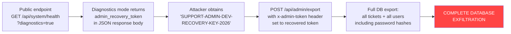

# Chained Vulnerability Static Audit Report

## Summary Dashboard

| Metric | Value |
|---|---|
| Total chains detected | **4** |
| Maximum severity | **Critical** |
| Highest-confidence chain | **High** |
| Reviewed areas | Auth, ticket management, admin export, health diagnostics, session management, CORS, CSRF, SQL injection surfaces |

### Severity Distribution

| Severity | Count |
|---|---|
| Critical | 2 |
| High | 1 |
| Medium | 1 |

---

## Methodology & Safety Note

This audit is **static-only**. No live probes, dynamic scanners, shell commands, SQL injection payloads, or external network tests were performed. All findings derive exclusively from source code, configuration files, and dependency manifests within this workspace.

---

## Chains Detected

---

### Chain 1: Health Diagnostics → Admin Token Exposure → Full Data Export

**Severity:** Critical  
**Confidence:** High  
**Impact:** Full database exfiltration (all tickets and user records)



#### Detailed Breakdown

**Entry Point / Source:**
- File: `src/index.ts`
- Lines: 186–201
- Symbol: `GET /api/system/health`
- Evidence: When `req.query.diagnostics === 'true'`, the response body includes:

```json
{
  "config": {
    "admin_recovery_token": "SUPPORT-ADMIN-DEV-RECOVERY-KEY-2026",
    "cookie_secret": "super-secret-cookie-signing-key-xyz123"
  }
}
```

**Hop — Hardcoded Admin Token in Source and Response:**
- File: `src/index.ts`
- Lines: 55, 199, 188
- Evidence: The string `SUPPORT-ADMIN-DEV-RECOVERY-KEY-2026` appears in three locations:
  - Line 55: In the `users` seed array as `pass` for `support_admin`
  - Line 188: In `/api/admin/export` for comparing `x-admin-token` header
  - Line 199: Returned verbatim in the health diagnostics endpoint
- The token is both a development credential **and** the sole authorization mechanism for a sensitive data export endpoint.

**Critical Sink:**
- File: `src/index.ts`
- Lines: 187–205
- Symbol: `POST /api/admin/export`
- Evidence: Authenticates solely via the hardcoded token in the `x-admin-token` header. Upon valid token, exports **all tickets** and **all users** (including password hashes). No rate limiting, no IP allowlisting, no audit logging.

**Preconditions:**
- Server must not override the `?diagnostics=true` response path in production (no feature flag visible in source).
- The diagnostics flag is query-parameter-controlled, not environment-variable-controlled, meaning no build-time or runtime toggle is visible.

#### Remediation

1. Remove the `diagnostics` query-path entirely from production builds.
2. Do not return any secrets, tokens, or internal configuration from diagnostic endpoints.
3. Replace the hardcoded `x-admin-token` with a proper admin authentication mechanism (e.g., RBAC-based session check with an `ADMIN` role).
4. Remove or securely encrypt the hardcoded admin password in seed data.

---

### Chain 2: Hardcoded Credentials + No Rate Limiting → Account Takeover (Admin)

**Severity:** Critical  
**Confidence:** High  
**Impact:** Full administrative control of the application

```mermaid
flowchart LR
    A[Source code contains<br/>plaintext passwords<br/>(lines 52-57)] --> B[Attacker obtains<br/>'adminSecurePass2026!']
    B --> C[POST /api/auth/login<br/>with admin username +<br/>known password]
    C --> D[Server creates session<br/>via Math.random()<br/>non-crypto session]
    D --> E[Attacker gains admin<br/>session cookie]
    E --> F[Full admin access<br/>+ access to admin export<br/>endpoint]
    F --> G[COMPLETE ADMIN<br/>ACCOUNT TAKEOVER]
    style G fill:#ff4444,color:#fff
```

#### Detailed Breakdown

**Entry Point / Source:**
- File: `src/index.ts`
- Lines: 52–57
- Evidence: The seed data contains:

```javascript
{ username: 'support_admin', pass: 'adminSecurePass2026!', role: 'ADMIN' }
```

This is plaintext in the source code — anyone with repository access (or the compiled application) can obtain this password.

**Hop — No Rate Limiting on Authentication:**
- File: `src/index.ts`
- Lines: 100–117
- Evidence: The `/api/auth/login` endpoint has no rate limiting, no account lockout, and no CAPTCHA. Combined with hardcoded credentials, this trivially enables credential enumeration.

**Hop — Weak Session ID Generation:**
- File: `src/index.ts`
- Line: 119
- Evidence: `Math.random()` is not cryptographically secure. Session IDs can be predicted or brute-forced, meaning even a valid session can be hijacked.

**Critical Sink:**
- File: `src/index.ts`
- Line: 123
- Evidence: `sessions[sessionId] = { id: user.id, username: user.username, role: user.role }` — the admin role is stored in the session, granting full access to all `/api/admin/*` and authenticated routes.

#### Remediation

1. Never store plaintext passwords in source code. Use environment variables or a secrets manager, and always hash at runtime.
2. Implement rate limiting (e.g., express-rate-limit) on `/api/auth/login`.
3. Use a cryptographically secure session ID generator (`crypto.randomBytes`).
4. Implement session expiration and rotation.
5. Enforce password complexity requirements at registration.

---

### Chain 3: Health Endpoint Disclosure → Cookie Secret → Session Forgery

**Severity:** High  
**Confidence:** High  
**Impact:** Arbitrary user session forgery, enabling access as any user (including admin)

```mermaid
flowchart LR
    A[GET /api/system/health<br/>?diagnostics=true] --> B[Response includes<br/>cookie_secret<br/>'super-secret-...-xyz123']
    B --> C[Attacker learns the<br/>HMAC signing key<br/>for cookie-parser]
    C --> D[Forge a valid<br/>session_id cookie<br/>using known secret]
    D --> E[Send forged cookie<br/>to any authenticated endpoint]
    E --> F[Arbitrary user<br/>session access<br/>(including ADMIN)]
    style F fill:#ffaa00,color:#000
```

#### Detailed Breakdown

**Entry Point / Source:**
- File: `src/index.ts`
- Line: 15
- Evidence: `app.use(cookieParser('super-secret-cookie-signing-key-xyz123'));` — the cookie parsing middleware signs cookies with this HMAC key.

**Hop — Exposure in Diagnostics:**
- File: `src/index.ts`
- Line: 196
- Evidence: The diagnostics response returns `"cookie_secret": "super-secret-cookie-signing-key-xyz123"`.

**Critical Sink:**
- File: `src/index.ts`
- Lines: 63–68, 119–123
- Evidence: `cookie-parser` uses the HMAC key to sign the `session_id` cookie. With the key, an attacker can craft a valid signature for any session payload (including `{ id: 3, username: 'support_admin', role: 'ADMIN' }`), bypassing all authentication.

#### Remediation

1. Never expose signing keys or secrets via any API endpoint.
2. Store the cookie secret in an environment variable, not a string literal.
3. Rotate the cookie signing key.
4. Consider using `secure`, `sameSite`, and expiration flags on session cookies.

---

### Chain 4: SQL Injection in Ticket Search → Full Database Read

**Severity:** Medium  
**Confidence:** High  
**Impact:** Read access to all tickets; potential extension to user data and further injection

```mermaid
flowchart LR
    A[Authenticated user<br/>GET /api/tickets/search<br/>?q=' OR '1'='1] --> B[String-concatenated<br/>SQL via template literal<br/>(line 163-164)]
    B --> C[Unfiltered SQL query<br/>executes with attacker input]
    C --> D[Returns all rows from<br/>tickets table<br/>(and potentially users)]
    D --> E[DATA EXFILTRATION<br/>via search interface]
    style E fill:#ffaa00,color:#000
```

#### Detailed Breakdown

**Entry Point / Source:**
- File: `src/index.ts`
- Lines: 162–164
- Evidence:

```typescript
const queryParam = req.query.q || '';
const sql = `SELECT * FROM tickets WHERE title LIKE '%${queryParam}%' OR description LIKE '%${queryParam}%'`;
```

The `queryParam` is directly interpolated into the SQL string with no escaping or parameterization.

**Hop — Authenticated Endpoint:**
- File: `src/index.ts`
- Lines: 161–162
- Evidence: The endpoint requires a valid session via `requireAuth`, but authentication is compromised by Chains 2 and 3 (predictable session IDs, forged cookies).

**Critical Sink:**
- File: `src/index.ts`
- Lines: 165–170
- Evidence: `db.all(sql, ...)` executes the unsanitized SQL. An attacker can union-inject or blind-inject to read other tables.

#### Remediation

1. Parameterize the query: `db.all('SELECT * FROM tickets WHERE title LIKE ? OR description LIKE ?', [`%${queryParam}%`, `%${queryParam}%`], ...)`
2. Sanitize user input before interpolation.
3. Add limit and offset constraints to prevent mass data retrieval.

---

## Cross-Cutting Weaknesses Inventory

| # | Weakness | File | Lines | Risk |
|---|---|---|---|---|
| 1 | **CORS misconfiguration** | `src/index.ts` | 13 | `origin: true` + `credentials: true` allows any origin to make credentialed requests |
| 2 | **No CSRF protection** | `src/index.ts` | 11–160 | State-changing POST endpoints have no CSRF token validation |
| 3 | **Stack trace exposure** | `src/index.ts` | 174–177 | Error responses include `err.stack` and raw query strings |
| 4 | **Verbose error messages** | `src/index.ts` | 167, 173 | Search and ticket-fetch endpoints return raw database error details |
| 5 | **No input validation at registration** | `src/index.ts` | 86–92 | Any username/password accepted; no uniqueness check before hashing |
| 6 | **In-memory sessions with no expiration** | `src/index.ts` | 49, 119–123 | Sessions persist for lifetime of process; never invalidated except on logout |
| 7 | **Hardcoded plaintext passwords** | `src/index.ts` | 52–57 | Three users seeded with known plaintext passwords |
| 8 | **Hardcoded cookie signing key** | `src/index.ts` | 15 | Weak, static HMAC secret in source |
| 9 | **Docker image from `slim` base with no user directive** | `Dockerfile` | 1–8 | Container runs as root by default |

---

## Unknowns & Not-Reviewed Areas

| Area | Reason |
|---|---|
| Runtime configuration (env vars, .env files) | No `.env` or config files present; environment-dependent behavior assumed |
| Network boundary / firewall configuration | Not visible in codebase |
| TLS/HTTPS configuration | Not configured in source; the app listens on HTTP on port 8032 |
| Logging / monitoring infrastructure | No logging code visible; no audit trail |
| Dependency vulnerability assessment | No static dependency audit performed; `express`, `sqlite3`, `bcryptjs` versions should be checked against CVE databases |
| Test coverage | No test files present in the repository |

---

## Recommended Tests to Add

1. **Authentication bypass test**: Verify that unauthenticated requests to protected endpoints are rejected.
2. **SQL injection test**: Send crafted `?q=` payloads to `/api/tickets/search` and confirm parameterized queries prevent injection.
3. **CORS validation test**: Send credentialed cross-origin requests from `http://evil.com` and confirm they are rejected.
4. **Admin token rotation test**: Verify that the admin token is not hardcoded and is fetched from a secure store.
5. **Session security test**: Verify session IDs are cryptographically random, have expiration, and are regenerated on role change.
6. **Diagnostics endpoint test**: Verify that `/api/system/health?diagnostics=true` returns only non-sensitive information in production builds.

---

## Remediation Priority Matrix

| Priority | Action | Chains Broken |
|---|---|---|
| **P0 (Immediate)** | Remove hardcoded credentials and tokens; parameterize SQL queries | Chain 1, Chain 2, Chain 3, Chain 4 |
| **P1 (Short-term)** | Replace `Math.random()` session IDs with `crypto.randomBytes()` | Chain 2, Chain 3 |
| **P1 (Short-term)** | Add rate limiting to authentication endpoints | Chain 2 |
| **P2 (Medium-term)** | Fix CORS to whitelist specific origins | — |
| **P2 (Medium-term)** | Remove diagnostics path from production build | Chain 1, Chain 3 |
| **P2 (Medium-term)** | Add CSRF tokens to state-changing endpoints | — |
| **P3 (Long-term)** | Implement proper RBAC and audit logging | Chain 1 |
| **P3 (Long-term)** | Add TLS, session expiration, secure cookie flags | Chain 2, Chain 3 |

---

*Report generated by Chained Vulnerability Static Audit (static-only). No live probes or dynamic scanners were used.*
