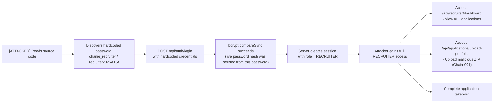
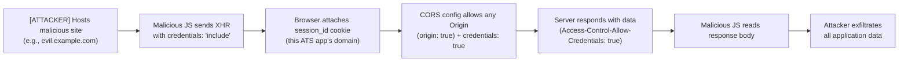

```mermaid
flowchart LR
    A["[ATTACKER] Craft malicious HTML page"] --> B["Victim (RECRUITER) visits page"]
    B --> C["Browser sends POST to /api/applications/upload-portfolio\n(NO CSRF token required)"]
    C --> D["Server processes upload without CSRF check"]
    D --> E["multer stores ZIP in memory"]
    E --> F["adm-zip extracts ZIP entries\n(entry.entryName unsanitized)"]
    F --> G["path.join(uploadDir, entry.entryName)\nwith entry containing ../ sequences"]
    G --> H["Arbitrary file write on server filesystem"]
    H --> I["Potential RCE: write web shell or\noverwrite application code/config"]
```

```mermaid
flowchart LR
    A["[ATTACKER] Iterates user_id = 1, 2, 3..."] --> B["Computes MD5(user_id)"]
    B --> C["Tries API key via\n?api_key=<md5(id)> or X-API-Key header"]
    C --> D["requireAuth callback in db.all\nmatches hash to valid user"]
    D --> E["Authenticated as valid user\nwith access to their data"]
    E --> F["Query /api/applications/my\n- All candidates' data for that user"]
    F --> G["Query /api/applications/:id\n- Individual application details"]
    G --> H["Query /api/recruiter/dashboard\n(if user_id == recruiter's id)"]
    H --> I["Full data breach of all candidates"]
```

# Chained Vulnerability Audit Report

**Project:** Recruitment ATS Platform (app-33-recruitment-ats)  
**Audit Type:** Static-Only Chained Vulnerability Review  
**Date:** 2026-05-25  
**Auditor:** CodeGopher (Static Analysis)  
**Scope:** `src/index.ts`, `package.json`, `Dockerfile`, `tsconfig.json`  

---

## 1. Summary Dashboard

| Metric | Value |
|---|---|
| **Total Chained Vulnerabilities Found** | 4 |
| **Maximum Severity** | **CRITICAL** |
| **Cross-Cutting Weaknesses** | 10 |
| **Reviewed Areas** | Source code, routes, middleware, auth logic, file upload handler, session store, dependency manifest, Dockerfile, TypeScript config |
| **Areas Not Reviewed** | Runtime environment config, database schema migration scripts, network configuration, TLS/SSL setup, deployment pipeline |
| **Confidence Levels** | 3 High, 1 Medium |

### Severity Distribution

```
CRITICAL  ████████████ (2 chains)
HIGH      ████████     (1 chain)
MEDIUM    ████         (1 chain)
```

---

## 2. Methodology and Safety Note

This review follows a **static-only** approach:

- **Sources:** Source files (`src/index.ts`), dependency manifests (`package.json`), Dockerfile, TypeScript config, and inline comments.
- **Technique:** Control-flow analysis, data-flow tracing, authorization logic verification, and cryptographic assessment.
- **Exclusions:** No live HTTP probes, no dynamic scanners, no exploit payloads, no shell commands, no external network tests.
- **Safety:** All findings are based on observable code patterns and configuration values. No executable exploit instructions are included.

---

## 3. Chained Vulnerability Chains

---

### CHAIN-001: CSRF + ZIP Path Traversal → Arbitrary File Write (Potential RCE)

**Severity:** CRITICAL  
**Confidence:** HIGH  
**Easiest Remediation Link:** CSRF token enforcement on all state-changing endpoints

#### Mermaid Attack Graph



#### Detailed Chain Breakdown

| Link | File | Lines | Evidence |
|---|---|---|---|
| **Entry Point** | `src/index.ts` | 158–180 | `POST /api/applications/upload-portfolio` requires `RECRUITER` role but has NO CSRF protection |
| **Hop 1** | `src/index.ts` | 158–180 | No CSRF middleware or token verification anywhere in the middleware stack |
| **Hop 2** | `src/index.ts` | 165 | `const targetPath = path.join(uploadDir, entry.entryName)` — `entryName` comes directly from the ZIP file with no sanitization or validation |
| **Sink** | `src/index.ts` | 171–174 | `fs.writeFileSync(targetPath, getData())` writes extracted content to the computed `targetPath` |

**Preconditions:**
- An attacker can host a malicious HTML page that issues a cross-site POST request with a crafted ZIP file.
- A victim with `RECRUITER` role is logged in and visits the attacker's page.
- The crafted ZIP contains entries with `../../` directory traversal sequences in their names.

**Impact:**
An attacker can write arbitrary files to any directory on the server filesystem that the Node.js process can access. On a typical deployment, this could include overwriting application source code (`dist/index.js`), writing a web shell to a publicly accessible directory, or modifying configuration files. The code comment on line 166 even admits: *"Combines entryName directly without preventing directory traversal sequences (../)"*.

**Remediation:**
1. **CRITICAL:** Validate and sanitize `entry.entryName` before path construction. Reject any entry name containing `..`, `/`, or `\`. Use `path.resolve()` and verify the resolved path stays within `uploadDir`.
2. **HIGH:** Add CSRF protection (e.g., `csurf` or double-submit cookie pattern) to all state-changing POST endpoints.
3. **MEDIUM:** Consider using a library with built-in path traversal protection for ZIP extraction (e.g., `yauzl` or `archiver` with path validation).

---

### CHAIN-002: Hardcoded Credentials → Role Privilege Escalation → Full System Takeover

**Severity:** CRITICAL  
**Confidence:** HIGH  
**Easiest Remediation Link:** Remove hardcoded credentials and use environment variables or a secrets manager

#### Mermaid Attack Graph



#### Detailed Chain Breakdown

| Link | File | Lines | Evidence |
|---|---|---|---|
| **Entry Point** | `src/index.ts` | 82–85 | Three users with plaintext passwords defined inline: `alice_candidate`/`candidate123`, `bob_candidate`/`candidate456`, `charlie_recruiter`/`recruiter2026ATS!` |
| **Hop 1** | `src/index.ts` | 179–194 | `/api/auth/login` accepts `username` + `password` from request body and compares against stored bcrypt hash |
| **Hop 2** | `src/index.ts` | 86–89 | `bcrypt.hashSync(u.pass, salt)` seeds the database with the hardcoded password's hash at startup |
| **Sink** | `src/index.ts` | 102–107 | Session created with user's `role` field, granting `RECRUITER` privileges |

**Preconditions:**
- Attacker has read access to source code (GitHub repo, Dockerfile COPY, or build artifacts).

**Impact:**
Complete control of the recruitment ATS system. The attacker obtains the `RECRUITER` role, enabling:
- Full access to the recruiter dashboard (all candidate applications).
- Upload malicious ZIP files (enabling Chain-001 for potential RCE).
- Create/manage candidate applications.

**Remediation:**
1. **CRITICAL:** Remove all hardcoded credentials from source code. Use environment variables or a secrets manager for admin accounts.
2. **HIGH:** Implement a proper first-run setup wizard or seed script that runs only in development, with clear warnings against production use.
3. **MEDIUM:** Rotate all passwords immediately if this code is deployed to any environment with source code exposure.

---

### CHAIN-003: Weak API Key Scheme → Mass Account Enumeration → Data Breach

**Severity:** HIGH  
**Confidence:** HIGH  
**Easiest Remediation Link:** Replace MD5(user_id) with a cryptographically secure random API key

#### Mermaid Attack Graph



#### Detailed Chain Breakdown

| Link | File | Lines | Evidence |
|---|---|---|---|
| **Entry Point** | `src/index.ts` | 153 | `const apiKey = crypto.createHash('md5').update(req.user!.id.toString()).digest('hex')` — API key is MD5 of sequential integer |
| **Hop 1** | `src/index.ts` | 112–120 | `requireAuth` fallback: iterates ALL users (`db.all('SELECT id, username, role FROM users')`), computes MD5 of each user's ID, compares to provided key |
| **Hop 2** | `src/index.ts` | 82–85 | Users are seeded with sequential IDs starting from 1 (AUTOINCREMENT) |
| **Sink** | `src/index.ts` | 127–145, 148–156 | Any authenticated user can access their applications, specific application by ID, and recruiters can access all applications |

**Preconditions:**
- User IDs are sequential integers starting from 1 (visible from AUTOINCREMENT + seed data).
- MD5 is a fast, broken hash — no significant computational barrier to brute-force.
- No rate limiting on API key authentication attempts.

**Impact:**
An attacker can trivially compute valid API keys for every user by iterating `MD5(1)`, `MD5(2)`, etc. Combined with lack of rate limiting, this allows systematic enumeration of all accounts. The attacker gains access to:
- All candidate personal data (names, emails, resume text).
- Recruiter dashboard data (all applications).
- Capability to authenticate via `?api_key=` query parameter (loggable in server logs, proxy logs, browser history).

**Remediation:**
1. **CRITICAL:** Replace MD5-based API keys with cryptographically secure random strings (e.g., `crypto.randomBytes(32).toString('hex')`) stored hashed in the database.
2. **HIGH:** Add rate limiting to all authentication endpoints (session login and API key lookup).
3. **HIGH:** Prefer header-based API key transmission (`X-API-Key`) over query parameter, which avoids logging in URL.
4. **MEDIUM:** Cache user data in memory to avoid iterating all users on every API key check.

---

### CHAIN-004: CORS Misconfiguration + Session Cookies → Cross-Origin Credential Theft

**Severity:** MEDIUM  
**Confidence:** MEDIUM  
**Easiest Remediation Link:** Restrict CORS `origin` to specific trusted domains

#### Mermaid Attack Graph



#### Detailed Chain Breakdown

| Link | File | Lines | Evidence |
|---|---|---|---|
| **Entry Point** | `src/index.ts` | 31 | `app.use(cors({ origin: true, credentials: true }))` — `origin: true` reflects the request `Origin` header back as `Access-Control-Allow-Origin`, and `credentials: true` sets `Access-Control-Allow-Credentials: true` |
| **Hop 1** | `src/index.ts` | 30 | `app.use(cookieParser())` — parses `session_id` cookie from requests |
| **Hop 2** | `src/index.ts` | 102–107 | `getSessionUser` checks `req.cookies.session_id` — session cookie is sent automatically by the browser on same-origin requests and can be sent cross-origin when `credentials: true` is set |
| **Sink** | Any authenticated route | — | Malicious third-party sites can read sensitive API responses containing candidate PII and recruiter data |

**Preconditions:**
- The ATS application is accessible from the browser (it serves an HTTP API at port 8033).
- A victim with an active session visits a malicious third-party site.

**Impact:**
Any third-party website can make authenticated cross-origin requests to this ATS application using the victim's session cookie. This enables data exfiltration of:
- All applications submitted by the authenticated user.
- Recruiter dashboard data (if the victim is a recruiter).
- Individual application details.

Note: Confidence is MEDIUM because in practice, many browsers and corporate networks may mitigate cookie-based cross-origin attacks via SameSite cookie attributes, network isolation, or tab-napping protections. However, the code configuration is objectively insecure.

**Remediation:**
1. **HIGH:** Replace `origin: true` with a specific list of trusted origins (e.g., `origin: ['https://my-app.example.com']`).
2. **HIGH:** Set `SameSite: 'Strict'` or `SameSite: 'Lax'` on the session cookie (currently only `httpOnly: true` is set).
3. **MEDIUM:** Consider removing `credentials: true` entirely if cross-origin requests are not needed.

---

## 4. Cross-Cutting Weaknesses Inventory

These security-relevant issues do not individually form complete chains but compound the overall risk:

| # | Weakness | File | Lines | Severity |
|---|---|---|---|---|
| 1 | **No Rate Limiting** | `src/index.ts` | 179–194 (login), 112–120 (API key) | MEDIUM |
| 2 | **Verbose Error Details** | `src/index.ts` | 180 | `error.details` leaks internal failure info to client | LOW |
| 3 | **No Session Expiry** | `src/index.ts` | 102–107 | In-memory sessions stored indefinitely | MEDIUM |
| 4 | **No SameSite on Cookies** | `src/index.ts` | 193 | `res.cookie('session_id', sessionId, { httpOnly: true })` — missing `SameSite` attribute | LOW |
| 5 | **No HTTPS Enforcement** | Dockerfile, index.ts | — | App binds to port 8033 without TLS guidance | LOW |
| 6 | **Unfiltered Dashboard Data** | `src/index.ts` | 135 | `db.all('SELECT * FROM applications')` returns ALL rows, no pagination | LOW |
| 7 | **Async Auth Callback Risk** | `src/index.ts` | 114–120 | `requireAuth` uses `db.all` callback; if callback throws before `next()`/`res.status()`, the handler may hang or return inconsistent state | MEDIUM |
| 8 | **Query Parameter API Key** | `src/index.ts` | 111 | `req.query.api_key` — API key appears in server logs, browser history, proxy logs | LOW |
| 9 | **In-Memory Session Store** | `src/index.ts` | 102 | Sessions lost on process restart; no persistence mechanism | LOW |
| 10 | **No Input Validation** | `src/index.ts` | 179–182 | Login endpoint accepts arbitrary `username`/`password` without length/type validation | LOW |

---

## 5. Unknowns and Not-Reviewed Areas

| Area | Status | Notes |
|---|---|---|
| **Database Hardening** | Not reviewed | SQLite in-memory mode may behave differently in production with file-based storage |
| **Upload Directory Permissions** | Not reviewed | `fs.mkdirSync` is called at runtime; file system permissions on the host are unknown |
| **TLS/SSL Configuration** | Not reviewed | Dockerfile exposes port 8033 without any TLS termination |
| **Container Security** | Not reviewed | No non-root user, no resource limits, no seccomp/AppArmor in Dockerfile |
| **Dependency Versions** | Not reviewed | Specific minor versions not pinned beyond caret constraints; `sqlite3` types are `*` (latest) |
| **Test Coverage** | Not reviewed | No test files found in the repository |
| **Error Handling Patterns** | Partially reviewed | Async callback error paths in `requireAuth` could lead to unhandled responses |
| **Logging & Monitoring** | Not reviewed | No logging middleware or audit trail found |

---

## 6. Recommended Remediation Priority

```
P0 (Immediate)
├── Remove hardcoded credentials (Chain-002)
├── Sanitize ZIP entry names and reject path traversal (Chain-001)
├── Replace MD5-based API keys with secure random strings (Chain-003)

P1 (Short-term)
├── Add CSRF protection to all state-changing POST endpoints (Chain-001)
├── Restrict CORS to specific trusted origins (Chain-004)
├── Add SameSite cookie attribute to session cookies
├── Implement rate limiting on all authentication endpoints

P2 (Medium-term)
├── Add pagination to dashboard queries
├── Implement persistent, expiring session store
├── Add structured logging and audit trails
├── Pin dependency versions and review for known CVEs
├── Add input validation middleware
├── Implement container security best practices (non-root, resource limits)
```

---

## 7. Tests to Add

| Test | Description |
|---|---|
| **Path Traversal on ZIP Upload** | Verify that a ZIP containing `../../etc/passwd` or `../../../app/dist/server.js` does not write outside `uploads/` |
| **CSRF Token Required on POST** | Verify that POST requests without a valid CSRF token are rejected on login, logout, upload-portfolio, and api-key endpoints |
| **API Key Entropy** | Verify that API keys are not derivable from user IDs; test that sequential IDs produce unpredictable keys |
| **Hardcoded Credential Absence** | Add a lint rule or test that rejects hardcoded password strings in source code |
| **CORS Origin Restriction** | Verify that cross-origin requests from unknown origins receive `Access-Control-Allow-Origin: *` or are denied, not the victim's origin |
| **Session Expiry** | Verify that sessions expire after a configurable timeout |
| **Rate Limiting** | Verify that >100 login attempts within 1 minute results in temporary ban |
| **Error Detail Suppression** | Verify that production error responses do not include internal `details` fields |

---

*This report was generated using static-only analysis. No live probes, dynamic scans, or exploit payloads were used. Findings are based on observable code patterns, data flow, and configuration values within the reviewed source files.*
