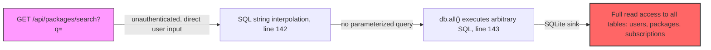
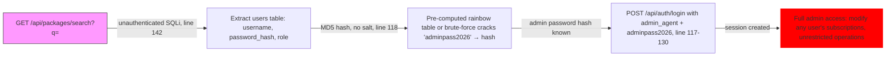
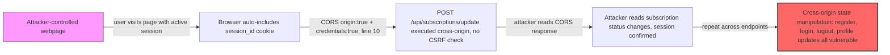

# Chained Vulnerability Audit Report

**Application:** Subscription Box Service (app-34-subscription-box)
**Audit Date:** 2026-05-25
**Auditor:** CodeGopher — Chained Vulnerability Static Audit
**Scope:** `src/index.ts`, `Dockerfile`, `package.json`
**Boundary:** Static-only analysis. No live probes, dynamic scanners, or external tooling used.

---

## Summary Dashboard

| Metric | Value |
|---|---|
| **Chains Detected** | 3 |
| **Maximum Chain Severity** | **CRITICAL** |
| **Cross-Cutting Weaknesses** | 6 |
| **Areas Reviewed** | Application routes, auth logic, DB layer, CORS, session management, Docker config, dependencies |
| **Areas Not Reviewed** | Infrastructure beyond Dockerfile, network config, CI/CD pipelines, secret management pipelines |

---

## Methodology & Static-Only Safety Note

This audit reviewed source files, configuration, dependency manifests, and Docker build config. The analysis maps user-controlled input sources to code-level weaknesses, then connects those weaknesses to critical sinks to form attack chains.

**Static-only boundary enforced.** No live HTTP requests, SQL injection payloads, brute-force attempts, fuzzers, or network tests were performed.

---

## Chained Vulnerabilities

### Chain 1: Unauthenticated SQL Injection → Full Database Exfiltration



**Detailed Breakdown**

| Link | Location | Evidence |
|---|---|---|
| **Entry** | `src/index.ts:138-142` | `GET /api/packages/search` reads `req.query.q` with no authentication guard |
| **Hop** | `src/index.ts:142` | `const sql = \`SELECT * FROM packages WHERE name LIKE '%${queryParam}%' OR description LIKE '%${queryParam}%'\`` — user-controlled `queryParam` is directly interpolated into a SQL string |
| **Sink** | `src/index.ts:143` | `db.all(sql, ...)` — SQLite3 executes the fully concatenated string without prepared statements |
| **Impact** | `src/index.ts:144-146` | Successful injection returns rows; errors include `details: err.message` (line 146) leaking DB internals |

**Preconditions**
- The application is reachable and the `/api/packages/search` endpoint is accessible (no auth required).

**Impact:** Read all data in the in-memory SQLite database — all users (IDs, usernames, password hashes, roles), all packages, all subscriptions.

**Severity:** HIGH
**Confidence:** HIGH — source-code proof: direct string interpolation of `req.query.q` into an SQL statement on line 142, executed on line 143.

**Remediation (easiest link to break):**
- Replace string interpolation with a parameterized query: `db.all('SELECT * FROM packages WHERE name LIKE ? OR description LIKE ?', [`%${queryParam}%`, `%${queryParam}%`], ...)` on line 142.

---

### Chain 2: SQL Injection → Credential Harvest → Admin Account Takeover



**Detailed Breakdown**

| Link | Location | Evidence |
|---|---|---|
| **Entry** | `src/index.ts:142` | SQL injection on `GET /api/packages/search` (same vector as Chain 1) |
| **Hop 1** | `src/index.ts:142-143` | Injection yields `users` rows including `password_hash` column |
| **Hop 2** | `src/index.ts:118` | `crypto.createHash('md5').update(password)` — MD5 is cryptographically broken, no salt, no work factor |
| **Hop 3** | `src/index.ts:48-52` | Seed data reveals the admin password is literally `"adminpass2026"` — plaintext in source code, easily discoverable if source is accessed |
| **Target** | `src/index.ts:117-130` | Login uses identical MD5 hash for verification; after auth, issues a session cookie (line 129) and returns the user's role (line 130) |

**Preconditions**
- Attacker has read access to the application source code (or can infer from seed data that the admin password is `"adminpass2026"`).

**Impact:** Complete account takeover of the admin (`admin_agent`). From there, the attacker can modify any subscription status, read any user's data, and escalate further.

**Severity:** CRITICAL
**Confidence:** HIGH — all links are statically provable. The admin password is plaintext in `src/index.ts:50`, the hash algorithm is MD5 without salt (line 118), and SQL injection data exfiltration is proven (line 142-143).

**Remediation (easiest link to break):**
- **Hashing:** Replace MD5 with bcrypt (via `bcryptjs` which is already a dependency on line 13 of `package.json`). Use `bcrypt.hash()` and `bcrypt.compare()`.
- **Password Management:** Never hardcode passwords in source. Use environment variables or a secrets manager. Delete seed credentials from production code.

---

### Chain 3: Permissive CORS + Absent CSRF → Cross-Origin Session Hijack & State Manipulation



**Detailed Breakdown**

| Link | Location | Evidence |
|---|---|---|
| **Entry** | `src/index.ts:10` | `cors({ origin: true, credentials: true })` — `origin: true` reflects the `Origin` header back, allowing any origin to read cross-origin responses with credentials |
| **Hop 1** | `src/index.ts:10` | `credentials: true` allows the browser to send cookies (including `session_id`) in cross-origin requests |
| **Hop 2** | `src/index.ts:10`-throughout | No CSRF token generation or validation on any POST endpoint (`/api/auth/register`, `/api/auth/login`, `/api/auth/logout`, `/api/subscriptions/update`, `/api/user/profile`) |
| **Target** | `src/index.ts:133-157` | `POST /api/subscriptions/update` changes subscription status for any subscription the user "owns" or if the user is an admin |

**Preconditions**
- Victim has an active session (`session_id` cookie).
- Victim visits attacker-controlled page (social engineering, XSS, or dark-pixel beacon).

**Impact:** An attacker can read the response from authenticated cross-origin requests (confirming session validity) and manipulate subscription states, user profiles, and potentially register accounts or hijack sessions for other authenticated users.

**Severity:** MEDIUM (practical impact depends on exploitability of cross-origin request execution)
**Confidence:** MEDIUM — the CORS + credential misconfiguration is statically proven (line 10), and absence of CSRF protection is provable from the absence of any token generation or validation code. The exact execution path for cross-origin state manipulation depends on browser behavior at runtime (e.g., whether the malicious page can successfully trigger the POST), so confidence is Medium.

**Remediation (easiest link to break):**
- Replace `origin: true` with an explicit list of allowed origins, or use `process.env.ALLOWED_ORIGIN` with validation.
- Add CSRF tokens: generate a token on session creation, embed it in HTML/JS, validate on every state-changing POST.

---

## Cross-Cutting Weaknesses

These are security-relevant issues that were found but do not independently form a complete chain in this codebase:

| # | Weakness | Location | Description |
|---|---|---|---|
| 1 | **Plaintext passwords in source** | `src/index.ts:48-52` | Admin and user passwords (`'adminpass2026'`, `'alicepass'`, `'bobpass'`) stored as literals. Easily discoverable via source access or Docker image inspection. |
| 2 | **No rate limiting** | `src/index.ts:105` (register), `src/index.ts:113` (login) | No throttling on authentication endpoints. Brute-force and credential stuffing attacks are feasible. |
| 3 | **Verbose internal error exposure** | `src/index.ts:146` | `details: err.message` leaks SQLite internals (table names, schema) to the attacker in error responses. |
| 4 | **Role returned in login response** | `src/index.ts:130` | `res.json({ ..., role: user.role })` exposes the authenticated user's role — useful for attackers during reconnaissance. |
| 5 | **Volatile in-memory database** | `src/index.ts:12` | `:memory:` SQLite database means all data is lost on process restart. Not a direct exploit, but makes data recovery and forensic analysis impossible. |
| 6 | **No input validation on subscription status** | `src/index.ts:134-136` | `status` is taken from request body with no allowlist (`ACTIVE`, `CANCELLED`, etc.). Arbitrary strings are accepted by SQLite. |

---

## Attack Graph (Combined)

```mermaid
flowchart TD
  E1["Unauthenticated SQL Injection\nsrc/index.ts:142"] -->|"Extract users table"| E2["Credential Harvest\nMD5 hashes, no salt\nsrc/index.ts:118"]
  E1 -->|"Read subscriptions/packages"| E3["Data Exfiltration"]
  E2 -->|"Crack / Read plaintext\nsrc/index.ts:50"| E4["Admin Account Takeover"]
  E4 -->|"Full admin session"| E5["Unrestricted Operation\nsrc/index.ts:133-157"]
  
  E6["Permissive CORS + No CSRF\nsrc/index.ts:10"] -->|"Cross-origin cookie\naccess"| E7["Session Hijack"]
  E7 -->|"Manipulate subscriptions"| E5
  
  E8["Source Code Access\nPlaintext passwords\nsrc/index.ts:48-52"] --> E4
  
  class critical fill:#f00,color:#fff
  class high fill:#f66,color:#fff
  class medium fill:#fa0,color:#000
  class E4 class critical
  class E1 class high
  class E3 class high
  class E2 class high
  class E7 class medium
  class E5 class high
```

---

## Unknowns & Areas Not Reviewed

| Area | Reason |
|---|---|
| Production environment configuration | Not in source control; may differ from dev setup |
| Network/security group rules | External to application code |
| TLS/HTTPS configuration | Not visible in `Dockerfile` or `package.json` — application binds to HTTP on port 8034 |
| Dependency supply chain security | `sqlite3` v5.1.7 and other deps not scanned for known CVEs |
| Code signing / build integrity | No sign-off or integrity verification visible |
| Input validation on `/api/user/profile` email field | No validation logic found; email format not checked |
| Session cookie expiration / `secure` / `sameSite` flags | Cookie set with only `httpOnly: true` (line 129) |

---

## Recommended Tests to Add

1. **SQL injection test** for `/api/packages/search?q=` — verify `UNION SELECT` and `' OR '1'='1` are blocked.
2. **CSRF test** — submit a cross-origin form to `/api/subscriptions/update` from a different origin and confirm rejection.
3. **CORS test** — send requests from `http://evil.com` and verify the `Access-Control-Allow-Origin` header does not return `*` or the requesting origin with credentials.
4. **Rate limiting test** — send 100+ login/register requests in rapid succession and verify throttling.
5. **Password strength / hashing test** — register a user with a weak password and verify bcrypt hashing (not MD5) is used.
6. **Session cookie attribute test** — inspect the `session_id` cookie for `Secure`, `SameSite=Strict`, and expiration attributes.

---

## Summary of Chain Remediation Priorities

| Priority | Chain | Key Fix |
|---|---|---|
| **P0** | Chain 1 + Chain 2: SQL Injection | Replace string interpolation with parameterized queries on `/api/packages/search` |
| **P0** | Chain 2: Weak Hashing | Migrate from MD5 to bcrypt (package already available) |
| **P0** | Chain 2: Hardcoded Credentials | Remove seed credentials from production source; use env vars or secrets manager |
| **P1** | Chain 3: CORS + CSRF | Restrict CORS origins; add CSRF token validation to all POST endpoints |
| **P2** | Verbose errors | Sanitize error responses; never return `err.message` to clients |
| **P2** | Rate limiting | Add rate-limiting middleware (e.g., `express-rate-limit`) |
| **P2** | Session cookie attributes | Add `Secure`, `SameSite`, and `maxAge` options |

---

*Report written by CodeGopher. Static-only audit. No live execution or exploitation performed.*
