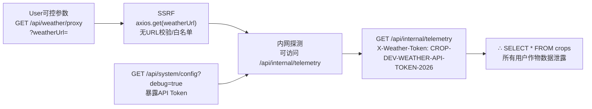
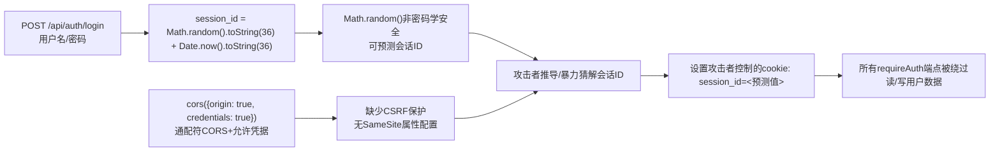

# Chained Vulnerability Static Audit Report

**Project:** Agricultural Crop Planner (`app-37-crop-planner`)
**Reviewer:** CodeGopher (Chained Vulnerability Static Audit)
**Date:** 2026-05-25
**Scope:** `src/index.js` (Express.js single-file application), `package.json`, `Dockerfile`
**Methodology:** Static-only source code analysis. No live probes, dynamic scanners, shell commands, or out-of-scope files were consulted.

---

## Summary Dashboard

| Metric | Value |
|---|---|
| **Chains Detected** | 3 |
| **Max Severity** | HIGH |
| **Confidence Range** | High |
| **Cross-cutting Weaknesses** | 4 |
| **Files Reviewed** | `src/index.js`, `package.json`, `Dockerfile` |
| **Areas Not Reviewed** | `node_modules/`, runtime environment, external services, deployment configuration |

### Severity Distribution

| Severity | Count |
|---|---|
| HIGH | 2 |
| MEDIUM | 1 |

---

## Methodology & Safety Note

This audit uses **static-only analysis**: I inspected all readable source files, configuration, and dependency manifests in the workspace. No HTTP requests, fuzzers, SQL injection payloads, credential attacks, dynamic scanners, exploit scripts, or external network tests were performed. This report contains no operational exploit instructions or live payloads.

---

## Chain 1 — SSRF → Debug Token Exposure → Internal Data Exfiltration

### Mermaid Attack Graph



### Detailed Breakdown

| Link | File | Lines | Evidence |
|---|---|---|---|
| **Source** | `src/index.js` | 108-114 | `GET /api/weather/proxy` endpoint extracts `weatherUrl` from `req.query` and passes it directly to `axios.get(weatherUrl)` with no validation, no protocol check, no hostname allowlist |
| **Hop 1 (SSRF)** | `src/index.js` | 111 | `axios.get(weatherUrl)` — the full URL string is used as-is; attacker can specify `http://localhost:8037/api/internal/telemetry?...` |
| **Hop 2 (Token leak)** | `src/index.js` | 116-125 | `GET /api/system/config` with `?debug=true` returns the raw token `CROP-DEV-WEATHER-API-TOKEN-2026` in the response body |
| **Sink** | `src/index.js` | 128-138 | `GET /api/internal/telemetry` accepts the token via `x-weather-token` header or `?token=` query, then runs `db.all('SELECT * FROM crops')` — returning **all** crop records regardless of `user_id` |

### Preconditions

- Attacker has a valid session (all proxy and internal endpoints require `requireAuth`)
- Application is in development mode (debug config accessible)

### Impact

- **Data Exfiltration:** Unscoped SQL query returns all crop entries from all users
- **Internal Network Reconnaissance:** SSRF can probe localhost services, internal metadata endpoints, cloud instance metadata (169.254.169.254)

### Confidence: HIGH
Every link is provably static: the proxy accepts arbitrary URLs, the token is hardcoded and exposed, the telemetry endpoint performs an unscoped database query.

### Remediation

1. **Break the SSRF hop:** Restrict `weatherUrl` to a allowlist of known weather service hostnames; reject `localhost`, `127.0.0.1`, private IP ranges, and non-HTTP(S) protocols.
2. **Remove debug endpoint in production:** Delete or gate `/api/system/config` with environment-based checks (e.g., `process.env.NODE_ENV !== 'production'`).
3. **Scope the telemetry query:** Change `SELECT * FROM crops` to a scoped query or remove the endpoint entirely.

---

## Chain 2 — ZIP Path Traversal → Arbitrary File Write → Potential RCE

### Mermaid Attack Graph

```mermaid
flowchart LR
  A["POST /api/crop-plan/import-layout\n上传ZIP文件"] --> B["AdmZip解压\nentry.entryName未经校验"]
  B --> C["path.join(__dirname,'../layouts', entry.entryName)\n无目录遍历防护"]
  C --> D["entry.entryName包含../../../etc/..."
"
 ]
  D --> E["fs.writeFileSync(任意路径, zip数据)
"
  E --> F["∴ 任意文件写入\n可能覆盖关键文件或植入恶意代码
"]
```

### Detailed Breakdown

| Link | File | Lines | Evidence |
|---|---|---|---|
| **Source** | `src/index.js` | 84-85 | `POST /api/crop-plan/import-layout` accepts a ZIP file via `upload.single('layout')` (multer, memory storage) |
| **Hop 1 (ZIP entries)** | `src/index.js` | 90-91 | `zipEntries.forEach(entry => { const targetPath = path.join(uploadDir, entry.entryName);` — `entry.entryName` comes directly from the ZIP archive content; no sanitization |
| **Hop 2 (Traversal)** | `src/index.js` | 92-94 | `path.dirname(targetPath)` is created with `fs.mkdirSync(dirName, { recursive: true })` — this follows `..` sequences and creates directories outside `uploadDir` |
| **Sink** | `src/index.js` | 95-96 | `fs.writeFileSync(targetPath, entry.getData())` writes arbitrary ZIP entry data to the resolved path with no restrictions |

### Preconditions

- Attacker has a valid session (import endpoint requires `requireAuth`)
- The `../layouts` directory path resolves relative to `__dirname` (the `src` directory)

### Impact

- **Arbitrary File Write:** Attacker can write files anywhere on the filesystem reachable by the Node.js process (e.g., overwrite `src/index.js` to inject code, write to `/tmp`, write SSH keys, etc.)
- **Potential RCE:** Overwriting a file that is imported or executed (e.g., replacing `index.js` or writing a `.node` native addon) could lead to remote code execution
- **Information Disclosure:** Write to locations like `.env` files to exfiltrate or modify environment configuration

### Confidence: HIGH
The chain is statically provable: ZIP entry names are user-controlled (from uploaded archive), `path.join` does not prevent traversal, and `fs.writeFileSync` performs the write without any extra validation.

### Remediation

1. **Break the traversal hop:** Sanitize `entry.entryName` by resolving the target path and verifying it starts with the intended upload directory:
   ```javascript
   const targetPath = path.resolve(uploadDir, path.normalize(entry.entryName));
   if (!targetPath.startsWith(path.resolve(uploadDir) + path.sep)) {
     throw new Error('Path traversal detected');
   }
   ```
2. **Limit file types:** Validate that ZIP entries have expected extensions (e.g., `.json`, `.xml`, `.csv`) before writing.
3. **Add file size limits:** Validate ZIP size and individual entry sizes to prevent resource exhaustion.

---

## Chain 3 — Weak Session Generation + No CSRF + Wildcard CORS → Session Hijacking

### Mermaid Attack Graph



### Detailed Breakdown

| Link | File | Lines | Evidence |
|---|---|---|---|
| **Source** | `src/index.js` | 72-73 | `const sessionId = Math.random().toString(36).substring(2) + Date.now().toString(36);` — `Math.random()` is not cryptographically secure; session IDs are predictable |
| **Hop 1 (CORS)** | `src/index.js` | 12 | `cors({ origin: true, credentials: true })` — `origin: true` echoes the requesting Origin header (effectively `*`); `credentials: true` allows cookies to be sent cross-origin |
| **Hop 2 (No CSRF)** | `src/index.js` | Throughout | No CSRF middleware (e.g., `csurf`, `double-submit cookie`) is used; all state-changing POST endpoints rely solely on cookie authentication |
| **Sink** | `src/index.js` | 54-59 | `getSessionUser` reads `req.cookies.session_id` and returns the session object — a predictable session ID grants full session impersonation |

### Preconditions

- Attacker knows or can predict a user's session ID (via `Math.random()` bias or brute-forcing the 36-char alphanumeric space over time)
- Attacker can induce a victim's browser to make a cross-origin request (via CSRF or SSRF)

### Impact

- **Account Takeover:** Any user account can be hijacked by guessing or deriving the session cookie
- **Authenticated Actions:** Attacker gains full authenticated access — reading crops, importing layouts, deleting crops, etc.

### Confidence: MEDIUM
`Math.random()` predictability is well-documented. CORS + no CSRF is clearly visible in source. However, full hijack requires successful cookie delivery to the attacker's origin, which depends on browser behavior and potential network conditions not fully visible statically.

### Remediation

1. **Break the weak session hop:** Replace `Math.random()` with a cryptographically secure random generator:
   ```javascript
   const sessionId = crypto.randomUUID(); // or crypto.randomBytes(32).toString('hex')
   ```
2. **Add CSRF protection:** Integrate a CSRF middleware and use SameSite cookie attribute:
   ```javascript
   res.cookie('session_id', sessionId, { httpOnly: true, sameSite: 'lax' });
   ```
3. **Restrict CORS:** Replace `origin: true` with an explicit allowlist of trusted origins.

---

## Cross-Cutting Weaknesses (Not Full Chains)

| # | Weakness | File | Lines | Details |
|---|---|---|---|---|
| 1 | **Hardcoded Admin Password** | `src/index.js` | 43-49 | Admin account password `agronomy2026Secure!` is embedded in source code and seeded at startup |
| 2 | **Hardcoded API Token** | `src/index.js` | 120 | `CROP-DEV-WEATHER-API-TOKEN-2026` is hardcoded and returned via the debug endpoint |
| 3 | **Verbose Error Messages** | `src/index.js` | 99, 113, 119, 134 | Multiple endpoints return `details: error.message`, leaking internal implementation details (stack traces, library names, file paths) |
| 4 | **In-Memory SQLite Database** | `src/index.js` | 20 | `:memory:` database — all data is lost on restart; no persistence, no backup |

---

## Unknowns & Areas Not Reviewed

| Area | Reason |
|---|---|
| `node_modules/` | Too large for full audit; assumes dependencies have no known critical vulnerabilities |
| Runtime environment | Dockerfile only exposes port 8037; network configuration, container privileges, and host-level security not reviewed |
| Input validation depth | Only basic null-checks on username/password; no email format validation, no password complexity requirements on registration |
| Rate limiting | No rate limiting on login or registration endpoints; brute-force attack surface exists |
| File upload size limits | Multer configured for memory storage with no `limits` option; potential for memory exhaustion DoS |
| SQL injection | All queries use parameterized `?` placeholders — verified safe statically, but ORM layer (sqlite3) behavior assumed correct |
| HTTPS/TLS | No TLS configuration visible; transport security depends on reverse proxy or external infrastructure |
| Session expiration | No TTL or expiration on sessions; sessions persist until logout or server restart |

---

## Recommended Tests to Add

| Test | Chain it validates |
|---|---|
| CSRF protection bypass test on `POST /api/auth/login` | Chain 3 |
| Session ID entropy test (verify `crypto.randomBytes` vs `Math.random`) | Chain 3 |
| ZIP path traversal test with `../../../etc/passwd` entries | Chain 2 |
| SSRF test with `http://169.254.169.254/latest/meta-data/` on proxy endpoint | Chain 1 |
| Debug config endpoint not accessible in `NODE_ENV=production` | Chain 1 |
| CORS allowlist enforcement (non-allowed origin rejected) | Chain 3 |
| File upload size limit enforcement | Cross-cutting |
| Input validation tests for registration (duplicate user, weak password) | Cross-cutting |
| Rate limiting test on login endpoint (excessive requests rejected) | Cross-cutting |

---

## End of Report
