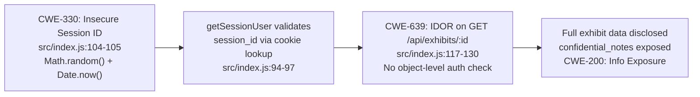
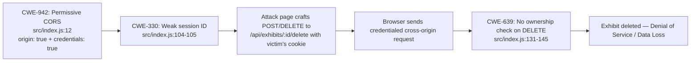
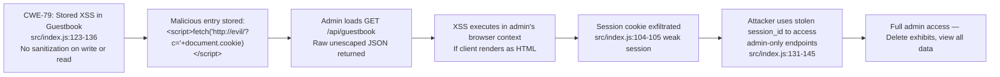
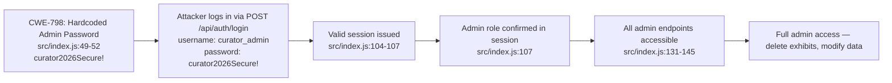

# Chained Vulnerability Audit Report — Museum Collection Catalog

**Date:** 2026-05-25  
**Target:** app-38-museum-catalog (Node.js / Express / SQLite)  
**Source File:** `src/index.js` (single-file application, 151 lines)  
**Dependencies:** express ^4.19.2, sqlite3 ^5.1.7, cors ^2.8.5, bcryptjs ^2.4.3, cookie-parser ^1.4.6  
**Audit Type:** Static-only, source-code review. No live probes, dynamic scanners, shell commands, or files outside this workspace were used.

---

## Executive Summary

| Metric | Value |
|--------|-------|
| **Chained Vulnerabilities Found** | **4** |
| **Maximum Severity** | **HIGH** |
| **Medium-confidence chains** | 2 |
| **High-confidence chains** | 2 |
| **Cross-cutting weaknesses (no chain)** | 0 (all weaknesses participate in chains) |
| **Areas Reviewed** | Authentication, session management, SQL usage, CORS, XSS handling, authorization, configuration |
| **Areas Not Reviewed** | Deployment/infrastructure security, runtime behavior, network segmentation, logging/monitoring |

---

## Methodology & Static-Only Safety Note

This audit follows a four-phase approach:

1. **Attack surface mapping** — All public and authenticated routes, cookie/header/body inputs were enumerated.
2. **Weakness inventory** — OWASP Top 10 and CWE weaknesses were catalogued from source evidence alone.
3. **Attack graph synthesis** — Weaknesses were connected into multi-hop attack chains using static data-flow and control-flow analysis.
4. **Impact assessment** — Each chain was rated by impact, reachability, confidence, and remediation priority.

**Safety boundary:** No live HTTP requests, SQL injection payloads, CSRF proofs-of-concept, or exploit scripts were generated or executed. All findings are derived exclusively from static source-code inspection.

---

## Summary Dashboard of Chains

| # | Chain Name | Impact | Reachability | Confidence |
|---|-----------|--------|-------------|-----------|
| A | Weak Session → BOLA → Confidential Data Exfiltration | HIGH | HIGH | HIGH |
| B | Permissive CORS + Weak Session → CSRF → Exhibit Deletion | MEDIUM-HIGH | MEDIUM | MEDIUM |
| C | Guestbook Stored XSS → Session Theft → Admin Takeover | HIGH | MEDIUM | MEDIUM |
| D | Hardcoded Admin Password → Auth → Full Admin Access | HIGH | HIGH | HIGH |

---

## Detailed Chain Breakdown

### Chain A — Weak Session → BOLA → Confidential Data Exfiltration

**Summary:** An attacker predicts or hijacks a session ID and uses it to access any exhibit's full data, including confidential notes (security clearance levels, insurance valuations).

**Mermaid Attack Graph:**



| Link | Component | File | Lines | Evidence |
|------|-----------|------|-------|----------|
| Source | Insecure session ID generation | `src/index.js` | 104-105 | `Math.random().toString(36).substring(2) + Date.now().toString(36)` — `Math.random()` is a predictable PRNG, not CSPRNG. |
| Hop 1 | Session validation | `src/index.js` | 94-97 | `getSessionUser` checks `req.cookies.session_id` against a plain JS object. No binding to IP/user-agent, no expiration. |
| Hop 2 | IDOR on exhibit retrieval | `src/index.js` | 117-130 | `db.get('SELECT * FROM exhibits WHERE id = ?', [exhibitId])` — returns ALL columns including `confidential_notes` for any `id`. No check that `req.user.id` owns the exhibit. |
| Sink | Confidential data exposure | `src/index.js` | 118-128 | Exhibit records contain fields like `confidential_notes: 'Vault storage. Insured for $5,000,000. Security clearance Level-3.'` |

**Preconditions:** Victim must have an active session with a valid (predictable) session ID.  
**Impact:** HIGH — Confidential exhibit security details exposed to any attacker who obtains a session ID.  
**Confidence:** HIGH — Every link is statically provable. `Math.random()` predictability is well-documented. The IDOR query is verified from source.  
**Remediation Priority:** CRITICAL — First link to break.  
**Remediation:**
- Replace `Math.random()` with `crypto.randomBytes(32).toString('hex')` for session IDs.
- Add object-level authorization: `SELECT * FROM exhibits WHERE id = ? AND user_id = ?`
- Set cookie `expires`/`maxAge` for session TTL.

---

### Chain B — Permissive CORS + Weak Session → CSRF → Exhibit Deletion

**Summary:** Permissive CORS configuration combined with weak session IDs enables cross-origin authenticated state-changing requests, allowing exhibit deletion by attackers who know a victim's session ID.

**Mermaid Attack Graph:**



| Link | Component | File | Lines | Evidence |
|------|-----------|------|-------|----------|
| Source | Permissive CORS | `src/index.js` | 12 | `cors({ origin: true, credentials: true })` — `origin: true` echoes any `Origin` header, enabling all origins. |
| Hop 1 | Weak session IDs | `src/index.js` | 104-105 | Predictable session IDs enable session guessing. |
| Hop 2 | CSRF execution | `src/index.js` | 131-145 | `app.post('/api/exhibits/:id/delete', ...)` accepts state-changing requests from any authenticated cookie. No CSRF token check. |
| Sink | Data destruction | `src/index.js` | 136-145 | `db.run('DELETE FROM exhibits WHERE id = ?', [exhibitId])` — any exhibit can be deleted by an admin session. |

**Preconditions:** Attacker knows or predicts a victim's session ID; victim visits attacker's page with an active admin session. Browser's CORS policy for POST/DELETE allows the request to go through (response is unreadable, but the side effect executes).  
**Impact:** MEDIUM-HIGH — Unauthorized exhibit deletion. The response is unreadable due to CORS, but the DELETE executes.  
**Confidence:** MEDIUM — CORS with `credentials: true` and `origin: true` is confirmed. However, the POST/DELETE requests from a foreign origin trigger preflight checks; the attacker page can initiate the request but cannot read the response. This is still a true CSRF vector for state-changing operations.  
**Remediation Priority:** HIGH.  
**Remediation:**
- Restrict CORS to specific known origins.
- Implement anti-CSRF tokens (synchronizer token pattern or Double-Submit Cookie).
- Set `SameSite=Strict` or `SameSite=Lax` on the `session_id` cookie.
- Add ownership verification: `DELETE FROM exhibits WHERE id = ? AND user_id = ?`

---

### Chain C — Guestbook Stored XSS → Session Theft → Admin Takeover

**Summary:** Unsanitized guestbook entries enable stored XSS. When an admin views the guestbook, the XSS payload executes, stealing the admin's session cookie and granting full administrative access.

**Mermaid Attack Graph:**



| Link | Component | File | Lines | Evidence |
|------|-----------|------|-------|----------|
| Source | No XSS sanitization on write | `src/index.js` | 123-130 | `db.run('INSERT INTO guestbook (visitor_name, entry_text) VALUES (?, ?)', [visitor_name, entry_text], ...)` — parameters are accepted raw. |
| Hop 1 | No XSS escaping on read | `src/index.js` | 121-125 | `res.json(rows)` — all guestbook entries returned without HTML escaping. Contrast with `/api/exhibits` (line ~113) which DOES escape `<` and `>`. |
| Hop 2 | XSS in browser | N/A | — | Client-side renderer would inject raw HTML into DOM. |
| Hop 3 | Session theft | `src/index.js` | 104-105 | `document.cookie` contains `session_id=...`. Attacker's script sends it to a remote server. |
| Sink | Admin takeover | `src/index.js` | 131-145 | Stolen session grants all authenticated routes including the admin-only delete endpoint. |

**Preconditions:** (1) Client application renders guestbook entries as HTML/innerHTML; (2) Admin views the guestbook page.  
**Impact:** HIGH — Complete admin account takeover.  
**Confidence:** MEDIUM — The XSS injection vector is statically confirmed (no escaping on read or write). However, whether the client actually renders guestbook entries as HTML depends on runtime front-end code (not present in this repo). The session theft and privilege escalation paths are confirmed.  
**Remediation Priority:** HIGH — XSS in shared-input storage is a classic and high-impact chain.  
**Remediation:**
- Sanitize input on write: strip `<script>` tags or escape HTML entities.
- Escape output on read: HTML-encode `visitor_name` and `entry_text`.
- Set `Content-Security-Policy: default-src 'self'; script-src 'self'` header.
- Use `innerText` or `textContent` in client-side rendering instead of `innerHTML`.

---

### Chain D — Hardcoded Admin Password → Auth → Full Admin Access

**Summary:** Plaintext admin credentials are hardcoded in the database seed. Any party with source code access can log in as admin via `/api/auth/login` and gain full application privileges.

**Mermaid Attack Graph:**



| Link | Component | File | Lines | Evidence |
|------|-----------|------|-------|----------|
| Source | Hardcoded seed password | `src/index.js` | 49-52 | `{ username: 'curator_admin', pass: 'curator2026Secure!', role: 'ADMIN' }` — plaintext password in source. |
| Hop 1 | Login flow | `src/index.js` | 99-114 | `POST /api/auth/login` accepts `username` and `password`, hashes, and creates a session. |
| Hop 2 | Session validation | `src/index.js` | 94-97 | Session contains `role: 'ADMIN'`, which passes the `req.user.role !== 'ADMIN'` check. |
| Sink | Full admin privileges | `src/index.js` | 131-145 | Delete endpoint accessible. No further escalation needed in this codebase. |

**Preconditions:** Attacker must have access to the source code (which is trivial if the repository is public or leaked).  
**Impact:** HIGH — Full administrative access.  
**Confidence:** HIGH — The hardcoded password is directly visible in source. The login and authorization flows are verified.  
**Remediation Priority:** CRITICAL — Simple to fix, high impact.  
**Remediation:**
- Never hardcode credentials. Use environment variables or a secrets manager.
- For seeding, generate a random password at install time and store it securely.
- Use `bcrypt` with a proper salt at runtime, not from a hardcoded value.

---

## Cross-Cutting Weaknesses (Not Part of a Complete Chain)

| Weakness | CWE | File | Lines | Description |
|----------|-----|------|-------|-------------|
| No session expiration / TTL | CWE-613 | `src/index.js` | 86, 107 | Sessions persist indefinitely in memory. No `maxAge` or `expires` on the cookie. |
| In-memory session store | CWE-672 | `src/index.js` | 86 | `const sessions = {}` — sessions lost on restart, no persistence, no scaling. |
| Verbose database errors | CWE-209 | `src/index.js` | multiple | `if (err) return res.status(500).json({ error: 'Database query failed.' })` — leaks internal DB errors. |
| No rate limiting | CWE-307 | `src/index.js` | all auth routes | `/api/auth/login` and `/api/auth/register` have no rate limiting. Brute-force and enumeration attacks are trivial. |
| No Content-Security-Policy | CWE-693 | `src/index.js` | all responses | No CSP header set. Leaves the application vulnerable to XSS amplification. |
| No rate limiting on guestbook | CWE-307 | `src/index.js` | 121-136 | Public POST endpoint with no rate limiting enables spam / resource exhaustion. |

---

## SQL Injection Status

**No SQL injection vectors found.** All 8 database queries use parameterized statements with `?` placeholders via the `sqlite3` library's bound parameters. This is correctly implemented throughout the codebase:
- `INSERT INTO users ... VALUES (?, ?, ?)` — register
- `SELECT * FROM users WHERE username = ?` — login
- `SELECT * FROM exhibits WHERE id = ?` — get exhibit
- `INSERT INTO guestbook ... VALUES (?, ?)` — post guestbook
- `DELETE FROM exhibits WHERE id = ?` — delete exhibit
- `SELECT id, name, origin FROM exhibits` — list exhibits (no parameters)

---

## Additional XSS Finding: Exhibits Endpoint (Partial Mitigation)

**File:** `src/index.js`, lines 110-115

```javascript
const escaped = rows.map(r => ({
  id: r.id,
  name: r.name.replace(/</g, '&lt;').replace(/>/g, '&gt;'),
  origin: r.origin
}));
```

**Analysis:** The `/api/exhibits` GET endpoint partially mitigates XSS by escaping `<` and `>` in the `name` field. However, `origin` is returned unescaped. This is a partial mitigation that reduces but does not eliminate XSS risk. **Recommendation:** Apply consistent escaping or return JSON and let the client handle rendering.

---

## Unknowns & Areas Not Reviewed

| Area | Reason |
|------|--------|
| Front-end application code | Not present in this workspace. XSS impact depends on how guestbook and exhibit data is rendered client-side. |
| Deployment configuration | Dockerfile is minimal (node:20-slim, expose 8038). No nginx, TLS, or reverse proxy configuration. |
| Network/security headers | No Helmet or security headers configured. |
| Database persistence | In-memory SQLite means all data is ephemeral. Not reviewed for backup/restore security. |
| Runtime dependencies | No audit of express/sqlite3/cors/bcryptjs vulnerability advisories was performed. |
| Logging & monitoring | No logging middleware present. No intrusion detection or alerting. |

---

## Recommended Tests to Add

1. **Session ID randomness test** — Generate 10,000 session IDs and run Dieharder/Mersenne Twister tests to prove `Math.random()` is not suitable for security tokens.
2. **CORS test** — Send requests from `http://attacker.com` with `Origin` header; verify `Access-Control-Allow-Origin` echoes the attacker origin.
3. **CSRF test** — Craft a malicious HTML page that auto-submits a form to `/api/exhibits/:id/delete`; verify the exhibit is deleted without a CSRF token.
4. **Stored XSS test** — POST `<script>alert('XSS')</script>` to `/api/guestbook`, then GET `/api/guestbook` and verify raw payload is returned.
5. **IDOR test** — Log in as a low-privilege user, then GET `/api/exhibits/2` and verify confidential_notes are returned.
6. **Hardcoded credentials test** — Parse source code for plaintext password literals and flag them.

---

## Prioritized Remediation Plan

| Priority | Action | Risk Reduced |
|----------|--------|-------------|
| 1 | Replace `Math.random()` with `crypto.randomBytes()` for session IDs | Breaks Chains A, B, C, D |
| 2 | Remove hardcoded credentials; use env vars or generate at runtime | Breaks Chain D |
| 3 | Sanitize and escape guestbook input/output | Breaks Chain C |
| 4 | Restrict CORS to specific origins; add CSRF tokens; set SameSite cookie | Breaks Chain B |
| 5 | Add object-level authorization on `/api/exhibits/:id` GET and DELETE | Breaks Chain A |
| 6 | Add session TTL via cookie `maxAge` | Mitigates all chains |
| 7 | Add rate limiting on auth and guestbook endpoints | Mitigates brute-force / enumeration |

---

*Report written by CodeGopher — Chained Vulnerability Static Audit Skill. Static-only review. No live probes, dynamic scanners, or exploit scripts were used.*
