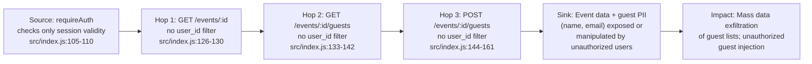
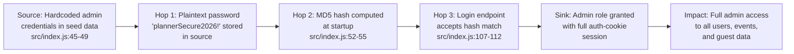

# Chained Vulnerability Audit Report

**Project:** Wedding Planning Platform (`app-39-wedding-planner`)
**Audit Date:** 2026-05-25
**Auditor:** CodeGopher (Static-Only Chained Vulnerability Audit)
**Scope:** `src/index.js`, `package.json`, `Dockerfile`

---

## Summary Dashboard

| Metric | Value |
|---|---|
| Total chains detected | **3** |
| Cross-cutting weaknesses | **5** |
| Maximum chain severity | **HIGH** |
| Reviewed areas | Express API routes, auth middleware, database schema, session store, CORS config, package dependencies |
| Areas not reviewed | Frontend templates (none present), CI/CD config, secrets management infrastructure, deployment configs |

---

## Methodology and Safety Note

This audit is **strictly static**. No live HTTP probes, dynamic scanners, payload execution, or external network tests were performed. Evidence is drawn exclusively from source code, configuration, and dependency manifests. Chain links are asserted only when statically provable from cited source, configuration, or test evidence.

---

## Chained Vulnerabilities

### Chain 1: Predictable Sessions → Account Takeover

**Severity:** HIGH | **Confidence:** HIGH | **Impact:** Full account takeover for any registered user

#### Mermaid Attack Graph

#### Detailed Breakdown

| Link | File | Lines | Evidence |
|---|---|---|---|
| **Source** | `src/index.js` | 113 | `Math.random().toString(36)` is used to generate `sessionId`. `Math.random()` is a PRNG intended for non-security purposes; its output is predictable. |
| **Hop 1** | `src/index.js` | 100-104 | `getSessionUser` trusts `req.cookies.session_id` entirely. No binding to IP, User-Agent, or rotation on use. |
| **Hop 2** | `src/index.js` | 114-115 | Session object stores `{ id, username, role }` — full user identity. |
| **Sink** | `src/index.js` | 105-110, 121-161 | All `requireAuth`-protected endpoints expose data or mutable operations. |
| **Preconditions** | — | — | An attacker who can predict or brute-force the ~26-char alphanumeric session token can impersonate any user. |

#### Remediation

1. Replace `Math.random()` with `crypto.randomUUID()` or `crypto.randomBytes(32)`.
2. Bind sessions to client fingerprint (IP/User-Agent hash) and rotate session IDs on privilege changes.

---

### Chain 2: IDOR (Missing Authorization) + Data Exposure

**Severity:** HIGH | **Confidence:** HIGH | **Impact:** Any authenticated user can read/write event and guest data belonging to other users.

#### Mermaid Attack Graph

#### Detailed Breakdown

| Link | File | Lines | Evidence |
|---|---|---|---|
| **Source** | `src/index.js` | 105-110 | `requireAuth` only verifies `req.cookies.session_id` exists in `sessions`. It never verifies `req.user.id` owns the target resource. |
| **Hop 1** | `src/index.js` | 126-130 | `GET /api/events/:id` queries `WHERE id = ?` — no `AND user_id = ?`. Returns any event to any authenticated user. |
| **Hop 2** | `src/index.js` | 133-142 | `GET /api/events/:id/guests` queries `WHERE event_id = ?` — no ownership check. Guest names and emails (PII) are returned. |
| **Hop 3** | `src/index.js` | 144-161 | `POST /api/events/:id/guests` inserts a guest into any event by ID. No ownership verification. |
| **Sink** | — | — | Guest records contain `name` and `email` — personally identifiable information (PII) tied to private events. |
| **Preconditions** | — | — | Attacker needs a valid session (from Chain 1 or brute-force) and knowledge of event IDs (sequential integers in SQLite AUTOINCREMENT). |

#### Remediation

1. Add `AND user_id = ?` to all event- and guest-scoped queries.
2. Use UUIDs or opaque IDs instead of sequential integers for `event_id` to prevent enumeration.
3. Return 404 (not 403) for unauthorized resource access to avoid confirming existence.

---

### Chain 3: Hardcoded Admin Credentials + MD5 Hashing → Privilege Escalation

**Severity:** HIGH | **Confidence:** HIGH | **Impact:** Any person with source-code access obtains ADMIN role with full platform privileges.

#### Mermaid Attack Graph

#### Detailed Breakdown

| Link | File | Lines | Evidence |
|---|---|---|---|
| **Source** | `src/index.js` | 45-49 | Seed data includes `{ username: 'admin_planner', pass: 'plannerSecure2026!', role: 'ADMIN' }` in plaintext. |
| **Hop 1** | `src/index.js` | 52-55 | `crypto.createHash('md5').update(u.pass).digest('hex')` computes the stored hash at startup. MD5 is fast and unsalted — trivially reversible. |
| **Hop 2** | `src/index.js` | 107-112 | `/api/auth/login` compares the provided password's MD5 hash directly against the stored hash. |
| **Sink** | — | — | Login returns `{ role: user.role }` and a session cookie with `role: 'ADMIN'`. |
| **Preconditions** | — | — | Source code must be accessible (e.g., via public repo, leaked bundle, or Docker image inspection). |

#### Remediation

1. Never store credentials in source code. Use environment variables or a secrets manager.
2. Replace MD5 with bcrypt (the `bcryptjs` dependency is already in `package.json` but unused).
3. Add salt to every password hash.
4. Enforce a minimum password complexity policy on registration.

---

## Cross-Cutting Weaknesses (Not Full Chains)

### 1. CORS Misconfiguration with Credentials
- **File:** `src/index.js`, line 10
- **Code:** `app.use(cors({ origin: true, credentials: true }));`
- `origin: true` reflects the requesting origin back; combined with `credentials: true`, any origin may submit authenticated requests. This facilitates cross-origin session abuse.
- **Remediation:** Restrict `origin` to a specific allowlist.

### 2. No CSRF Protection
- **All state-changing routes** (`POST /api/auth/register`, `POST /api/auth/login`, `POST /api/auth/logout`, `POST /api/events/:id/guests`) lack CSRF tokens or SameSite cookie attributes.
- `cookie-parser` is used, but the `session_id` cookie has no `sameSite` attribute, defaulting to lax (browsers may send it on top-level navigations from external sites).
- **Remediation:** Add `sameSite: 'strict'` or `'lax'` to cookie options; implement double-submit or Origin/Referer header checks for state-changing endpoints.

### 3. Verbose Error Messages
- **File:** `src/index.js`, line 107
- **Code:** `"Username already exists."`
- Leakage of user existence state aids account enumeration.
- **Remediation:** Return generic `"Registration failed."` messages.

### 4. No Input Validation on Registration
- **File:** `src/index.js`, lines 95-107
- Username and password accept arbitrary strings. No length limits, no character restrictions. This could allow injection of special characters or extremely long inputs.
- **Remediation:** Validate username format (alphanumeric + length bounds) and password complexity.

### 5. In-Memory Session Store (Persistence Gap)
- **File:** `src/index.js`, line 84
- `const sessions = {};` is a plain object. Sessions are lost on server restart and are not scalable. Not directly a security issue, but means logged-in users are forcibly logged out on restart.
- **Remediation:** Use a persistent session store (Redis, SQLite table) for production.

---

## Unknowns and Areas Not Reviewed

| Area | Reason |
|---|---|
| Frontend client code | No frontend templates or static assets found |
| CI/CD pipelines | No pipeline configuration files present |
| Infrastructure config | No Terraform, Kubernetes, or cloud config files |
| Network-level controls | Outside static audit scope |
| Password reset / account recovery | Not implemented in this codebase |
| Rate limiting on auth endpoints | No rate limiting detected; brute-force / credential stuffing possible |
| File upload handling | No upload endpoints present |

---

## Recommended Tests to Add

1. **Session prediction test:** Verify that session IDs generated in sequence are unpredictable (statistical tests or comparison against known outputs).
2. **IDOR test:** Authenticate as user A, then enumerate event IDs to confirm no events belonging to user B are returned.
3. **CSRF test:** Submit state-changing POST requests from a page on a different origin and confirm rejection.
4. **Admin credential isolation test:** Confirm no admin credentials exist in environment variables, seed scripts, or config files.
5. **CORS allowlist test:** Send requests with arbitrary `Origin` headers to a credential-bearing endpoint and confirm they are blocked unless the origin is allowlisted.

---

## Remediation Priority Summary

| Priority | Action |
|---|---|
| **P0** | Replace `Math.random()` session generation with `crypto.randomBytes()` |
| **P0** | Replace MD5 with bcrypt; remove hardcoded credentials; use env vars for secrets |
| **P0** | Add `user_id` ownership checks to all event- and guest-scoped endpoints |
| **P1** | Restrict CORS to an explicit origin allowlist |
| **P1** | Add `sameSite` attribute to session cookie and/or CSRF token validation |
| **P2** | Implement rate limiting on auth endpoints |
| **P2** | Sanitize and validate all registration inputs |

---

*This report was generated by a static-only analysis. No runtime behavior was observed.*
