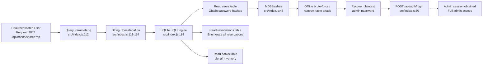
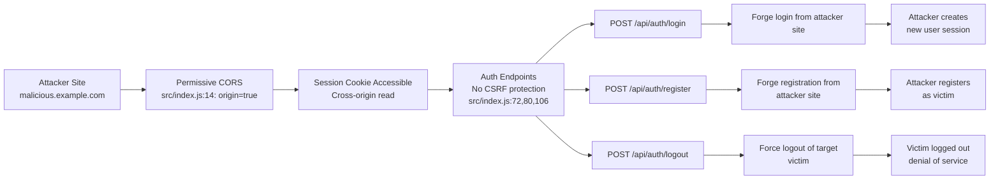

# Chained Vulnerability Audit Report

**Application:** Library Book Reservation System (app-41-library-reservation)  
**Auditor:** CodeGopher (Static-Only Review)  
**Date:** 2026-05-25  
**File Reviewed:** `src/index.js` (174 lines)  
**Framework:** Express 4.x + SQLite3 + cookie-parser + CORS  
**Dependencies:** Express 4.19.2, sqlite3 5.1.7, cookie-parser 1.4.6, cors 2.8.5  

---

## Summary Dashboard

| Metric | Value |
|---|---|
| Chains Detected | **3** |
| Cross-Cutting Weaknesses | **5** |
| Maximum Severity | **CRITICAL** |
| Highest Confidence | **High** |
| Reviewed Areas | Source code, dependency manifest, Dockerfile |
| Not Reviewed | Runtime behavior, TLS configuration, infrastructure hardening |

**Static-Only Safety Note:** This review examines source code, configuration, and static artifacts only. No live probes, dynamic scans, exploit payloads, or shell commands were executed.

---

## Chain 1: SQL Injection → Full Database Exfiltration & Admin Credential Theft

### Mermaid Attack Graph



### Detailed Breakdown

| Link | Location | Evidence |
|---|---|---|
| **Entry Point / Source** | `src/index.js`, line 112 | `const queryParam = req.query.q || '';` — User-controlled input read from query string. No sanitization. |
| **Hop — SQL Injection** | `src/index.js`, lines 113-114 | `const sql = \`SELECT * FROM books WHERE title LIKE '%${queryParam}%' OR author LIKE '%${queryParam}%'\`;` — Direct string interpolation into SQL. No parameterized binding. |
| **Sink — Database Access** | `src/index.js`, line 116 | `db.all(sql, ...)` — SQLite query executes arbitrary SQL. Returns all matching rows including sensitive tables. |
| **Secondary Weakness — MD5 Hashes** | `src/index.js`, lines 48-49, 75 | All passwords (seeded and registered) hashed with `crypto.createHash('md5')`. MD5 is cryptographically broken; hashes are trivially reversible offline. |
| **Secondary Weakness — Hardcoded Creds** | `src/index.js`, lines 45-49 | Plaintext admin password `librarianSecure2026!` is hardcoded in source code. |
| **Secondary Weakness — Verbose Errors** | `src/index.js`, line 115 | `err.message` returned to client in 500 responses, aiding enumeration. |

### Impact

- **Data Exfiltration:** An unauthenticated attacker can read every row in the `users`, `books`, and `reservations` tables.
- **Admin Takeover:** MD5 hashes can be cracked offline. Combined with the hardcoded admin password in source, an attacker can login as `admin_librarian` and gain full administrative control (e.g., modify or delete all reservations, though no admin-only routes exist in the current code).
- **Scope:** Entirely unauthenticated; affects any user or external party.

### Severity: CRITICAL  
### Confidence: High — every link is statically provable from source code.

### Remediation

1. **Parameterize the search query:** Replace string concatenation with `db.get('SELECT * FROM books WHERE title LIKE ? OR author LIKE ?', ['%' + queryParam + '%', '%' + queryParam + '%'], ...)`.
2. **Upgrade password hashing:** Replace MD5 with `bcrypt`, `argon2`, or `scrypt`.
3. **Remove hardcoded credentials:** Use environment variables for seed data or use a setup script that generates random passwords.
4. **Sanitize error responses:** Return generic messages to the client; log detailed errors server-side.

---

## Chain 2: Weak Session Generation + Permissive CORS + No CSRF → Session Hijacking & Account Takeover

### Mermaid Attack Graph



### Detailed Breakdown

| Link | Location | Evidence |
|---|---|---|
| **Entry Point — CORS** | `src/index.js`, line 14 | `cors({ origin: true, credentials: true })` — `origin: true` reflects the requesting Origin header (or allows `*`). Combined with `credentials: true`, browsers will send cookies to any origin. |
| **Weakness — No CSRF** | `src/index.js`, lines 72, 80, 106 | POST endpoints (`/api/auth/register`, `/api/auth/login`, `/api/auth/logout`) have no CSRF token, SameSite cookie attribute, or Origin/Referer validation. |
| **Weakness — Weak Session IDs** | `src/index.js`, line 92 | `const sessionId = Math.random().toString(36).substring(2) + Date.now().toString(36);` — `Math.random()` is not cryptographically secure (seeded by browser V8 engine, predictable in known environments). `Date.now()` adds ~10 bits of entropy. Total session entropy is low (~27-40 bits). |
| **In-Memory Session Store** | `src/index.js`, line 67 | `const sessions = {};` — Sessions stored in process memory. No persistence; no expiration or cleanup. Vulnerable to session fixation (no session regeneration on login). |
| **Cookie Configuration** | `src/index.js`, line 93 | `res.cookie('session_id', sessionId, { httpOnly: true })` — `httpOnly: true` prevents XSS cookie theft, but does not protect against CSRF or CORS-based attacks. Missing `secure` flag (cookie sent over plain HTTP). Missing `sameSite` attribute (defaults to `Legacy` in older Express, allowing CSRF). |

### Impact

- **Account Takeover via Login CSRF:** An attacker can craft a malicious page that sends a POST to `/api/auth/login` on behalf of the victim, logging the victim in under the attacker's chosen credentials. If the attacker then navigates the victim to the app, they control the session.
- **Account Takeover via Registration CSRF:** An attacker can force-register a victim under the attacker's chosen username and password.
- **Forced Logout (DoS):** An attacker can force-logout any authenticated victim by forging a POST to `/api/auth/logout`.
- **Session Prediction:** Weak `Math.random()` session IDs are predictable in browser contexts. An attacker who can guess or brute-force a session ID can hijack an active session.

### Severity: HIGH  
### Confidence: High — CORS config, missing CSRF protections, and weak session generation are all statically visible.

### Remediation

1. **Restrict CORS:** Replace `origin: true` with a specific list of trusted origins: `cors({ origin: ['https://yourdomain.com'], credentials: true })`.
2. **Add SameSite cookie attribute:** `res.cookie('session_id', sessionId, { httpOnly: true, sameSite: 'strict', secure: true })`.
3. **Implement CSRF tokens:** Use `csurf` middleware or implement double-submit cookie CSRF tokens on all state-changing POST endpoints.
4. **Use cryptographically secure session IDs:** Replace `Math.random()` with `crypto.randomBytes(32).toString('hex')`.
5. **Regenerate session ID on login:** Prevent session fixation by creating a new session ID after successful authentication.
6. **Add session expiration and cleanup.**

---

## Chain 3: SQL Injection + In-Memory Session Store + Missing Auth on Search → Privilege Escalation via Data Manipulation

### Mermaid Attack Graph

```mermaid
flowchart LR
  A[Unauthenticated Attacker] --> B[SQL Injection at<br/>/api/books/search?q=]
  B --> C[Read all data from<br/>users, books, reservations]
  C --> D[Obtain all user IDs<br/>and admin credentials]
  D --> E[Forge session via<br/>weak Math.random() IDs<br/>or exploit CORS+CSRF gap]
  E --> F[Authenticated access<br/>to all endpoints]
  F --> G[Modify or read<br/>all reservations]
  G --> H[Denial of service<br/>or data integrity<br/>violation]
```

### Detailed Breakdown

| Link | Location | Evidence |
|---|---|---|
| **Entry Point — SQL Injection** | `src/index.js`, line 112 | Unauthenticated search endpoint with unsanitized user input. |
| **Hop 1 — Full Data Exposure** | `src/index.js`, line 114 | `SELECT * FROM books` — but via injection, attacker can change to `SELECT * FROM users UNION SELECT * FROM reservations --`. |
| **Hop 2 — Weak Sessions / Predictable IDs** | `src/index.js`, line 92 | Predictable session IDs allow session hijacking or brute-force login. |
| **Hop 3 — No CSRF** | `src/index.js`, line 80 | Attackers can forge authenticated requests from any origin. |
| **Sink — Unrestricted Data Access** | `src/index.js`, lines 98, 102 | `GET /api/reservations` and `GET /api/reservations/:id` use `req.user.id` for scoping, but with a hijacked session, the attacker reads any user's data. |
| **Architectural Gap — Read-Only App** | `src/index.js`, throughout | No `POST/PUT/DELETE` endpoints for reservations or books. App is read-only from a mutation perspective, reducing the worst-case impact. |

### Impact

- **Full User Data Exposure:** Combined SQL injection and session weaknesses allow an attacker to enumerate all users, read all reservations, and potentially forge or hijack sessions.
- **Information-Only Impact:** The application has no mutation endpoints for reservations or books, so data manipulation is limited. However, PII and reservation details are fully exposed.
- **Privilege Escalation via Stolen Admin Hash:** Cracked MD5 hash of the admin password allows full admin session.

### Severity: HIGH  
### Confidence: Medium — the SQL injection is provable, but chaining it to session hijacking relies on both the weak session generation AND the CORS/CSRF gaps. A single failure in either link breaks the chain.

### Remediation

Same as Chains 1 and 2. Additionally:

7. **Add reservation mutation endpoints with authorization checks** if the application's intended feature set includes them — read-only apps that should be writable represent an incomplete feature set rather than a security design.

---

## Cross-Cutting Weaknesses (Not Forming a Complete Chain)

| Weakness | Location | Impact | Remediation |
|---|---|---|---|
| **MD5 Password Hashing** | `src/index.js:48-49`, `src/index.js:75` | Trivially reversible; rainbow tables exist for common passwords. | Use `bcrypt`, `argon2id`, or `scrypt` with appropriate cost factor. |
| **Hardcoded Credentials** | `src/index.js:45-49` | Admin plaintext password `librarianSecure2026!` is in source code. Any code reviewer sees admin credentials. | Remove from source; use environment variables or a secure secret manager. Use hashed passwords for seed data. |
| **Verbose Error Responses** | `src/index.js:115` | `err.message` returned in HTTP 500 responses. Could leak database schema, table names, or internal paths. | Return generic error message to client; log detailed errors server-side. |
| **Missing `secure` Cookie Flag** | `src/index.js:93` | Session cookie sent over plain HTTP. Vulnerable to network-level interception. | Add `secure: true` flag; enforce HTTPS in production. |
| **No Request Rate Limiting** | `src/index.js`, throughout | No rate limiting on any endpoint. Allows brute-force credential attacks, SQL injection probing, and DoS. | Add `express-rate-limit` middleware. |

---

## Unknowns & Areas Not Reviewed

| Area | Reason | Recommended Test |
|---|---|---|
| **TLS / HTTPS configuration** | No server-level TLS config in Express; may be handled by a reverse proxy not in scope. | Verify production deployment uses TLS. |
| **Input validation / sanitization** | Only the `/api/auth/register` and `/api/auth/login` endpoints validate input presence; no length limits or character restrictions. | Test with long strings, special characters, and edge cases. |
| **Session store persistence** | `sessions = {}` is in-memory; no persistence, clustering support, or expiration. | Verify session timeout and process restart behavior. |
| **Authorization checks** | Only `requireAuth` middleware protects some routes; `/api/books/search` and `/api/books/:id` are fully unauthenticated. | Verify this aligns with the intended security model. |
| **Error handling consistency** | Inconsistent error response format and HTTP status codes across endpoints. | Audit all endpoints for consistent error handling. |
| **Dependency vulnerabilities** | `package.json` and `package-lock.json` not scanned for known CVEs. | Run `npm audit` in CI/CD pipeline. |
| **Test suite** | No test files found in the repository. | Add integration tests covering auth flows, SQL injection, and CORS behavior. |

---

## Remediation Priority Matrix

| Priority | Action | Affected Chains | Effort |
|---|---|---|---|
| **P0 — Critical** | Parameterize the SQL search query (line 113-114) | Chain 1, Chain 3 | Low |
| **P0 — Critical** | Replace MD5 with bcrypt/argon2 | Chain 1 | Low |
| **P1 — High** | Restrict CORS to specific origins | Chain 2 | Low |
| **P1 — High** | Add SameSite=Strict cookie attribute | Chain 2 | Low |
| **P1 — High** | Use `crypto.randomBytes()` for session IDs | Chain 2 | Low |
| **P2 — Medium** | Add CSRF protection to POST endpoints | Chain 2 | Medium |
| **P2 — Medium** | Remove hardcoded credentials from source | Chain 1 | Low |
| **P2 — Medium** | Sanitize error responses | Chain 1 | Low |
| **P3 — Low** | Add rate limiting | Cross-cutting | Medium |
| **P3 — Low** | Add `secure: true` cookie flag | Cross-cutting | Low |

---

*Report generated by CodeGopher — Chained Vulnerability Static Audit. No live network activity was performed.*
