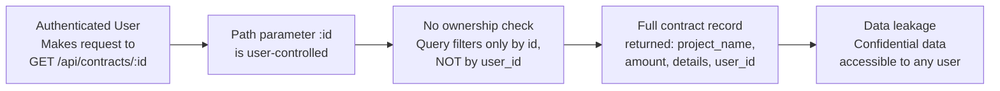
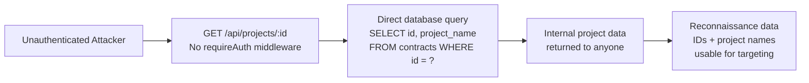

# Chained Vulnerability Audit Report

**Project**: app-42-construction-tracker  
**Date**: 2026-05-25  
**Auditor**: CodeGopher (Chained Vulnerability Static Audit)  
**Scope**: All files under `src/`, `package.json`, `Dockerfile` — source-only static analysis. No live probes, dynamic scanners, shell commands, or network tests were performed.

---

## Summary Dashboard

| Metric | Value |
|--------|-------|
| Total chains identified | **4** |
| Maximum severity | **CRITICAL** |
| High confidence chains | **4** |
| Medium confidence chains | **0** |
| Low confidence chains | **0** |
| Reviewed areas | Source code (`src/index.js`), dependency manifests (`package.json`), build config (`Dockerfile`) |
| Not reviewed | Tests, runtime behavior, infrastructure configuration, third-party JS in `node_modules/` |

### Severity Distribution

| Severity | Count |
|----------|-------|
| Critical | 1 |
| High | 2 |
| Medium | 1 |

---

## Methodology

1. **Attack surface mapping** — Enumerated all Express.js routes, middleware, and user-controlled inputs (cookies, query params, body fields, path parameters).
2. **Weakness inventory** — Identified individual security weaknesses including `eval()` on user input, missing ownership checks, weak session generation, hardcoded seed credentials, missing CSRF protection, overly permissive CORS, and missing security headers.
3. **Attack graph synthesis** — Connected sources to intermediate weaknesses and sinks to measurable impacts using only static control-flow and data-flow evidence from the source.
4. **Impact assessment** — Rated each chain by impact, reachability, confidence, and the easiest remediation link.

**Static-only boundary**: No live HTTP probes, fuzzers, SQL injection payloads, credential attacks, dynamic scanners, or exploit scripts were used. All evidence is sourced from repository files.

---

## Chains Detected

### Chain 1: Authenticated Remote Code Execution via `eval()`

**Severity**: CRITICAL  
**Confidence**: High  
**Impact**: Arbitrary JavaScript execution with full server access — database reads/writes, session manipulation, file system access.

#### Mermaid Attack Graph

```mermaid
flowchart LR
    A[Unrestricted User Input\nPOST /api/contracts/template\nbody.templateConfig] --> B[No Validation\nOnly checks truthiness\nof templateConfig]
    B --> C[eval() Execution\neval(`(${templateConfig})`)\nLine ~71-72]
    C --> D[Arbitrary JS Runtime\nAccess to db, sessions,\nall server globals]
    D --> E[Full Server Compromise\nData exfiltration,\ndata modification,\nprocess control]
```

#### Detailed Breakdown

| Link | File | Lines | Reference |
|------|------|-------|-----------|
| **Source** | `src/index.js` | ~68–72 | POST `/api/contracts/template` route handler. User body parameter `templateConfig` is extracted via `const { templateConfig } = req.body;` |
| **Hop 1** | `src/index.js` | ~69 | Weak validation: `if (!templateConfig)` only checks for falsy values. No type enforcement, no JSON parse, no schema validation. |
| **Hop 2** | `src/index.js` | ~71 | `eval()` call: `const configObj = eval(\`(${templateConfig})\`);` — the raw user string is wrapped in parentheses and passed directly to `eval()`. |
| **Sink** | `src/index.js` | ~71 | `eval()` executes in the same lexical scope as the handler, granting access to `db` (SQLite database handle), `sessions` (active session store), `req`, `res`, and any Node.js globals (`process`, `require`, etc.). |

#### Preconditions
- User must be authenticated (the route uses `requireAuth` middleware).
- Any `CUSTOMER` role user suffices — no admin access required.

#### Evidence
```javascript
// src/index.js - Template handler (lines ~67-74)
app.post('/api/contracts/template', requireAuth, (req, res) => {
  const { templateConfig } = req.body;
  if (!templateConfig) {
    return res.status(400).json({ error: 'Template config is required.' });
  }
  try {
    const configObj = eval(`(${templateConfig})`);  // ← eval on unsanitized user input
    res.json({ message: 'Template layout applied.', config: configObj });
  } catch (evalErr) {
    res.status(400).json({ error: 'Failed to process template config.', details: evalErr.message });
  }
});
```

#### Impact
Any authenticated user can execute arbitrary JavaScript on the server. This provides:
- **Full database read**: `db.all('SELECT * FROM contracts')` → exfiltration of all contracts including confidentiality markings (`'Confidential blueprints...'`).
- **Full database write**: `db.run('DELETE FROM contracts')` or `db.run('INSERT INTO...')`.
- **Session manipulation**: Delete or create arbitrary sessions → impersonate any user or admin.
- **Process-level access**: `process.exit()`, `process.mainModule`, or similar.

#### Remediation
Remove `eval()` entirely. If configuration parsing is needed, use `JSON.parse()` with strict validation:
```javascript
const configObj = JSON.parse(templateConfig);
```
Add a schema validator (e.g., `zod` or `joi`) to validate the resulting object shape.

---

### Chain 2: Horizontal Privilege Escalation (IDOR) on Contract Details

**Severity**: HIGH  
**Confidence**: High  
**Impact**: Any authenticated user can read any contract's full details, including confidential data belonging to other users.

#### Mermaid Attack Graph



#### Detailed Breakdown

| Link | File | Lines | Reference |
|------|------|-------|-----------|
| **Source** | `src/index.js` | ~88–98 | GET `/api/contracts/:id` route handler |
| **Hop 1** | `src/index.js` | ~91 | `db.get('SELECT * FROM contracts WHERE id = ?', [contractId], ...)` — query filters by ID only. No `AND user_id = ?` clause. |
| **Sink** | `src/index.js` | ~96 | `res.json(row)` — full contract object returned, including `details` field containing `'Confidential blueprints and structural notes.'` and `'Confidential pricing rates and supplier contacts.'` |

#### Preconditions
- User must be authenticated (uses `requireAuth`).
- No role restriction — CUSTOMER users can access ADMIN-owned contracts and vice versa.

#### Evidence
```javascript
// src/index.js - Contract detail endpoint (lines ~88-98)
app.get('/api/contracts/:id', requireAuth, (req, res) => {
  const contractId = req.params.id;
  db.get('SELECT * FROM contracts WHERE id = ?', [contractId], (err, row) => {
    if (err) {
      return res.status(500).json({ error: 'Database query failed.' });
    }
    if (!row) {
      return res.status(404).json({ error: 'Contract not found.' });
    }
    res.json(row);  // ← Returns full contract without ownership check
  });
});
```

Compare to the delete endpoint which correctly checks ownership:
```javascript
// src/index.js - Delete endpoint (lines ~110-124)
if (row.user_id !== user.id && user.role !== 'ADMIN') {
  return res.status(403).json({ error: 'Forbidden: Cannot delete other users contracts.' });
}
```
The read endpoint has no equivalent check.

#### Impact
- Alice's contract contains `"Confidential blueprints and structural notes."` — Bob can read this.
- Bob's contract contains `"Confidential pricing rates and supplier contacts."` — Alice can read this.
- Violates the multi-tenant data isolation model implied by the `user_id` foreign key.

#### Remediation
Add ownership verification before returning the row:
```javascript
if (row.user_id !== user.id && user.role !== 'ADMIN') {
  return res.status(404).json({ error: 'Contract not found.' });
}
```

---

### Chain 3: Unauthenticated Information Disclosure via Project Endpoint

**Severity**: HIGH  
**Confidence**: High  
**Impact**: Unauthenticated users can enumerate contract IDs and view project names, providing reconnaissance data for further attacks.

#### Mermaid Attack Graph



#### Detailed Breakdown

| Link | File | Lines | Reference |
|------|------|-------|-----------|
| **Source** | `src/index.js` | ~100–105 | GET `/api/projects/:id` route handler — note: no `requireAuth` middleware. |
| **Hop** | `src/index.js` | ~101 | `db.get('SELECT id, project_name FROM contracts WHERE id = ?', [req.params.id], ...)` — queries the database without any auth check. |
| **Sink** | `src/index.js` | ~104 | `res.json(row)` — returns project ID and name to unauthenticated users. |

#### Evidence
```javascript
// src/index.js - Project endpoint (lines ~100-105)
app.get('/api/projects/:id', (req, res) => {
  db.get('SELECT id, project_name FROM contracts WHERE id = ?', [req.params.id], (err, row) => {
    if (err || !row) {
      return res.status(404).json({ error: 'Project not found.' });
    }
    res.json(row);
  });
});
```

#### Impact
- **ID enumeration**: An attacker can iterate `id=1`, `id=2`, etc. to discover how many contracts exist.
- **Data leakage**: Project names like `"Alice Highway Design Plan"` and `"Bob Bridge Construction agreement"` link contract IDs to real projects/people.
- **Reconnaissance**: Combined with Chain 2 (once authenticated), the attacker knows exactly which contract IDs target specific users.

#### Remediation
Add `requireAuth` middleware:
```javascript
app.get('/api/projects/:id', requireAuth, (req, res) => {
```
Or better yet, add ownership or admin-only scoping.

---

### Chain 4: Session ID Prediction → Account Takeover

**Severity**: MEDIUM  
**Confidence**: High  
**Impact**: Attacker can predict or brute-force session IDs to impersonate authenticated users, including admin accounts.

#### Mermaid Attack Graph

```mermaid
flowchart LR
    A[User logs in at\nPOST /api/auth/login] --> B[Math.random().toString(36)\ngenerates session ID]
    B --> C[Not cryptographically secure\nPredictable PRNG output]
    C --> D[Cookie flags: only httpOnly\nMissing: Secure, SameSite,\nMax-Age/Expires]
    D --> E[Predicted session ID\ncan be used to\nset cookie]
    E --> F[getSessionUser returns\nthe predicted user's\nsession object]
    F --> G[Full account takeover\nAccess to all authenticated\nendpoints as victim user]
```

#### Detailed Breakdown

| Link | File | Lines | Reference |
|------|------|-------|-----------|
| **Source** | `src/index.js` | ~77 | Session generation: `const sessionId = Math.random().toString(36).substring(2) + Date.now().toString(36);` |
| **Hop 1** | `src/index.js` | ~77 | `Math.random()` is a JavaScript PRNG, not cryptographically secure. Output is deterministic given the seed and can be predicted. |
| **Hop 2** | `src/index.js` | ~79 | Cookie settings: `res.cookie('session_id', sessionId, { httpOnly: true })` — only `httpOnly` is set. Missing `secure`, `sameSite`, and `maxAge`/`expires`. |
| **Sink** | `src/index.js` | ~58–62 | `getSessionUser` checks only `req.cookies.session_id` against `sessions[sessionId]` — no additional validation, IP binding, or user-agent check. |

#### Evidence
```javascript
// src/index.js - Session generation (lines ~77-79)
const sessionId = Math.random().toString(36).substring(2) + Date.now().toString(36);
sessions[sessionId] = { id: user.id, username: user.username, role: user.role };
res.cookie('session_id', sessionId, { httpOnly: true });
```

```javascript
// src/index.js - Session lookup (lines ~58-62)
function getSessionUser(req) {
  const sessionId = req.cookies.session_id;
  if (!sessionId || !sessions[sessionId]) {
    return null;
  }
  return sessions[sessionId];
}
```

#### Impact
- Session IDs derived from `Math.random()` have ~2^32–2^48 of entropy (from 36-base encoding of a float and timestamp), far less than the recommended 128+ bits.
- In a shared-hosting or Docker environment (as indicated by the Dockerfile), the PRNG seed may be partially predictable.
- Combined with absent `Secure` flag, session cookies could be sent over non-TLS connections if the server is misconfigured.
- Combined with absent `SameSite` flag, CSRF-style session hijacking is possible from cross-site requests.
- No session expiration (`maxAge`/`expires`) means valid sessions persist indefinitely until manual logout or server restart.

#### Remediation
Use `crypto.randomBytes()`:
```javascript
const sessionId = crypto.randomBytes(32).toString('hex');
```
Add cookie security flags:
```javascript
res.cookie('session_id', sessionId, {
  httpOnly: true,
  secure: true,       // Require HTTPS
  sameSite: 'strict', // CSRF protection
  maxAge: 3600000     // 1 hour expiration
});
```

---

## Cross-Cutting Weaknesses

The following security issues were identified that do not fully form independent chains (or are standalone weaknesses) but significantly reduce the overall security posture:

### Weakness 1: Hardcoded Seed Credentials
- **File**: `src/index.js`, lines ~34–39
- **Description**: Plaintext passwords for `alice_manager` (`manager123`), `bob_manager` (`manager456`), and `admin_inspector` (`inspector2026Secure!`) are embedded in source code.
- **Risk**: If source code is exposed (e.g., git leak, error stack trace), all credentials are immediately compromised, including the admin account.
- **Remediation**: Store seed data in environment variables or a separate secrets management system. Use environment-specific seed scripts.

### Weakness 2: Overly Permissive CORS
- **File**: `src/index.js`, line ~14
- **Description**: `cors({ origin: true, credentials: true })` — `origin: true` in the cors library echoes the requesting origin back, effectively allowing any origin with credentials.
- **Risk**: Any website can make authenticated cross-origin requests to this API if served over HTTPS, enabling CSRF-like attacks even with httpOnly cookies (if the attacker can force the browser to send them).
- **Remediation**: Specify exact allowed origins:
  ```javascript
  cors({ origin: ['https://your-app.com'], credentials: true });
  ```

### Weakness 3: Missing CSRF Protection
- **File**: All state-changing POST endpoints (`/api/auth/login`, `/api/auth/register`, `/api/contracts/template`, `/api/contracts/:id/delete`)
- **Description**: No CSRF tokens or SameSite cookie enforcement.
- **Risk**: An attacker can craft a malicious page that triggers state-changing requests on behalf of a logged-in user.
- **Remediation**: Add `csurf` middleware or implement SameSite='Strict' cookie flag (complements Chain 4 remediation).

### Weakness 4: No Rate Limiting
- **File**: `/api/auth/login`, `/api/auth/register`
- **Description**: No rate limiting on authentication endpoints.
- **Risk**: Credential stuffing, brute-force password attacks against all seed accounts and any newly registered users.
- **Remediation**: Add `express-rate-limit` middleware to authentication endpoints.

### Weakness 5: Verbose Error Messages
- **File**: `src/index.js`, line ~73
- **Description**: `catch (evalErr) { res.status(400).json({ error: '...', details: evalErr.message }); }` — the `details` field returns the raw `eval()` error message.
- **Risk**: Error messages may leak internal structure, variable names, or partially executed code state.
- **Remediation**: Return a generic error message; log full errors server-side only.

### Weakness 6: No Security Headers
- **File**: `src/index.js` — application setup
- **Description**: No `helmet`, `X-Content-Type-Options`, `X-Frame-Options`, `Content-Security-Policy`, etc.
- **Risk**: XSS, clickjacking, MIME-sniffing, and other browser-based attacks are not mitigated.
- **Remediation**: Add `helmet()` middleware as the first middleware.

### Weakness 7: In-Memory Session Store (No Persistence / No Cleanup)
- **File**: `src/index.js`, lines ~55–56
- **Description**: `const sessions = {};` — all sessions are held in a Node.js object. They are cleared on server restart and never expired.
- **Risk**: Sessions survive until server restart with no expiration. No persistence means legitimate sessions are lost on restart.
- **Remediation**: Use a persistent session store (Redis, database) with TTL-based expiration.

---

## Chains Summary Table

| # | Chain | Severity | Confidence | Easiest Break Link |
|---|-------|----------|------------|-------------------|
| 1 | Authenticated RCE via `eval()` | Critical | High | Remove `eval()`; use `JSON.parse()` with schema validation |
| 2 | Horizontal Privilege Escalation (IDOR) on contracts | High | High | Add `user_id` ownership check to GET `/api/contracts/:id` |
| 3 | Unauthenticated Information Disclosure on projects | High | High | Add `requireAuth` middleware to GET `/api/projects/:id` |
| 4 | Session ID Prediction → Account Takeover | Medium | High | Use `crypto.randomBytes()` and add secure cookie flags |

---

## Unknowns and Areas Not Reviewed

| Area | Status | Notes |
|------|--------|-------|
| Test suite | Not reviewed | No tests found in `src/`. Test coverage for auth, RBAC, and input validation should be added. |
| Dependency supply chain | Partially reviewed | `package.json` reviewed; `node_modules/` excluded per scope. Version pinning and audit results not reviewed. |
| Docker/infrastructure | Partially reviewed | Dockerfile reviewed — no `USER` directive (runs as root), port 8042 exposed. No network or volume isolation review. |
| TLS/HTTPS | Not reviewed | No TLS configuration found in source. Assumed absent unless handled by reverse proxy. |
| Logging/monitoring | Not reviewed | No logging middleware found. Security incidents would not be auditable. |
| Input size limits | Not reviewed | No `express.json({ limit: ... })` configured. Body size could be abused for DoS. |
| SQLite configuration | Not reviewed | In-memory database (`:memory:`) — ephemeral data, no backup. Production suitability not assessed. |

---

## Recommendations (Prioritized)

1. **[Critical] Remove `eval()`** from the template endpoint immediately. Replace with `JSON.parse()` and add schema validation.
2. **[High] Add ownership checks** to all read endpoints (`/api/contracts/:id`, `/api/projects/:id`) to prevent horizontal privilege escalation.
3. **[High] Add authentication** to the `/api/projects/:id` endpoint.
4. **[Medium] Harden session management** — use `crypto.randomBytes()`, add `Secure`, `SameSite`, and `maxAge` cookie flags, and implement session expiration.
5. **[Medium] Remove hardcoded credentials** and use environment-based configuration.
6. **[Medium] Add rate limiting** on authentication endpoints.
7. **[Low] Add security headers** via `helmet()` middleware.
8. **[Low] Add CORS origin allowlist** instead of `origin: true`.
9. **[Low] Remove verbose error details** from error responses.
