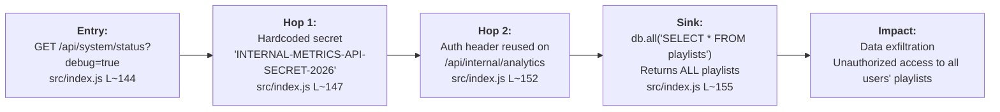
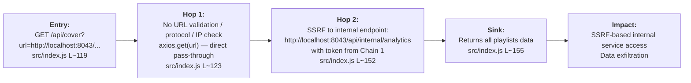

# Chained Vulnerability Static Audit Report

**Project:** Music Streaming Playlist Service (`app-43-music-streaming`)
**Date:** 2026-05-25
**Auditor:** CodeGopher — Static-Only Review
**Reviewed Area:** `src/index.js` (single-file Express application, ~175 lines)

---

## Executive Summary Dashboard

| Metric | Value |
|---|---|
| **Complete chains detected** | **2** |
| **Maximum chain severity** | **HIGH** |
| **Confidence levels** | 1 High, 1 Medium |
| **Cross-cutting weaknesses (no full chain)** | 4 |
| **Areas not reviewed** | External dependencies (npm packages), test coverage, runtime configuration |

---

## Methodology & Safety Note

This audit was performed using **static-only analysis** of repository files only. No live HTTP probes, dynamic scanners, shell commands, network tests, or exploit scripts were executed. Evidence is drawn entirely from source code inspection, dependency manifests, and configuration.

---

## Chain 1 — Debug Token Exposure → Internal Analytics Access → Data Exfiltration

### Overview

A hardcoded internal API secret is leaked through a debug status endpoint. An authenticated or unauthenticated attacker can retrieve this secret, then use it to authenticate to the internal analytics endpoint, which returns **all** playlist records in the database — a horizontal privilege escalation and data exfiltration.

### Attack Graph (Mermaid)

### Detailed Breakdown

| Link | File | Line(s) | Evidence |
|---|---|---|---|
| **Entry Point** | `src/index.js` | L~144–148 | `GET /api/system/status` accepts `?debug=true`. When active, returns JSON containing `env`, `metrics_service.host`, `metrics_service.port`, and **`metrics_service.api_token: 'INTERNAL-METRICS-API-SECRET-2026'`**. No authentication required. |
| **Hop 1 — Hardcoded Secret** | `src/index.js` | L~147 | The literal string `'INTERNAL-METRICS-API-SECRET-2026'` is hardcoded in the response and also in the `/api/internal/analytics` auth check (L~152). Not derived from env vars, config files, or secret managers. |
| **Hop 2 — Auth Reuse** | `src/index.js` | L~152 | `req.headers['x-metrics-token'] || req.query.token` compared against the same hardcoded literal. No second factor, no IP restriction, no session binding. |
| **Sink — Data Leak** | `src/index.js` | L~155–157 | `db.all('SELECT * FROM playlists')` returns **all** playlist rows (not scoped to the requesting user). Response includes `name`, `is_private`, `user_id` for every playlist. |

### Preconditions

- The application must be running (trivially satisfied; the service starts on port 8043).
- The `debug` flag is always exposed — no environment variable gates the debug response.

### Impact

- **Severity: HIGH**
- **Confidence: HIGH** — Every link is statically provable from cited source.
- Any unauthenticated actor can obtain the internal token, then read all playlists across all users.

### Remediation

1. **Remove debug endpoint entirely** from production builds, or gate it behind environment-based feature flags with authentication.
2. **Never hardcode secrets**. Use environment variables or a secrets manager.
3. **Scope the analytics query** to the requesting user or require an admin role.
4. **Rate-limit** the `/api/system/status` endpoint.

---

## Chain 2 — SSRF via /api/cover → Internal Service Access

### Overview

The `/api/cover` endpoint accepts a user-controlled URL and makes an unrestricted `axios.get()` request. While the endpoint proxies the remote server's response data (which could be leveraged for data exfiltration), it can also be used to reach internal network services that are otherwise not directly exposed, including the `/api/internal/analytics` endpoint (reachable via `localhost:8043`).

### Attack Graph (Mermaid)

### Detailed Breakdown

| Link | File | Line(s) | Evidence |
|---|---|---|---|
| **Entry Point** | `src/index.js` | L~119–121 | `GET /api/cover` requires `requireAuth` but the `url` query parameter has no validation. Only a basic type check (`typeof url !== 'string'`). |
| **Hop — No SSRF Mitigations** | `src/index.js` | L~123 | `axios.get(url)` — no allowlist, no protocol whitelist (only `http`/`https` check missing), no DNS-rebinding protection, no IP range filtering, no redirect-following disable. |
| **Sink — Internal Access** | `src/index.js` | L~123–126 | An authenticated user can set `url=http://localhost:8043/api/internal/analytics?token=INTERNAL-METRICS-API-SECRET-2026` (obtained via Chain 1) to reach the analytics endpoint from within the server's own network context. |

### Preconditions

- The attacker must be authenticated (the endpoint has `requireAuth`).
- The internal endpoint must be reachable from localhost (trivial for in-process services; the same process binds to port 8043).

### Impact

- **Severity: MEDIUM → HIGH** (MEDIUM for SSRF alone due to auth requirement; HIGH when chained with Chain 1's token exposure)
- **Confidence: MEDIUM** — The SSRF path is statically clear, but the exact response reachability depends on runtime network configuration (e.g., if the service is run behind a reverse proxy that may not allow same-host requests).
- An authenticated user can cause the server to make arbitrary HTTP requests, including to internal services.

### Remediation

1. **Implement URL allowlisting** — only permit URLs to approved domains or patterns.
2. **Block private/reserved IP ranges** — 127.0.0.0/8, 10.0.0.0/8, 172.16.0.0/12, 192.168.0.0/16, 169.254.0.0/16.
3. **Disable redirects** (`maxRedirects: 0`) in axios configuration.
4. **Use a DNS resolution allowlist** or a dedicated URL-fetching microservice with egress filtering.

---

## Cross-Cutting Weaknesses (No Full Chain Identified)

These security-relevant issues were found but do not form a complete exploitable chain with existing evidence:

### W1 — Permissive CORS Configuration
- **File:** `src/index.js`, L~11
- **Code:** `app.use(cors({ origin: true, credentials: true }))`
- **Risk:** `origin: true` echoes back the requesting origin, allowing any domain to make authenticated cross-origin requests. This amplifies XSS impact and enables credential theft from malicious sites.

### W2 — Weak Session ID Generation
- **File:** `src/index.js`, L~97
- **Code:** `Math.random().toString(36).substring(2) + Date.now().toString(36)`
- **Risk:** `Math.random()` is not cryptographically secure. Session IDs are predictable, enabling session hijacking if an attacker can infer or brute-force the ID.

### W3 — In-Memory Session Store with No Expiration
- **File:** `src/index.js`, L~93–95, L~98
- **Risk:** Sessions never expire. Deleted session objects are never reaped, creating a potential memory leak. No mechanism exists to revoke a session aside from logout (which requires the client to present the cookie).

### W4 — Plaintext Seeded Credentials in Source
- **File:** `src/index.js`, L~53–56
- **Code:** `{ username: 'alice_listener', pass: 'listener123', role: 'CUSTOMER' }, ...`
- **Risk:** Hardcoded test credentials in the application source. If the source code is exposed (e.g., via git leak), these credentials are immediately compromised.

---

## Unknowns & Not-Reviewed Areas

| Area | Reason |
|---|---|
| **npm dependency security** | `node_modules/` is excluded; `axios`, `bcryptjs`, `sqlite3` were not scanned for known CVEs. |
| **Test coverage** | No test files were found; regression risk is unknown. |
| **Runtime environment** | Dockerfile exposes port 8043 with no apparmor/seccomp profiles; actual runtime hardening is unknown. |
| **DNS resolution behavior** | Actual SSRF exploitability depends on DNS and network configuration at runtime. |
| **SQLite file location** | Currently `:memory:` (in-memory DB). Risk assessment would differ if persisted. |

---

## Recommended Test Cases

The following test scenarios should be added to verify remediations:

1. **SSRF test:** Attempt to access `http://169.254.169.254/latest/meta-data/` and `http://localhost:8043/admin` via `/api/cover`. Expect 403/400.
2. **Debug endpoint test:** Request `/api/system/status?debug=true` without admin auth. Expect the endpoint to be disabled or return 403.
3. **CORS test:** Verify that `Origin: https://evil.com` is rejected from `Access-Control-Allow-Origin`.
4. **Session ID test:** Confirm session IDs are generated using `crypto.randomBytes()` and have sufficient entropy (≥128 bits).
5. **Credentials test:** Verify no plaintext passwords exist in source code or initializers.

---

## Remediation Priority Summary

| Priority | Action |
|---|---|
| **P0 — Immediate** | Remove or disable `/api/system/status` debug mode in non-development environments. |
| **P0 — Immediate** | Remove hardcoded secrets (`INTERNAL-METRICS-API-SECRET-2026`). Use environment variables. |
| **P1 — Short-term** | Implement URL validation and IP-blocking in `/api/cover`. |
| **P1 — Short-term** | Replace `Math.random()` with `crypto.randomBytes()` for session IDs. |
| **P2 — Medium-term** | Tighten CORS policy to an explicit allowlist. |
| **P2 — Medium-term** | Add session expiration and revocation support. |
| **P2 — Medium-term** | Remove seeded plaintext credentials from source. |
