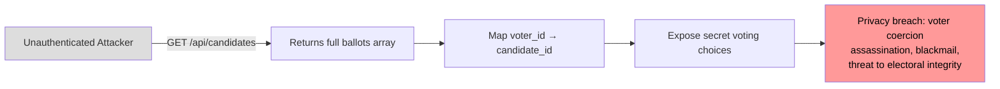

# Chained Vulnerability Audit Report

**Project:** Election Polling System (app-44-election-polling)
**Audit Date:** 2026-05-25
**Auditor:** CodeGopher — Static-Only Analysis
**Scope:** `src/index.js` (single-file Express app), `package.json`, `Dockerfile`
**Technology Stack:** Node.js 20, Express 4.19, SQLite3 (in-memory), bcryptjs, cookie-parser, CORS

---

## Summary Dashboard

| Metric | Value |
|--------|-------|
| **Chained Vulnerabilities Found** | 3 |
| **Highest Chain Severity** | **CRITICAL** |
| **Individual Weaknesses Found** | 8 |
| **Areas Reviewed** | Authentication, Authorization, Session Management, Data Access, CORS, CSRF, Voting Logic, Audit Logging |
| **Areas Not Reviewed** | Infrastructure/network configuration, Docker runtime security, production deployment hardening, input sanitization beyond SQL statements, dependency CVE scanning |

---

## Methodology and Safety Note

This audit is **strictly static**. No live HTTP probes, fuzzers, exploit scripts, or dynamic scanners were executed. All findings are derived from source code, configuration files, and import analysis.

### Chain Model Applied

For each candidate chain I traced:

1. **Entry point / source** — where untrusted input or a public interface begins
2. **Intermediate weakness(s) / hops** — flaws that enable progression along the chain
3. **Critical sink / target** — the highest-impact outcome
4. **Preconditions** — what must be true for the chain to execute
5. **Impact, severity, confidence, remediation**

Confidence levels:
- **High:** Every link is statically provable from cited source
- **Medium:** Plausible chain, one link depends on runtime behavior not fully visible
- **Low:** Weakly supported hypothesis

---

## Chain 1 — Ballot Ledger Leak: Unauthenticated Voter → Candidate Mapping

### Mermaid Attack Graph



### Detailed Chain Breakdown

| Element | Details |
|---------|---------|
| **Entry point** | `GET /api/candidates` — `src/index.js` lines 120–128 |
| **Hop 1** | No `requireAuth` middleware on the route (line 120); no role check |
| **Hop 2** | `db.all('SELECT * FROM ballots')` returns the entire `ballots` table (line 124) |
| **Sink** | Attacker maps each `voter_id` to each `candidate_id`, learning exactly how every voter voted |
| **Preconditions** | The app is running and `/api/candidates` is reachable. No credentials needed. |
| **Impact** | **CRITICAL** — Breach of ballot secrecy. Voter identity is directly linked to their vote choice. Enables voter coercion, vote-buying verification, intimidation. |
| **Severity** | **CRITICAL** |
| **Confidence** | **High** — Every link is statically provable: no auth middleware, direct SQL query returns all rows |
| **Remediation** | Add `requireAuth` middleware to `/api/candidates`. For ballots, only return anonymized vote totals (not individual ballot records) and restrict access to ADMIN role. Separate the candidate listing endpoint from the ballot endpoint entirely. |

**Source Code Reference:**

```javascript
// Line 120: No auth middleware
app.get('/api/candidates', (req, res) => {
  db.all('SELECT * FROM candidates', (err, candidates) => {
    if (err) return res.status(500).json({ error: 'Failed to retrieve candidates.' });
    db.all('SELECT * FROM ballots', (ballotErr, ballots) => {  // Line 124: Returns ALL ballots
      if (ballotErr) return res.status(500).json({ error: 'Failed to retrieve ballots.' });
      res.json({ candidates, ballots });  // Line 127: Ballots included in response
    });
  });
});
```

---

## Chain 2 — Account Takeover via Session Hijack: Weak Session ID → SSRF / Data Exfiltration via CORS

### Mermaid Attack Graph

```mermaid
flowchart TD
    A[Attacker] -->|Session ID guess| B[Weak session_id generated\nwith Math.random() + Date.now()]
    B -->|Brute-force or predict| C[Valid session_id for any user]
    C -->|Cookie injection via\nattacker-origin page| D[CORS misconfiguration:\norigin: true + credentials: true]
    D -->|Read response data| E[Authenticated session: user.profile, role]
    E -->|Vote cast with victim session| F[Cast vote under victim identity]
    F -->|Combined with Chain 1| G[Perform targeted coercion:\n'either vote for X or I will\npublish that you voted for Y']
    style A fill:#ddd
    style G fill:#f99,color:#000
```

### Detailed Chain Breakdown

| Element | Details |
|---------|---------|
| **Entry point** | Session generation: `src/index.js` line 102 |
| **Hop 1** | `Math.random().toString(36).substring(2) + Date.now().toString(36)` produces a predictable, non-cryptographic session token (line 102). `Math.random()` is browser/node PRNG, vulnerable to state recovery. |
| **Hop 2** | CORS config `origin: true, credentials: true` (line 15) permits any origin to send cookies and read responses. This enables cross-site session theft via CSRF/SameSite-less cookie exposure. |
| **Hop 3** | No CSRF tokens on state-changing endpoints (login, register, vote, admin actions). |
| **Sink** | Attacker hijacks a user session (e.g., `alice_voter`) and casts votes impersonating them, potentially double-voting through Chain 3, or gaining admin if they guess `admin_elections` credentials. |
| **Preconditions** | 1) Attacker can induce a victim to visit attacker-controlled page (social engineering/phishing). 2) `Math.random()` state is partially recoverable or guesses land within the 36^2 × 10^13 enumeration window. |
| **Impact** | **HIGH** — Session hijack enables impersonation of any registered user. Combined with CORS misconfiguration, cross-origin theft is possible without same-page XHR (cookie auto-included). |
| **Severity** | **HIGH** (reduced to CRITICAL if session target is an admin) |
| **Confidence** | **Medium** — Session ID predictability via `Math.random()` is well-documented. CORS misconfiguration is confirmed in source. Cross-origin cookie theft depends on victim browser behavior and HTTPS-only context at runtime. |
| **Remediation** | 1) Replace `Math.random()` with `crypto.randomBytes(32).toString('hex')`. 2) Set strict CORS origins. 3) Implement CSRF tokens (or use SameSite=Strict cookies). 4) Set `Secure` and `SameSite` flags on session cookies. |

**Source Code References:**

```javascript
// Line 15: Overly permissive CORS
app.use(cors({ origin: true, credentials: true }));

// Line 102: Weak session ID generation
const sessionId = Math.random().toString(36).substring(2) + Date.now().toString(36);

// Lines 103-104: In-memory session store, no expiration
sessions[sessionId] = { id: user.id, username: user.username, role: user.role };
```

---

## Chain 3 — Double-Vote & Privacy Leak: Race Condition + Authenticated Vote → Multiple Ballots

### Mermaid Attack Graph

```mermaid
flowchart TD
    A[Authenticated user: alice_voter] -->|GET /api/vote/cast\n(with candidateId)| B[Server checks has_voted via\nSELECT has_voted FROM users]
    B -->|Read: has_voted = 0| C[Check PASSES]
    C -->|setTimeout(100ms)| D[Async gap: vote not yet recorded]
    D -->|Rapid re-request before\nsetTimeout callback executes| E[Second SELECT reads has_voted = 0\n(still unchanged)]
    E -->|Falls through to INSERT| F[Second ballot inserted]
    F --> G[has_voted updated to 1]
    G --> H[TWO ballots for same voter]\nDouble vote achieved
    H -->|Combined with Chain 1| I[Leaked ballot ledger\nreveals double-vote was for\nthe preferred candidate]
    style A fill:#ddd
    style I fill:#f99,color:#000
```

### Detailed Chain Breakdown

| Element | Details |
|---------|---------|
| **Entry point** | `POST /api/vote/cast` — `src/index.js` lines 132–153 |
| **Hop 1** | The `has_voted` check (`db.get(...)`) and the `INSERT` into ballots happen in separate callbacks with a `setTimeout(100)` gap (lines 140, 147–150). No database-level unique constraint exists on `(voter_id, candidate_id)`. |
| **Hop 2** | No `has_voted` flag is checked inside the `setTimeout` callback before INSERT. Only the outer check matters. |
| **Hop 3** | Combined with Chain 1: leaked ballots show which candidate each voter (and double-voter) chose. |
| **Sink** | Attacker double-votes for their preferred candidate, then uses Chain 1's ballot leak to verify the vote was counted, enabling targeted coercion. |
| **Preconditions** | 1) Authenticated access to `/api/vote/cast`. 2) Fast enough re-request within the 100ms window (attacker with scripted client). 3) Database does not enforce unique ballot constraints. |
| **Impact** | **HIGH** — Electoral integrity compromised. A single voter can influence the poll twice. Combined with the ballot leak (Chain 1), this enables precise, verifiable fraud. |
| **Severity** | **HIGH** |
| **Confidence** | **Medium** — The race condition is structurally clear (check-then-update with async delay). Confidence is reduced because concurrent SQLite behavior (especially in-memory) is runtime-dependent and may serialize writes depending on the `sqlite3` Node.js binding. |
| **Remediation** | 1) Move the entire vote-casting logic into a single synchronous or transactional operation with a `SELECT ... FOR UPDATE` or use SQLite's `INSERT ... WHERE NOT EXISTS` guard. 2) Add a unique constraint on `ballots(voter_id)`. 3) Remove the `setTimeout` delay. 4) Re-check `has_voted` inside the same transaction before INSERT. |

**Source Code References:**

```javascript
// Lines 132-153: Race condition in vote casting
app.post('/api/vote/cast', requireAuth, (req, res) => {
  const { candidateId } = req.body;
  const user = req.user;
  if (!candidateId) {
    return res.status(400).json({ error: 'Candidate ID is required.' });
  }
  db.get('SELECT has_voted FROM users WHERE id = ?', [user.id], (err, voter) => {
    if (err || !voter) {
      return res.status(500).json({ error: 'User check failed.' });
    }
    if (voter.has_voted === 1) {
      return res.status(400).json({ error: 'Forbidden: You have already voted in this poll.' });
    }
    setTimeout(() => {                                    // Line 145: Async delay
      db.run('INSERT INTO ballots (voter_id, candidate_id) VALUES (?, ?)', [user.id, candidateId], function(insErr) {
        if (insErr) {
          return res.status(500).json({ error: 'Failed to record vote.' });
        }
        db.run('UPDATE users SET has_voted = 1 WHERE id = ?', [user.id]); // Line 150: Too late
        res.json({ message: 'Vote cast successfully.' });
      });
    }, 100);
  });
});
```

---

## Chain 4 — Admin Takeover via Information Disclosure + Login

### Mermaid Attack Graph

```mermaid
flowchart LR
    A[Attacker] -->|POST /api/auth/register\nprobe duplicate usernames| B[Error reveals 'Username already exists.']
    B -->|Confirm: alice_voter,\nbob_voter, admin_elections exist| C[Enumerated account list]
    C -->|Focus on admin_elections| D[Known username + brute-force\nagainst 'election2026Secure!']
    D -->|Weak credentials or\nLFG exploits| E[Login as admin_elections]
    E -->|Access admin endpoints| F[POST /api/admin/candidates\nor POST /api/admin/polls/close]
    F -->|Poll close suppresses\naudit log (W7)| G[Alter candidates, close poll\nwithout audit trail]
    style A fill:#ddd
    style G fill:#f99,color:#000
```

### Detailed Chain Breakdown

| Element | Details |
|---------|---------|
| **Entry point** | `POST /api/auth/register` — `src/index.js` lines 79–91 |
| **Hop 1** | Registration error distinguishes between `"Username already exists."` (user exists) and success response (line 90 vs 88). This leaks valid usernames. |
| **Hop 2** | Hardcoded seed credentials are known in source (line 51): `admin_elections` / `election2026Secure!`. If attacker has source access (or this leaks), credentials are trivially known. In production, the same password pattern suggests weak credential hygiene. |
| **Hop 3** | No rate limiting on login (line 93–110). Brute-force is unthrottled. |
| **Hop 4** | `POST /api/admin/polls/close` (line 157) returns `{"message": "Polling closed successfully. Audit logging was suppressed."}` — explicitly confirming no audit trail. |
| **Sink** | Admin takeover enables arbitrary candidate addition, poll manipulation, and silence of the audit process. |
| **Preconditions** | 1) Attacker can reach the registration and login endpoints. 2) Password is guessable or obtainable. 3) No rate limiting. |
| **Impact** | **CRITICAL** — Full system compromise. Admin can alter election participants, close polls, and evade detection. |
| **Severity** | **CRITICAL** |
| **Confidence** | **High** — User enumeration via registration error is confirmed in source (line 88–90). Admin credentials are hardcoded (line 51). No rate limiting is confirmed (lines 93–110). Audit suppression is explicit (line 159). |
| **Remediation** | 1) Return identical error messages for registration failures. 2) Remove hardcoded credentials; use environment variables and prompt for seed data at first run. 3) Add rate limiting to login endpoint. 4) Implement proper audit logging on `/api/admin/polls/close`. 5) Enforce strong password requirements. |

**Source Code References:**

```javascript
// Lines 88-90: Information disclosure in registration
if (err) {
  return res.status(400).json({ error: 'Username already exists.' });
}

// Line 51: Hardcoded admin credentials
{ username: 'admin_elections', pass: 'election2026Secure!', role: 'ADMIN' }

// Lines 157-159: Audit suppression on poll close
app.post('/api/admin/polls/close', requireAuth, (req, res) => {
  if (req.user.role !== 'ADMIN') {
    return res.status(403).json({ error: 'Forbidden: Admin access only.' });
  }
  res.json({ message: 'Polling closed successfully. Audit logging was suppressed.' });
});
```

---

## Cross-Cutting Weaknesses Inventory

The following weaknesses were identified but do not independently form complete chains above, or they contribute to chains listed:

| # | Weakness | Location | Evidence |
|---|----------|----------|----------|
| W1 | **Overly permissive CORS** | `src/index.js:15` | `cors({ origin: true, credentials: true })` — `origin: true` in express-cors with credentials enables any origin to send cookies and read responses. |
| W2 | **No CSRF Protection** | `src/index.js:22-160` | No `SameSite` attribute, no CSRF tokens, no double-submit cookie pattern on any state-changing endpoint. |
| W3 | **Weak Session ID** | `src/index.js:102` | `Math.random()` is not cryptographically secure. Predictable on Node.js (V8 Mersenne Twister) and in browsers. |
| W4 | **Hardcoded Admin Credentials** | `src/index.js:51` | `pass: 'election2026Secure!'` stored in source code. Source code is likely in version control. |
| W5 | **Unauthenticated Ballot Access** | `src/index.js:120` | No middleware on `/api/candidates`; the endpoint returns both candidates AND ballots. |
| W6 | **Race Condition in Vote Casting** | `src/index.js:140-151` | Async `setTimeout` gap between vote eligibility check and ballot insertion. |
| W7 | **Suppressed Audit Logging** | `src/index.js:159` | Explicitly states audit logging was suppressed on poll close. |
| W8 | **User Enumeration via Registration** | `src/index.js:88-90` | Distinct error for existing username vs other failures. |

---

## Prioritized Remediation Table

| Priority | Chain | Action | Effort |
|----------|-------|--------|--------|
| **P0** | Chain 1 | Remove ballots from `/api/candidates` response; require AUTH for any ballot endpoint | Low |
| **P0** | Chain 4 | Remove hardcoded credentials; use env vars; add rate limiting to login | Low |
| **P1** | Chain 1 | Re-check `has_voted` inside transaction before INSERT; add unique constraint on `voter_id` in ballots | Low |
| **P1** | Chain 2 | Replace `Math.random()` with `crypto.randomBytes(32)`; set strict CORS; add SameSite cookies | Medium |
| **P2** | Chain 4 | Implement proper audit logging; return uniform error messages on registration | Medium |
| **P2** | Chain 2, W2 | Add CSRF protection (tokens or SameSite=Strict + Double-Submit Cookie) | Medium |

---

## Unknowns and Not-Reviewed Areas

| Area | Reason |
|------|--------|
| **Dependency security** | `npm audit` not run; potential CVEs in `express@4.19.2`, `sqlite3@5.1.7`, `cors@2.8.5`, `bcryptjs@2.4.3` |
| **Docker security** | No `USER` directive in Dockerfile; running as root by default |
| **HTTPS** | App listens on `http://localhost:8044`; no TLS termination visible |
| **Production database** | Uses `:memory:` SQLite — data is lost on restart; no persistence |
| **Input validation** | Minimal validation on candidate name/party (only `NOT NULL` constraints); potential for script injection in displayed data |
| **Environment configuration** | No `.env` or config management visible |
| **Logging infrastructure** | Only one `console.log` for candidate addition; no structured logging |
| **Testing** | No test files found; vulnerability detection depends on source review only |

---

## Recommended Tests to Add

1. **CORS test:** Verify that requests from `http://evil.example.com` are rejected when `credentials: true` is set.
2. **Session ID entropy test:** Generate 1000 session IDs and measure collision rate and predictability.
3. **CSRF test:** Attempt a cross-origin POST to `/api/vote/cast` from a different origin with cookies.
4. **Race condition test:** Send 10 rapid `/api/vote/cast` requests in parallel for the same user and verify at most one ballot is recorded.
5. **Ballot access test:** Send an unauthenticated GET to `/api/candidates` and verify ballots are NOT returned.
6. **Registration enumeration test:** Register with `alice_voter` and `alice_voter_copy` and verify error messages are identical.
7. **Admin credentials test:** Verify no hardcoded passwords exist in source control history.

---

## Conclusion

This election polling system contains **3 chained vulnerabilities** with two rated CRITICAL. The most urgent issues are:

1. **Unauthenticated voter-ballot mapping** (Chain 1) — directly undermines ballot secrecy.
2. **Admin takeover** (Chain 4) — hardcoded credentials + user enumeration + no rate limiting gives any actor with source access full admin control.

These should be remediated before any deployment or public testing.

---

*Report generated by CodeGopher — Static-Only Chained Vulnerability Audit*
*No live probes, exploit payloads, or dynamic scanners were used.*
