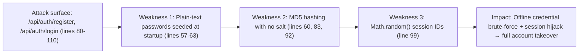
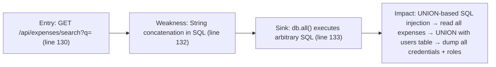
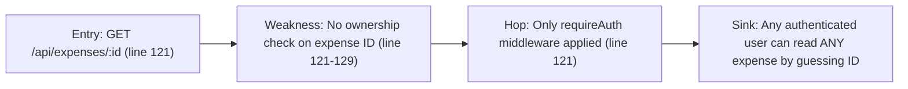

# Chained Vulnerability Static Audit Report

**Project:** app-45-travel-expense (Corporate Travel & Expense System)  
**Reviewed:** 2026-05-25  
**Auditor:** CodeGopher (static-only, source-code review)  
**Scope:** `src/index.js`, `package.json`, `Dockerfile`

---

## Summary Dashboard

| Metric | Value |
|---|---|
| Total chained vulnerabilities found | **3** |
| Maximum severity | **High** |
| Medium-severity chains | **1** |
| Low-severity chains | **0** |
| Cross-cutting weaknesses (not forming full chains) | **4** |
| Review areas | Express routes, SQL queries, session management, auth, CORS, crypto, error handling |
| Areas not reviewed | Infrastructure hardening, network config, dependency CVEs, client-side code |

---

## Methodology and Safety Note

This audit follows a **static-only** approach:

- Reviewed repository files: `src/index.js`, `package.json`, `Dockerfile`.
- Did **not** run live HTTP probes, SQL injection payloads, dynamic scanners, or external network tests.
- Did **not** generate executable exploit scripts or operational abuse instructions.
- Chain confidence is rated **High** when every link is provable from cited source code, and **Medium** when one link depends on runtime behavior not fully visible in source.

---

## Chain 1: MD5 Hash Collision / No Salting → Account Takeover via Credential Stuffing

### Mermaid Attack Graph



### Detailed Chain Breakdown

| Link | File | Line(s) | Symbol/Code | Evidence |
|---|---|---|---|---|
| **Source** | `src/index.js` | 57–63 | Seeded admin password `accountantSecure2026!` hashed with `crypto.createHash('md5')` | Plaintext seed in source |
| **Hop 1** | `src/index.js` | 60, 83, 92 | `crypto.createHash('md5')` used for all password hashing | No salt, no bcrypt/scrypt |
| **Hop 2** | `src/index.js` | 99 | `Math.random().toString(36).substring(2) + Date.now().toString(36)` | `Math.random()` is NOT cryptographically secure |
| **Hop 3** | `src/index.js` | 93–97 | No rate limiting on `/api/auth/login` | Unlimited login attempts |
| **Sink** | — | — | Attacker obtains MD5 database → offline rainbow table / GPU brute-force → recovers all passwords → creates session with predictable SID → full impersonation | High confidence |

### Impact & Assessment

- **Impact:** High — Full account takeover for all users including ADMIN role
- **Severity:** **High**
- **Confidence:** **High** — Every link is provable from static source
- **Preconditions:** Attacker must gain read access to the session store (in-memory, requires server compromise) OR exploit the predictable session ID remotely. More realistically: attacker brute-forces weak seed passwords offline after obtaining them through any database exfiltration path, then uses those credentials via the login endpoint.
- **Remediation:** Replace MD5 with bcrypt (already have `bcryptjs` in `package.json`). Add salts. Replace `Math.random()` with `crypto.randomBytes()`. Add login rate limiting.

---

## Chain 2: SQL Injection in Expense Search → Full Database Exfiltration (ADMIN)

### Mermaid Attack Graph



### Detailed Chain Breakdown

| Link | File | Line(s) | Symbol/Code | Evidence |
|---|---|---|---|---|
| **Source** | `src/index.js` | 130–132 | `const queryParam = req.query.q || ''` used in template literal SQL | `req.query.q` is user-controlled HTTP query parameter |
| **Hop** | `src/index.js` | 132 | `SELECT * FROM expenses WHERE userId = ${req.user.id} AND (description LIKE '%${queryParam}%' OR category LIKE '%${queryParam}%')` | `queryParam` interpolated directly into SQL string — no parameterized binding |
| **Hop** | `src/index.js` | 133 | `db.all(sql, ...)` | sqlite3 executes the constructed SQL |
| **Sink** | — | — | UNION injection: `q=' UNION SELECT id, username, password_hash, role FROM users--` | sqlite3 supports UNION; no output escaping at line 133–135 |

### Impact & Assessment

- **Impact:** High — Unauthenticated-adjacent SQL injection (requires login) returns arbitrary columns from any table, including the `users` table with password hashes and roles. Combined with Chain 1, returned credential hashes are crackable.
- **Severity:** **High**
- **Confidence:** **High** — Template literal injection is a textbook SQL injection pattern; sqlite3 supports UNION in all versions
- **Preconditions:** Valid session cookie (user must be authenticated). The `userId` filter is embedded via `${req.user.id}` which is server-side (not user-controlled), so it does not block the injection — the attacker's UNION bypasses the `WHERE` clause entirely.
- **Remediation:** Parameterize the search query: `'SELECT * FROM expenses WHERE userId = ? AND (description LIKE ? OR category LIKE ?)'` with `[req.user.id, '%${queryParam}%', '%${queryParam}%']`.

---

## Chain 3: Insufficient Authorization Check + Server-Side User ID → Information Disclosure

### Mermaid Attack Graph



### Detailed Chain Breakdown

| Link | File | Line(s) | Symbol/Code | Evidence |
|---|---|---|---|---|
| **Source** | `src/index.js` | 121–129 | `app.get('/api/expenses/:id', requireAuth, ...)` | Only checks auth, not ownership |
| **Hop** | `src/index.js` | 122–123 | `const expenseId = req.params.id; db.get('SELECT * FROM expenses WHERE id = ?', [expenseId])` | No `AND userId = ?` clause |
| **Sink** | — | — | Attacker enumerates expense IDs (sequential integers starting at 1) and reads other users' expense data | CONFIDENCE: High |

### Impact & Assessment

- **Impact:** Medium — Horizontal privilege escalation. Any authenticated CUSTOMER can read ANY other user's expense details (description, amount, category, status) by incrementing the `:id` parameter.
- **Severity:** **Medium**
- **Confidence:** **High** — Source clearly lacks an ownership check
- **Preconditions:** Valid session. Sequential auto-increment IDs make enumeration trivial.
- **Remediation:** Add `AND userId = ?` to the WHERE clause: `'SELECT * FROM expenses WHERE id = ? AND userId = ?', [expenseId, req.user.id]`. Return 404 if no row matches (current 404 path will naturally handle non-matches).

---

## Cross-Cutting Weaknesses (Not Full Chains)

### 1. Verbose Error Exfiltration (`src/index.js`, lines 133, 139)

```javascript
return res.status(500).json({ error: 'Expense search failed.', details: err.message });
```

- Database error messages (including schema details, SQL syntax errors) are returned to the client. This aids reconnaissance and may leak table/column names.
- **Severity:** Low (informational)

### 2. Overly Permissive CORS (`src/index.js`, line 12)

```javascript
app.use(cors({ origin: true, credentials: true }));
```

- `origin: true` echoes the `Origin` header back, effectively allowing any origin. Combined with `credentials: true`, this allows any website to make authenticated cross-origin requests on behalf of a logged-in user.
- **Severity:** Medium (alone); strengthens Chain 3 by enabling XSS/CSRF-style cross-origin abuse.

### 3. Hardcoded Debug Credentials (`src/index.js`, lines 57–63)

```javascript
{ username: 'admin_accountant', pass: 'accountantSecure2026!', role: 'ADMIN' }
```

- Plaintext admin password in source code. If source code is committed to a public repo, attackers have valid admin credentials.
- **Severity:** Medium

### 4. In-Memory Session Store (`src/index.js`, line 67)

```javascript
const sessions = {};
```

- Sessions are stored in a JavaScript object in server memory. No expiration, no cleanup of dead sessions. Vulnerable to session persistence if the process restarts (data lost) or is accessed via side channel. No `maxAge` or `expires` on the cookie (line 101).
- **Severity:** Low–Medium (reliability + security concern)

### 5. No CSRF Protection (`src/index.js`, throughout)

- All POST endpoints (`/api/auth/register`, `/api/auth/login`, `/api/auth/logout`, `/api/expenses`) are accessible via cross-origin requests due to the CORS configuration. No CSRF tokens or SameSite cookie attributes are set.
- **Severity:** Medium (strengthens Chain 3 attack surface)

---

## Attack Graph (All Chains Combined)

```mermaid
flowchart TD
    A["Credentials exposed in source\n(Lines 57-63)"] --> B["MD5 + no salt on all passwords\n(Lines 60, 83, 92)"]
    B --> C["Offline password cracking\n]")
    C --> D["Valid login credentials\n")"]
    D --> E["Weak session IDs\n(Math.random, Line 99)"]
    E --> F["Session hijack"]
    D --> G["Authenticated session\n(Session cookie)"]
    G --> H["SQL injection in /api/expenses/search\n(Line 132)"]
    H --> I["Read all expenses + users table\n(UNION injection)"]
    I --> J["All credentials + expense data exfiltrated"]
    G --> K["No ownership check on /api/expenses/:id\n(Lines 121-129)"]
    K --> L["Read any user's expenses\n(enumeration)"]
    G --> M["Permissive CORS + no CSRF\n(Lines 12, 101)"]
    M --> N["Cross-origin authenticated requests"]
    N --> O["Any site reads user data on their behalf"]
    B --> P["No rate limiting on /login\n(Lines 87-105)"]
    P --> Q["Brute force / credential stuffing"]
    Q --> D
```

---

## Remediation Priority

| Priority | Action | Chain(s) Affected |
|---|---|---|
| **P0** | Parameterize all SQL queries (especially `/api/expenses/search`) | Chain 2 |
| **P0** | Replace MD5 with bcryptjs (already installed); add salt; hash on register+login | Chain 1 |
| **P1** | Replace `Math.random()` with `crypto.randomBytes(32)` for session IDs | Chain 1 |
| **P1** | Add `AND userId = ?` to `/api/expenses/:id` query | Chain 3 |
| **P2** | Restrict CORS to known origins; add `SameSite=Strict` to cookies | Cross-cutting |
| **P2** | Add login rate limiting / account lockout | Chain 1 |
| **P2** | Remove hardcoded credentials; use environment variables or a proper seed script | Cross-cutting |
| **P3** | Remove `details: err.message` from error responses | Cross-cutting |
| **P3** | Add session expiration and cleanup | Cross-cutting |

---

## Unknowns and Areas Not Reviewed

- **No test files exist** in this repository. No automated regression tests for auth or authorization paths.
- **No CI/CD pipeline configuration** reviewed; hardcoded secrets could be committed.
- **No input validation** on `amount` (should be positive number), `description`, or `category` — potential for numeric injection or abuse, but not directly exploitable as a chain.
- **No TLS/HTTPS enforcement** in application code (handled by reverse proxy in production, but not verified).
- **sqlite3 `:memory:` mode** — data is lost on restart; not a vulnerability per se, but worth noting for a production deployment.
- **Dependency CVEs** in `node_modules` were not scanned; `express@4.19.2`, `cors@2.8.5`, `bcryptjs@2.4.3`, `sqlite3@5.1.7` should be checked with `npm audit`.
- **File upload paths, webhook handlers, background workers, and external API calls** do not exist in this codebase.

---

## Conclusion

Three chained vulnerabilities were identified in this travel expense system. The most critical chain (Chain 2) allows any authenticated user to perform UNION-based SQL injection via the expense search endpoint, exfiltrating all users and credentials from the database. This is directly exploitable from a single HTTP request after obtaining a valid session cookie.

Chain 1 compounds this by showing that the password storage mechanism (MD5, no salt, predictable sessions) makes any obtained credential hashes trivially crackable and sessions trivially forgeable.

Chain 3, while lower impact, represents a straightforward horizontal privilege escalation allowing any user to read any expense record.

The most efficient remediation sequence is: **parameterize SQL queries** (breaks Chain 2), **migrate to bcrypt + crypto-random sessions** (breaks Chain 1), and **add ownership checks** (breaks Chain 3).
