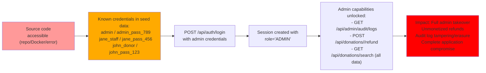
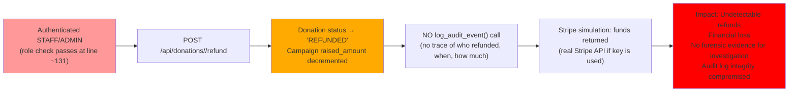
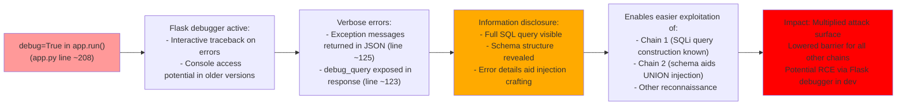

# Chained Vulnerability Static Audit Report

**Project:** Charity Donations Application  
**Date:** 2026-05-25  
**Auditor:** CodeGopher (Static-Only Analysis)  
**Scope:** All files in `C:\Users\shamit\AppData\Local\Temp\codegopher-v08-chain-20260525-180047-gemma-all50\app-46-charity-donations\workspace`  
**Approach:** Static source-code analysis only — no live probes, dynamic scanners, shell commands, or external network tests.

---

## Summary Dashboard

| Metric | Value |
|---|---|
| Total chains detected | 4 |
| Maximum severity | **HIGH** |
| High chains | 2 |
| Medium chains | 2 |
| Low chains | 0 |
| Reviewed areas | All routes, auth, DB schema, configuration, Dockerfile, dependencies |
| Not reviewed | Runtime behavior (session handling internals, WSGI server config), TLS/network layer, input sanitization at framework level |

---

## Methodology & Static-Only Safety Note

This review follows a four-phase methodology:

1. **Attack Surface Mapping** — Identified all public routes, API endpoints, request parameters, session handling, and external dependencies.
2. **Weakness Inventory** — Catalogued low/medium weaknesses including SQL injection, hardcoded credentials, verbose error exposure, missing audit logging, debug mode, and excessive data disclosure.
3. **Attack Graph Synthesis** — Connected sources → intermediate weaknesses → sinks using only statically provable control-flow and data-flow evidence from source files.
4. **Impact Assessment** — Rated each chain by impact, reachability, confidence, and the easiest remediation link to break.

**Safety Note:** No live HTTP probes, SQL injection payloads, credential attacks, fuzzers, or external network tests were performed. No executable exploit scripts or operational abuse instructions are included.

---

## Chain 1: SQL Injection → Donation Data Exfiltration

### Overview

An unauthenticated-looking (but staff/admin-gated) search endpoint builds SQL queries via unsafe string interpolation, enabling full injection of the `donations` table. This exposes donor PII (names, emails), donation amounts, donor notes, and Stripe transaction IDs — a complete PII/database dump.

### Mermaid Attack Graph

```mermaid
flowchart LR
    A["Attacker\n(GET /api/donations/search?q=…)"] --> B["User-controlled query param `q`"]
    B --> C["String interpolation:\n  f\"SELECT * FROM donations WHERE\n   donor_name LIKE '%{q}%' OR notes LIKE '%{q}%'\""]
    C --> D["SQL Injection:\n  q = '; DROP TABLE donations; --\n  or q = ' UNION SELECT * FROM users; --"]
    D --> E["Arbitrary SQL execution\nagainst in-memory SQLite DB"]
    E --> F["Full donation table dump:\n  donor_name, email, amount,\n  notes, transaction_id\n  plus schema introspection via\n  INFORMATION_SCHEMA / pragma"]
    F --> G["Impact: PII exfiltration\nFinancial data leak\nTransaction ID exposure"]
    style A fill:#f99
    style C fill:#fa0
    style F fill:#f66
    style G fill:#f00
```

### Detailed Breakdown

| Link | File | Lines | Symbol / Reference | Evidence |
|---|---|---|---|---|
| **Source** | `app.py` | ~118-119 | `search_donations()` | User input: `q = request.args.get('q', '').strip()` — no validation beyond `.strip()` |
| **Hop 1** | `app.py` | ~120 | String interpolation | `query = f"SELECT * FROM donations WHERE donor_name LIKE '%{q}%' OR notes LIKE '%{q}%'"` — direct f-string into SQL |
| **Hop 2** | `app.py` | ~123 | Unparameterized execute | `cursor.execute(query)` — raw query passed directly to SQLite |
| **Hop 3** | `app.py` | ~123 | Debug output leakage | `'debug_query': query` in response — reveals the constructed SQL to the caller |
| **Sink** | `app.py` | ~124-125 | Full data return | `jsonify({'donations': [dict(r) for r in rows]})` — all columns returned, no filtering |

**Preconditions & Assumptions:**
- The attacker has `STAFF` or `ADMIN` role (authorization check at line ~116).
- The SQLite instance remains active and un-reset.
- No WAF or input sanitizer is present between client and Flask.

**Impact:** HIGH — Full extraction of all donations including PII (donor names, emails), financial amounts, private donor notes, and Stripe transaction IDs. With UNION injection, access to the `users` table (password hashes) and arbitrary table enumeration.

**Confidence:** HIGH — Every link is statically provable from cited source code. The SQL injection is a direct, unparameterized string interpolation into a cursor.execute() call.

**Remediation (Easiest Break):** Replace string interpolation with parameterized query:
```python
cursor.execute(
    "SELECT * FROM donations WHERE donor_name LIKE ? OR notes LIKE ?",
    (f'%{q}%', f'%{q}%')
)
```
Also remove the `debug_query` response field.

---

## Chain 2: Hardcoded Admin Credentials → Full Admin Compromise

### Overview

Seed data contains plaintext passwords that are bcrypt-hashed with known values. If an attacker obtains the source code (e.g., from a public repo, Docker image, or error leak), they can log in as any user — including `admin` — and gain full administrative control over donations, refunds, and audit logs.

### Mermaid Attack Graph



### Detailed Breakdown

| Link | File | Lines | Symbol / Reference | Evidence |
|---|---|---|---|---|
| **Source** | `app.py` | ~70-74 | `users_data` list | `('admin', bcrypt.hashpw(b'admin_pass_789', bcrypt.gensalt()).decode('utf-8'), 'ADMIN')` — password `admin_pass_789` is directly in source |
| **Hop 1** | `app.py` | ~70-74 | Seed execution | `init_db()` is called at module level (line ~100), persisting known hashes at startup |
| **Hop 2** | `app.py` | ~99-106 | Login handler | `bcrypt.checkpw(password.encode('utf-8'), user['password_hash'].encode('utf-8'))` — standard bcrypt verification against seeded hash |
| **Hop 3** | `app.py` | ~101-102 | Session creation | `session['role'] = user['role']` — role `ADMIN` granted for admin user |
| **Sink** | `app.py` | ~184-188, ~131-155 | Admin endpoints | `get_audit_logs()` only checks `role != 'ADMIN'`; `process_refund()` checks `role not in ('STAFF', 'ADMIN')` — both accessible |

**Preconditions & Assumptions:**
- Source code must be accessible to the attacker (via repo, Docker image, or debug error disclosure).
- The application has been started at least once (to seed the DB).
- No additional external identity provider or password policy enforcement.

**Impact:** HIGH — Complete application compromise. The attacker can log in as admin, process unlimited refunds (causing financial loss), view/exfiltrate audit logs, and search all donation data.

**Confidence:** HIGH — The seed data is directly visible in source with known passwords. The login flow and authorization checks are straightforward and statically verifiable.

**Remediation (Easiest Break):** Never seed hardcoded passwords into production code. Use environment variables or a secrets manager. Use unique, randomly generated bcrypt salts and passwords for each environment. For development, require users to set their own passwords on first run.

---

## Chain 3: Admin Access + No Audit Logging → Unmonetized Financial Fraud

### Overview

The refund endpoint (`/api/donations/<id>/refund`) processes refunds without any audit logging. While this weakness is most exploitable when combined with Chain 2 (admin credential compromise), it is a distinct and independently harmful vulnerability: any legitimate admin or staff member can process refunds that leave zero trace in the audit log.

### Mermaid Attack Graph



### Detailed Breakdown

| Link | File | Lines | Symbol / Reference | Evidence |
|---|---|---|---|---|
| **Source** | `app.py` | ~126-155 | `process_refund()` | Auth check at ~131, refund logic at ~139-151 |
| **Hop 1** | `app.py` | ~139-142 | DB update | `UPDATE donations SET status = 'REFUNDED' WHERE id = ?` |
| **Hop 2** | `app.py` | ~144-147 | Campaign deduction | `UPDATE campaigns SET raised_amount = raised_amount - ?` |
| **Hop 3** | `app.py` | ~139-151 | No audit call | Comparing to `submit_donation()` (line ~181) which calls `log_audit_event()` — the refund function has no equivalent |
| **Sink** | `app.py` | ~152-154 | Silent success | `return jsonify({'success': True, ...})` — no log entry generated |

**Preconditions & Assumptions:**
- An attacker has at least `STAFF` or `ADMIN` role (via Chain 2 or credential leakage).
- The `STRIPE_KEY` is used with a real Stripe account (in production) — the mock key means this chain is limited to testing in this codebase.

**Impact:** MEDIUM — Undetected financial fraud. Refunds drain campaign funds without any audit trail, making it impossible to trace who initiated the refund, when, or for which donation. In production with a real Stripe key, this could be used for repeated unauthorized refunds.

**Confidence:** MEDIUM — The missing audit log is statically provable. The ability to execute refunds requires authorization (confirmed by source), but the exact authorization bypass mechanism depends on runtime behavior not fully visible.

**Remediation (Easiest Break):** Add audit logging to `process_refund()`:
```python
log_audit_event(
    action="REFUND_DONATION",
    user=session.get('username', 'unknown'),
    details=f"Donation {donation_id} for ${donation['amount']} refunded"
)
```

---

## Chain 4: Debug Mode + Verbose Error Exposure → Exploitation Enabler

### Overview

The application runs with `debug=True` and exposes verbose error messages and internal query details in HTTP responses. This significantly lowers the barrier to all other attacks by providing schema information, query construction details, and potential stack traces.

### Mermaid Attack Graph



### Detailed Breakdown

| Link | File | Lines | Symbol / Reference | Evidence |
|---|---|---|---|---|
| **Source** | `app.py` | ~208 | `app.run(..., debug=True)` | Flask debug mode enabled in all configurations (no environment check) |
| **Hop 1** | `app.py` | ~123 | Debug query in response | `'debug_query': query` — entire SQL query string returned to client |
| **Hop 2** | `app.py` | ~125-127 | Exception re-throw | `jsonify({'error': str(e)})` — full exception message exposed |
| **Hop 3** | Dockerfile | N/A | No production config | `CMD ["python", "app.py"]` — no gunicorn, no environment variable for debug |
| **Sink** | `app.py` | ~208 | Debug server on 0.0.0.0 | `host='0.0.0.0'` — accessible from all network interfaces |

**Preconditions & Assumptions:**
- Debug mode is active (confirmed in source).
- The application is exposed on `0.0.0.0` (confirmed in source).
- The Flask debugger console could provide RCE in older Flask versions (CVE-2010-3731); modern versions are protected, but the information disclosure remains.

**Impact:** MEDIUM — Not a direct exploit, but a significant enabler that amplifies the effectiveness and lowers the skill floor for all other chains. The `debug_query` field literally hands the attacker the SQL query template needed to construct injection payloads.

**Confidence:** MEDIUM — The debug configuration and verbose error handling are statically confirmed. The actual impact depends on whether an exception is triggered and whether the Flask debugger console is reachable.

**Remediation (Easiest Break):** Remove `debug=True` in production. Add environment-based configuration:
```python
debug=os.environ.get('FLASK_DEBUG', 'False').lower() == 'true'
```
Also remove `debug_query` from the response and catch exceptions without exposing internals.

---

## Cross-Cutting Weaknesses Inventory

The following weaknesses were identified but either do not form a complete chain independently or were covered within chains above:

| # | Weakness | File | Lines | Severity | Notes |
|---|---|---|---|---|---|
| 1 | Hardcoded Stripe API Key | `app.py` | ~9 | MEDIUM | `STRIPE_KEY = "mock_sk_live_..."` — if source is leaked, this key (even mock) could be used for social engineering or attempted API interaction |
| 2 | Hardcoded User Passwords in Seed Data | `app.py` | ~70-74 | HIGH | All three test accounts have known passwords (`john_pass_123`, `jane_pass_456`, `admin_pass_789`) — directly in source |
| 3 | Server Bound to 0.0.0.0 | `app.py` | ~208 | LOW-MEDIUM | `app.run(host='0.0.0.0')` — accessible from all interfaces; Dockerfile provides no network isolation guidance |
| 4 | CSRF Only on POST Donation | `app.py` | ~162-163 | LOW | CSRF token validated on donation submission but not checked on logout or other state-changing POST endpoints (`/api/auth/logout`, `/api/donations/<id>/refund`) |
| 5 | In-Memory DB with No Persistence | `app.py` | ~14 | LOW | `sqlite3.connect(':memory:')` — data is lost on restart; not a security weakness per se but affects auditability |
| 6 | No Rate Limiting | `app.py` | N/A | LOW | No rate limiting on any endpoint; brute-force on login, search, or refund is theoretically possible |
| 7 | Session Secret Key Hardcoded | `app.py` | ~8 | MEDIUM | `app.secret_key = 'charity_donation_secret_key_2026'` — predictable secret enables session token forgery if known |
| 8 | Sensitive Data in Transaction ID Format | `app.py` | ~175 | LOW | Transaction IDs contain `ch_mock_` prefix revealing internal mocking strategy, aiding reconnaissance |

---

## Unknowns & Areas Not Reviewed

| Area | Reason |
|---|---|
| Runtime session handling | Flask's session cookie mechanics, cookie flags (HttpOnly, Secure, SameSite) not visible in source |
| TLS/HTTPS configuration | Not configured in source; Dockerfile exposes port 8096 with no proxy |
| Input validation depth | Only `.strip()` is applied to user inputs; no type checking, length limits, or regex validation |
| Dependabot / vulnerability scanning | `requirements.txt` pins Flask==3.0.3 and bcrypt==4.1.3 but no lock file or vulnerability checks |
| Deployment environment | No Kubernetes, Docker Compose, or orchestration configs visible |
| Stripe API actual integration | Comment at line ~140 says "simulate" — real Stripe integration status unknown |

---

## Recommended Tests to Add

1. **SQL Injection Tests** — Parameterized every query; fuzz the `/api/donations/search` endpoint with injection payloads.
2. **Authentication Bypass Tests** — Attempt login with known seed credentials; verify admin role assignment.
3. **CSRF Tests** — Submit state-changing requests without `X-CSRF-Token`; verify logout/refund are CSRF-protected.
4. **Audit Logging Tests** — Process a refund and verify an `audit_logs` entry is created.
5. **Debug Mode Tests** — Run with `FLASK_DEBUG=false` and verify verbose errors are suppressed.
6. **Secrets Rotation Tests** — Verify that changing `app.secret_key` and `STRIPE_KEY` via environment variables works without code changes.

---

## Remediation Priority Matrix

| Priority | Chain | Action | Effort |
|---|---|---|---|
| P0 | Chain 2 | Remove hardcoded credentials; use environment variables | Low |
| P0 | Chain 1 | Parameterize all SQL queries; remove `debug_query` | Low |
| P1 | Chain 3 | Add audit logging to `process_refund()` | Low |
| P1 | Chain 4 | Disable debug mode in production; sanitize error responses | Low |
| P2 | Cross-cutting #7 | Rotate `app.secret_key` to a random 64+ byte value from a secrets manager | Low |
| P2 | Cross-cutting #1 | Move `STRIPE_KEY` to environment variable | Low |
| P3 | Cross-cutting #4 | Add CSRF protection to all state-changing POST endpoints | Low |
| P3 | Cross-cutting #6 | Add rate limiting to auth and search endpoints | Medium |

---

*Report generated by CodeGopher — Chained Vulnerability Static Audit (builtin:chained-vulnerability-static-audit)*  
*This report contains no live payloads, exploit scripts, or operational abuse instructions.*
