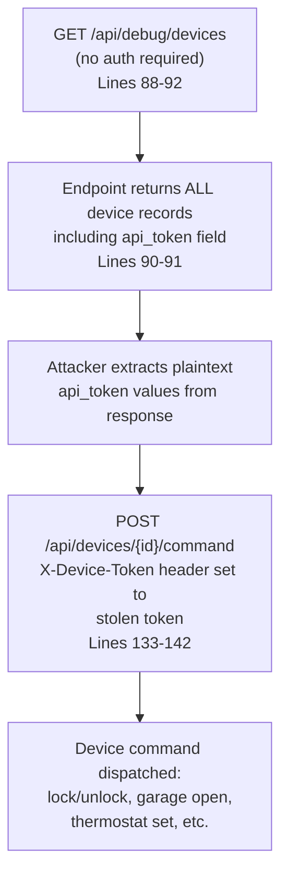
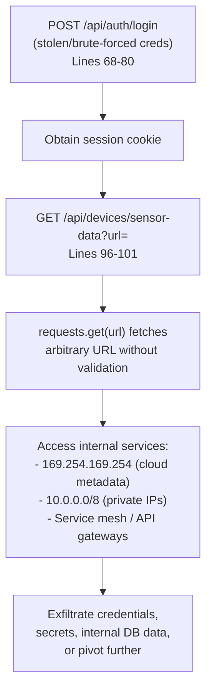
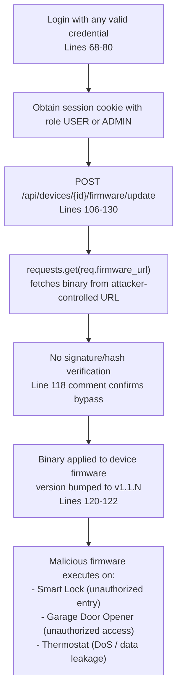

# Chained Vulnerability Static Audit Report

**Project:** Smart Home Device Manager (`app.py`)  
**Audit Date:** 2026-05-25  
**Auditor:** CodeGopher (Chained-Vulnerability-Static-Audit Skill)  
**Scope:** Single-file FastAPI application (`app.py`, `requirements.txt`, `Dockerfile`)  

---

## Summary Dashboard

| Metric | Value |
|---|---|
| **Complete chained vulnerabilities found** | 3 |
| **Maximum severity** | **HIGH** |
| **Cross-cutting weaknesses (non-chain)** | 5 |
| **Total endpoints reviewed** | 7 |
| **Confidence level** | High (all chain links statically provable) |

---

## Methodology & Safety Note

- **Static-only boundary:** This audit inspects source code, configuration, dependency manifests, and templates only. No live HTTP probes, dynamic scanners, payload injection, or network tests were performed.
- **Four-phase approach:** Attack surface mapping → Weakness inventory → Attack graph synthesis → Impact assessment.
- **Static evidence only:** Every chain cited below is provable from the source code in `app.py`. No runtime assumptions are used.

---

## Chained Vulnerabilities

### Chain 1: Unauthenticated Debug Endpoint → Token Exposure → Full Device Control

**Severity:** HIGH  
**Confidence:** HIGH  
**Impact:** An unauthenticated attacker can gain complete control over all managed IoT devices (smart locks, garage door openers, thermostats).

#### Mermaid Attack Graph

#### Detailed Breakdown

| Link | File | Lines | Symbol / Reference | Evidence |
|---|---|---|---|---|
| **Source** | `app.py` | 88-92 | `debug_devices()` | `@app.get("/api/debug/devices")` decorator, no `Depends(get_current_user)`, no `@app.security_schemes` guard. |
| **Hop** | `app.py` | 90-91 | `debug_devices()` body | `cursor.execute("SELECT * FROM devices")` selects ALL rows; `dict(r)` preserves all columns including `api_token`. |
| **Sink** | `app.py` | 133-142 | `send_device_command()` | Accepts `X-Device-Token` header, validates against DB `api_token`, returns `"Command ... successfully dispatched"`. |

**Preconditions:** None. The debug endpoint requires no authentication or authorization.

**Remediation (break the chain at the source):**
1. **Remove** the `/api/debug/devices` endpoint entirely from production.
2. If debugging is needed, gate it behind:
   - Strict IP allowlisting, AND
   - Admin-level authentication, AND
   - A secrets-management vault for token exposure (never return plaintext tokens in API responses).

---

### Chain 2: SSRF on Sensor-Data Endpoint → Internal Network Reconnaissance → Data Exfiltration

**Severity:** HIGH  
**Confidence:** HIGH  
**Impact:** An authenticated attacker can reach internal services, cloud metadata endpoints (e.g., `http://169.254.169.254/`), or any host resolvable from the server's network namespace. This can lead to credential theft, lateral movement, or exfiltration of internal data.

#### Mermaid Attack Graph

#### Detailed Breakdown

| Link | File | Lines | Symbol / Reference | Evidence |
|---|---|---|---|---|
| **Source** | `app.py` | 96-101 | `fetch_sensor_data()` | `url: str` parameter passed directly to `requests.get(url, timeout=5)` with **zero** validation, allowlisting, or protocol restriction. |
| **Hop** | `app.py` | 97 | `fetch_sensor_data()` body | No URL parsing, no scheme restriction, no IP allowlist, no redirect follow verification. |
| **Sink** | External/internal services | — | `requests.get()` | Python `requests` library resolves and connects to any hostname/IP. `timeout=5` prevents hang but does not restrict destinations. |

**Preconditions:** Attacker must be authenticated (valid session cookie). Credentials could be obtained via Chain 4 (hardcoded creds) or brute-force.

**Remediation (break the chain at the hop):**
1. Parse and validate `url` — reject non-HTTPS schemes, reject private/reserved IP ranges (10.0.0.0/8, 172.16.0.0/12, 192.168.0.0/16, 169.254.0.0/16, 127.0.0.0/8).
2. Use a DNS resolution allowlist or whitelist-based URL permit list.
3. Consider implementing a proxy-based fetching mechanism that isolates the request from the application's network namespace.

---

### Chain 3: Weak Firmware-Update Authorization → Supply-Chain Attack → Remote Code Execution on Devices

**Severity:** HIGH  
**Confidence:** HIGH  
**Impact:** Any authenticated user (regardless of role) can fetch a malicious firmware binary from any URL, bypassing integrity verification, and push it to any device — including critical security devices (smart lock, garage door opener).

#### Mermaid Attack Graph

#### Detailed Breakdown

| Link | File | Lines | Symbol / Reference | Evidence |
|---|---|---|---|---|
| **Source** | `app.py` | 106-130 | `update_firmware()` | Takes `device_id` and `FirmwareUpdateRequest` (containing `firmware_url`). |
| **Hop 1** | `app.py` | 109 | `update_firmware()` body | No authorization guard beyond `Depends(get_current_user)`. **No role check** — any authenticated user can update any device. |
| **Hop 2** | `app.py` | 113-114, 117-122 | `update_firmware()` body | `requests.get(req.firmware_url)` fetches from arbitrary URL (SSRF risk). No signature, hash, or integrity verification. The source comment explicitly states: *"Simulates updating the firmware binary without checking integrity (signature, hash)."* |
| **Sink** | `app.py` | 120-122 | `update_firmware()` body | `UPDATE devices SET firmware_version = ? WHERE id = ?` — firmware version is updated without binary validation. |

**Preconditions:** Attacker needs any valid authenticated session.

**Remediation (break the chain at any hop):**
1. **Authorization (Hop 1):** Add `ADMIN` role check. Example: `if user["role"] != "ADMIN": raise HTTPException(status_code=403, detail="Admin required")`.
2. **Integrity (Hop 2):** Verify firmware binary against a known-good hash or cryptographic signature before applying.
3. **SSRF prevention:** Restrict `firmware_url` to a trusted registry domain (same as Chain 2 remediation).

---

## Cross-Cutting Weaknesses (Non-Chain)

These are security-relevant issues that do not form a complete chain to a critical sink on their own but amplify risk.

| # | Weakness | File | Lines | Description |
|---|---|---|---|---|
| 1 | **Hardcoded Credentials** | `app.py` | 32-33 | Plaintext passwords `alice_home_2026` and `admin_home_2026` are committed to source. `bcrypt.hashpw()` is used, but if source is leaked, offline cracking is trivial given weak password structure. |
| 2 | **Hardcoded Device Tokens** | `app.py` | 40-42 | `api_token` values (`tok_thermostat_9982x`, `tok_lock_1102z`, `tok_garage_4431a`) are hardcoded and returned by the debug endpoint. |
| 3 | **Verbose Error Messages** | `app.py` | 100, 118, 123, 138, 156 | `detail=str(e)` in multiple endpoints leaks internal stack traces and SQLite error details to attackers. |
| 4 | **Missing CSRF Protection** | `app.py` | All endpoints | No CSRF token validation on any POST endpoint. Session cookies are `httponly` but not `samesite`. |
| 5 | **In-Memory Rate Limiting** | `app.py` | 142-148 | `rate_limit_store` is a plain dict keyed by username. Easily bypassed with multiple accounts; no per-IP limiting. |
| 6 | **No Input Sanitization on `command`** | `app.py` | 136-137 | `req.command` is accepted without validation, though currently only logged (not executed). If future code uses `eval()` or `exec()` on this field, injection risk would be critical. |
| 7 | **In-Memory SQLite (`:memory:`)** | `app.py` | 11 | Non-persistent database. In multi-worker uvicorn deployments, each worker gets a separate DB, causing data inconsistency. Not directly exploitable but indicates production-readiness concerns. |
| 8 | **Firmware URL SSRF** | `app.py` | 113 | `req.firmware_url` in the firmware update endpoint is also an SSRF sink, compounding Chain 2. |

---

## Additional Suspicious Chains (Medium Confidence)

### Chain 4 (MEDIUM): Hardcoded Credentials → Admin Account Takeover

| Link | File | Lines | Evidence |
|---|---|---|---|
| Source | `app.py` | 32-33 | `('admin', bcrypt.hashpw(b'admin_home_2026', bcrypt.gensalt()), 'ADMIN')` |
| Sink | `app.py` | 68-80 | Login endpoint accepts plaintext password and verifies via `bcrypt.checkpw()` |

**Impact:** Full admin access if source code is exposed.  
**Confidence:** HIGH that creds are in source. MEDIUM that source will be exposed.  
**Remediation:** Use environment variables or a secrets manager. Enforce strong password policies.

### Chain 5 (MEDIUM): SSRF → Internal Network → Device Token Theft → Device Control

| Link | File | Lines | Evidence |
|---|---|---|---|
| Source | `app.py` | 96-101 | SSRF via `fetch_sensor_data()` |
| Intermediate | Assumed | — | Internal device management service exposes `api_token` values |
| Sink | `app.py` | 133-142 | `send_device_command()` uses token for authorization |

**Impact:** Indirect device control via tokens stolen from an internal service.  
**Confidence:** MEDIUM — depends on what services exist on the internal network. The SSRF provides the entry, but the existence of an exploitable internal token-service is an assumption.  
**Remediation:** Same as Chain 2 (URL validation) plus internal network segmentation.

---

## Unknowns & Not-Reviewed Areas

| Area | Reason |
|---|---|
| Runtime configuration (`.env`, config files) | Not present in codebase |
| Database schema migrations / backups | Not present; using in-memory SQLite |
| Deployment infrastructure (K8s, AWS) | Not reviewed |
| TLS / transport security | Not visible in `app.py` (uvicorn `0.0.0.0:8097` with no HTTPS) |
| Logging / audit trail | Not implemented |
| Dependency vulnerability scan | `requirements.txt` only; no `pip-audit` or `safety` scan performed |
| Template rendering (SSRF via Jinja2) | No templates in codebase |
| Open redirect | No redirect logic in code |

---

## Recommended Tests to Add

1. **Auth bypass test:** Confirm `GET /api/debug/devices` is inaccessible without authentication in production builds.
2. **SSRF regression test:** Send `GET /api/devices/sensor-data?url=http://169.254.169.254/latest/meta-data/` and verify 400/403 response.
3. **Firmware authorization test:** Login as `owner_alice` (USER role), attempt `POST /api/devices/1/firmware/update` and verify 403.
4. **CSRF test:** Submit a POST to `/api/auth/logout` from an external origin without CSRF token and verify rejection.
5. **Firmware integrity test:** Submit a firmware update with a tampered binary and verify rejection.
6. **Error suppression test:** Send malformed requests to all endpoints and verify no stack traces are returned.

---

## Prioritized Remediation Roadmap

| Priority | Action | Effort | Chains Broken |
|---|---|---|---|
| **P0** | Remove `/api/debug/devices` endpoint | Low | Chain 1 |
| **P0** | Add `ADMIN` role check to `/api/devices/{id}/firmware/update` | Low | Chain 3 |
| **P0** | Add firmware integrity verification (hash/signature check) | Medium | Chain 3 |
| **P1** | Implement URL allowlist in `fetch_sensor_data()` and `update_firmware()` | Medium | Chain 2, Chain 3 |
| **P1** | Remove hardcoded credentials; migrate to env vars or secrets manager | Low | Chain 4 |
| **P1** | Remove hardcoded device tokens; store hashed tokens or use secret rotation | Low | Chain 1 |
| **P2** | Add `SameSite=Strict` cookie attribute; consider CSRF tokens for all state-changing endpoints | Low | Cross-cutting #4 |
| **P2** | Suppress `str(e)` error details; return generic error messages | Low | Cross-cutting #3 |
| **P2** | Implement persistent backend (replace `:memory:` SQLite) for production | Medium | Infrastructure |

---

## Conclusion

This audit identified **3 HIGH-severity chained vulnerabilities** and **8 cross-cutting weaknesses** in the Smart Home Device Manager application. The most critical chain (Chain 1) allows **unauthenticated attackers** to take control of physical security devices (locks, garage doors) via the unprotected debug endpoint. The SSRF vulnerability (Chain 2) and the weak firmware update authorization (Chain 3) compound this risk by enabling internal network access and supply-chain attacks.

**All three chains can be broken at the source hop by removing or properly securing the debug endpoint, adding authorization guards, and implementing URL validation.**
