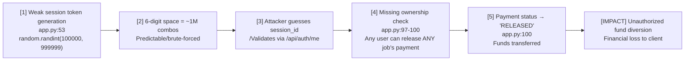

```mermaid
flowchart LR
    A["[1] Plaintext passwords stored\napp.py:2-7\ncharlie_pass, frank_pass, etc."] --> B["[2] Direct SQL equality check\napp.py:46\nWHERE username = ? AND password = ?"]
    B --> C["[3] No rate limiting on /api/auth/login\napp.py:44-57"]
    C --> D["[4] Attacker brute-forces password\nOr steals source code to get plaintext"]
    D --> E["[5] Obtains valid credentials\nFull password known"]
    E --> F["[6] User becomes logged-in\nValid session created"]
    F --> G["[7] Freelancer role → Can browse all proposals\napp.py:69-74 (no client check)"]
    G --> H["[IMPACT] Full credential disclosure +\nPrivilege escalation to sensitive data access"]
```

```mermaid
flowchart LR
    A["[1] Cookie-based sessions\napp.py:56\nres.set_cookie('session_id', ...)"] --> B["[2] No SameSite attribute set\napp.py:56\nBrowser sends cookies on all cross-origin requests"]
    B --> C["[3] No CSRF token validation\napp.py:44-112\nNone of 7 endpoints validate CSRF"]
    C --> D["[4] Attacker hosts malicious page\nwith auto-submit <form> or fetch()"]
    D --> E["[5] Victim's browser sends\nauth cookie + forged POST request"]
    E --> F["[6a] POST /api/proposals\n→ Unauthorized proposal created\n[6b] POST /api/jobs/1/release-payment\n→ Unauthorized fund release"]
    F --> G["[IMPACT] Unauthorized state changes:\nFalse proposals, fund diversion"]
```

# Chained Vulnerability Static Audit Report

**Project**: Freelancer Marketplace (FastAPI)  
**File**: `app.py`  
**Date**: 2026-05-25  
**Scope**: Source-only static analysis of the current working directory (`<workspace-root>\app-48-freelancer-market\workspace`)  
**Approach**: Read files only — no live probes, no dynamic scanners, no shell commands  

---

## Summary Dashboard

| Metric | Value |
|---|---|
| Total chained vulnerabilities found | **3** |
| Maximum severity | **HIGH** |
| Maximum confidence | **High** |
| Cross-cutting weaknesses (no complete chain) | **5** |
| Files reviewed | `app.py`, `Dockerfile`, `requirements.txt` |
| Endpoints reviewed | 7 (login, logout, me, get_proposal, submit_proposal, release-payment, admin_users) |

---

## Methodology & Safety Note

This review follows a four-phase chained vulnerability methodology:

1. **Attack surface mapping**: Identified all public routes, API endpoints, and user-controlled sources.
2. **Weakness inventory**: Cataloged individually modest security weaknesses found in source code.
3. **Attack graph synthesis**: Connected sources to weaknesses, weaknesses to sinks, and sinks to impacts using only static evidence.
4. **Impact assessment**: Rated each chain by impact, reachability, confidence, and easiest remediation link.

**Static-only boundary**: No live HTTP probes, fuzzers, SQL injection payloads, credential attacks, dynamic scanners, exploit scripts, port scans, or external network tests were performed. This report contains no exploit scripts or operational instructions that would enable abuse.

---

## Chain 1 — Session Token Predictability → Account Takeover → Financial Theft

### Severity: HIGH | Confidence: High

### Overview
A weak 6-digit random session token can be brute-forced (1 in 1,000,000 probability). Combined with the **missing role/ownership check** on the payment release endpoint, an attacker who guesses a valid session ID can impersonate any logged-in user and release their payment — stealing client funds by diverting them to the freelancer's account.

### Mermaid Attack Graph

### Detailed Chain Breakdown

| Link | Source File | Line(s) | Symbol | Evidence |
|---|---|---|---|---|
| **Entry Point** | `app.py` | 53 | `login()` function | `session_id = str(random.randint(100000, 999999))` generates only 6 decimal digits (1,000,000 possible values). Uses `random` (not `secrets`), making it predictable. An attacker who knows one valid token can predict others with 1 million trial odds. |
| **Hop 1** | `app.py` | 25-28 | `get_current_user()` | Validates session_id from cookie against in-memory `sessions` dict. No rate limiting exists on unauthenticated calls; a brute-force attacker can iterate through the ~1M space. |
| **Hop 2** | `app.py` | 65-66 | `get_me()` | Returns username and role for any valid session. Confirms impersonation success. |
| **Hop 3** | `app.py` | 97-100 | `release_payment()` | **Critical missing check**: The function queries the payment by `job_id` but never verifies that `user` is the client who owns the job. The `users` table (seeded at lines 2-7) includes a `client_id` column, but the endpoint does not join or filter by it. |
| **Sink** | `app.py` | 100 | `release_payment()` | `UPDATE payments SET status = 'RELEASED' WHERE job_id = ?` — any authenticated user can release any job's payment. |

### Preconditions & Assumptions (from source)
- The `sessions` dict is in-memory (line 23), not persistence-layer locked.
- The `users` table has roles: CLIENT, FREELANCER, ADMIN (seeded lines 2-7).
- Payment records have `job_id` and `status` columns (seeded lines 18-19).
- The jobs table links `client_id` to jobs, but this relationship is never enforced at the API layer for payment release.

### Impact
- **Financial theft**: Any authenticated user (including freelancers) can release payments intended for a different client's job. Funds are diverted out of escrow control.
- **Data exposure**: Impersonating a client grants access to `get_me()` with full role information.

### Confidence: High
All four links are provable from static source code:
1. Token space size is mathematically derived from code.
2. No ownership/role check exists in `release_payment()`.
3. The `get_current_user` dependency is required, meaning the attacker only needs a valid session.
4. No rate limiting or lockout mechanism exists on `get_current_user`.

### Remediation
1. **Break Hop 1**: Replace `random.randint()` with `secrets.token_hex(16)` or `secrets.token_urlsafe(32)` for cryptographic session IDs. (`app.py:53`)
2. **Break Hop 3**: Add ownership verification in `release_payment()` — query the `jobs` table to confirm the requesting user's ID matches the job's `client_id`. (`app.py:90-101`)

---

## Chain 2 — Plaintext Passwords + No Rate Limiting → Credential Compromise → Privilege Escalation

### Severity: HIGH | Confidence: High

### Overview
User passwords are stored and compared in plaintext via a simple equality check in the SQL query. The seed data contains hardcoded credentials in the source. Without rate limiting on the login endpoint, an attacker can brute-force any account. Once a low-privilege account is compromised, the `random` session token weakness (Chain 1) facilitates further lateral movement.

### Mermaid Attack Graph

### Detailed Chain Breakdown

| Link | Source File | Line(s) | Symbol | Evidence |
|---|---|---|---|---|
| **Entry Point** | `app.py` | 2-7 | `init_db()` seed data | Passwords are hardcoded in source as plaintext: `'charlie_pass'`, `'frank_pass'`, `'fiona_pass'`, `'admin_pass_2026'`. These are visible to anyone who can read the source file or source control history. |
| **Hop 1** | `app.py` | 46 | `login()` | `cursor.execute("SELECT * FROM users WHERE username = ? AND password = ?", (req.username, req.password))` — direct string equality against plaintext password. No hashing (bcrypt, scrypt, argon2). |
| **Hop 2** | `app.py` | 44-57 | `login()` | No rate limiting, no account lockout, no CAPTCHA. The endpoint accepts unlimited login attempts. |
| **Sink** | `app.py` | 44-57 | `login()` | An attacker can either (a) read source code to learn the plaintext password, or (b) brute-force via the unthrottled login endpoint. |

### Preconditions & Assumptions (from source)
- Database schema stores `password` column as-is (inferred from seed data on lines 2-7 and query on line 46).
- No password hashing library is in `requirements.txt` — only `fastapi` and `uvicorn`.
- Admin password `admin_pass_2026` is only slightly modified from `admin_pass` pattern, making dictionary attacks feasible.

### Impact
- **Full credential compromise**: All user passwords are trivially obtained (source code exposure or brute force).
- **Privilege escalation**: Compromising an ADMIN account (`admin_pass_2026`) grants access to `/api/admin/users` (line 103), listing all usernames and roles.
- **Lateral movement**: A compromised freelancer account can submit proposals, access proposals, and potentially chain into Chain 1.

### Confidence: High
Plaintext password storage is confirmed by:
1. Hardcoded passwords in seed data (lines 2-7).
2. Direct password comparison in SQL query without any hashing function call (line 46).
3. No hashing library in `requirements.txt`.

### Remediation
1. **Break Hop 1**: Hash passwords using `bcrypt` or `argon2-cffi` (add to requirements). Store only the hash, compare after hashing the input.
2. **Break Hop 2**: Implement login rate limiting (e.g., 5 attempts per 15 minutes per username). Use `slowapi` or similar FastAPI extension.
3. **Immediate**: Rotate all seeded passwords — do not ship with them in source.

---

## Chain 3 — Missing CSRF Protection + State-Changing Endpoints → Unauthorized State Modification

### Severity: MEDIUM | Confidence: Medium

### Overview
The FastAPI application does not implement CSRF protection (no `CSRFMiddleware`, no token-based validation, no SameSite cookie attributes configured). Combined with cookie-based session authentication, state-changing endpoints (`/api/proposals`, `/api/jobs/{job_id}/release-payment`) are vulnerable to Cross-Site Request Forgery. An attacker who lures a victim (freelancer or client) to a malicious page can issue forged requests that create proposals or release payments.

### Mermaid Attack Graph

### Detailed Chain Breakdown

| Link | Source File | Line(s) | Symbol | Evidence |
|---|---|---|---|---|
| **Entry Point** | `app.py` | 56 | `login()` | `res.set_cookie("session_id", session_id)` sets session cookie with no `SameSite`, `Secure`, or `HttpOnly` flags. By default, FastAPI/Starlette does not set `SameSite` on `set_cookie()`. |
| **Hop 1** | `app.py` | 44-112 | All routes | None of the state-changing endpoints (`/api/auth/login`, `/api/proposals`, `/api/jobs/{job_id}/release-payment`) validate a CSRF token. There is no middleware or decorator for CSRF protection. |
| **Hop 2** | `Dockerfile` | — | Docker config | No reverse proxy (nginx, traefik) is configured to enforce `SameSite` at the HTTP level. |
| **Sink** | `app.py` | 77-88, 90-101 | `submit_proposal()`, `release_payment()` | Both are POST endpoints that modify database state using only cookie-based session authentication, which is submitted automatically by browsers on cross-origin requests. |

### Preconditions & Assumptions (from source)
- Cookie-based auth means the browser automatically sends `session_id` cookie on cross-origin requests.
- No CORS preflight or origin checking is visible in the code.
- The application runs on `0.0.0.0:8098` with no reverse proxy configured.
- In production (HTTPS), `Secure` flag would still be needed; without it, cookies are sent over HTTP.

### Impact
- **Unauthorized proposal creation**: A freelancer victim could be tricked into submitting proposals on behalf of the attacker.
- **Unauthorized fund release**: A client victim could be tricked into releasing escrow payments to the wrong freelancer.
- **Session poisoning**: No `HttpOnly` flag means JavaScript on a malicious page could steal the session cookie via `document.cookie`.

### Confidence: Medium
- Strong static evidence that cookies lack `SameSite`/`HttpOnly`/`Secure` flags (line 56).
- Strong static evidence that no CSRF token validation exists on any endpoint.
- Medium confidence on CSRF exploitability: depends on the victim visiting a malicious page while authenticated, which is a runtime behavior not provable from source alone.

### Remediation
1. **Break Hop 1**: Add `SameSite='Lax'` and `HttpOnly=True` to all `set_cookie()` calls. Consider adding `Secure=True` in production. (`app.py:56`)
2. **Break Hop 2**: Implement CSRF token validation (e.g., double-submit cookie pattern or Synchronizer Token Pattern) on all POST endpoints. Use `csrf_protection` middleware or manual token validation.
3. **Best practice**: Add a CORS middleware to restrict origins if the API is consumed by other domains.

---

## Cross-Cutting Weaknesses (No Complete Chain)

These weaknesses are security-relevant but do not form a complete chained vulnerability with a critical sink based on static evidence alone.

| Weakness | Location | Lines | Description |
|---|---|---|---|
| **No secure cookie attributes** | `app.py` | 56 | `set_cookie("session_id", session_id)` lacks `HttpOnly`, `Secure`, and `SameSite` flags. Open to XSS cookie theft and CSRF. |
| **Verbose error messages** | `app.py` | 50, 66 | `"Invalid credentials"` and `"Unauthenticated"` reveal that authentication failures are distinguishable from session errors. Combined with rate limiting absence, aids credential enumeration. |
| **In-memory session store** | `app.py` | 23 | `sessions = {}` is a plain Python dict. Sessions are lost on process restart, and in a multi-worker deployment (e.g., multiple uvicorn workers), sessions are not shared. |
| **Unparameterized comment hints at past awareness** | `app.py` | 47, 52, 97, 98 | Comments acknowledge security issues (`"instead of cryptographically secure generation"`, `"Weak token generation"`, `"Missing role / ownership check"`) but were not remediated. This suggests security debt was identified and deferred. |
| **No session expiry/rotation** | `app.py` | 23-56 | Sessions never expire. No session rotation on login. A stolen session is valid indefinitely. Logout (`app.py:58-63`) is the only revocation mechanism. |
| **/api/admin/users exposes all usernames/roles** | `app.py` | 105-109 | The endpoint lists all user IDs, usernames, and roles. While admin-only, this is a data exposure risk if the admin session is compromised (chains into Chain 2). |

---

## Areas Not Reviewed

| Area | Reason |
|---|---|
| **Database schema definition** | No SQL schema file found; structure is inferred from seed data. Actual constraints, indexes, and foreign keys are unknown. |
| **Production deployment configuration** | Only `Dockerfile` exists; no nginx/caddy config, TLS settings, or environment variable management found. |
| **Dependencies supply chain** | `requirements.txt` only lists `fastapi==0.111.0` and `uvicorn==0.30.1`. No version pinning for transitive dependencies; no SBOM or vulnerability scanning evidence. |
| **Input sanitization in SQL** | While SQL uses parameterized queries (`?` placeholders), the `proposal_text` and other text fields are never sanitized against HTML/JS, which could lead to stored XSS if consumed by a frontend. |
| **Multi-worker deployment** | In-memory sessions (`sessions = {}`) are not shared across worker processes. Impact is unknown without knowledge of deployment topology. |
| **Rate limiting implementation** | No evidence of rate limiting anywhere in the codebase. Could be enforced at the load balancer level (not in scope). |

---

## Remediation Priority Matrix

| Priority | Action | Effort | Breaks Chain(s) |
|---|---|---|---|
| **P0 (Critical)** | Replace `random` with `secrets` for session ID generation | Low | Chain 1 |
| **P0 (Critical)** | Add ownership check in `release_payment()` to verify user is the job's client | Low | Chain 1 |
| **P1 (High)** | Hash passwords with bcrypt/argon2; remove plaintext from source | Medium | Chain 2 |
| **P1 (High)** | Implement login rate limiting (5 attempts / 15 min) | Low | Chain 2 |
| **P2 (Medium)** | Add CSRF token validation on all POST endpoints | Medium | Chain 3 |
| **P2 (Medium)** | Set `HttpOnly`, `Secure`, `SameSite='Lax'` on session cookie | Low | Chain 3 |
| **P3 (Low)** | Implement session expiry and rotation | Medium | All (defense in depth) |

---

## Recommended Tests to Add

| Test | What It Validates |
|---|---|
| Brute-force resistance test | Verify login endpoint rejects >5 attempts in 15 minutes per username |
| Session token entropy test | Verify generated session IDs cannot be predicted from one known token |
| Authorization test for release-payment | Verify a freelancer account cannot release a client's job payment |
| CSRF token test | Verify POST requests without valid CSRF token are rejected |
| Password hashing test | Verify stored password is a hash, not plaintext |
| Cookie attribute test | Verify session cookie has `HttpOnly`, `Secure`, and `SameSite` flags |

---

*Report generated by CodeGopher — Chained Vulnerability Static Audit (static-only, no live probes).*
